# 图解：什么是红黑树？

原文：https://zhuanlan.zhihu.com/p/273829162

## 先谈平衡树

做开发的朋友一定知道接口这个东西：定义接口，给出实现。一个接口可以有多种不同的实现，但是这些实现都会满足接口中的声明。

红黑树的本质其实也是对**概念模型“2-3-4树”**的一种实现，因此先来关注2-3-4树。

关于B树（平衡多路查找树）的定义，这里不赘述。它最重要的特性在于平衡，这使得能够在最坏的情况下也保持O(LogN)的时间复杂度实现查找（一个不具备平衡性的查找树可能退化成单链表，时间复杂度回到O(N)）。

> 在此需要提醒大家，平衡的定义是说从空链接到根结点距离相等，此处一定要用心理解（也就是说，非叶子结点是不会存在空链接的）

由于2-3-4树是一棵阶数为4的B树，所以它存在以下节点：

* 2节点
* 3节点
* 4节点

2节点中存放着一个Key[x]和两个指针，分别指向小于X的子节点和大于X的子节点；3节点中存放着两个Key[x,y]和三个指针，分别指向小于X的子节点，介于X～Y之间的子节点和大于Y的子节点；4节点以此类推。

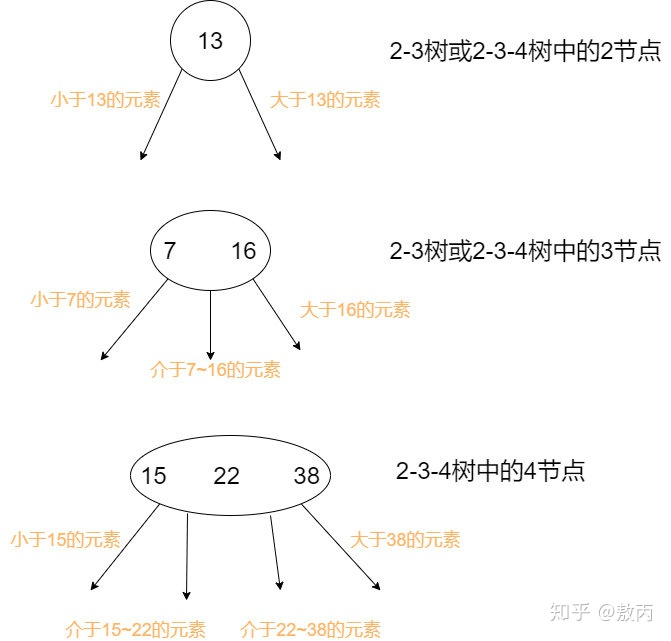

## 2-3-4 树到红黑树的转化

红黑树是对概念模型2-3-4树的一种实现，由于直接进行不同节点间的转化会造成较大的开销，所以选择以二叉树为基础，在二叉树的属性中加入一个**颜色属性**来表示2-3-4树中不同的节点。

2-3-4树中的2节点对应着红黑树中的黑色节点，而2-3-4树中的非2节点是以**红节点+黑节点**的方式存在，红节点的意义是与黑色父节点结合，表达着2-3-4树中的3、4节点。

> （此处理解成红节点也好，红色链接也好，看个人喜好。很多书中会说是由黑色节点指出的红色链接，链接指向的节点颜色为红色。）

先看2-3-4树到红黑树的节点转化。2节点直接转化为黑色节点；3节点这里可以有两种表现形式：左倾红节点或者右倾红节点；而4节点被**强制要求**转化为一个黑父带着左右两个红色儿子。

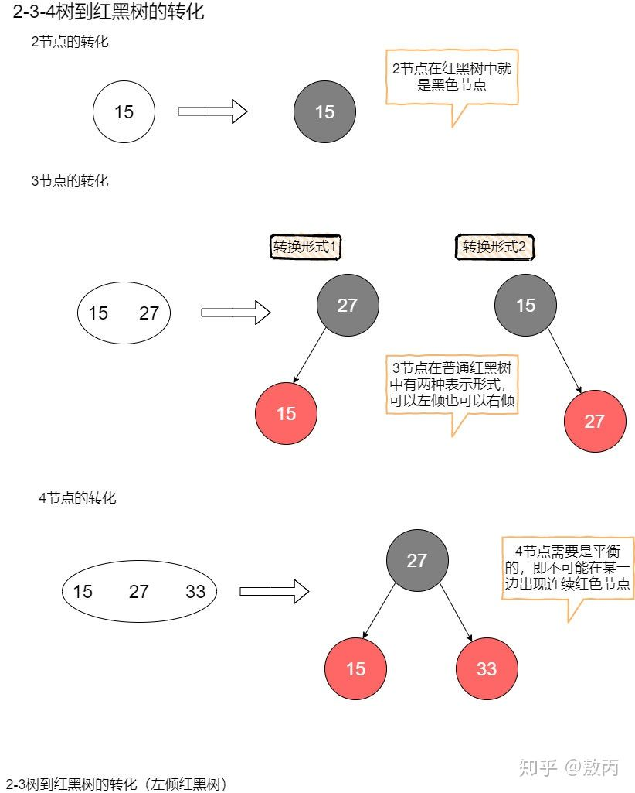

本文的研究主体是2-3树，并且是2-3树中较为特殊的一种转化-- **左倾红黑树**。顾名思义，左倾红黑树限制了如果在树中出现了红色节点，那么这个节点必须是左儿子。

以下是它的转化过程：

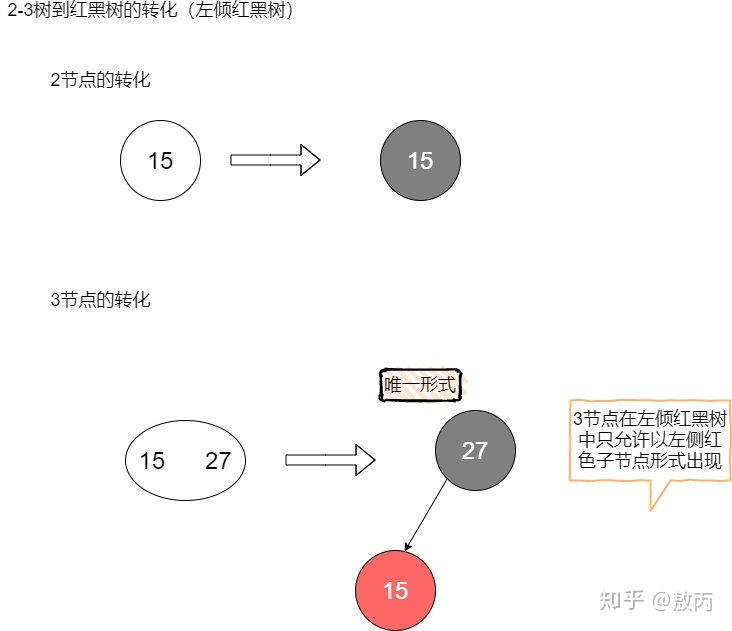

光看单个节点的转化可能还不够明显，下面制作了一张**红黑树转2-3树**的示意图，很清晰地描绘了它们之间的关系：只要把左倾红黑树中的红色节点顺时针方向旋转45度，使其与黑父平行，然后再将它们看作一个整体，你就会发现，这不就是一颗2-3树吗？

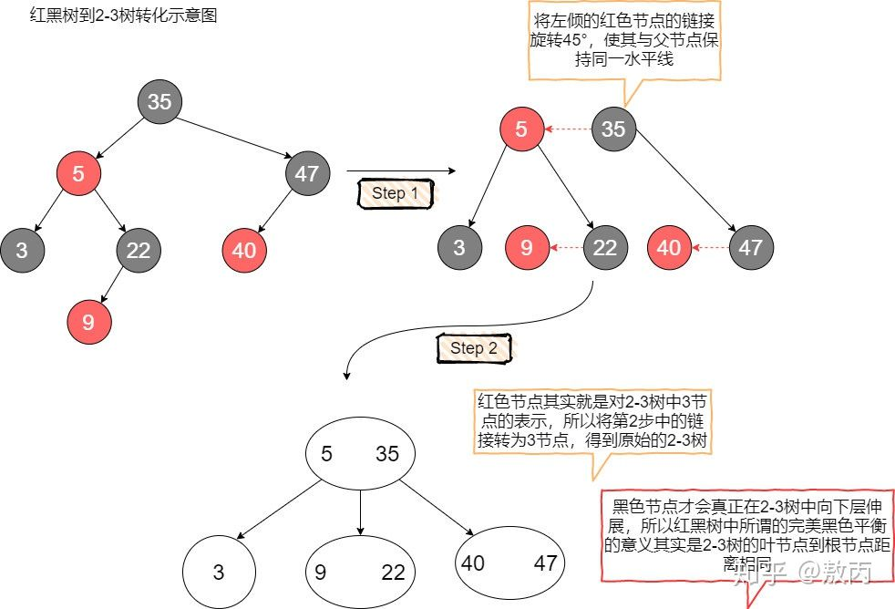

至此，红黑树其实就是对概念模型2-3树（或者2-3-4树）的一种实现。

算法导论中给出的是红黑树基于2-3-4树实现，其中4节点要求平衡（即4节点必须用黑色父亲和左右两个红色儿子表示，红色儿子不能出现在同一侧）。

**算法4**中给出的红黑树是基于2-3树实现，而且这种实现的红黑树十分特殊，它要求概念模型中的3节点在红黑树中必须用**左倾**的红色节点来表示。这种限定能够很大的减少红黑树调整过程中的复杂性。这将在接下来的内容中体会到这一点。

下面是根据**算法4**中的红黑树做演示主体的步骤：

* 首先，算法4中的红黑树基于2-3树概念模型，不用考虑2-3-4树中的复杂的4节点分裂；
* 第二，算法4中的红黑树是**左倾红黑树**，进一步降低了调平的难度；
* 第三，算法导论中对于红黑树删除场景的阐述并不够具体，许多关键环节都用“经过一定的旋转和变色处理”来带过，不利于新手的学习。

在了解红黑树的插入、删除操作之前，需要先了解2-3树的插入删除操作，这样才能够理解红黑树中的染色和旋转背后的意义。

先来看一下2-3树的插入。插入操作需要遵循一个**原则**：先将这个元素尝试性地放在**已经存在的节点中**，如果要存放的节点是2节点，那么插入后会变成3节点；如果要存放的节点是3节点，那么插入后会变成4节点（**临时**）。然后对可能生成的临时4节点进行分裂处理，使得临时4节点消失。

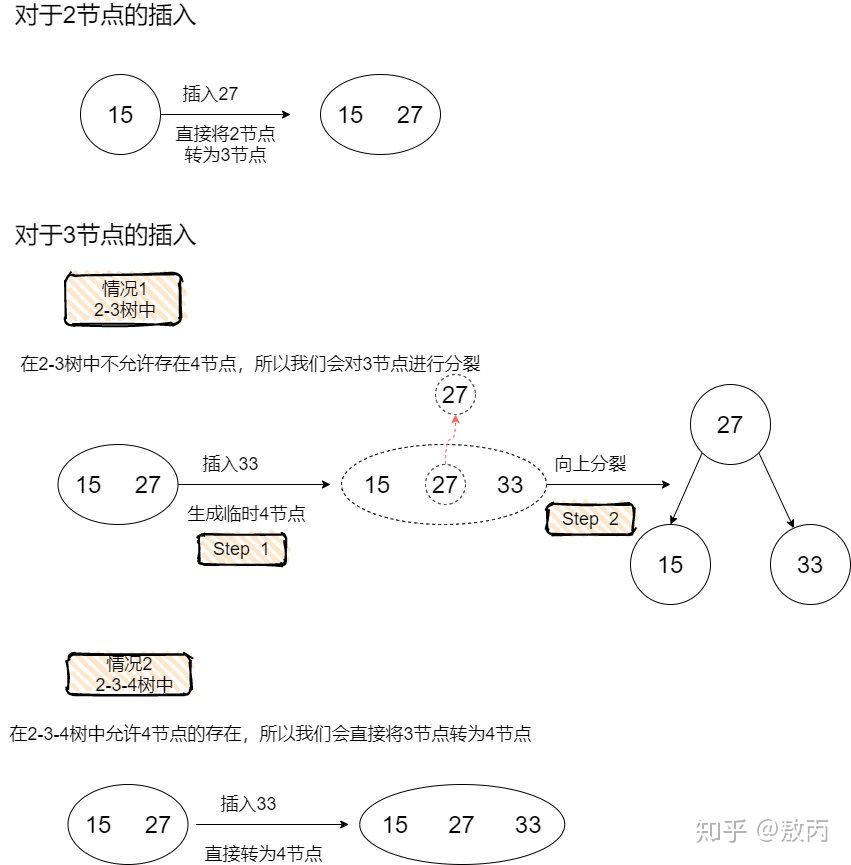

如果需要在2-3-4树中向4节点插入元素，那么会引发如下图所示的分裂过程：

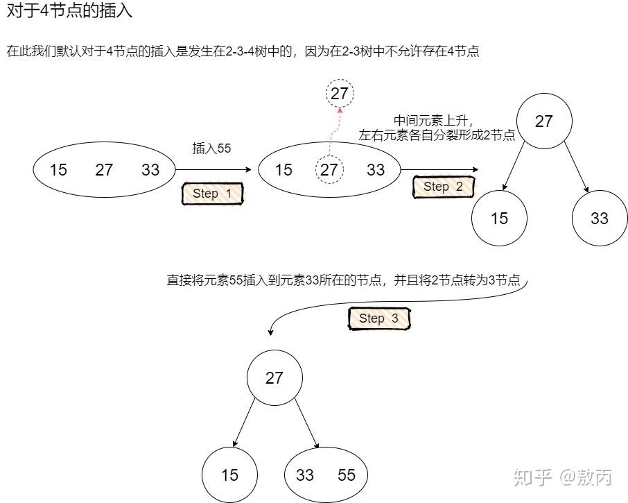

事实上，这正对应了红黑树在插入的时候一定会把待插入节点涂成红色，因为红色节点的意义是**与父节点进行关联**，形成概念模型2-3树中的3节点或者临时4节点。

而红黑树之所以需要在插入后进行调整，正是因为可能存在着概念模型中的临时4节点（反应在红黑树中是双红的情况）。

试想，在2-3树中如果插入节点是个2节点，那么反应在红黑树中，不正好对应着黑色父节点吗？在黑色父节点下面增加一个红色儿子，确实不会违背红黑树的任何原则，这也对应着向2-3树中的2节点插入一个元素，只需要简单的把2节点变成3节点。

接下来看看对于2-3树的删除。对于2-3树的删除，主要要考虑待删除元素在2节点这种情况，因为如果待删除元素在3节点，那么可以直接将这个元素删除，而不会破坏2-3树的任何性质（删除这个元素不会引起高度的变化）。

当待删除元素在2节点时，由于删除这个元素会导致2节点失去自己唯一的元素，引发2节点自身的删除，会使得树中某条路径的高度发生变化，树变得不平衡。

因此有两种方案去解决这个问题：

* 第一种：先删除这个2节点，然后对树进行平衡调整
* 第二种：想办法让这个被删除的元素不可能出现在2节点中

这里选择第二种方案。在搜索到这个节点的路径中，不断地判断当前节点是否为2节点。如果是，就从它的兄弟节点或者它的父节点借一个元素，使得当前节点由2节点变为一个3节点或者一个临时4节点（视情况而定，在后面的红黑树部分会详细介绍）。

这种操作会产生一个结果：**除非当前节点是根节点，否则当前节点的父节点一定是一个非2节点**（因为搜索的路径是自上而下，父节点已经进行过了这种操作，所以不可能是2节点），那么可以保证到达叶子节点的时候，也能顺利的从父节点或者兄弟节点处借到元素，使得自己成为非2节点。从而能够直接删除某个元素（现在这个元素不在2节点中了）。

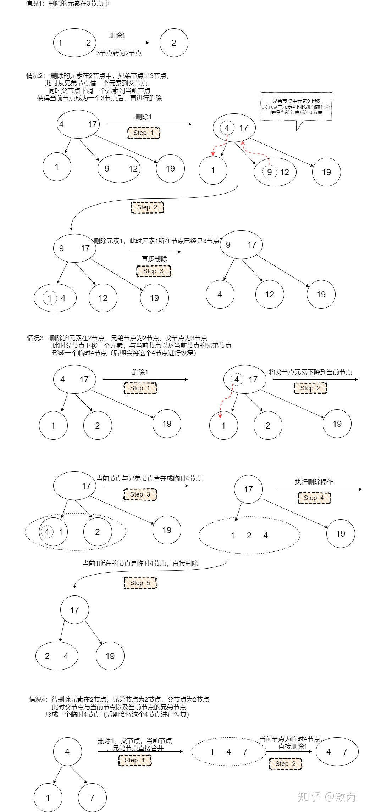

## 再看红黑树

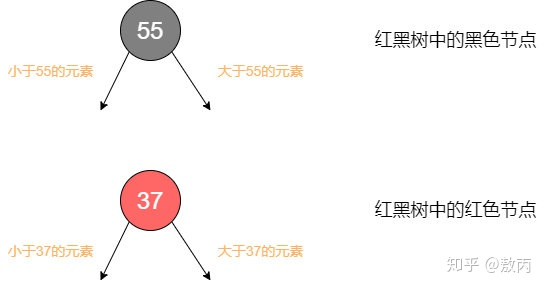

来看红黑树定义的5条内容：

* 节点颜色有红色有黑色

  2-3树转化为红黑树的过程已经说明了这个问题

* 根结点必为黑色

  2-3树中如果跟节点为2节点，那么它本来就对应红黑树中黑节点；如果根节点是3节点，也可以用黑色节点表示较大的那个元素，然后较小的元素作为左倾红节点存在于红黑树中。

* 所有叶子结点都是黑色

  此处提到的叶子结点其实就是空链接

* 任意节点到叶子节点经过的黑色节点数目相同

  红黑树中的红节点是和黑色父节点绑定的，在2-3树中本来就是同一层的，只有黑色节点才会2-3树中真正贡献高度，由于2-3树的任一节点到空链接距离相同，因此反应到红黑树中就是**黑色完美平衡**。

* 不会有连续的红色节点

  2-3树中本来就是规定没有4节点，2-3-4树中虽有4节点，但是要求在红黑树中体现为一黑色节点带两个红色儿子，分布左右，所以也不会有连续红节点。

### 作为二叉查找树

二叉查找树的节点有一个元素X和两个指针域，左指针指向小于X的元素，右指针指向大于X的元素。

假设插入序列是1～10，那么这棵树会演变成只有右链接的形式，树会增加到10层，这个时候已经不具备O(LogN)的查找时间复杂度，因为这棵树退化为了链表。

因此对二叉树进行平衡调整是很重要的一个环节，无论是AVL还是红黑树，它们本质上都是希望尽可能保证这棵二叉查找树中的元素尽量均衡的分布在树的两侧。

当向一棵二叉查找树中插入一个元素Y的时候，会一直与树中的节点进行大小比较，如果Y小于当前元素，就往左走；如果Y大于当前元素，就往右走，直到达到叶子结点，这个时候可以把Y插入这棵二叉查找树了。

由于这次的插入动作，整棵树可能会发生一些不平衡，因此需要在插入后进行一次平衡调整，使得整棵树恢复到平衡的状态（具体如何调整，要看树是AVL还是红黑树亦或是其他的平衡树）。

二叉查找树的删除是一个很有意思的问题，不同于插入的是，待删除的元素并不能保证一定出现在树的叶子节点。这将带来一个棘手的情况：即需要从树的中间部分取走一个元素，而且取走之后还需要经过调整来使得整棵树满足平衡的性质。从树的中间部分直接取走一个节点的场景实在太多，也牵扯到了太多相关的节点，这种操作很难实现。

好在有人提出了一个观点：**对查找树中的一个节点删除，其实可以不必真的改动这个节点的位置**。由于查找树的特殊性质，将某个元素节点删除后，它有两个最佳替代者，分别是有序序列中的前驱元素和后继元素。

还以一个包含元素1～10的二叉查找树为例，如果希望删除5所在的节点，那么让4或者6替代它的位置都是可行的。作为前驱元素的4，会存放在5所在的节点的左子树的最右侧；作为后继元素的6，会存放在5所在节点的右子树的最左侧。

关于这个结论，需要稍加思索便可以明白。

现在再让问题简化些，也就是说，删除某个节点的时候，先找到它的前驱元素或者后继元素（随便挑选一个），将它的前驱元素直接填到待删除的节点，然后再把它的前驱元素或者后继元素删除。

这个时候问题就转化成了在二叉查找树中删除一个没有左子树的节点（或者是一个没有右子树的节点），只需要将这个节点删除再进行对应的平衡调整即可（虽然还是需要调平，但是比直接在树中层删除一个同时具备左右儿子的节点要容易很多）。

注意，此处并没有强调是针对红黑树的操作，因为红黑树和AVL都是二叉查找树，它们都是用这个方法。

### 树的旋转

为了调平一棵二叉树，使得其左右节点数目分布均衡，通常会选择旋转的手段。可以把一棵二叉树某个节点的左右子树想象成天平上待称重的物品。如果哪边重了，就从重的那边拿出一部分，加到轻的那边，以此保持相对的平均。

在二叉树中这种调整的操作就是旋转，下面给出两个示例，希望大家能够仔细研究，旋转是二叉树调平的精髓。

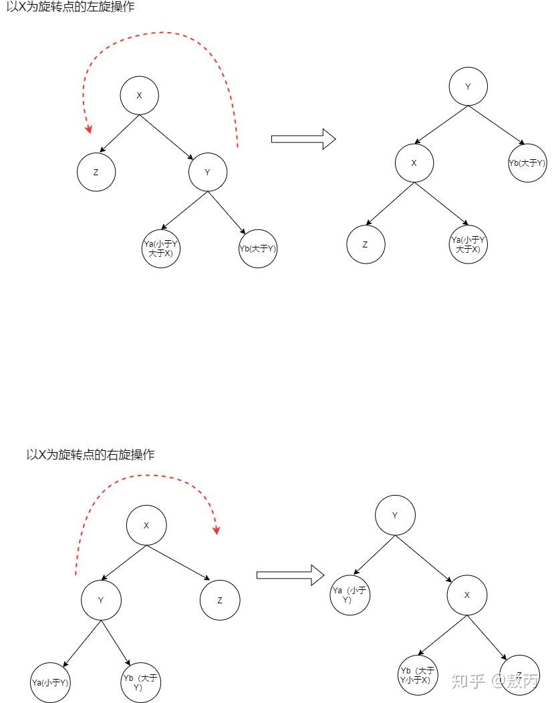

理解了这些了之后，再去看红黑树的插入删除，就能够旋转和染色背后的意义了。选择算法4中的左倾红黑树作为演示。

首先看插入操作。

### 插入操作

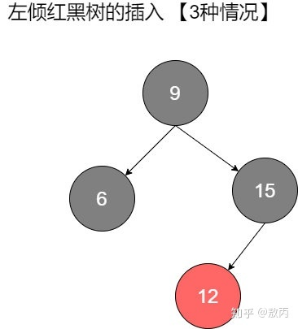

如图所示，对于左倾红黑树的插入一共有三种可能的情况：

#### 第一种情况

待插入元素比黑父大，插在了黑父的右边，而黑父左边是红色儿子。这种情况会导致在红黑树中出现右倾红节点。

注意，这种情况对应着2-3树中出现了临时4节点。在2-3树中的处理是将这个临时4节点分裂，左右元素各自形成一个2节点，中间元素上升到上层跟父节点结合。所以，在红黑树中的动作是：将原本红色的左右儿子染黑（左右分裂），将黑父染红（等待上升结合）。

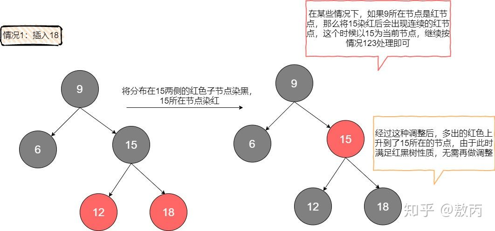

#### 第二种情况

待插入的元素比红父小，且红父自身就是左倾。其实就是说红父和待插入的元素同时靠在了左边，形成了持续的红节点。这种情况需要用两步来调整。由于插入的是红色节点，其实不会破坏黑色完美平衡，所以要注意的是在旋转和染色的过程中继续保持这种完美黑色平衡。

首先对红父的父亲进行一次右旋，这次右旋不会破坏黑色平衡，但是也没有解决连续红色的问题。接下来将12所在节点与15所在节点交换颜色，这样的目的是为了消除连续红色，并且这个操作依旧维持了黑色平衡。现在已经得到了情况一的场景，直接按**情况一**处理即可。

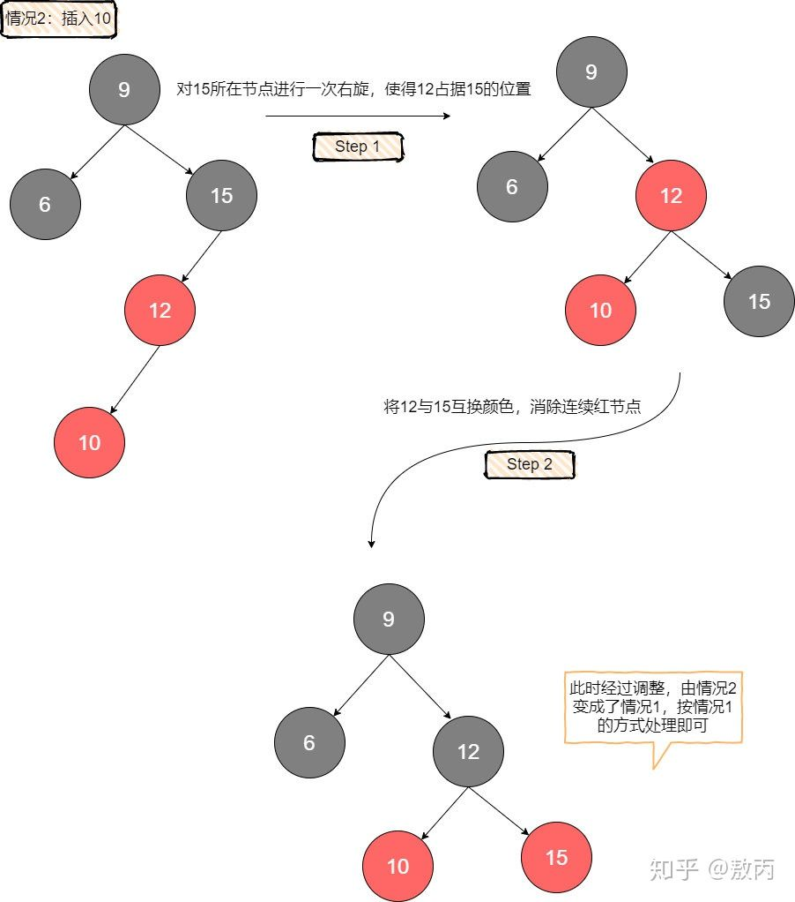

#### 第三种情况

待插入元素比红父大，且红父自身就是左倾。也就是说插入的这个节点形成了一个右倾的红色节点，对右倾的处理很简单，将红父进行一次左旋，就能够使得右倾红节点变为左倾，现在出现了连续的左倾红节点，直接按**情况二**处理即可。

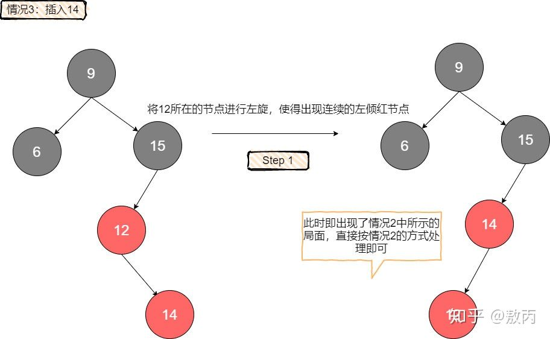

在插入时，可以体会到左倾红黑树对于左倾的限制带来的好处，因为在原树符合红黑树定义的情况下，如果父亲时红的，那么它一定左倾，同时也不用考虑可能存在的右倾兄弟（如果有，那说明原树不满足红黑树定义）。

### 删除操作

#### 左倾红黑树的删除

