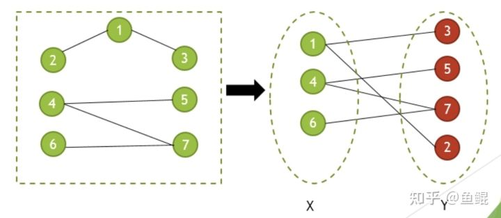
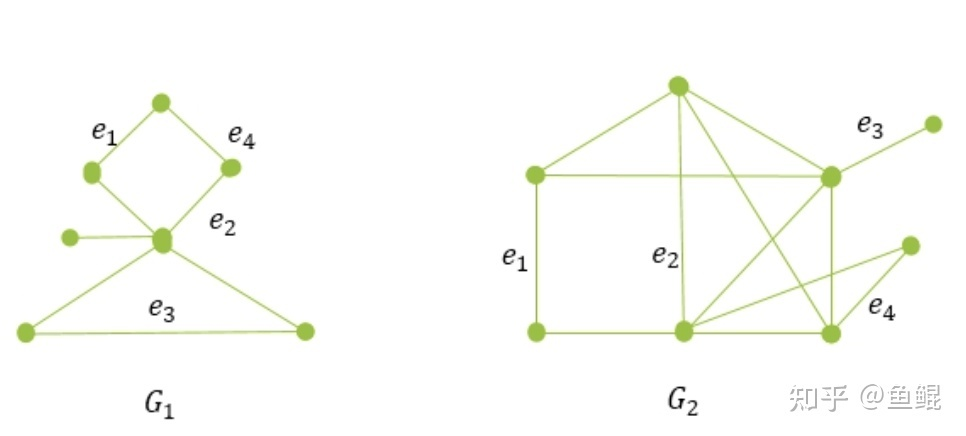

# KM 算法原理、实现与应用

原文：https://zhuanlan.zhihu.com/p/444518253

问题描述：给 N 个人员（x1, x2,..., xn）安排 N 份工作（y1, y2, ..., yn），其中每个人只能胜任其中的若干项工作，而且每个人完成不同工作需要耗费的时间不同。是否可以给每个人分配一个胜任的工作，而且保证完成工作的总耗时最少？应该如何分配？以上问题，可以抽象化为二分图相关问题。这里主要讲解二分图的相关原理/匈牙利算法和KM算法的证明和实现逻辑。

## 一. 相关概念

### 1.1 二分图

如果图G的顶点集合可以分为两个非空子集X和Y，使得G的任何一条边对应的两个端点，一个在X中，另一个在Y中，则G称为二分图，记做G(X,Y)。这里的关键是：任何一条边。也就是说，两个顶点集{X}和{Y}各自的内部，是无边可达的。

**匹配**：G是一个图，那么G中不相邻的边（两条边不能有相同的点）组成的集合M称为图G的一个匹配。对于匹配M中的每条边 e=uv，其两端点 u 和 v 称为被M所匹配，此时 u 和 v 称为是 **M饱和**的。

**最大匹配**：图G中含边数最多的匹配，称为G的最大匹配。

**完美匹配**：如果G中的每个点都是M饱和的，那么M是G的完美匹配。

以上例子中，{e1}, {e1, e2}, {e1, e2, e3} 都是 G1 的匹配，最后一个是最大匹配。

**交错路径**：M 是 G 的一个匹配，G 的一条M 交错

**增广路径**：