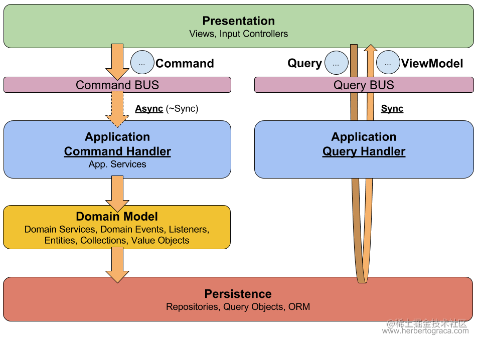
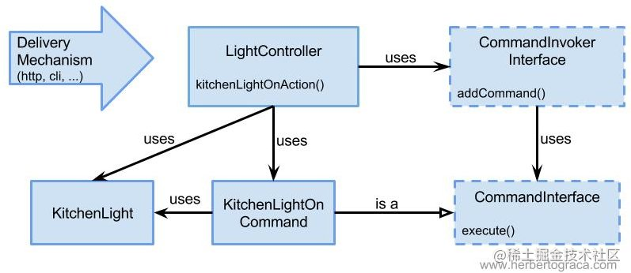
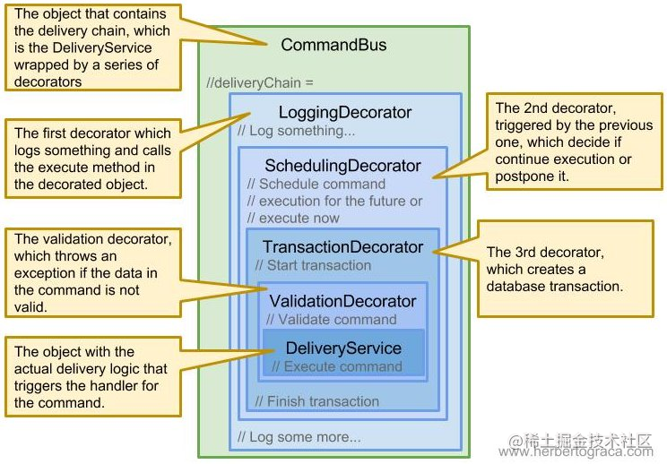

# CQRS 介绍

原文：https://juejin.cn/post/7001738938943537160

## 一. CQRS

CQRS，全称 Command Query Responsibility Segregation， 即命令查询职责分离。顾名思义，将命令和查询分离。

查询，就是查询数据，不会对数据产生变化，因此它是**幂等**的，不用担心对系统产生影响，因此**可以针对查询添加缓存操作提升查询性能**。

命令，就是对数据产生变化的操作的总称。

大多数软件系统中，查询频率要远大于命令操作，这是将查询与命令分离的根本原因。

CQRS的架构图如下：

## 二. 命令模式

命令模式在日常开发中比较常见，拿一个控制灯光的例子来说，可能会有如下的实现：

命令模式会将执行动作和执行需要的信息封装成为一个 Command，假如说要将灯光调整为 25% 、调整为 50%，是否需要针对其每一个都创建一个命令类呢？这样就会导致创建无穷多的命令。

但是仔细想想，设置功率，仅仅只是数据变化，而具体怎么设置的业务逻辑并不会发生变化，于是就可以通过创建一个命令类，通过 execute 的入参将变化的数据传递过去。但是如果这样，就会破坏**命令模式的初衷：将执行流程所需要的信息封装起来，使得其他调用地方执行流程时不进行感知**。

或许也可以通过命令的构造器将变化的数据传入进去，但是这样并不优雅。它实际上是一种黑客行为，因为数据不是对象存在所需要的东西，它是它需要执行一些逻辑的东西，所以**数据是方法的依赖，而不是对象的依赖**。

## 三. 命令总线

核心目的是**将“不变”与“变化”分离开来**。往往变化的是数据，而不变的是业务逻辑。就上述例子来说，调整功率的具体代码业务逻辑不会变，仅仅是需要设置的功率在变化。因此可以分为两个类，其中之一为 **Command** （存放数据DTO）；另一个为 **Handler** （存放 业务逻辑），其持有一个 *execute (CommandInterface command): void* 方法来触发业务逻辑的执行。此时上述的 **CommandInvoker** 也将演化，当接收到一个命令时，将查找该命令指定的命令处理器，然后调用处理器执行命令，那么这里就将它称为**命令总线**。

使用命令总线，可以为选择异步执行命令，为系统带来更好的请求响应；而**在一个集中的地方集中执行命令的一个好处就是可以在执行命令前后进行增强（类似AOP）**。命令总线一般会使用包装着它的装饰器来实现这一目标：

## 四. CQRS小结

通过 CQRS 模式将读模型与写模型分离，使得可以优化读性能和写性能之外，还可以让代码更加清晰简洁，更加体现出领域，更容易维护。