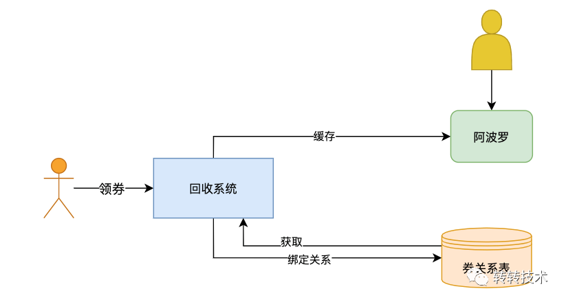
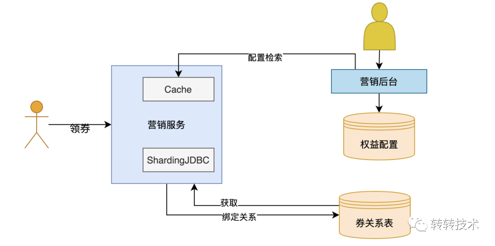
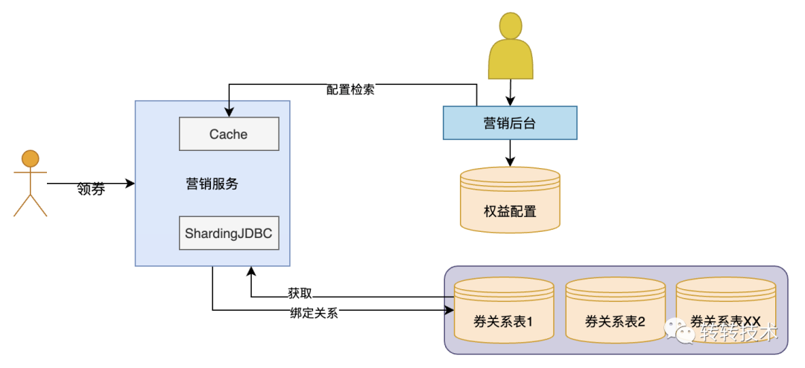
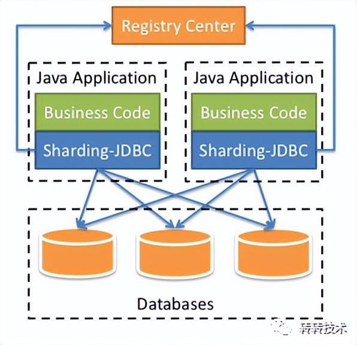
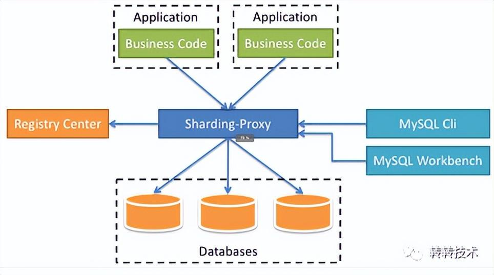
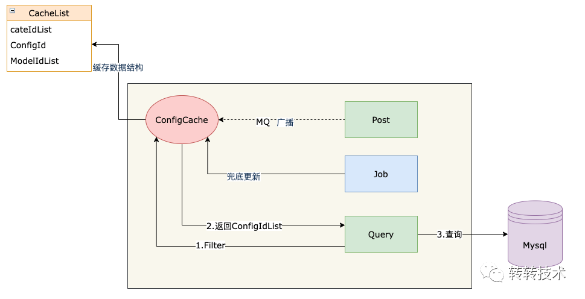
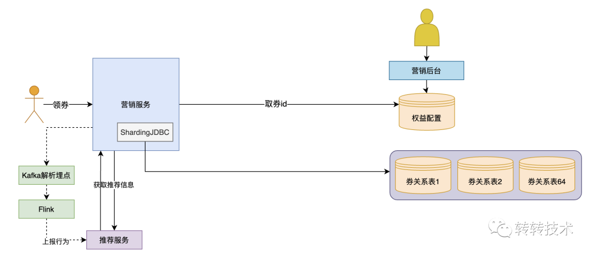
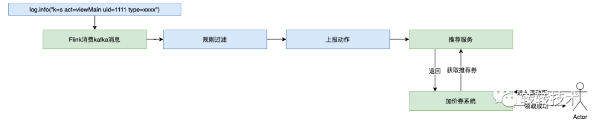
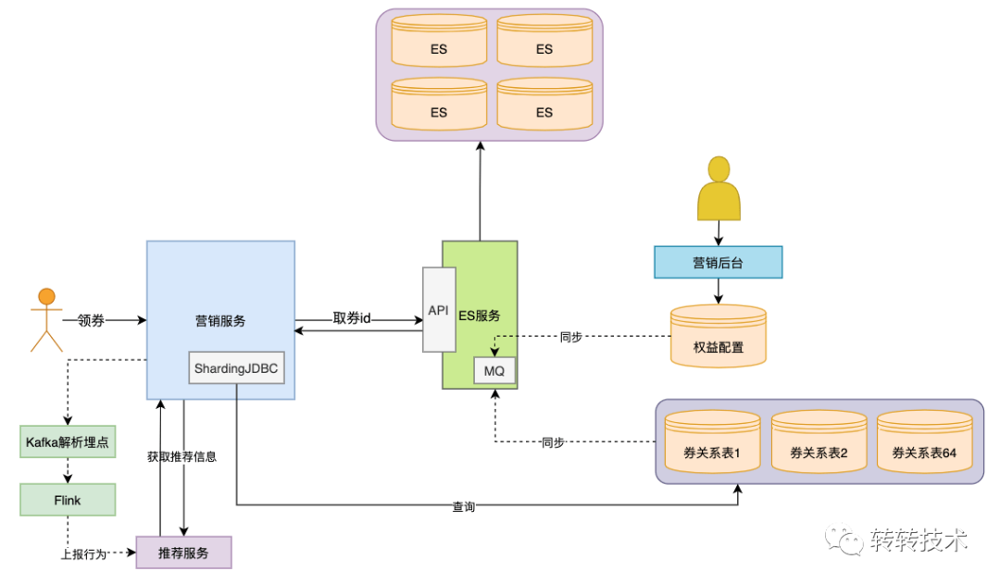
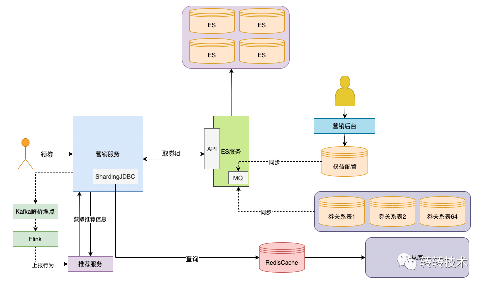

# 搞明白优惠券架构是如何演化的

原文：https://www.toutiao.com/article/7122621335360061985/?log_from=644c5088331f18_1659147118275

### 业务介绍

转转的 C2B 回收业务，一句话概括就是从用户手中回收 3C 数码产品。

用户选择想要估价商品进行估价，如果用户认为合理则可以将商品邮寄到平台，平台收货后进行质量检测，同时向用户提供确切的报价。用户权衡觉得和合理后，可以点击确认回收，平台将给用户进行打款。

### 业务场景

如何有效提升用户下单量呢？报价合理的基础上，还需要给予用户一定的现金补贴，买家端称之为“满减券”，而卖家端则是“满加券”，后续都统称为“加价券”，卖家用户满足一定售出金额的时候平台会给用户额外进行一定比例或者固定金额的价格补贴。

接下来我们将详细讲一下加价券业务的演进历程。

### 名词解释

权益配置：存储的是加价券的配置信息

券关系表：存储的是加价券与用户的绑定关系

### 演进过程

#### 1.0 实验阶段

**关键字：探索、不确定性**

在项目初期，对于加价券的数据模型并没有明确定义，产品也不确定什么样的玩法会对用户产生比较有效的激励， 所以加价券的数据结构会频繁发生改变。

所以将加价券的配置写入到阿波罗配置中心，好处是可以快速上线进行实验，方便随时修改加价券的数据结构，虽然配置中心的缺点也很明显（没有强校验规则，产品配置成本高，易错），但是早期并没有过多的券配置，技术协助review即可。

券关系表即用户与加价券关联关系数据，由于项目初期对数据量以及增长没有明确的指标，所以没有进行分库分表，只是使用了一张表进行存储，在增长量逐渐明确后再进行数据的拆分以及迁移。

#### 2.0 平台化建设

**关键字：规范化**

经过一段时间的试验阶段， 产品明确了加价券的玩法以及数据模型。加价券已经不再仅仅服务于线上回收业务，例如上门回收、线下门店回收、端外回收等业务也逐渐接入加价券，配置中心的弊端逐渐暴露了出来。

第一阶段也提到使用阿波罗的不便之处：

- 缺少校验规则, 容易出现配置错误, 引发线上问题
- 产品需要对json操作熟练，配置成本较高
- 没有可视化工具不便于维护

为了让他们减少操作成本，处理更规范化，以及提供一些便利的运营工具给他们使用，所以2.0建设废除了阿波罗配置中心，搭建了一套营销后台。

#### 3.0 大表拆成小表

随着业务发展用户绑定券的数量越来越多，单表已经接近上亿的量级，预估到五年后数据量过大造成系统性能问题，所以在本阶段建设过程中对券关系表进行分库分表处理。

首先，分库分表方案有两种：

1. 基于JDBC进行一层代理，该方案只需要后端参与即可

2. 基于数据库进行一层代理，该方案需要DBA或者运维的介入，维护起来不方便。

   

为了降低人力成本，选择了**JDBC**代理，框架选用的市面上使用比较多的sharding-jdbc，这个框架社区比较活跃方便后面快速定位、解决问题。

根据当前的数据量以及增长效率简单得出一个增长模型，大概估算出未来五年券关系总量，计算出了对应的库表数量, 这里将单表拆分成8库8表即可。

加价券的场景都是由与某个**用户**强相关，例如加价券列表或用户筛选最合适的加价券进行核销，所以使用用户的uid进行hash运算来进行分表。

#### 如何筛选合适的券给用户呢？

用户进行券核销的时候需要根据分类、品牌、机型等信息进行筛选, 筛选条件过多。由于数据量过多，直接进行表关联并不合适，为了加快上线节奏，本次也没有考虑使用第三方的中间件进行检索。

考虑到加价券在这个阶段配置数量不会过多，解决方案是将券配置信息缓存到本地，运营在后台新增或者修改券的时候通过MQ广播通知各个机器进行更新。为了保证数据准确，还有一个定时任务定时去进行兜底更新，这样在筛选加价券的时候会先去内存中过滤出符合用户要求的券配置id，再通过这些配置id去数据库直接获取相应的加价券即可。

#### 4.0 智能化建设

**智能化**指的是，通过用户的一些行为（下单，评价，浏览商品等）进行分析并给用户发一些适合的券，不再是通过一些活动发放固定类型的加价券。

所谓术业有专攻，智能化发券通过算法推荐组的相关同事协助进行大数据分析。实现过程为通过kafka获取到用户的相关行为的埋点日志，再使用Flink接收到kafka消息进行信息规则过滤，过滤出想要的信息，上报给搜索推荐服务, 当用户进入活动页的时候, 查询推荐服务获取到用户最合适的券发给用户。

#### 5.0 引入ElasticSearch中间件

当数据库中的数据多到一定规模时，数据库就不适用于复杂的查询了，往往只能满足普通查询的场景。对于全文检索、可变数据结构等场景，数据库天生不适用。因此需要针对特定的场景，引入合适的解决方案。

经过4.0的建设之后，随着产品需求越来越多，产品需要大量建券进行黑盒实验，来给用户进行定制化发券，券配置放到本地可能会有内存OOM的风险，系统**稳定性**存在严重的问题，所以需要找到另一种合适的方案进行数据检索，目前比较适合的方案就是ElasticSearch, 通过介入ES来简化加价券的检索。

当然，引入更多组件同时会提高系统的复杂度，不同的组件保存的数据需要同步，需要考虑一致性的问题，需要有更多的运维手段来管理这些组件等, 不过对于当前加价券场景对于强一致性没有那么强的需求，**秒级**延迟完全可以接受，只需要保证**最终一致性**即可。

##### 附一些ES集群优化手段：

- 压缩数据传输大小，ES索引只建立需要检索的字段，查询的时候只获取主键id，提升网络传输效率。
- 减少检索范围，因为加价券查询场景都是跟用户挂钩，所以根据uid进行分片，检索的时候依据uid进行路由，可极大减少检索数量。
- 限制数据总量，对于已过期的加价券，没有必要长期保留，可定期进行归档，mysql数据可归档在TiDB， es数据无需保留，保证数据库以及es集群数据总量达到可控的范围。
- 选取合适的字段, 例如在5.x版本下如果对于数字类型进行精确查找，不会进行范围查找，建议使用keyword字段, 例如品类、机型信息。

#### 6.0 引入NoSQL、从库等提升稳定性

随着业务方越来越多，查询请求量级越来越大，高峰会达到1W+qps, 对服务端以及数据库的稳定性都形成了极大的考验

对于服务的稳定性，进行了以下优化：

- 读写分离, 大部分是读多写少场景, 高并发场景,例如秒杀场景, 读写分离可以保证写入的稳定性, 而加价券场景对于从库的延迟也可以容忍。
- 缓存覆盖, 对于常用接口进行redis 缓存处理，减少数据库查询负担。
- 熔断降级，当Es集群或服务端不可避免出现抖动导致超时的时候，及时进行熔断处理，触发兜底策略，保证系统能够稳定运行。

### 感悟&总结

1.不需要过度设计

2.协调合适的人帮忙做合适的事

3.多跟同事交流技术心得，可以便于快速解决问题，从工作中得到启发

4.有没有一些架构设计的原则？

- **回滚设计**。确保系统可以向前兼容，在系统升级时应能有办法回滚版本；
- **禁用设计**。应该提供控制具体功能是否可用的配置，在系统出现故障时能够快速下线功能；
- **监控设计**。在设计阶段就要考虑监控的手段；
- **采用成熟的技术**。刚开发的或开源的技术往往存在很多隐藏的bug，出了问题没有商业支持可能会是一个灾难；
- **资源隔离设计**。应避免单一业务占用全部资源；
- **架构水平扩展**。系统只有做到能水平扩展，才能有效避免瓶颈问题；
- **快速迭代**。系统应该快速开发小功能模块，尽快上线进行验证，早日发现问题大大降低系统交付的风险；