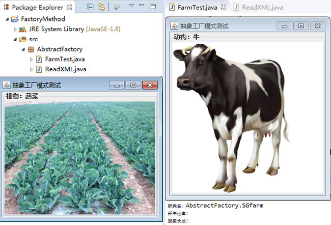

# 抽象工厂

原文：http://c.biancheng.net/view/1351.html


​        工厂方法模式只考虑的是**一种产品**的生产。但是现实生活中的许多工厂是综合性的，能生产多等级（种类）的产品，如农场里即养动物，又种植植物；电器厂即生产电视机，又生产洗衣机等等。

​        抽象工厂模式就是考虑多等级产品的生产，将同一个具体工厂所生产的位于不同等级的一组产品称为一个产品簇，如下图所示，海尔工厂和TCL工厂所生产的电视机和空调对应的关系图：


## 1. 模式的定义和特点

​        抽象工厂（AbstractFactory）模式定义：是一种为访问类提供一个创建一组相关或相互依赖对象的接口，且访问类无须指定所要产品的具体类就能得到同族的不同等级的产品的模式结构。

​        抽象工厂模式是工厂模式的升级版，工厂方法模式只生产一个等级的产品，而抽象工厂模式可生成多个等级的产品。

​        使用抽象工厂模式一般要满足以下的条件：

* 系统中有多个产品族，每个具体工厂创建同一族但属于不同等级结构的产品
* 系统一次只可能消费其中一族产品，即同族的产品一起使用

### 1.1 优点

​        抽象工厂模式除了具有工厂方法模式的优点外，还有一下几个优点：

* 可以在类的内部对产品族中相关联的多等级产品共同管理，而不必专门引入多个新的类进来进行管理
* 当需要产品族时，抽象工厂可以保证客户端始终只使用一个产品的产品组
* 抽象工厂增强了程序的可扩展性，当增加一个新的产品族时，不需要修改代码，满足开闭原则

### 1.2 缺点

* 当产品族中需要增加一个新的产品时，所有的工厂类都需要进行修改。增加了系统的抽象性和理解难度

## 2. 模式的结构与实现

​        抽象工厂模式同工厂模式一样，也是**抽象工厂、具体工厂、抽象产品和具体产品**等4个要素构成，但抽象工厂中方法个数不同，抽象产品的个数也不同。

### 2.1 模式的结构

​        抽象工厂的主要角色如下：

1. 抽象工厂（Abstract Factory）：提供了创建产品的接口，它包含多个创建产品的方法 newProduct()， 可以创建多个不同等级的产品
2. 具体工厂（Concrete Factory）：主要是实现抽象工厂中的多个抽象方法，完成具体产品的创建
3. 抽象产品（Product）：定义了产品的规范，描述了产品的主要特性和功能，抽象工厂模式有多个抽象产品
4. 具体产品（Concrete Product）：实现了抽象产品角色所定义的接口，由具体工厂来创建，它同具体工厂之间时多对一的关系

​        抽象工厂模式的结构如下：


### 2.2 模式的实现

​        从上图可以看出抽象工厂模式的结构同“工厂方法模式”的结构相似，不同的是其产品的种类不止一个，所以创建产品的方法也不止一个。下面给出抽象工厂和具体工厂的代码：

1. 抽象工厂：提供了产品的生成方法：

   ```java
   interface AbstractFactory {
       public Product1 newProduct1();
       public Product2 newProduct2();
   }
   ```

   

2. 具体工厂：实现了产品的生成方法：

   ```java
   class ConcreteFactory1 implements AbstractFactory {
       public Product1 newProduct1() {
           System.out.println("具体工厂 1 生成-->具体产品 11...");
           return new ConcreteProduct11();
       }
       public Product2 newProduct2() {
           System.out.println("具体工厂 1 生成-->具体产品 21...");
           return new ConcreteProduct21();
       }
   }
   ```

   

## 3. 模式的应用实例

### 3.1 用抽象工厂模式设计农场类

​        分析：农场中，除了像畜牧场一样可以养动物，还可以培养植物，如养马、养牛、种菜、种水果等，所以本实例比前面介绍的畜牧场类复杂，必须用抽象工厂模式来实现。

​        本例用抽象工厂模式来设计两个农场，一个是韶关农场用于养牛和种菜，一个是上饶农场用于养马和种水果，可以在以上两个农场中定义一个生成动物方法 newAnimal() 和一个培养植物的方法 newPlant()

​        对马类、牛类、蔬菜类和水果类等具体产品类，由于要现实它们的图像，所以它们的构造函数中用到了JPanel、JLabel和ImageIcon 等组件，并定义一个 show 方法来显示它们。

​        客户端程序通过对象生成器类ReadXML读取XML配置文件中的数据来决定养什么动物和培养什么植物。结构图如下所示：


代码如下：

```java
package AbstractFactory;

import java.awt.*;
import javax.swing.*;

public class FarmTest {
    public static void main(String[] args) {
        try {
            Farm f;
            Animal a;
            Plant p;
            f = (Farm) ReadXML.getObject();
            a = f.newAnimal();
            p = f.newPlant();
            a.show();
            p.show();
        } catch (Exception e) {
            System.out.println(e.getMessage());
        }
    }
}

//抽象产品：动物类
interface Animal {
    public void show();
}

//具体产品：马类
class Horse implements Animal {
    JScrollPane sp;
    JFrame jf = new JFrame("抽象工厂模式测试");

    public Horse() {
        Container contentPane = jf.getContentPane();
        JPanel p1 = new JPanel();
        p1.setLayout(new GridLayout(1, 1));
        p1.setBorder(BorderFactory.createTitledBorder("动物：马"));
        sp = new JScrollPane(p1);
        contentPane.add(sp, BorderLayout.CENTER);
        JLabel l1 = new JLabel(new ImageIcon("src/A_Horse.jpg"));
        p1.add(l1);
        jf.pack();
        jf.setVisible(false);
        jf.setDefaultCloseOperation(JFrame.EXIT_ON_CLOSE);//用户点击窗口关闭
    }

    public void show() {
        jf.setVisible(true);
    }
}

//具体产品：牛类
class Cattle implements Animal {
    JScrollPane sp;
    JFrame jf = new JFrame("抽象工厂模式测试");

    public Cattle() {
        Container contentPane = jf.getContentPane();
        JPanel p1 = new JPanel();
        p1.setLayout(new GridLayout(1, 1));
        p1.setBorder(BorderFactory.createTitledBorder("动物：牛"));
        sp = new JScrollPane(p1);
        contentPane.add(sp, BorderLayout.CENTER);
        JLabel l1 = new JLabel(new ImageIcon("src/A_Cattle.jpg"));
        p1.add(l1);
        jf.pack();
        jf.setVisible(false);
        jf.setDefaultCloseOperation(JFrame.EXIT_ON_CLOSE);//用户点击窗口关闭
    }

    public void show() {
        jf.setVisible(true);
    }
}

//抽象产品：植物类
interface Plant {
    public void show();
}

//具体产品：水果类
class Fruitage implements Plant {
    JScrollPane sp;
    JFrame jf = new JFrame("抽象工厂模式测试");

    public Fruitage() {
        Container contentPane = jf.getContentPane();
        JPanel p1 = new JPanel();
        p1.setLayout(new GridLayout(1, 1));
        p1.setBorder(BorderFactory.createTitledBorder("植物：水果"));
        sp = new JScrollPane(p1);
        contentPane.add(sp, BorderLayout.CENTER);
        JLabel l1 = new JLabel(new ImageIcon("src/P_Fruitage.jpg"));
        p1.add(l1);
        jf.pack();
        jf.setVisible(false);
        jf.setDefaultCloseOperation(JFrame.EXIT_ON_CLOSE);//用户点击窗口关闭
    }

    public void show() {
        jf.setVisible(true);
    }
}

//具体产品：蔬菜类
class Vegetables implements Plant {
    JScrollPane sp;
    JFrame jf = new JFrame("抽象工厂模式测试");

    public Vegetables() {
        Container contentPane = jf.getContentPane();
        JPanel p1 = new JPanel();
        p1.setLayout(new GridLayout(1, 1));
        p1.setBorder(BorderFactory.createTitledBorder("植物：蔬菜"));
        sp = new JScrollPane(p1);
        contentPane.add(sp, BorderLayout.CENTER);
        JLabel l1 = new JLabel(new ImageIcon("src/P_Vegetables.jpg"));
        p1.add(l1);
        jf.pack();
        jf.setVisible(false);
        jf.setDefaultCloseOperation(JFrame.EXIT_ON_CLOSE);//用户点击窗口关闭
    }

    public void show() {
        jf.setVisible(true);
    }
}

//抽象工厂：农场类
interface Farm {
    public Animal newAnimal();

    public Plant newPlant();
}

//具体工厂：韶关农场类
class SGfarm implements Farm {
    public Animal newAnimal() {
        System.out.println("新牛出生！");
        return new Cattle();
    }

    public Plant newPlant() {
        System.out.println("蔬菜长成！");
        return new Vegetables();
    }
}

//具体工厂：上饶农场类
class SRfarm implements Farm {
    public Animal newAnimal() {
        System.out.println("新马出生！");
        return new Horse();
    }

    public Plant newPlant() {
        System.out.println("水果长成！");
        return new Fruitage();
    }
}
```

```java
package AbstractFactory;
import javax.xml.parsers.*;
import org.w3c.dom.*;
import java.io.*;

class ReadXML {
    public static Object getObject() {
        try {
            DocumentBuilderFactory dFactory = DocumentBuilderFactory.newInstance();
            DocumentBuilder builder = dFactory.newDocumentBuilder();
            Document doc;
            doc = builder.parse(new File("src/AbstractFactory/config.xml"));
            NodeList nl = doc.getElementsByTagName("className");
            Node classNode = nl.item(0).getFirstChild();
            String cName = "AbstractFactory." + classNode.getNodeValue();
            System.out.println("新类名：" + cName);
            Class<?> c = Class.forName(cName);
            Object obj = c.newInstance();
            return obj;
        } catch (Exception e) {
            e.printStackTrace();
            return null;
        }
    }
}
```

```xml
<?xml version="1.0" encoding="UTF-8"?>
<config>
	<className>SGfarm</className>
</config>
```

程序运行结果如下：



## 4. 模式的应用场景


## 5. 模式的扩展