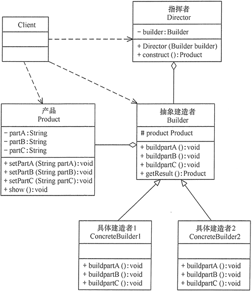

# 建造者模式

原文：http://c.biancheng.net/view/1354.html


## 1. 定义与特点

建造者模式的定义：将一个**复杂对象**的构造与它的表示分离，使同样的构建过程可以创建不同的表示。

它是将一个**复杂的对象**分解为多个简单的对象，然后一步一步构建而成。它将变与不变相分离，即产品的组成部分是不变的，但每一部分是可以灵活的选择的。

### 1.1 优点

* 封装性好，构建和表示分离
* 扩展性好，各个具体的构建者相互独立，有利于系统的解耦
* 客户端不必知道产品内部的组成细节，建造者可以对创建过程逐步细化，而不对其他模块产生任何影响，便于控制细节风险

### 1.2 缺点

* 产品的组成部分必须相同，限制了使用范围
* 如果产品的内部变化复杂，如果产品内部发生变化，则建造者也要同步修改，后期维护成本大

## 2. 结构与实现

建造者（Builder）模式由 **产品、抽象建造者、具体建造者、指挥者** 等4个要素构成，现在分析其基本结构和实现方法

### 2.1 模式的结构

建造者模式的主要角色如下：

1. 产品角色（Product）：它是包含多个组成部件的复杂对象，由具体建造者来创建其各个零部件
2. 抽象建造者（Builder）：它是一个包含创建产品各个子部件的抽象方法的接口，通常还包含一个返回复杂产品的方法 getResult() [现在喜欢用 build()方法]
3. 具体构建者（Concrete Builder）：实现Builder接口，完成复杂产品的各个部件的具体创建方法
4. 指挥者（Director）：它调用建造者对象中的部件构造与装配方法完成负载对象的创建，在指挥者中不涉及具体产品的信息

​        结构图如下：



### 2.2 模式的实现

根据上图，可得如下的相关代码：

#### 2.2.1 产品角色

包含多个组成部分的复杂对象

```java
class Product {
    private String partA;
    private String partB;
    private String partC;

    public void setPartA(String partA) {
        this.partA = partA;
    }

    public void setPartB(String partB) {
        this.partB = partB;
    }

    public void setPartC(String partC) {
        this.partC = partC;
    }

    public void show() {
        //显示产品的特性
    }
}
```

#### 2.2.2 抽象构建者

```java
abstract class Builder {
    //创建产品对象
    protected Product product = new Product();

    public abstract void buildPartA();

    public abstract void buildPartB();

    public abstract void buildPartC();

    //返回产品对象
    public Product getResult() {
        return product;
    }
}
```

#### 2.2.3 具体构建者

```java
public class ConcreteBuilder extends Builder {
    public void buildPartA() {
        product.setPartA("建造 PartA");
    }

    public void buildPartB() {
        product.setPartB("建造 PartB");
    }

    public void buildPartC() {
        product.setPartC("建造 PartC");
    }
}
```

#### 2.2.4 指挥者

调用构建者中的方法，完成复杂对象的创建

```java
class Director {
    private Builder builder;

    public Director(Builder builder) {
        this.builder = builder;
    }

    //产品构建与组装方法
    public Product construct() {
        builder.buildPartA();
        builder.buildPartB();
        builder.buildPartC();
        return builder.getResult();
    }
}
```

#### 2.2.5 客户类

```java
public class Client {
    public static void main(String[] args) {
        Builder builder = new ConcreteBuilder();
        Director director = new Director(builder);
        Product product = director.construct();
        product.show();
    }
}
```


## 3. 应用实例

### 3.1 用建造者模式描述客厅装修

分析：客厅装修是一个复杂的过程，它包含了墙体的装修、电视机的选择、沙发的购买和布局等等。客户把装修要求告诉项目经理，项目经理指挥装修工人一步步装修，最后完成整个客厅的装修与布局，所以本例用建造者模式实现比较适合。

这里，客厅是产品，包括墙、电视和沙发等组成部分。具体装修工人是具体建造者，他们负责装修与墙、电视和沙发的布局。项目经理是指挥者，他负责指挥装修工人进行装修。

另外，客厅类，提供了 show() 方法，可以将装修结果图显示出来。客户端程序通过对象生成器类 ReadXML 读取XML配置文件中的装修方案数据，调用项目经理进行装修。其类图如下：


代码如下：

```java
package Builder;

import java.awt.*;
import javax.swing.*;

public class ParlourDecorator {
    public static void main(String[] args) {
        try {
            Decorator d;
            d = (Decorator) ReadXML.getObject();
            ProjectManager m = new ProjectManager(d);
            Parlour p = m.decorate();
            p.show();
        } catch (Exception e) {
            System.out.println(e.getMessage());
        }
    }
}

//产品：客厅
class Parlour {
    private String wall;    //墙
    private String TV;    //电视
    private String sofa;    //沙发 

    public void setWall(String wall) {
        this.wall = wall;
    }

    public void setTV(String TV) {
        this.TV = TV;
    }

    public void setSofa(String sofa) {
        this.sofa = sofa;
    }

    public void show() {
        JFrame jf = new JFrame("建造者模式测试");
        Container contentPane = jf.getContentPane();
        JPanel p = new JPanel();
        JScrollPane sp = new JScrollPane(p);
        String parlour = wall + TV + sofa;
        JLabel l = new JLabel(new ImageIcon("src/" + parlour + ".jpg"));
        p.setLayout(new GridLayout(1, 1));
        p.setBorder(BorderFactory.createTitledBorder("客厅"));
        p.add(l);
        contentPane.add(sp, BorderLayout.CENTER);
        jf.pack();
        jf.setVisible(true);
        jf.setDefaultCloseOperation(JFrame.EXIT_ON_CLOSE);
    }
}

//抽象建造者：装修工人
abstract class Decorator {
    //创建产品对象
    protected Parlour product = new Parlour();

    public abstract void buildWall();

    public abstract void buildTV();

    public abstract void buildSofa();

    //返回产品对象
    public Parlour getResult() {
        return product;
    }
}

//具体建造者：具体装修工人1
class ConcreteDecorator1 extends Decorator {
    public void buildWall() {
        product.setWall("w1");
    }

    public void buildTV() {
        product.setTV("TV1");
    }

    public void buildSofa() {
        product.setSofa("sf1");
    }
}

//具体建造者：具体装修工人2
class ConcreteDecorator2 extends Decorator {
    public void buildWall() {
        product.setWall("w2");
    }

    public void buildTV() {
        product.setTV("TV2");
    }

    public void buildSofa() {
        product.setSofa("sf2");
    }
}

//指挥者：项目经理
class ProjectManager {
    private Decorator builder;

    public ProjectManager(Decorator builder) {
        this.builder = builder;
    }

    //产品构建与组装方法
    public Parlour decorate() {
        builder.buildWall();
        builder.buildTV();
        builder.buildSofa();
        return builder.getResult();
    }
}

package Builder;

import org.w3c.dom.Document;
import org.w3c.dom.Node;
import org.w3c.dom.NodeList;

import javax.xml.parsers.DocumentBuilder;
import javax.xml.parsers.DocumentBuilderFactory;
import java.io.File;

class ReadXML {
    public static Object getObject() {
        try {
            DocumentBuilderFactory dFactory = DocumentBuilderFactory.newInstance();
            DocumentBuilder builder = dFactory.newDocumentBuilder();
            Document doc;
            doc = builder.parse(new File("src/Builder/config.xml"));
            NodeList nl = doc.getElementsByTagName("className");
            Node classNode = nl.item(0).getFirstChild();
            String cName = "Builder." + classNode.getNodeValue();
            System.out.println("新类名：" + cName);
            Class<?> c = Class.forName(cName);
            Object obj = c.newInstance();
            return obj;
        } catch (Exception e) {
            e.printStackTrace();
            return null;
        }
    }
}
```

运行结果：


## 4. 应用场景

建造者模式唯一区别于工厂模式的是：**针对复杂对象的创建**。也就是说，如果创建简单对象，通常都是用工厂模式，而如果创建的对象是复杂的，就可以考虑使用建造者模式。

当需要创建的产品具备复杂创建过程时，可以抽取出共性创建过程，然后交由具体实现类自定义创建流程，使得同样的创建行为可以产生不同的产品，分离了创建与表示，使创建产品的灵活性大大增加。

建造者模式主要适用于以下的场景：

* 相同的方法，不同的执行顺序，产生不同的结果
* 多个部件或零件，都可以封装到一个对象中，但是产生的结果又不相同
* 产品类非常复杂，或者产品类中不同的调用顺序产生不同的作用
* 初始化一个对象特别复杂，参数多，而且很多参数都具有默认值

## 5. 建造者模式与工厂模式的区别

建造者模式与工厂模式的区别在于：

* 建造者模式更加注重方法的调用顺序，工厂模式注重创建对象
* 创建对象的力度不同，建造者模式创建复杂对象，由各种复杂的部件组成，工厂模式创建出来的对象都一样
* 关注重点不一样。工厂模式只需要把对象创建出来即可，而建造者模式不仅要创建出对象，还要知道对象由哪些部件组成
* 建造者模式根据建造过程中的顺序不一样，最终对象部件组成也不一样

## 6. 模式的扩展

建造者（Builder）模式在应用过程中可以根据需要改变。如果创建的产品只有一种，只需要一个具体建造者，这时可以省略掉抽象建造者，甚至可以省略掉指挥者角色。