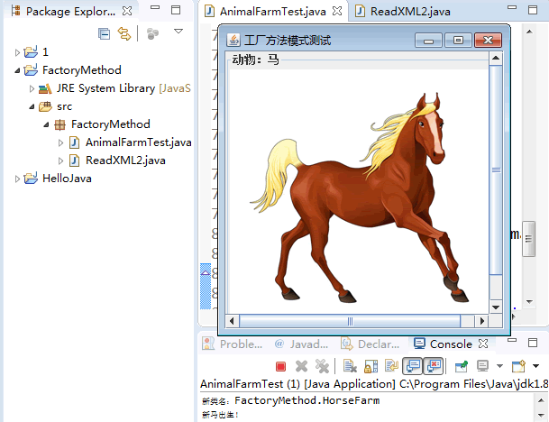

# 工厂方法

原文：http://c.biancheng.net/view/1335.html


## 1. 特点

工厂方法是**满足“开闭原则”**的。

### 1.1 优点

* 用户只需要具体工厂的名称就可以得到想要的产品，无需知道产品的具体创建过程
* 灵活性增强，对于**新产品的创建，只需要多写一个相应的工厂类**
* 典型的解耦框架。高层模块只需要知道产品的抽象类，无需关心其他实现类，满足迪米特法则、依赖导致原则和里氏替换原则

### 1.2 缺点

* 类的个数容易增多，增加复杂度
* 增加了系统的抽象性和理解难度
* 抽象产品只能生产一种产品，此弊端可以用“抽象工厂模式”来解决

### 1.3 应用场景

* 客户只知道创建产品的工厂名称，而不知道具体的产品名。如：TCL电视机厂，海信电视机厂等
* 创建对象的任务由多个具体子工厂中的某一个完成，而抽象工厂只提供创建产品的接口
* 客户不关心创建产品的细节，只关心产品的品牌

## 2. 模式的结构与实现

工厂方法模式由**抽象工厂、具体工厂、抽象产品和具体产品**等4个要素构成。

### 2.1 模式的结构

工厂方法模式的主要角色如下：

1. 抽象工厂（Abstract Factory）：提供了创建产品的接口，调用者通过它访问具体工厂的工厂方法 newProduct() 来创建产品
2. 具体工厂（Concrete Factory）：主要是实现抽象工厂中的抽象方法，完成具体产品的创建
3. 抽象产品（Product）：定义了产品的规范，描述了产品的主要特性和功能
4. 具体产品（Concrete Product）：实现了抽象产品角色所定义的接口，由具体工厂来创建，它同具体工厂之间一一对应

​        其结构图如下图所示：


### 2.2 模式的实现

根据类图写出如下的实现代码：

```java
package FactoryMethod;

public class AbstractFactoryTest {
    public static void main(String[] args) {
        try {
            Product a;
            AbstractFactory af;
            af = (AbstractFactory) ReadXML1.getObject();
            a = af.newProduct();
            a.show();
        } catch (Exception e) {
            System.out.println(e.getMessage());
        }
    }
}

//抽象产品：提供了产品的接口
interface Product {
    public void show();
}

//具体产品1：实现抽象产品中的抽象方法
class ConcreteProduct1 implements Product {
    public void show() {
        System.out.println("具体产品1显示...");
    }
}

//具体产品2：实现抽象产品中的抽象方法
class ConcreteProduct2 implements Product {
    public void show() {
        System.out.println("具体产品2显示...");
    }
}

//抽象工厂：提供了厂品的生成方法
interface AbstractFactory {
    public Product newProduct();
}

//具体工厂1：实现了厂品的生成方法
class ConcreteFactory1 implements AbstractFactory {
    public Product newProduct() {
        System.out.println("具体工厂1生成-->具体产品1...");
        return new ConcreteProduct1();
    }
}

//具体工厂2：实现了厂品的生成方法
class ConcreteFactory2 implements AbstractFactory {
    public Product newProduct() {
        System.out.println("具体工厂2生成-->具体产品2...");
        return new ConcreteProduct2();
    }
}
```


```java
package FactoryMethod;
import javax.xml.parsers.*;
import org.w3c.dom.*;
import java.io.*;

class ReadXML1 {
    //该方法用于从XML配置文件中提取具体类类名，并返回一个实例对象
    public static Object getObject() {
        try {
            //创建文档对象
            DocumentBuilderFactory dFactory = DocumentBuilderFactory.newInstance();
            DocumentBuilder builder = dFactory.newDocumentBuilder();
            Document doc;
            doc = builder.parse(new File("src/FactoryMethod/config1.xml"));
            //获取包含类名的文本节点
            NodeList nl = doc.getElementsByTagName("className");
            Node classNode = nl.item(0).getFirstChild();
            String cName = "FactoryMethod." + classNode.getNodeValue();
            //System.out.println("新类名："+cName);
            //通过类名生成实例对象并将其返回
            Class<?> c = Class.forName(cName);
            Object obj = c.newInstance();
            return obj;
        } catch (Exception e) {
            e.printStackTrace();
            return null;
        }
    }
}
```

```xml
<?xml version="1.0" encoding="UTF-8"?>
<config>
	<className>ConcreteFactory1</className>
</config>
```

运行结果：

```
具体工厂1生成-->具体产品1...
具体产品1显示...
```

如果将XML配置文件中的 ConcreteFactory1 改成 ConcreteFactory2，则程序运行结果如下：

```
具体工厂2生成-->具体产品2...
具体产品2显示...
```

## 3. 模式的应用实例

### 3.1 用工厂方法模式设计畜牧场

分析：有很多种类的畜牧场，如养马场用于养马，养牛场用于养牛，所以该实例用工厂方法模式比较合适。

对养马场和养牛场等具体工厂类，只要定义一个生成动物的方法 newAnimal() 即可。由于要显示马类和牛类等具体产品类的图像，所以它们的构造函数中用到了JPanel、JLabel和ImageIcon等组件，并定义一个 show() 方法类显示它们。

客户端程序通过对象生成器类 ReadXML2 读取 XML 配置文件中的数据来决定养马还是养牛。其结构图如下图所示：


注意：该程序中用到了 XML 文件，并且要显示马类和牛类等具体产品类的图像

​        代码和XML如下：

```java
package FactoryMethod;

import java.awt.*;
import javax.swing.*;

public class AnimalFarmTest {
    public static void main(String[] args) {
        try {
            Animal a;
            AnimalFarm af;
            af = (AnimalFarm) ReadXML2.getObject();
            a = af.newAnimal();
            a.show();
        } catch (Exception e) {
            System.out.println(e.getMessage());
        }
    }
}

//抽象产品：动物类
interface Animal {
    public void show();
}

//具体产品：马类
class Horse implements Animal {
    JScrollPane sp;
    JFrame jf = new JFrame("工厂方法模式测试");

    public Horse() {
        Container contentPane = jf.getContentPane();
        JPanel p1 = new JPanel();
        p1.setLayout(new GridLayout(1, 1));
        p1.setBorder(BorderFactory.createTitledBorder("动物：马"));
        sp = new JScrollPane(p1);
        contentPane.add(sp, BorderLayout.CENTER);
        JLabel l1 = new JLabel(new ImageIcon("src/A_Horse.jpg"));
        p1.add(l1);
        jf.pack();
        jf.setVisible(false);
        jf.setDefaultCloseOperation(JFrame.EXIT_ON_CLOSE);    //用户点击窗口关闭
    }

    public void show() {
        jf.setVisible(true);
    }
}

//具体产品：牛类
class Cattle implements Animal {
    JScrollPane sp;
    JFrame jf = new JFrame("工厂方法模式测试");

    public Cattle() {
        Container contentPane = jf.getContentPane();
        JPanel p1 = new JPanel();
        p1.setLayout(new GridLayout(1, 1));
        p1.setBorder(BorderFactory.createTitledBorder("动物：牛"));
        sp = new JScrollPane(p1);
        contentPane.add(sp, BorderLayout.CENTER);
        JLabel l1 = new JLabel(new ImageIcon("src/A_Cattle.jpg"));
        p1.add(l1);
        jf.pack();
        jf.setVisible(false);
        jf.setDefaultCloseOperation(JFrame.EXIT_ON_CLOSE);    //用户点击窗口关闭
    }

    public void show() {
        jf.setVisible(true);
    }
}

//抽象工厂：畜牧场
interface AnimalFarm {
    public Animal newAnimal();
}

//具体工厂：养马场
class HorseFarm implements AnimalFarm {
    public Animal newAnimal() {
        System.out.println("新马出生！");
        return new Horse();
    }
}

//具体工厂：养牛场
class CattleFarm implements AnimalFarm {
    public Animal newAnimal() {
        System.out.println("新牛出生！");
        return new Cattle();
    }
}
```


```java
package FactoryMethod;
import javax.xml.parsers.*;
import org.w3c.dom.*;
import java.io.*;

class ReadXML2 {
    public static Object getObject() {
        try {
            DocumentBuilderFactory dFactory = DocumentBuilderFactory.newInstance();
            DocumentBuilder builder = dFactory.newDocumentBuilder();
            Document doc;
            doc = builder.parse(new File("src/FactoryMethod/config2.xml"));
            NodeList nl = doc.getElementsByTagName("className");
            Node classNode = nl.item(0).getFirstChild();
            String cName = "FactoryMethod." + classNode.getNodeValue();
            System.out.println("新类名：" + cName);
            Class<?> c = Class.forName(cName);
            Object obj = c.newInstance();
            return obj;
        } catch (Exception e) {
            e.printStackTrace();
            return null;
        }
    }
}
```


```xml
<?xml version="1.0" encoding="UTF-8"?>
<config>
	<className>HorseFarm</className>
</config>
```

运行结果：

