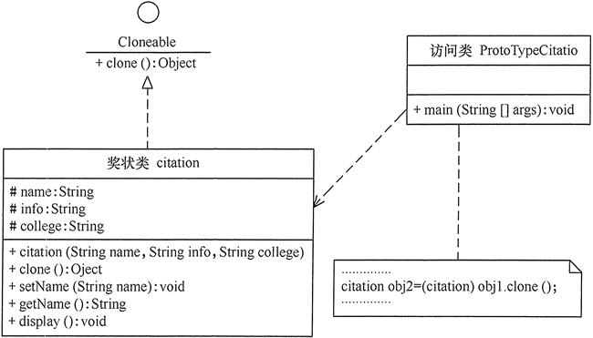

# 原型模式

原文：http://c.biancheng.net/view/1343.html


## 1. 定义与特点

​        定义：用一个**已经创建的实例作为原型，通过复制该原型对象来创建一个和原型相同或者相似的新对象**。这里，**原型实例**指定了要创建的对象的种类。用这种方式创建对象非常高效，根本无须知道对象创建的细节。例如，Windows 的安装通常比较耗时，如果复制就快很多。

### 1.1 优点

* Java 自带的原型模式基于内存二进制流的复制，在性能上比直接 new 一个对象更优良
* 可以使用深度克隆方式保存对象的状态，使用原型模式将对象复制一份，并将其状态保存起来，简化了创建对象的过程，在需要的时候使用（例如恢复到历史某一个时刻），可辅助实现撤销操作

### 1.2 缺点

* 需要为每一个类都配置一个 clone 方法
* clone 方法位于类的内部，当对象已有类进行改造的时候，需要修改代码，未必了开闭原则
* 当实现深度克隆是，需要编写较为复杂的代码，而且当对象之间存在多重嵌套引用时，为了实现深度克隆，每一层对象对应的类都必须支持深度克隆，实现起来会比较麻烦。因此，深克隆，浅克隆需要运用得当

## 2. 结构与实现

​        由于 Java 提供了对象的 clone 方法，所以用 Java 实现原型模式很简单。

### 2.1 模式的结构

​        原型模型包含一下主要角色：

* 抽象原型类：规定了具体原型对象必须实现的接口
* 具体原型类：实现抽象原型类的 clone 方法，他是可被复制的对象
* 访问类：使用具体原型类中的 clone 方法来复制新的对象

其结构如下图所示：


### 2.2 模式的实现

​        原型模式的克隆分为**浅克隆**和**深克隆**。

* 浅克隆：创建一个新对象，新对象的属性和原来对象完全相同，对于非基本类型属性，仍然指向原油属性所指向的对象的内存地址
* 深克隆：创建一个新对象，属性中引用的其他对象也会被克隆，不再指向原有对象地址

​        Java 中的 Object 类提供了**浅克隆** 的 clone 方法，具体原型类要实现 Cloneable 接口就可以实现对象的浅克隆，这里的 Cloneable 接口就是抽象原型类。其代码如下：

```java
//具体原型类
class Realizetype implements Cloneable {
    Realizetype() {
        System.out.println("具体原型创建成功！");
    }

    public Object clone() throws CloneNotSupportedException {
        System.out.println("具体原型复制成功！");
        return (Realizetype) super.clone();
    }
}

//原型模式的测试类
public class PrototypeTest {
    public static void main(String[] args) throws CloneNotSupportedException {
        Realizetype obj1 = new Realizetype();
        Realizetype obj2 = (Realizetype) obj1.clone();
        System.out.println("obj1==obj2?" + (obj1 == obj2));
    }
}
```

程序运行结构：

```
具体原型创建成功！
具体原型复制成功！
obj1==obj2?false
```

## 3. 应用实例

​        【例 1 】用原型模式模拟“孙悟空”复制自己

​        分析：孙悟空拔下一根猴毛轻轻一吹就变出很多孙悟空，这实际上是用到了原型模式。这里的孙悟空类 SunWuKong 是具体的原型类。而 Java 中的 Cloneable 接口是抽象原型类。

​        同前面介绍的猪八戒实例一样，由于要显示孙悟空的图像，所以将孙悟空类定义成面板 JPanel 的子类，里面包含了标签，用于保存孙悟空的图像。

​        另外，重写了 Cloneable 接口的 clone() 方法，用于复制新的孙悟空。访问类可以通过调用孙悟空的 clone() 方法复制多个孙悟空，并在框架窗体 JFrame 中显示。图 2 所示是其结构图。


程序代码如下：

```java
import java.awt.*;
import javax.swing.*;

class SunWukong extends JPanel implements Cloneable {
    private static final long serialVersionUID = 5543049531872119328L;

    public SunWukong() {
        JLabel l1 = new JLabel(new ImageIcon("src/Wukong.jpg"));
        this.add(l1);
    }

    public Object clone() {
        SunWukong w = null;
        try {
            w = (SunWukong) super.clone();
        } catch (CloneNotSupportedException e) {
            System.out.println("拷贝悟空失败!");
        }
        return w;
    }
}

public class ProtoTypeWukong {
    public static void main(String[] args) {
        JFrame jf = new JFrame("原型模式测试");
        jf.setLayout(new GridLayout(1, 2));
        Container contentPane = jf.getContentPane();
        SunWukong obj1 = new SunWukong();
        contentPane.add(obj1);
        SunWukong obj2 = (SunWukong) obj1.clone();
        contentPane.add(obj2);
        jf.pack();
        jf.setVisible(true);
        jf.setDefaultCloseOperation(JFrame.EXIT_ON_CLOSE);
    }
}
```

运行结果：


​        【例 2 】用原型模式生成“三好学生”奖状

​        分析：同一学校的“三好学生”奖状除了获奖人姓名不同，其他都相同，属于相似对象的复制，同样可以用原型模式创建，然后再做简单修改就可以了。下图所示是三好学生奖状生成器的结构图。



代码如下：

```java
public class ProtoTypeCitation {
    public static void main(String[] args) throws CloneNotSupportedException {
        citation obj1 = new citation("张三", "同学：在2016学年第一学期中表现优秀，被评为三好学生。", "韶关学院");
        obj1.display();
        citation obj2 = (citation) obj1.clone();
        obj2.setName("李四");
        obj2.display();
    }
}

//奖状类
class citation implements Cloneable {
    String name;
    String info;
    String college;

    citation(String name, String info, String college) {
        this.name = name;
        this.info = info;
        this.college = college;
        System.out.println("奖状创建成功！");
    }

    void setName(String name) {
        this.name = name;
    }

    String getName() {
        return (this.name);
    }

    void display() {
        System.out.println(name + info + college);
    }

    public Object clone() throws CloneNotSupportedException {
        System.out.println("奖状拷贝成功！");
        return (citation) super.clone();
    }
}
```

运行结果如下：

```
奖状创建成功！
张三同学：在2016学年第一学期中表现优秀，被评为三好学生。韶关学院
奖状拷贝成功！
李四同学：在2016学年第一学期中表现优秀，被评为三好学生。韶关学院
```

## 4. 应用场景

​        原型模式通常适用于以下场景：

* 对象之间相同或者相似，即只是个别的几个属性不同的时候
* 创建对象成本较大，例如初始化时间长、占用CPU多，或者占用网络资源太多等，需要优化资源
* 创建一个对象需要繁琐的数据准备或访问权限等，需要提供高性能或者提高安全性
* 系统中大量使用该对象，且各个调用者都需要给它的属性重新复制

​        在 Spring 中，原型模式应用非常广泛，例如 scope='prototype'， JSON.parseObject() 等都是原型模式的具体应用。

## 5. 原型模式扩展

​        原型模式可**扩展为带原型管理器的原型模式**，它在原型模式的基础上增加了一个原型管理器 PrototypeManager 类。该类用 HashMap 保存多个复制的原型，Client 类可以通过管理器的 get(String id) 方法从中获取复制的原型。其结构图如下图所示。


​        【例3】用带原型管理器的原型模式来生成包含“圆”和“正方形”等图形的原型，并计算其面积。分析：本实例中由于存在不同的图形类，例如，“圆”和“正方形”，它们计算面积的方法不一样，所以需要用一个原型管理器来管理它们，下图所示是其结构图。


代码如下：

```java
import java.util.*;

interface Shape extends Cloneable {
    public Object clone();    //拷贝

    public void countArea();    //计算面积
}

class Circle implements Shape {
    public Object clone() {
        Circle w = null;
        try {
            w = (Circle) super.clone();
        } catch (CloneNotSupportedException e) {
            System.out.println("拷贝圆失败!");
        }
        return w;
    }

    public void countArea() {
        int r = 0;
        System.out.print("这是一个圆，请输入圆的半径：");
        Scanner input = new Scanner(System.in);
        r = input.nextInt();
        System.out.println("该圆的面积=" + 3.1415 * r * r + "\n");
    }
}

class Square implements Shape {
    public Object clone() {
        Square b = null;
        try {
            b = (Square) super.clone();
        } catch (CloneNotSupportedException e) {
            System.out.println("拷贝正方形失败!");
        }
        return b;
    }

    public void countArea() {
        int a = 0;
        System.out.print("这是一个正方形，请输入它的边长：");
        Scanner input = new Scanner(System.in);
        a = input.nextInt();
        System.out.println("该正方形的面积=" + a * a + "\n");
    }
}

class ProtoTypeManager {
    private HashMap<String, Shape> ht = new HashMap<String, Shape>();

    public ProtoTypeManager() {
        ht.put("Circle", new Circle());
        ht.put("Square", new Square());
    }

    public void addshape(String key, Shape obj) {
        ht.put(key, obj);
    }

    public Shape getShape(String key) {
        Shape temp = ht.get(key);
        return (Shape) temp.clone();
    }
}

public class ProtoTypeShape {
    public static void main(String[] args) {
        ProtoTypeManager pm = new ProtoTypeManager();
        Shape obj1 = (Circle) pm.getShape("Circle");
        obj1.countArea();
        Shape obj2 = (Shape) pm.getShape("Square");
        obj2.countArea();
    }
}
```

运行结果如下所示：

```
这是一个圆，请输入圆的半径：3
该圆的面积=28.2735

这是一个正方形，请输入它的边长：3
该正方形的面积=9
```

