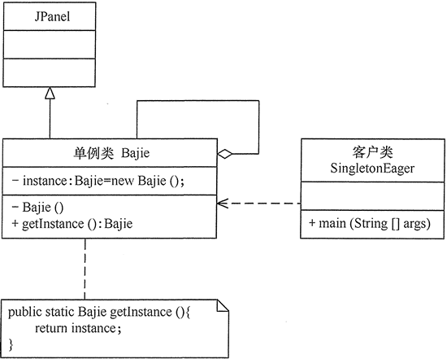
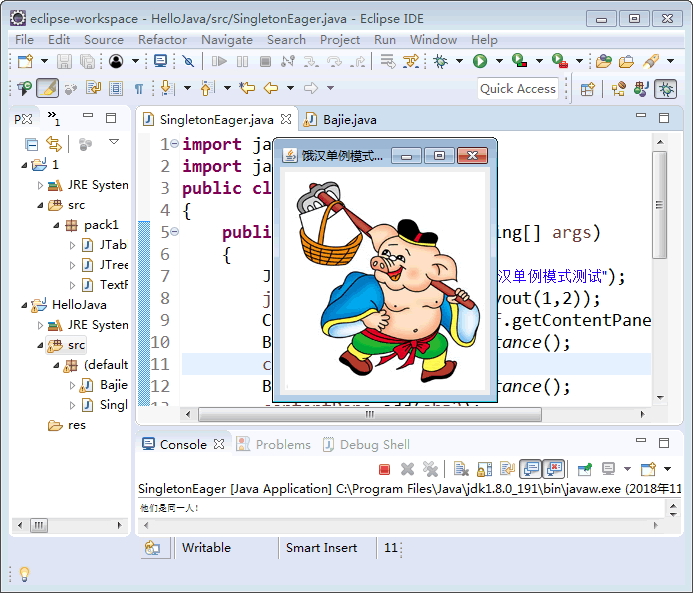

# 单例模式

原文：http://c.biancheng.net/view/1338.html


## 1. 定义和特点

单例模式（Singleton Partten）定义：**指一个类只有一个实例，且该类能自行创建这个实例的一种模式**。例如：Windows中只能打开一个任务管理器，这样可以避免因为打开多个任务管理窗口而造成内存资源浪费，或出现各个窗口显示内容的不一致等等。

在计算机系统中，还有 Windows 的回收站、操作系统中的文件系统、多线程中的线程池、显卡的驱动程序对象、打印机的后台处理服务、应用程序的日志对象、数据库的连接池、网站的计数器、Web 应用的配置对象、应用程序中的对话框、系统中的缓存等常常被设计成单例。

单例模式在现实生活中也应用非常广泛。例如公司CEO、部门经理等都属于单例模式。J2EE 标准中的 ServletContext 和 ServletContextConfig、Spring 框架应用中的 ApplicationContext、数据库中的连接池等也都是单例模式。

单例模式有一下3个特点：

* 单例类只有一个实例对象
* 该单例对象必须由单例类自行创建
* 单例类对外提供一个访问该单例的全局访问点

## 2. 优点和缺点

### 2.1 优点

* 单例模式可以保证内存里只有一个实例，减少了内存的开销
* 可以避免对资源的多重占用
* 单例模式设置全局访问点，可以优化和共享资源的访问

### 2.2 缺点

* 单例模式一般没有接口，扩展困难。如果要扩展，则除了修改源代码，没有第二种途径，违背开闭原则
* 在并发测试中，单例模式不利于代码调试。在调试过程中，如果单例中的代码没有执行完，也不能模拟生成一个新的对象
* 单例模式的功能代码通常写在一个类中，如果功能设计不合理，则很容易违背单一职责原则

> 单例模式看起来非常简单，实现起来也非常简单。单例模式在面试中是一个高频面试题。

## 3. 应用场景

对于Java来说，单例模式可以保证在一个JVM中只存在单一实例。单例模式的应用场景主要有以下几个： 

* 需要频繁创建的一些类，使用单例可以降低系统的内存压力，减少GC
* 某类只要求生成一个对象的时候，如每个人的身份证号码等
* 某些类创建实例时占用资源较多，或者实例化耗时长，且经常使用
* 某类需要频繁实例化，而创建的对象又频繁被销毁的时候。例如多线程的线程池、网络连接池等
* 频繁访问数据库或者文件的对象
* 对于一些控制硬件级别的操作，或者从系统上来讲应当是单一控制逻辑的操作，如果有多个实例，则系统会完全乱套
* 当对象需要被共享的场合。由于单例模式只允许创建一个对象，共享该对象可以节省内存，加快对象访问速度。如Web中的配置对象、数据库的连接池等

## 4. 结构和实现

单例模式是设计模式中最简单的模式之一。通常，普通类的构造函数是公有的，外部类可以通过 new 函数来创建多个类的实例。但是，如果将类的构造函数设置为**私有的**，外部类就无法调用该类的构造函数，也就无法生成该类的（多个）实例。此时，该类自身**必须**定一个静态私有实例方法，并向外提供一个静态的共有函数用于创建或者获取该静态私有实例。

下面分析其基本的结构和实现方法。

### 4.1 单例模式的结构

单例模式的主要角色有如下几个：

* 单例类：包含一个实例且能自行创建这个实例的类
* 访问类：使用单例的类

其结构如下图所示：


### 4.2 单例模式的实现

单例模式通常有两种实现形式：

#### 4.2.1 懒汉式模式

该模式的特点是类加载时没有生成单例，只有当第一次调用 getInstance() 方法时才去创建这个单例。代码如下：

```java
public class LazySingleton {
    private static volatile LazySingleton instance = null;    //保证 instance 在所有线程中同步

    private LazySingleton() {
    }    //private 避免类在外部被实例化

    public static synchronized LazySingleton getInstance() {
        //getInstance 方法前加同步
        if (instance == null) {
            instance = new LazySingleton();
        }
        return instance;
    }
}
```

注意：**如果编写的是多线程程序，则不要删除上面代码中的关键字 volatile 和 synchronized** ，否则将存在多线程非安全的问题。如果不删除这两个关键字，就能保证线程安全，但是每次访问都要同步，会影响性能，且消耗更多的资源，这是懒汉式单例的缺点。

#### 4.2 2 饿汉式单例

该模式的特点是类一旦加载就创建一个单例，保证在调用 getInstance() 方法之前单例已经存在了。代码如下：

```java
public class HungrySingleton {
    private static final HungrySingleton instance = new HungrySingleton();

    private HungrySingleton() {
    }

    public static HungrySingleton getInstance() {
        return instance;
    }
}
```

饿汉式单例在类创建的同时就已经创建好一个静态的对象供系统使用，以后不再改变。所以这种模式**是线程安全的**。可以直接用于多线程系统中而不会出现问题。

### 4.3 单例实例的应用实例

【例 1 】用懒汉式单例模式模拟产生美国当今总统对象

分析：在每一届任期内，美国的总统只有一人，所以本实例适合用单例模式实现。下图所示是用懒汉单例模式实现的结构图：


代码如下：

```java
public class SingletonLazy {
    public static void main(String[] args) {
        President zt1 = President.getInstance();
        zt1.getName();    //输出总统的名字
        President zt2 = President.getInstance();
        zt2.getName();    //输出总统的名字
        if (zt1 == zt2) {
            System.out.println("他们是同一人！");
        } else {
            System.out.println("他们不是同一人！");
        }
    }
}

class President {
    private static volatile President instance = null;    //保证instance在所有线程中同步

    //private避免类在外部被实例化
    private President() {
        System.out.println("产生一个总统！");
    }

    public static synchronized President getInstance() {
        //在getInstance方法上加同步
        if (instance == null) {
            instance = new President();
        } else {
            System.out.println("已经有一个总统，不能产生新总统！");
        }
        return instance;
    }

    public void getName() {
        System.out.println("我是美国总统：特朗普。");
    }
}
```

程序运行结果如下：

```
产生一个总统！
我是美国总统：特朗普。
已经有一个总统，不能产生新总统！
我是美国总统：特朗普。
他们是同一人！
```


【例 2 】用饿汉式单例模式模式产生猪八戒对象

分析：同上例类似，猪八戒只有一个，所以本实例同样适合用单例模式实现。本实例由于要显示猪八戒的图像，所以用到了框架窗体JFrame组建，这里的猪八戒类是单例类，可以将其定义成面板JPanel的子类，里面包含了标签，用于保存猪八戒的图像，客户窗体可以获得猪八戒对象，并显示它。下图是用饿汉式单例模式实现的结构图：



代码如下：

```java
import java.awt.*;
import javax.swing.*;

public class SingletonEager {
    public static void main(String[] args) {
        JFrame jf = new JFrame("饿汉单例模式测试");
        jf.setLayout(new GridLayout(1, 2));
        Container contentPane = jf.getContentPane();
        Bajie obj1 = Bajie.getInstance();
        contentPane.add(obj1);
        Bajie obj2 = Bajie.getInstance();
        contentPane.add(obj2);
        if (obj1 == obj2) {
            System.out.println("他们是同一人！");
        } else {
            System.out.println("他们不是同一人！");
        }
        jf.pack();
        jf.setVisible(true);
        jf.setDefaultCloseOperation(JFrame.EXIT_ON_CLOSE);
    }
}

class Bajie extends JPanel {
    private static Bajie instance = new Bajie();

    private Bajie() {
        JLabel l1 = new JLabel(new ImageIcon("src/Bajie.jpg"));
        this.add(l1);
    }

    public static Bajie getInstance() {
        return instance;
    }
}
```

程序运行结果如下图所示：



### 4.4 单例模式的扩展

单例模式可扩展为**有限的多例**（Multitcm）模式，这种模式可以**生成有限个**实例并保存在 List 中，客户需要时可以随机获取，其结构图如下所示：

