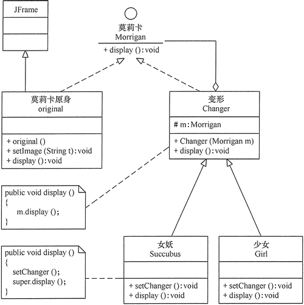

# 装饰器模式

原文：http://c.biancheng.net/view/1366.html


## 1. 定义和特点

装饰器（Decorator）模式的定义：指在不改变现有对象结构的情况下，动态地给该对象增加一些职责（即增加额外的功能）的模式，它属于对象结构型模式。

装饰器模式的主要优点：

* 装饰器是继承的有力补充，比继承灵活，在不改变原有对象的情况下，动态地给一个对象扩展功能，即插即用
* 通过使用不用装饰器类及这些装饰类的排列组合，可以实现不同的效果
* 装饰器模式完全遵守开闭原则

主要缺点：装饰器模式会增加许多子类，过度使用会增加程序的复杂性。

## 2. 结构和实现

通常情况下，扩展一个类的功能会使用继承方式来实现。但继承具有静态特征，耦合度高，并且随着扩展功能的增多，子类会很膨胀。如果使用组合关系来创建一个包装对象（即装饰对象）来包裹真是对象，并在保持真实对象的类结构不变的前提下，为其提供额外的功能，这就是装饰器模式的目标。

### 2.1 模式的结构

装饰器模式的主要包含以下的角色：

1. 抽象构件（Component）角色：定义一个抽象接口以规范准备接收附加责任的对象
2. 具体构件（Concrete Component）角色：实现抽象构件，通过装饰角色为其添加一些职责
3. 抽象装饰（Decorator）角色：继承抽象构件，并包含具体构件的实例，可以通过其子类扩展具体构件的功能
4. 具体装饰（Concrete Decorator）角色：实现抽象装饰的相关方法，并给具体构件对象添加附加的责任

装饰器模式的结构图：


### 2.2 模式的实现

装饰器模式的实现代码：

```java
package decorator;

public class DecoratorPattern {
    public static void main(String[] args) {
        Component p = new ConcreteComponent();
        p.operation();
        System.out.println("---------------------------------");
        Component d = new ConcreteDecorator(p);
        d.operation();
    }
}

//抽象构件角色
interface Component {
    public void operation();
}

//具体构件角色
class ConcreteComponent implements Component {
    public ConcreteComponent() {
        System.out.println("创建具体构件角色");
    }

    public void operation() {
        System.out.println("调用具体构件角色的方法operation()");
    }
}

//抽象装饰角色
class Decorator implements Component {
    private Component component;

    public Decorator(Component component) {
        this.component = component;
    }

    public void operation() {
        component.operation();
    }
}

//具体装饰角色
class ConcreteDecorator extends Decorator {
    public ConcreteDecorator(Component component) {
        super(component);
    }

    public void operation() {
        super.operation();
        addedFunction();
    }

    public void addedFunction() {
        System.out.println("为具体构件角色增加额外的功能addedFunction()");
    }
}
```

程序运行结果：

```
创建具体构件角色
调用具体构件角色的方法operation()
---------------------------------
调用具体构件角色的方法operation()
为具体构件角色增加额外的功能addedFunction()
```

## 3. 应用实例

【例1】用装饰器模式实现游戏角色“莫莉卡·安斯兰”的变身。

分析：在《恶魔战士》中，游戏角色“莫莉卡·安斯兰”的原身是一个可爱少女，但当她变身时，会变成头顶及背部延伸出蝙蝠状飞翼的女妖，当然她还可以变为穿着漂亮外衣的少女。这些都可用装饰器模式来实现，在本实例中的“莫莉卡”原身有 setImage(String t) 方法决定其显示方式，而其 变身“蝙蝠状女妖”和“着装少女”可以用 setChanger() 方法来改变其外观，原身与变身后的效果用 display() 方法来显示，下图所示是其结构图：



程序代码：

```java
package decorator;

import java.awt.*;
import javax.swing.*;

public class MorriganAensland {
    public static void main(String[] args) {
        Morrigan m0 = new original();
        m0.display();
        Morrigan m1 = new Succubus(m0);
        m1.display();
        Morrigan m2 = new Girl(m0);
        m2.display();
    }
}

//抽象构件角色：莫莉卡
interface Morrigan {
    public void display();
}

//具体构件角色：原身
class original extends JFrame implements Morrigan {
    private static final long serialVersionUID = 1L;
    private String t = "Morrigan0.jpg";

    public original() {
        super("《恶魔战士》中的莫莉卡·安斯兰");
    }

    public void setImage(String t) {
        this.t = t;
    }

    public void display() {
        this.setLayout(new FlowLayout());
        JLabel l1 = new JLabel(new ImageIcon("src/decorator/" + t));
        this.add(l1);
        this.pack();
        this.setDefaultCloseOperation(JFrame.EXIT_ON_CLOSE);
        this.setVisible(true);
    }
}

//抽象装饰角色：变形
class Changer implements Morrigan {
    Morrigan m;

    public Changer(Morrigan m) {
        this.m = m;
    }

    public void display() {
        m.display();
    }
}

//具体装饰角色：女妖
class Succubus extends Changer {
    public Succubus(Morrigan m) {
        super(m);
    }

    public void display() {
        setChanger();
        super.display();
    }

    private void setChanger() {
        ((original) super.m).setImage("Morrigan1.jpg");
    }
}

//具体装饰角色：少女
class Girl extends Changer {
    public Girl(Morrigan m) {
        super(m);
    }

    public void display() {
        setChanger();
        super.display();
    }

    private void setChanger() {
        ((original) super.m).setImage("Morrigan2.jpg");
    }
}
```

运行结果：


## 4. 应用场景

装饰器模式通常在以下几种情况使用：

* 当需要给一个现有类添加附加职责，而又不能采用生成子类的方式进行扩展时。例如：该类被隐藏或者该类时终极类或者采用了继承方式会产生大量的子类
* 当需要通过对现有的一组基本功能进行排列组合而产生非常多的功能时，采用继承关系很难实现，而采用装饰器模式却很好实现
* 当对象的功能要求可以动态地添加，也可以再动态地撤销时

装饰器模式在Java语言中的最著名的应用就是 Java I/O 标准库的设计了。例如，InputStream 的子类 FilterInputStream，OutputStream 的子类 FilterOutputStream， Reader 的子类 BufferedReader 以及 FilterReader，还有 Writer 的子类 BufferedWriter、FilterWriter 以及 PrintWriter 等，它们都是抽象装饰类。

下面代码是为 FileReader 增加缓冲区而采用的装饰类 BufferedReader 的例子：

```java
BufferedReader in = new BufferedReader(new FileReader("filename.txt"));
String s = in.readLine();
```

## 5. 模式扩展

装饰器模式所包含的 4 个角色不是任何时候都要存在的，在有些应用环境下模式是可以简化的，如一下两种情况：

1. 如果只有一个具体构件而没有抽象构件时，可以让抽象装饰继承具体构件，其结构如下：

   

2. 如果只有一个具体装饰时，可以将抽象装饰和具体装饰合并，其结构如下：

   

   