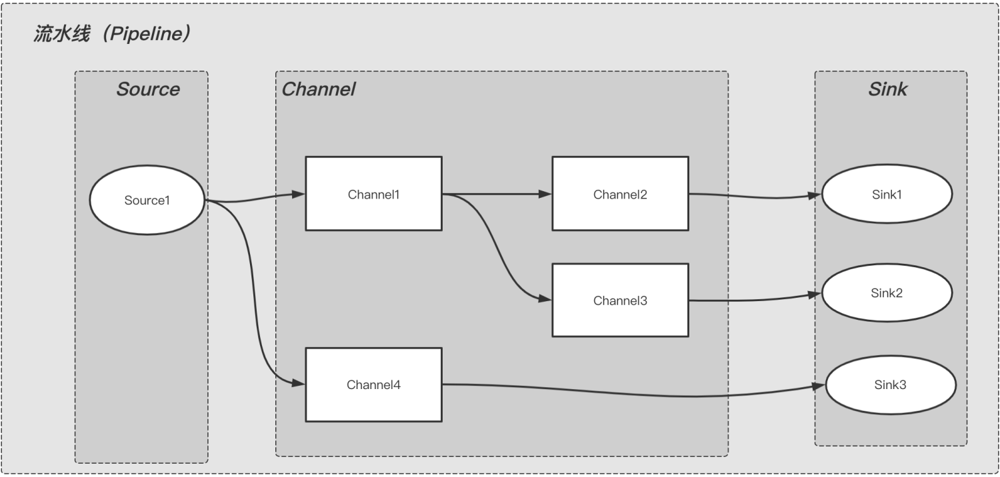

# Pipeline 设计模式

原文：https://www.toutiao.com/a6936390184397308447/


## 1. 目标

通过提供初始输入并传递处理后的输出以供下一阶段使用，从而允许在一系列阶段中进行数据处理。

## 2. 解释

Pipeline 模式为管道模式，也称为流水线模式。通过预先设定好的一系列的阶段来处理输入的数据，每个阶段的输出即是下一阶段的输入。

模型图如下：



从图中看来，整个流水线内，数据流转是从上游到下游，上游的输出是下游的输入，按阶段依次执行。

* **Source**：表示数据来源，如：KafkaSource

* **Channel**：表示对数据进行处理的组件，如：JsonChannel，对数据进行 json 转化和处理
* **Sink**：表示数据落地或下沉的地方，如：KafkaSink表示数据发送到指定的Kafka；DbSink表示数据落地到 DB

即：Pipeline 是由 Source （必须有），Channel（不一定需要），Sink（必须有）三种类型的组件自由组合而成的。

## 3. 代码示例

```java
/**
 * 生命周期
 */
public interface LifeCycle {
    // 初始化
    void init(String config);
    // 启动
    void startup();
    // 结束
    void shutdown();
}
```

```java
/**
 * 组件
 */
public interface Component<T> extends LifeCycle {
   // 组件名字
   String getName();
   // 获取下游组件
   Collection<Component> getDownStreams();
    // 执行
   void execute(T o);
}
```

```java
/**
 *  组件的抽象类
 * @param <T> 输入类型
 * @param <R> 输出类型
 */
public abstract class AbstractComponent<T, R> implements Component<T> {
    @Override
    public void execute(T o) {
        // 当前主键执行
        R r = doExecute(o);
        System.out.println(getName() + " receive " + o + " return " + r);
        // 获取下游组件，并执行
        Collection<Component> downStreams = getDownStreams();
        if (!CollectionUtils.isEmpty(downStreams)) {
            downStreams.forEach( c -> c.execute(r));
        }
    }
    
    // 具体组件执行处理
    protected abstract R doExecute(T o);
    
    @Override
    public void startup() {
        // 下游 -> 上游，依次启动 （倒着启动）
        Collection<Component> downStreams = getDownStreams();
        if (!CollectionUtils.isEmpty(downStreams)) {
            downStreams.forEach(Component::startup);
        }
        // do startup
        System.out.println("----- " + getName() + " is start ----- ");
    }
    
    @Override
    public void shutdown() {
        // 上游 -> 下游，依次关闭
        System.out.println("--- " + getName() + " is shutdown --- ");
        Collection<Component> downStreams = getDownStreams();
        if (!CollectionUtils.isEmpty(downStreams)) {
            downStreams.forEach(Component::shutdown);
        }
    }  
}
```

```java
/**
 * 数据来源
 */
public abstract class Souce<T, R> extends AbstractComponent<T,R> {}
```

```java
/**
 * 数据处理
 */
public abstract class Channel<T, R> extends AbstractComponent<T,R> {}
```

```java
/**
 * 数据下沉
 */
public abstract class Sink<T, R> extends AbstractComponent<T,R> {}
```

上面封装了基本的组件实现，下面扩展一下具体的实现，用一个简单的例子说明：

> IntegerSource => IncrChannel => StringChannel => ConsoleSink

从上面组件名字和方向可以判断，这个流水线要做的事情是：

> 输入一个整型数字 => 数字 + 1 => 转化为字符串 => 控制台输出

下面就来看看具体如何实现：

```java
/**
 * 来源
 */
public class IntegerSource extends Source<Integer, Integer> {
    private int val = 0;
    
    @Override
    protected Integer doExecute(Integer o) {
        return 0;
    }
    
    @Override
    public void init(String config) {
        System.out.println("---- " + getName() + " init ---- ");
        val = 1;
    }
    
    @Override
    public void startup(){
        super.startup();
        execute(val);
    }
    
    @Override
    public String getName(){
        return "Integer-Source";
    }
    
    @Override
    public Collection<Component> getDownStreams() {
        return Collections.singletonList(new IncrChannel());
    }
}
```


```java
/**
 * 处理： 数字 + 1
 */
public class IncrChannel extends Channel<Integer, Integer>{
    @Override
    protected Integer doExecute(Integer o) {
        return o + 1;
    }

    @Override
    public String getName() {
        return "Incr-Channel";
    }

    @Override
    public Collection<Component> getDownStrems() {
        return Collections.singletonList(new StringChannel());
    }

    @Override
    public void init(String config) {
    }
}
```

```java
/**
 * 处理：转为字符串
 */
public class StringChannel extends Channel<Integer, String> {
    @Override
    protected String doExecute(Integer o) {
        return "str" + o;
    }

    @Override
    public String getName() {
        return "String-Channel";
    }

    @Override
    public Collection<Component> getDownStrems() {
        return Collections.singletonList(new ConsoleSink());
    }

    @Override
    public void init(String config) {
    }
}
```

```java
/**
 * 控制台
 */
public class ConsoleSink extends Sink<String, Void> {
    @Override
    protected Void doExecute(String o) {
        return null;
    }

    @Override
    public String getName() {
        return "Console-Sink";
    }

    @Override
    public Collection<Component> getDownStrems() {
        return null;
    }

    @Override
    public void init(String config) {
    }
}
```

扩展实现也完成了。整个流水线基本设置好了。现在可以测试：

```java
public class Pipeline implements LifeCycle {
    private Source source; // 数据源
    
    public Pipeline(Source source) {
        this.source = source;
    }
    
    public void init(String config) {
        // 初始化
        System.out.println("--------- Pipeline init --------- ");
        source.init(null);
    }
    
    public void startup(){
        // 启动
        System.out.println("--------- Pipeline startup --------- ");
        source.startup();
    }
    
    public void shutdown() {
        // 结束
        source.shutdown();
        System.out.println("--------- Pipeline shutdown --------- ");
    }
    
    // 测试入口
    public static void main(String[] args) {
        Pipeline pipeline = new Pipeline(new IntegerSource());
        pipeline.init(null);
        pipeline.startup();
        pipeline.shutdown();
    }
}
```

执行结果：

> --------- Pipeline init ---------
>
> --------- Integer-Source init ---------

> --------- Pipeline startup ---------

> --------- Console-Sink is start ---------

> --------- String-Channel is start ---------

> --------- Incr-Channel is start ---------

> --------- Integer-Source is start ---------

> Integer-Source receive 1 return 1

> Incr-Channel receive 1 return 2

> String-Channel receive 2 return str2

> Console-Sink receive str2 return null

> --------- Integer-Source is shutdown ---------

> --------- Incr-Channel is shutdown ---------

> --------- String-Channel is shutdown ---------

> --------- Console-Sink is shutdown ---------

> --------- Pipeline shutdown ---------

## 4. 小结