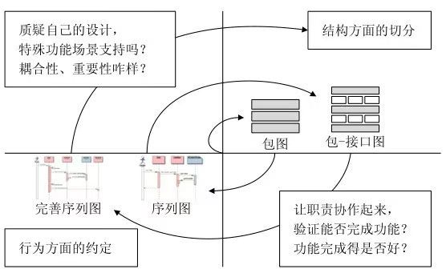
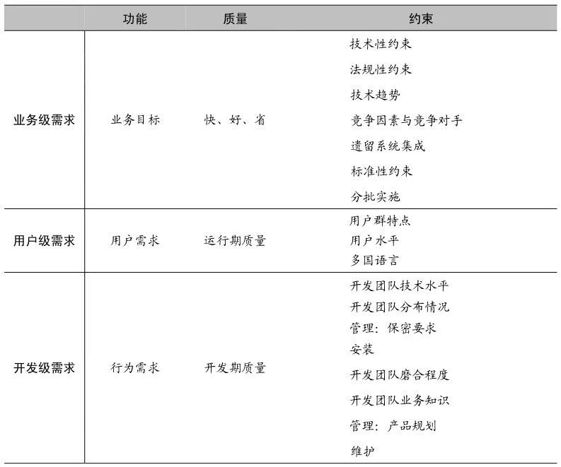
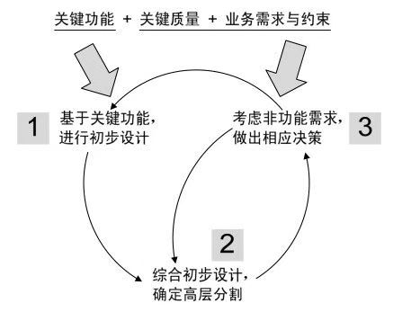
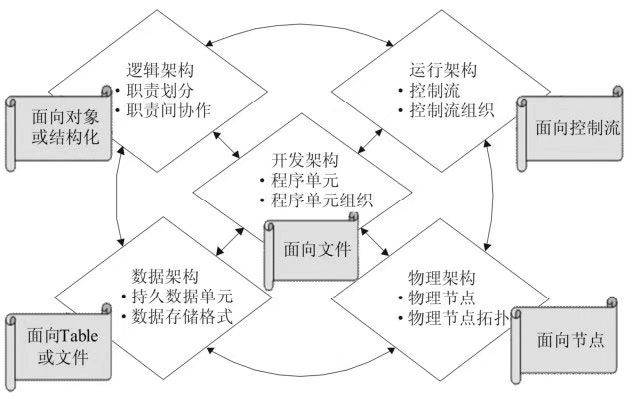

# 第一章

“**质疑驱动**”设计：

是的，又增加了一个“**驱动设计”的概念。这个概念大致如下：需求，被架构你的大脑（而不是自动）有节奏地引入架构设计一波又一波的思维活动中。例如，作为架构师，当你的架构设计进行到一半时，你可能明显感觉到：这个架构设计的中间成果，还需要进一步通过“质疑”引入更多“质量属性”，以及“特殊功能场景”来驱动后续架构工作的开展。

质疑，是架构师最宝贵的意识之一。

“**多阶段**”还是“**多视图**”？

首先应该是“多阶段”，然后才是“多视图”。

* 阶段一：把握需求特点，确定架构驱动力
* 阶段二：根据重大需求，确定概念架构
* 阶段三：细化架构设计，关注不同视图

**逻辑架构的10条经验**：

* 划分子系统：分层的细化

* 划分子系统：分区的引入

* 划分子系统：机制的提取

* 接口的定义：协作决定接口

* 选用序列图：杜绝协作图

* 包-接口图：从结构到行为的桥梁

* 灰盒包图：描述关键子系统

* 循序渐进的螺旋思维

* 设计模式：包内结构

* 设计模式：包间协作

  

  

**二维需求观**

**概念架构设计的高层步骤**：

**细化架构方法**

细化架构是相对于概念架构而言的。可以遵循下图的方法：

**划分子系统的4大原则**

* 职责分离原则
* 通用专用分离原则
* 技能分离原则
* 工作量均衡原则