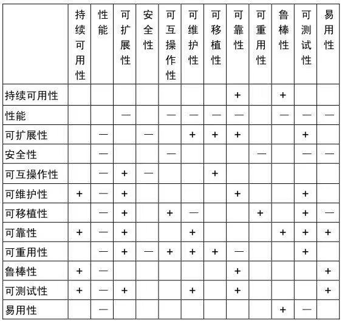
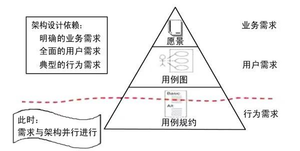
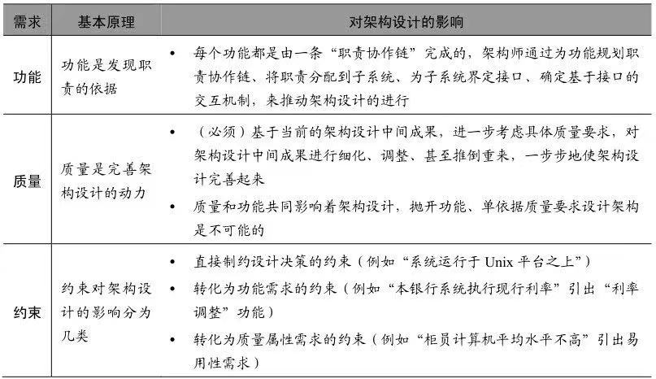
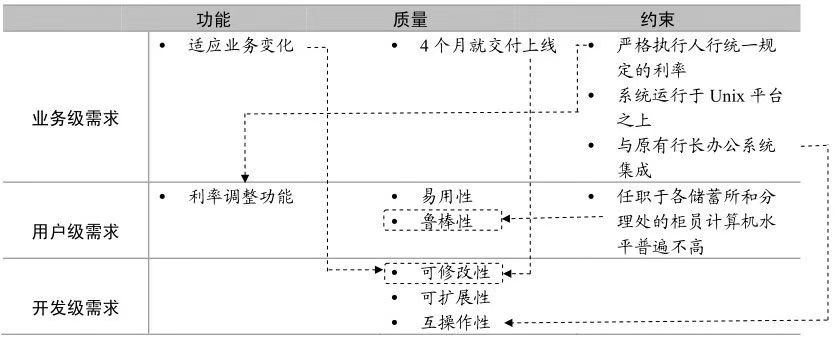
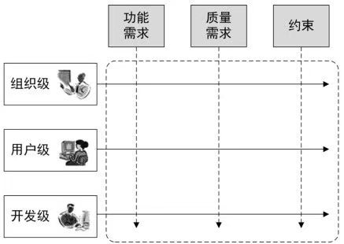
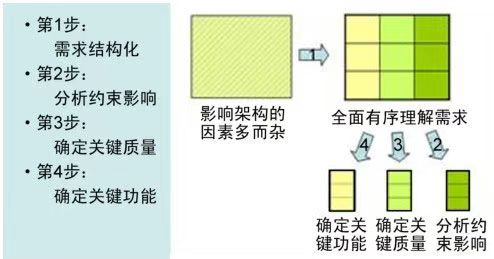

# 预架构阶段

**正确的做法**

* 在架构之初，就全盘考虑架构设计要重点支持的关键质量目标。 比如“性能”和“可扩展性”
* 在第一时间就判断这些“关键质量”之间有没有冲突关系，并制定权衡取舍策略。比如“性能”和“可扩展”这两个关键质量目标，它们是相互矛盾的，但就要考虑哪个更优先级更高。显然“性能”的优先级高于“可扩展”性。因此需要谨慎提高可扩展性的设计对性能的影响后在决定是否采用

**一线架构师**

一定应在 **需求分类、需求折衷、需求变更** 的研究方面是专家，否则就会与其他架构师输在起跑线上。

**架构设计的成败因素**

* 功能需求
  * 业务级需求
  * 用户级需求
  * 开发级需求
* 质量属性
* 约束

**如何考虑成败因素**

* 业务背景
* 系统规模
* 技术趋势
* 开发团队现状

**然后可以得到**

* 需求结构化
* 分析约束影响 - 约束：constraint
* 确定关键质量
* 确定关键功能

**今早开始需求分析**

今早开始需求分析的 3 个条件：

* 明确业务需求：
* 了解全面的用户需求：
* 典型的行为需求：

**不同需求，影响架构的原理不同**

**分析约束影响示例**

**二维需求观**

**关键需求决定架构，其余需求验证架构**

* **功能需求做减法**。在所有需求功能中挑选一个“关键功能子集”，作为架构设计驱动力的第一部分
* **质量属性需求做减法**。根据系统所在的领域的特点及系统规模的因素，确定架构设计重点支持哪些质量属性，作为“架构设计驱动力”的第二部分
* **约束性需求做加法**。充分考虑需求方及业务环境因素、用户群及使用环境因素、开发方及构建环境因素、业界当前技术环境因素等“4类约束”，将之作为“架构设计驱动力”的第三部分，并以“做加法”的思维方式分析约束影响、识别约束背后的衍生需求

**Pre-Architecture 阶段的 4 个步骤**

