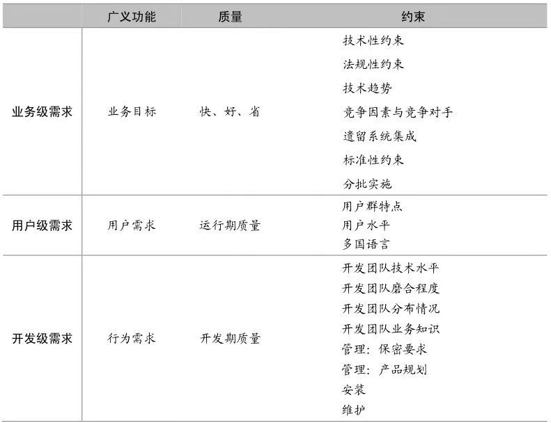

# 需求格式化与分析约束

**需求层次-需求方面 矩阵**

* **业务级需求**：包含客户或出资方要达到的业务目标、预期投资、工期要求，以及要符合哪些标准、对哪些遗留系统进行整合等约束条件
* **用户级需求**：用户使用系统来辅助完成哪些工作？对质量有何要求？用户群及所处的使用环境方面有何特殊要求？
* **开发级需求**：开发人员需要实现什么？开发期间、维护期间有何质量考虑？开发团队的哪些情况会反过来影响架构？

需求就分成了3个层面：

* 功能需求：更多体现各级直接目标需求
* 质量属性：运行期质量 + 开发期质量
* 约束需求：业务环境因素 + 使用环境因素 + 构建环境因素 + 技术环境因素