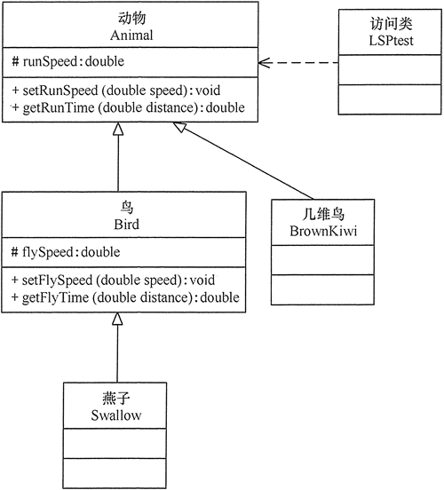

# 里氏替换原则

原文：http://c.biancheng.net/view/1324.html


## 1. 定义

​        里氏替换原则（Liskov Substitution Principle，LSP）：继承必须确保超类所拥有的性质在子类中仍然成立（Inheritance should ensure that any property proved about supertype objects also holds for subtype objects）。

​        里氏替换原则阐述了有关继承的一些原则，也就是什么时候应该是用继承，什么时候不应该是用继承，以及其中蕴含的原理。**里氏替换原则是继承复用的基础，它反映了基类与子类之间的关系，是对开闭原则的补充，是对实现抽象化的具体步骤的规范**。

## 2. 作用

​        里氏替换原则的主要作用如下：

1. 里氏替换原则是实现开闭原则的重要方式之一
2. 它克服了继承中重写父类造成的可复用性变差的缺点
3. 它是动作正确性的保证。即类的扩展不会给已有的系统引入新的错误，降低了代码的出错的可能
4. 加强程序的健壮性，同时变更时可以做到非常好的兼容性，提高程序的维护性、可扩展性，降低需求变更时引入的风险

## 3. 实现方法

​        里氏替换原则，通俗地讲就是：<font color='red'>**子类可以扩展父类的功能，但不能改变父类原有的功能**</font>。也就是说：子类继承父类时，除添加新的方法完成新的功能外，<font color='red'>**尽量**不要重写父类的方法</font>。

​        根据上述理解，对里氏替换原则的定义可以总结如下：

* 子类可以实现父类的抽象方法，但不能覆盖父类的非抽象方法
* 子类中可以增加自己特有的方法
* 当子类的方法重载父类的方法时，方法的**前置条件**（即方法的输入参数）<font color='red'>要比父类的方法**更宽松**</font>
* 当子类的方法实现父类的方法时（重写/重载，或实现抽象方法），方法的**后置条件**（即方法的输出/返回值）要比父类的方法<font color='red'>**更严格或者相等**</font>

​       通过重写父类的方法来完成新的功能写起来虽然简单，但是整个继承体系的可复用性会比较差，特别是运用多态比较频繁时，程序运行出错的概率会非常大。

​        如果程序违背了里氏替换原则，则继承类的对象在基类出现的地方会出现运行错误。这时其修正方法是：取消原来的继承关系，重新设计它们之间的关系。

​        关于里氏替换原则的例子，最有名的是“正方形不是长方形”。当然，生活中还有很多类似的例子，例如：企鹅、鸵鸟和几维鸟从生物学的角度来划分，它们属于鸟类；但从类的继承关系来看，由于它们不能继承“鸟”会飞的功能，所以它们不能定义成“鸟”的子类。同样，由于“气球鱼”不会游泳，所以不能定义成“鱼”的子类；“玩具炮”炸不了敌人，所以不能定义成“炮”的子类等等。

​        下面以“几维鸟不是鸟”为例，说明里氏替换原则。

​         分析：鸟一般都会飞，如燕子的飞行速度大概是120千米/小时。但是新西兰的几维鸟由于翅膀退化无法飞行。假如要设计一个实例，计算这两种鸟飞行300千米要花费的时间。显然，拿燕子来测试这段代码，结果正确，能计算出所需要的时间；但是拿几维鸟测试，结果会发现“除零异常”或者“无穷大”，明显不符合预期。其类图如下所示：


代码如下：

```java
package principle;

public class LSPtest {
    public static void main(String[] args) {
        Bird bird1 = new Swallow();
        Bird bird2 = new BrownKiwi();
        bird1.setSpeed(120);
        bird2.setSpeed(120);
        System.out.println("如果飞行300公里：");
        try {
            System.out.println("燕子将飞行" + bird1.getFlyTime(300) + "小时.");
            System.out.println("几维鸟将飞行" + bird2.getFlyTime(300) + "小时。");
        } catch (Exception err) {
            System.out.println("发生错误了!");
        }
    }
}

//鸟类
class Bird {
    double flySpeed;

    public void setSpeed(double speed) {
        flySpeed = speed;
    }

    public double getFlyTime(double distance) {
        return (distance / flySpeed);
    }
}

//燕子类
class Swallow extends Bird {
}

//几维鸟类
class BrownKiwi extends Bird {
    public void setSpeed(double speed) {
        flySpeed = 0;
    }
}
```

​        程序运行结果：

```tcl
如果飞行300公里：
燕子将飞行2.5小时.
几维鸟将飞行Infinity小时。
```

​        程序运行错误的原因：几维鸟**重写**了鸟类的 *setSpeed(double speed)*  方法，这违背了里氏替换原则。正确的做法是：取消几维鸟原来的继承关系，定义鸟和几维鸟的更一般的类，如动物类，它们都有奔跑的能力。几维鸟的飞行速度虽然为0，但是奔跑速度不为0，可以计算出其奔跑300千米所花费的时间。其类图如下所示：



