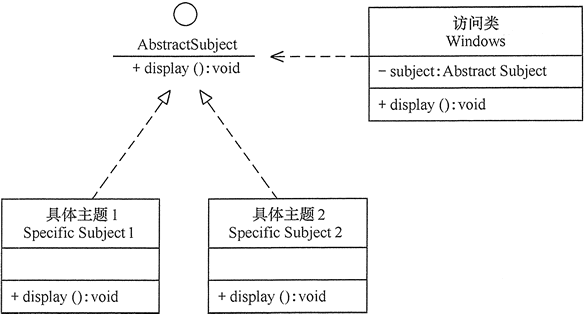

# 开闭原则

原文：http://c.biancheng.net/view/1322.html

## 1. 定义

​        开闭原则（Open Cloased Principle，OCP）定义：软件实体应当**对扩展开放，对修改关闭**，这就是开闭原则的经典定义。

​        软件实体包括一下几个部分：

* 项目中划分出来的模块
* 类与接口
* 方法

​        开闭原则的含义：当应用的需求改变时，在不修改软件实体的源代码或者二进制的前提下，可以扩展模块的功能，使其满足新的需求。

## 2. 作用

​        开闭原则是面向对象设计的**终极目标**，它使软件实体拥有一定的适应性和灵活性的同时，具备稳定性和延续性。具体来说，具备如下的作用：

### 2.1 对软件测试的影响

​        测试时子需要对扩展的代码进行测试就可以了，因为原有的测试代码依然能够正常运行

### 2.2 可以提高代码的复用性

​        粒度越小，被复用的可能性就越大；在面向对象的设计中，根据原子和抽象编程，可以提高代码的可复用性

### 2.3 提供软件的可维护性

​        开闭原则使得软件实体稳定性高和延续性强，则易于扩展和维护。

## 3. 实现方法

​        通过“**抽象约束、封装变化**”来实现开闭原则，即**通过接口或者抽象类为软件实体定义一个相对稳定的抽象层，而将相同的可变因素封装在相同的具体的实现类中**。

​        因为抽象灵活性好，适应性广，只要抽象的合理，可以基本保持软件架构的稳定。而软件中易变的细节可以从抽象派生来的实现类进行扩展，当软件需要发生变化时，只需要根据需求重新派生一个实现类来扩展就可以了。

​        下面以Windows的桌面主题为例，介绍开闭原则的应用。

​        分析：Windows的主题是桌面背景图片、窗口颜色和声音等元素的组合。用户可以根据自己的喜好更换自己的桌面主题，也可以从网上下载主题。这些主题有共同的特点，可以为其定义一个抽象类（Abstract Subject），而每个具体的主题（Specific Subject）是其子类。用户窗体可以根据需要选择或者增加新的主题，而不需要修改源代码，所以她是满足开闭原则的。其类图如下所示：

