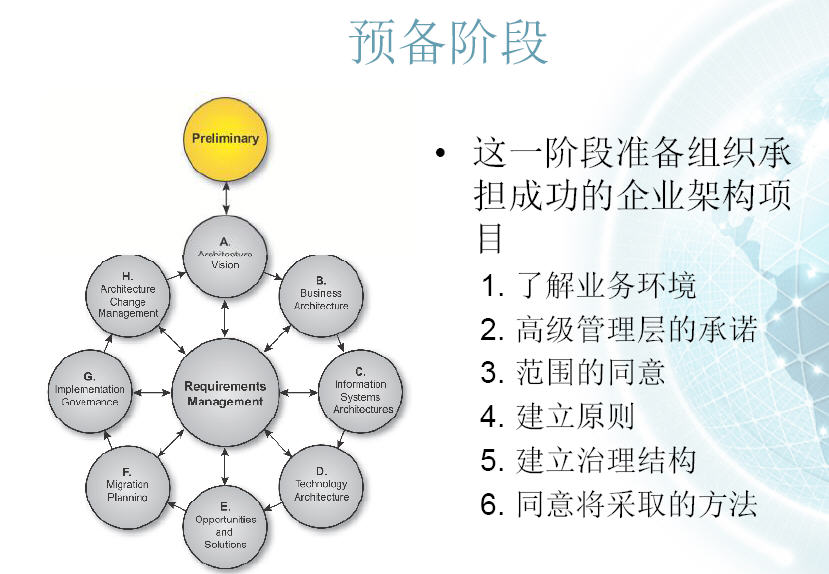
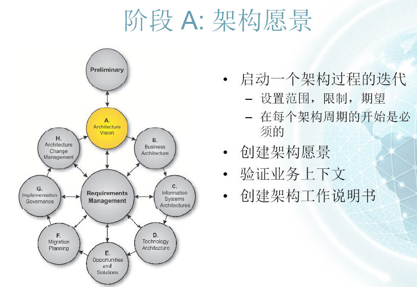
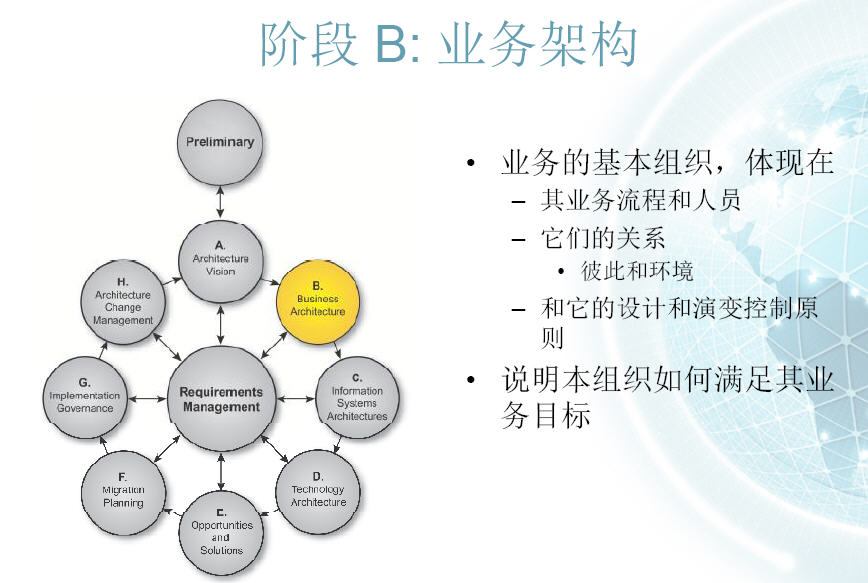
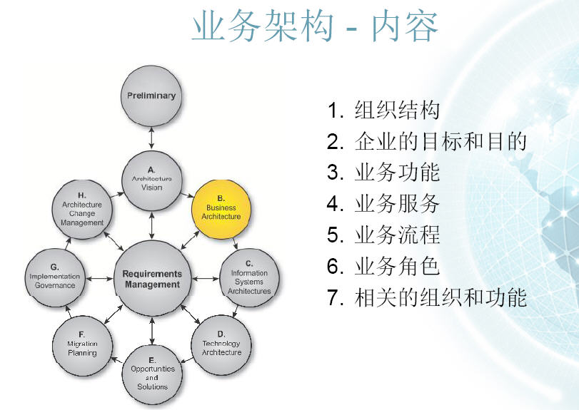
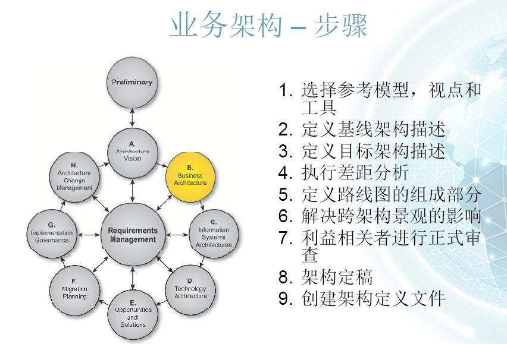

# 企业架构 － ADM方法概要介绍

原文：https://www.cnblogs.com/zhoujg/archive/2010/01/24/1654730.html

介绍 ADM (Architect Development Method)方法的每个阶段的功能内容。

## 一. 预备阶段

确定实现过程涉众，并且让它们面对企业架构工作的内容。该阶段交付基于组织业务法则的架构指导方针（Architecture Guiding Principles），并且描述用于监控 EA 实现进展的过程和标准。

## 二. 阶段A：架构愿景

**明确 EA 愿景。架构愿景（Architecture Vision）工件利用业务推动者明确业务架构工作的目的，并且创建基线和目标环境的粗略描述。**如果业务目标不清楚，那么该阶段中的一部分工作就是用来帮助业务人员确定其关键的目标和相应的过程，这些企业架构都必须支持。同样是该阶段中生成的架构工作描述（Statement of Architectural Work），勾勒出 EA 的范围及约束，并且表示出架构工作的计划。

## 三. 阶段B：业务架构

**详细描述关于业务领域架构的工作**。架构愿景（Architecture Visio）中概括的**基线和目标架构在此被详细说明**，从而使它们作为技术分析的有用输入。**业务过程建模、业务目标建模和用例建模是用于生成业务架构的一些技术**，这又包含了所期望状态的间隙分析。

