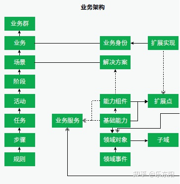
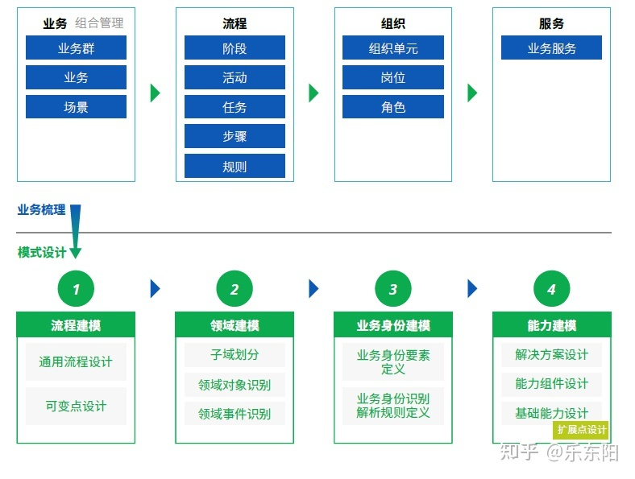
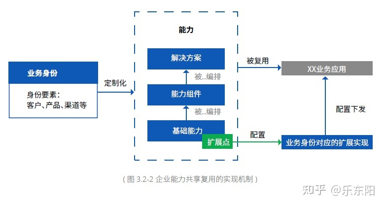
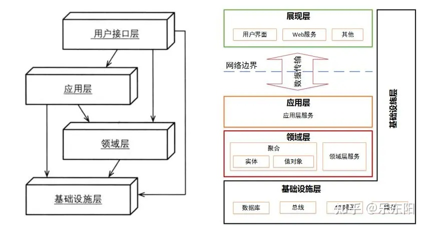

# 业务架构设计的方法

原文：https://zhuanlan.zhihu.com/p/382698551

TOGAF作为业界最知名的企业架构理论，对于高中阶的理念讲了很多，体系非常庞大，但如何进行更细化的设计则言之不多，业界出现了很多不同的实践，形成了行之有效的方法。而且随着软件开发方法的持续发展，企业架构理论也在不断更新换代。

企业需要根据自己的情况进行裁剪定制，形成一套适合自己的业务架构设计方法。本文介绍IBM和Thoughtworks两种业务架构设计方法，并引申开去谈谈DDD和微服务在架构设计和实现中的作用。

## 1. 什么是业务架构

**业务架构是基于架构愿景，以实现企业战略为目标，构建企业整体业务能力规划并将其传导给技术实现端的结构化企业能力分析方法**。业务架构的作用通常被认为是连接业务和IT的纽带和桥梁，形成业务和IT之间有效沟通的通用语言，用于实现业务需求到IT的顺利传导。

业务架构方法可以用于单个产品线或业务种类的领域级分析，也可以用于跨产品线、业务领域的企业级分析，后者被称为企业级架构。

## 2. IBM业务架构设计方法

**业务架构设计的起点是战略分析**。首先对业务战略进行分析，包括与先进同业对标，得出未来的业务能力要求。

然后开始设计业务架构，分为四步：

1. **使用价值链方法划分业务领域**。

   不同的行业有不同的核心价值链，做为横轴，再以不同类型的客户或者产品作为纵轴，就可以划分不同的业务领域。

2. **分析业务流程并建模，建立企业级流程模型**。

   整个企业必须统一采用一种业务流程标准，否则将无法进行企业级整合。业务流程要有边界，每个业务流程尽可能限制在业务领域之内。战略规划中的业务能力要求体现在业务流程设计中。**业务流程谁急颗粒度要具体到任务**。

3. **分析业务数据并进行建模，建立企业级逻辑数据模型**。

4. **在流程模型和数据模型基础上，进行组件分析**。

   以主题域划分边界，将主题域内容实体相关的任务聚集在一起构成一个业务组件，业务组件的行为主要是对数据实体进行增删改查以及业务处理。这样就得到了业务组件模型

**业务组件包括了行为和数据**，代表了企业的一种业务能力。业务组件定位在任务级别，实现企业业务能力复用。

## 3. ThoughtWorks 业务架构设计方法

ThoughtWorks 提出“流程建模-> 领域建模 -> 业务身份建模-> 能力建模”的业务架构设计方法，将 DDD 引入了业务架构设计。

下图是 ThoughtWorks 业务架构元模型：

下图是 ThoughtWorks 业务架构设计方法：

首先进行业务梳理，包括业务、流程、组织和服务等内容。

在此基础上进行模型设计：

1. **流程建模**。流程分层为阶段、活动、任务、步骤，还要说明具体规则。

2. **领域建模**。

   这里将DDD融合进了业务架构设计，主要是DDD的战略设计。DDD战略设计是指领域建模，即划分领域、子域、限界上下文。一个限界上下文包括一个或多个聚合，**限界上下文可能就是未来微服务的边界，可以用于微服务的拆分。**

3. **业务身份建模**。

   业务身份是指使用平台服务的业务身份要素，包括客户、产品、渠道等内容，基于业务身份提供差异化个性化的服务。

   

4. **能力建模**。

   分为三层，对领域对象的原子操作称为基础能力，是能力组合和复用的最小单位。能力组件是对一组相关联的基础能力的封装，以便提供更完整的服务。解决方案是针对具体业务、具体流程的能力模板。

## 4. 业务架构设计的产出

从上述两种业务架构设计方法来看，业务架构设计可形成如下产出：

1. 业务架构能力蓝图
2. 业务流程建模成果
3. 领域建模/业务数据建模成果
4. 业务架构组件模型

## 5. DDD与微服务设计

除了用于业务架构设计，DDD还可以应用到IT架构设计中。领域建模可以输入到数据架构中，指导主题域、主题、实体的识别。领域建模还可以输入到应用架构中用于L1-L3应用架构设计。

在具体系统设计中，分布式微服务架构是当前最流行的架构风格。DDD可以指导微服务的拆分和设计。**DDD的战略设计用于微服务的拆分，DDD的战术设计则可以用于微服务的设计。**这样通过DDD将业务建模和系统落地连接起来。

