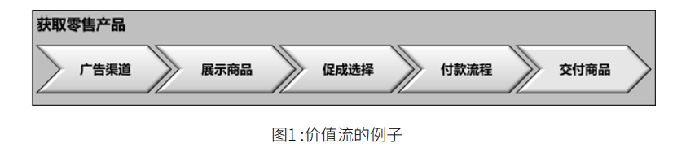
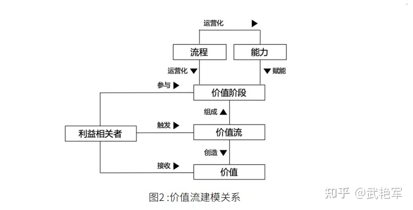
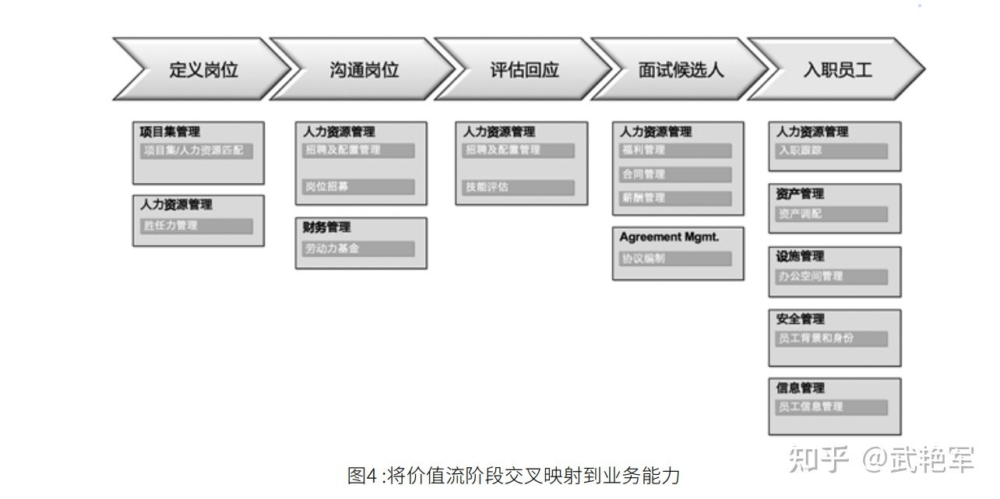

# 业务架构设计（二）价值流

原文：https://www.toutiao.com/a7011091454642684453/

​        **价值流**，是 TOGAF 业务架构中核心概念之一，必须要掌握。

## 1. 价值是商业模式的核心

​        业务架构中，**价值**的概念是非常宽泛的，**是指某物是有用的、能带来利益的、能满足诉求的**，而不是仅仅指某物的货币价值。

​        商业模式描述的是企业是怎么赚钱。**企业存在的核心在于为客户提供价值，即其价值主张**。企业通过为客户提供价值来赚取利润。

## 2. 价值流是业务架构的价值分析方法

​        **价值流**是对企业创造价值方式的描述，是业务架构的价值分析方法。

​        业务架构中的价值流不同于价值链、价值网络和精益价值流等类似提法的工具。业务架构价值流主要是借鉴了价值链的思路，主要改变有二：

1. 不只是关系经济价值的增加，而是关注特定利益相关者（比如客户）需求的满足，关注价值的创造、获取和交付，是一个端到端的视角
2. 只关注主价值链的内容，舍弃了支持活动。埃森哲的方法中，将这种工具称为 Prime Value Analysis （PVCS）

​        给出**业务架构价值流的定义**：*业务架构价值流是一个端到端的增值活动集合，为客户、利益相关者或最终用户创造整体结果*。这些增值活动由价值流阶段表示，每个阶段都会为利益相关者，创造和增加从一个阶段到下一个阶段的价值。

​        一条价值流为特定利益相关者创造和交付一定的价值。**业务架构价值流的组成要素包括：名称、描述、利益相关者和价值。**

​        上图湖区零售商品价值流为例，分为广告渠道、展示商品、促成选择、付款流程和交付商品等五个价值阶段，每个价值阶段都提供一定增值。比如展示商品是告诉客户有这样的商品；促成选择是促使客户选择该商品，但对客户来说都不是提供了完整的价值。只有完整了整个价值流的所有步骤，客户才会得到商品，从而满足客户的需求，向提供完整的价值。

​        价值流是一个较为宏观视角的工具，便于审视企业为特定利益相关者创造价值的一系列活动。相比于价值流，业务流程过于细致，偏重于对运营模式的描述。运营模式描述的是企业怎么运作，是企业运用人力、财务、技术各种资源完成营销、销售、生产、交付等各种经营活动的过程。

## 3. 业务架构价值流与其他业务架构概念的关系

### 3.1 价值流的分解

​        价值流可以分解为多个价值流阶段，**每个价值流阶段都是一个增值活动**，都给利益相关者带来价值的增加。

### 3.2 价值流与业务能力

​        业务能力为价值流提供支撑，**每个价值流阶段由一个或者多个业务能力支持**。下图就是价值流和业务能力的映射关系的示例。下图是员工招聘价值流，分为定义岗位、沟通岗位、评估回应、面试候选人和入职员工五个价值阶段，提供的价值是满足用户部门的用人需求。以沟通岗位这个价值阶段为例，涉及到人力资源管理和财务管理的相关业务能力，比如确定该岗位的编制和薪酬成本等。

​        进一步通过热力图可以分析业务能力现状与价值流对业务能力要求之间的差距。

​        **价值流**和**业务能力** 是业务架构最重要的两个产出。

### 3.3 价值与业务流程

​        价值阶段进一步落实到运营层面，就细化为业务流程。一个价值阶段可以对应一个或者多个业务流程。

​        **价值流相当于企业的业务用例**，聚焦于价值的创造、获取和交付本身，屏蔽了价值流如何实现的细节，因而更加稳定。如果企业的商业模式不变化，则价值流也不会变化。

​        **业务流程是价值流的在运营层面的具体实现方式**。业务流程每三到五年都需要根据组织架构的调整、技术的革新变化等进行流程再造和优化工作。

​        事实上，**价值流** - **价值阶段** - **业务流程** 可以构成三级流程架构的基础框架。

