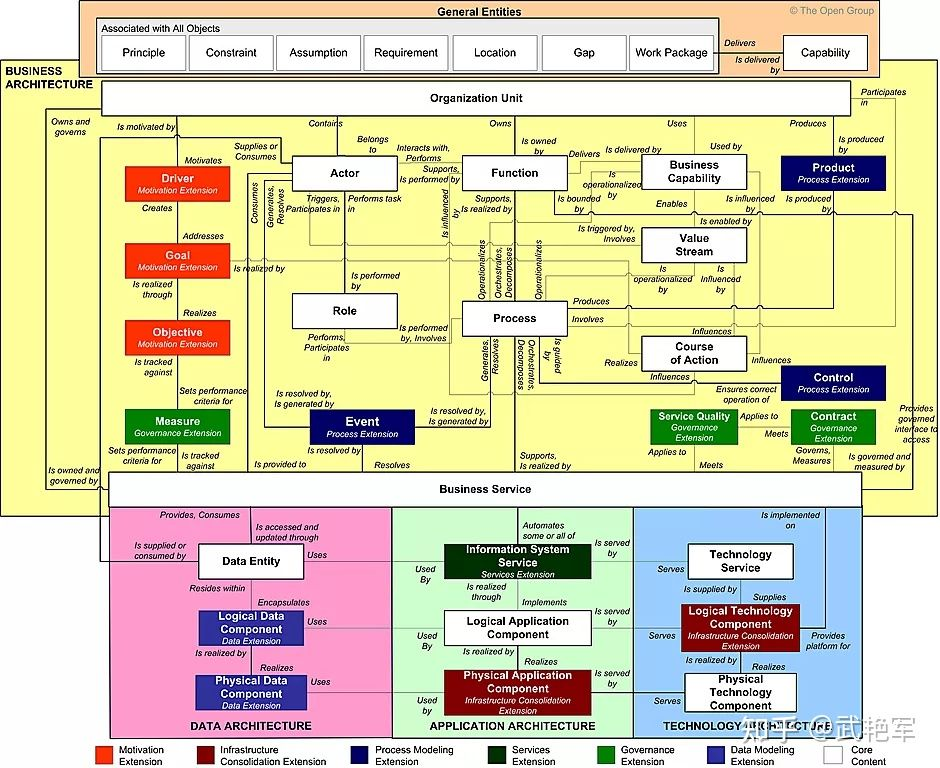

# TOGAF内容元模型介绍

原文：https://www.toutiao.com/a7017219174661472801/?log_from=f4808b464c5c1_1633868975169

## 一. 什么是元模型

​        **元模型是关于模型的模型**。这是特定领域的模型，**定义概念**并提供用于创建该领域中的模型的构建元素。例如：可以将 SPEM 视为流程工程元模型。同样的，TOGAF 也有自己的元模型，将自己理论体系中的各种概念融为一体。

​       进一步的，元模型的模型被称之为元元模型，**信息-模型-元模型-元元模型**，构成了经典的四层元数据体系结构。

## 二. TOGAF 内容元模型

​        **TOGAF 的工作成果中最小粒度的产出就是构建块**。构建块代表了业务能力、IT能力或者架构能力的一个组件。构建块又分为架构构建块（ABB）和解决方案构建块（SBB），架构构建块说明所需能力，解决方案构建块是实施所需能力的组件。

​        TOGAF 内容元模型提供了对架构中可能存在的所有构建块类型的定义，表明存在哪些构建模块以及相互间的关系。TOGAF内容元模型如下：

## 三. TOGAF 内容元模型内中的实体关系

​        TOGAF 内容元模型内实体之间的关系如下：

其中，分核心内容和扩充内容两类，白色的为核心内容。其他都是各种扩展内容，可以根据企业的具体需要进行剪裁。

## 四. 四大架构核心实体之间的关系

​        从上图中将核心元素抽离出来，就得到了 TOGAF 核心的内容元模型内实体及实体之间的关系。

​         从上图可以看到，业务架构的核心内容有组织单元（Organization Unit）、施动者（Actor）、角色（Role）、功能（Function）、流程（Process）、业务能力（Business Capability）、价值流（Value Stream）、行为方式（Course of Action）、业务服务（Business Service）等九个概念。

​        这里的组织单元、施动者和角色都是**组织相关**的。施动者属于组织单元，施动者在业务流程中扮演某种角色。

​        功能、流程、业务能力、价值流、行为方式、业务服务都是**行为相关**的，组织单元拥有功能，功能提供业务能力，业务能力使能价值流，功能、业务能力和价值流影响行为方式，流程由多个功能编排、分解而成，业务服务由流程实现。

​        **数据架构的核心内容是数据实体**。数据实体由组织的施动者提供或使用，数据实体被应用组件封装或访问，组织的施动者通过业务服务访问和更新数据实体。

​        **应用架构的核心内容是应用组件**。应用组件封装或者访问数据实体，应用组件基于技术平台实现，应用组件实现了业务服务。

​        **技术架构的核心内容是技术组件和平台服务**。平台服务通过技术组件实现。

