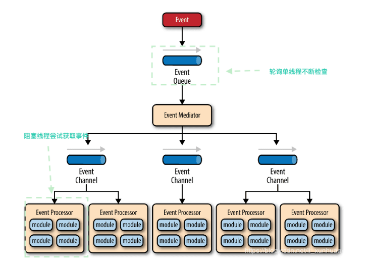
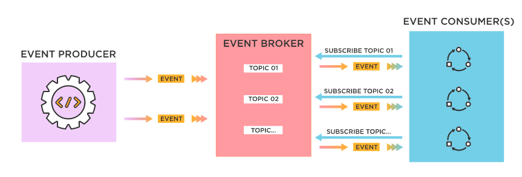
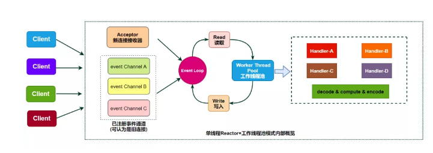
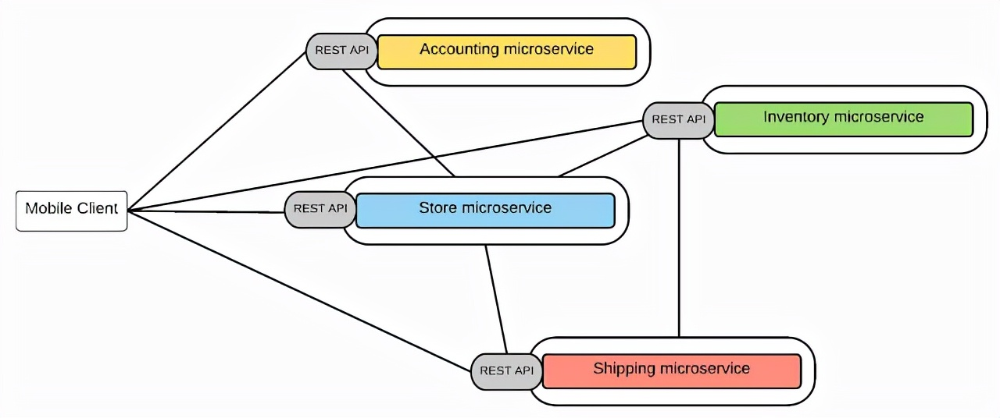
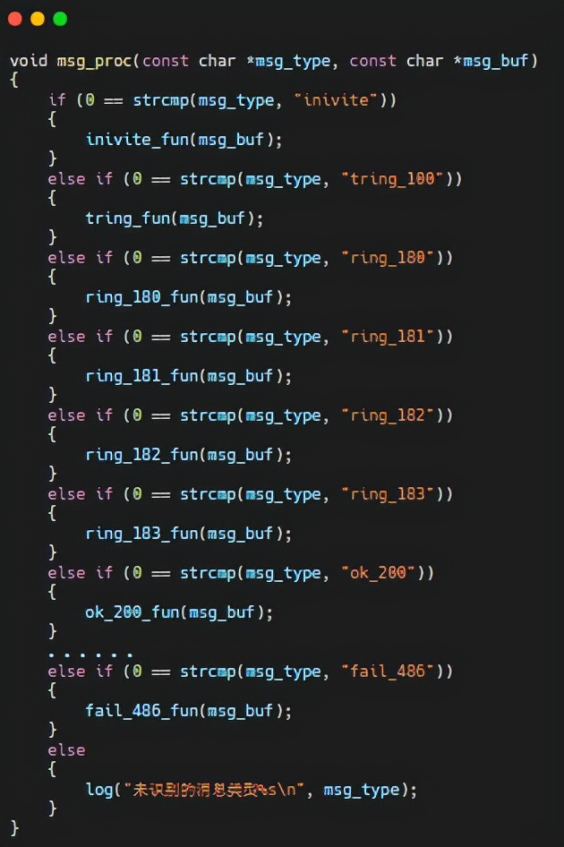
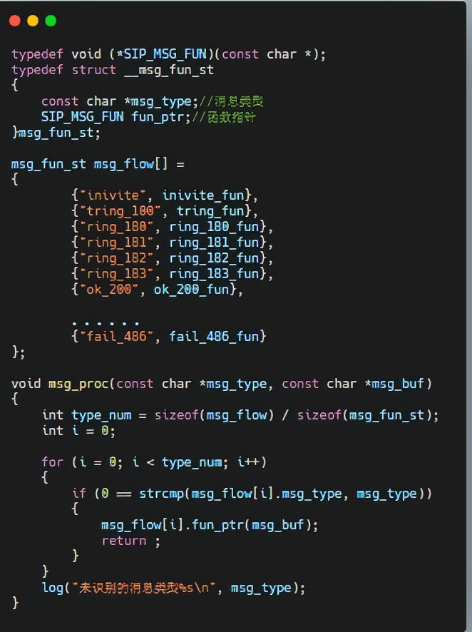
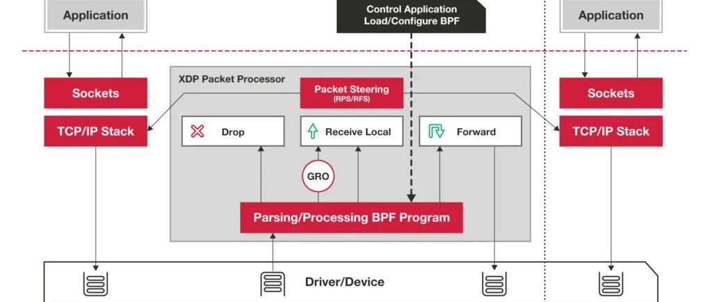

# 深入理解编程模型

原文：https://www.toutiao.com/a7016718580163084804/?log_from=e40c0eedf7e688_1634175786403


​        模型，是对事物共性的抽象，**编程模型**就是对编程的共性抽象。

## 一. 什么是编程的共性？

​        最重要的共性就是：程序设计时，代码的抽象方式、组织方式或者复用方式。编程模型主要是方法与思想。编程模型处于方法或者思想型的层面，在很多情况下，也可称为编程方法、编程方式、编程模型或者编程技术、编程范式。

​        当面对一个新问题时，通常的想法是通过分析，不断的转化和转换，得到本质相同的熟悉的、或者抽象的、简单的一个问题。这就是化归思想。把初始的问题或者对象称为原型，把化归后相对定型的模拟化或者理想化的对象称为模型。

​        编程模型，简单的可以理解为就是模版，遇到相似的问题就可以方便依赖模版解决，简化编程问题。不同的编程环境和不同的应用对象有不同的编程模型。

## 二. 事件驱动



​        事件驱动架构（Event-Driven Architecture）是一种用于设计应用的软件架构和模型，程序的执行流由外部事件来决定，它的一个特定是包含一个事件循环，当外部事件发生时使用回调机制来触发相应的处理。主要包括 4 个基本组件：

* **事件队列（Event Queue）**：接收事件的入口，存储待处理事件
* **分发器（Event Mediator）**：将不同的事件分发到不同的业务逻辑单元
* **事件通道（Event Channel）**：分发器与处理器之间的联系渠道
* **事件处理器（Event Processor）**：实现业务逻辑，处理完成后会发出事件，触发下一步操作

## 三. 为什么采用事件驱动模型

​        事件驱动模型可以理解为观察者模型，或者订阅-发布模型：



​        理解它的几个关键点：

* 首先是一种对象间的一对多的关系：最简单的如交通信号灯，信号灯是目标（一方），行人注视着信号灯（多方）
* 当目标发送改变（发布），观察者（订阅者）就可以接收到改变
* 观察者如何处理（如行人如何走，是快走/慢走/不走，目标不会管的），目标无需干涉；所以就松耦合了它们之间的关系


​        许多现代应用设计都是由事件驱动的，事件驱动应用可以用任何一种编程语言来创建，因为事件驱动本身是一种编程方法，而不是一种编程语言。

* **松耦合**：服务不需要（也不应该）知道或者依赖于其他服务。在使用事件时，服务独立运行，不了解其他服务，包括其实现细节和传输协议。事件模型下的服务可以独立地、更容易地更新、测试和部署
* **易扩展**：通过高度独立和解耦的事件处理器自然地实现了可扩展性。每个事件处理器都可以独立扩展，从而实现细粒度的可扩展性
* **恢复支持**：带有队列的事件驱动架构可以通过”重播“过去的事件来恢复丢失的工作。当用户需要恢复时，这对于防止数据丢失非常有用

事件驱动架构可以**最大程度减少耦合度**，因此是现代分布式应用架构的理想之选。

### 3.1 深入理解事件驱动

#### 3.1.1 异步处理和主动轮询

​        要理解事件驱动和程序，就需要与非事件驱动额程序进行比较。实际上，现代的程序大多是事件驱动的，比如多线程程序，肯定是事件驱动的。早起则存在许多非事件驱动程序，这样的程序，在需要等待某个条件触发时，会不断地检查这个条件，直到条件满足，这是很浪费 CPU 时间的。而事件驱动的程序，则有机会释放 CPU 从而进入睡眠态（注意，是有机会，当然程序也可以自行决定不释放 CPU），当事件触发时被操作系统唤醒，这样就能更加有效地使用 CPU。

#### 3.1.2 I/O模型

​        事件驱动框架一般时采用 Reactor 模式或者 Procactor 模式的 I/O 模型。

​        **Reactor 模式非常重要的一环就是调用函数来完成数据拷贝**。这部分是应用程序自己完成的。内核只负责通知监控的事件到来，所以本质上 **Reactor 模式属于非阻塞同步I/O**。



​        **Proactor 模式，借助于系统本身的异步 I/O 特性，由操作系统进行数据拷贝**，在完成之后来通知应用程序来拉取即可，效率更高效，但是底层需要借助于内核的异步I/O机制来实现，可能借助于 DMA 和 Zero-Copy 技术，理论上性能更高。

​        当前 Windows 系统通过 IOCP 实现了真正的异步 I/O，而在 Linux 系统的异步 I/O 还不完善，比如 Linux 中的 boots.asio 模块就是异步 I/O 的支持，但是目前 Linux 系统还是基于 Reactor 模式的非阻塞同步 I/O 为主。

#### 3.1.3 事件队列

​        事件驱动的程序必定会直接或间接拥有一个事件队列，用于存储未能及时处理的事件，这个事件队列，可以采用消息队列。

#### 3.1.4 事件串联

​        事件驱动的程序的行为，完全受外部输入的事件控制，所以事件驱动框架中，存在大量处理程序逻辑，可以通过事件把各个处理流程关联起来。

#### 3.1.5 顺序性和原子化

​        事件驱动的程序可以按照一定的顺序处理队列中的事件，而这个顺序则是由事件的触发顺序决定的，这一特性往往被用于保证某些过程的顺序性和原子化。

### 3.2 事件驱动缺点

* 事件驱动架构，就是通过引入中间层来实现事件发布-订阅机制进行组件解耦，看似能带来不少诱人的优点，也必然增加系统的复杂度，间接增加卡发难度和维护难度
* 事件驱动架构改变了编程思维，将完整的功能过程，拆解为不同的异步事件处理，也丧失了连贯的流程处理能力。如果事件数量众多，就容易在“事件丛林”中迷路，比如：中断风暴、鲸群效应等。

## 四. 常用的事件驱动框架

* select
* poll
* epoll
* libev
* 中断系统

​        **消息驱动与事件驱动很类似**，都是先有一个事件，然后产生一个相应的消息，再把消息放入消息队列，由需要的项目取拉取。它们只是一些细微的区别，一般都采用相同的框架。细微的区别在于：

* **消息驱动**：生产者A 发送一个消息到消息队列，消费者B 收到该消息。生成者A **很明确**这个消息是发给消费者B 的。通常是 **P2P 模式**
* **事件驱动**：生成者A 发出一个事件，消费者B 或者消费者C 收到这个事件，或者没有收到这个事件，**生成者A 只会产生一个事件**，不关心谁会处理这个事件，通常是**发布-订阅**模型。

​        **现代软件系统**是跨多个端点运行并通过大型网络连接的分布式系统。例如：考虑一位航空公司客户通过 Web 浏览器购买机票。该订单可能会通过 API，然后通过一系列返回结果的过程。这些来回通信的一个术语是消息传递。在消息驱动架构中，这些 API 调用看来来非常像一个函数调用：API 知道它在调用什么，期待某个结果并等待该结果。


## 五. 常用的消息驱动框架



* API 网关
* gRPC
* 微服务架构

### 5.1 消息驱动的优点

* **开发难度低**：消息驱动类似经典的编程模型，调用一个函数，等待一个结果，对结果做一些事情，编程简单快速，开发难度低。
* **方便调试维护**：因为编程逻辑清晰简单，流程清晰，调试起来更加直接方便，后期维护也容易。

### 5.2 事件驱动 vs 消息驱动

* **消息驱动**：

  ​        **调用一个函数，等待一个结果，对结果做一些事情。**

  ​        除了为大多数程序员所熟悉之外，这种结构还可以使调试更加直接。另一个优点就是消息“阻塞”，这意味着呼叫和响应的各个单元坐下来等待轮到接收者进行处理。

* **事件驱动**：

  ​        事件驱动**使单个事件易于隔离测试**。然而，这种与整个应用系统的分离也抑制了这些单元报告错误、重试调用程序甚至只是向用户确认进程已完成的能力。换句话说：当事件驱动系统中发生错误时，很难追踪到底哪里出了问题。**可观察性工具正在应对调试复杂事件链的挑战**。但是，添加到业务交易交叉点的每个工具都会为负责管理这些工作流的程序员带来另一层复杂性。

  ​        如果通信通常以一对一的方式进行，并且优先接收定期状态更新或确认，那么将倾向于使用基于消息的方法。但是，如果系统之间的交互特别复杂，并且确认和状态更新导致的延迟使得等待它们变得不切实际，那么事件驱动的设计可能更合适。但是请记住，大多数大型组织最终会采用**混合策略**：<font color='red'>一些面向客户/API 调用使用消息驱动，而企业本身使用事件驱动</font>。因此，尽可能多地熟悉两者并没有什么坏处。

## 六. 数据驱动

​        数据驱动核心出发点是相对于程序逻辑，人类更擅长于处理数据。数据比程序逻辑更容易驾驭，所以应该尽可能的将设计的复杂度从程序代码转移到数据。

### 6.1 例子

​        假设有一个程序，需要处理其他程序发送的消息，消息类型是字符串，每个消息都需要一个函数进行处理。第一印象，可以这样处理：



​        上面的消息类型取自 **SIP协议**（不完全相同，SIP 协议借鉴了 HTTP 协议），消息类型可能还会增加。看着长长的流程可能有些累，检测一下中间某个消息有没有处理也比较费劲儿，而且，每增加一个消息，就要增加一个流程分支。

​        按照 **数据驱动编程** 的思路，则可以这样设计：



​        第二种**数据驱动**思路的优势：

1. **可读性更强**。消息处理流程一目了然
2. **更容易修改**。需要增加新的消息，只需修改数据即可，不需要修改流程
3. **重用**。第一种方案的很多 else if 其实只是消息和处理函数不同，逻辑其实一样的。这种方案将相同的逻辑提取出来，把容易变化的部分提到了外面

### 6.2 隐含在背后的思想

​        很多思想都是相通的，而隐含在数据驱动编程背后的实现思想包括：

1. **控制复杂度**。通过把程序逻辑的复杂度转移到人类更容易处理的数据中来，从而达到控制复杂度的目的

2. **隔离变化**。如上例子，每个消息处理的逻辑是不变的，但是消息可能是变化的，那就把容易变化的消息和不容易变化的逻辑分离

3. **机制和策略的分离**。与第二点很像，机制就是消息的处理逻辑，策略就是不同的消息处理：

   

   

### 6.3 数据驱动编程可以用来做什么

#### 6.3.1 表驱动法（Table-Driven）

​        表驱动法消除重复代码，考虑一个消息（事件）驱动的系统，系统的某一模块需要和其他的几个模块进行通信。它收到消息后，需要根据消息的发送方，消息的类型，自身的状态，进行不同的处理。比较常见的一个做法是用三个级联的switch分支实现通过硬编码来实现：

```java
switch(sendMode){
    case:
}
switch(msgEvent){
    case:
}
switch(myStatus){
    case:
}
```

​        这种方法的缺点：

* **可读性不高**：
* **过多的Switch分支**：
* **可扩展性差**：
* **程序缺少核心主干**：

#### 6.3.2 表驱动实现

​        根据定义的三个枚举：模块类型，消息类型，自身模块状态，定义一个函数跳转表：

```c
typedef struct __EVENT_DRIVE
{
MODE_TYPE mod;//消息的发送模块
EVENT_TYPE event;//消息类型
STATUS_TYPE status;//自身状态
EVENT_FUN eventfun;//此状态下的处理函数指针
}EVENT_DRIVE;
EVENT_DRIVE eventdriver[] = // 这就是一张表的定义，不一定是数据库中的表。
                            // 也可以使自己定义的一个结构体数组。
    {
        {MODE_A, EVENT_a, STATUS_1, fun1}
        {MODE_A, EVENT_a, STATUS_2, fun2}
        {MODE_A, EVENT_a, STATUS_3, fun3}
        {MODE_A, EVENT_b, STATUS_1, fun4}
        {MODE_A, EVENT_b, STATUS_2, fun5}
        {MODE_B, EVENT_a, STATUS_1, fun6}
        {MODE_B, EVENT_a, STATUS_2, fun7}
        {MODE_B, EVENT_a, STATUS_3, fun8}
        {MODE_B, EVENT_b, STATUS_1, fun9}
        {MODE_B, EVENT_b, STATUS_2, fun10}
    };
int driversize = sizeof(eventdriver) / sizeof(EVENT_DRIVE)//驱动表的大小

EVENT_FUN GetFunFromDriver(MODE_TYPE mod, 
                           EVENT_TYPE event, 
                           STATUS_TYPE status)//驱动表查找函数
    {
        int i = 0;
        for (i = 0; i < driversize; i ++)
        {
            if ((eventdriver[i].mod == mod) && 
                (eventdriver[i].event == event) && 
                (eventdriver[i].status == status))
            {
                return eventdriver[i].eventfun;
            }
        }
        return NULL;
    }
```

​        这种做法的好处是：

* **提高了程序的可读性**。一个消息如何处理，只要看一下驱动表就知道，非常明显。
* **减少了重复代码**。这种方法的代码量肯定比第一种少。为什么？因为它把一些重复的东西：switch分支处理进行了抽象，把其中公共的东西——根据三个元素查找处理方法抽象成了一个函数GetFunFromDriver外加一个驱动表。
* **可扩展性强**。注意这个函数指针，他的定义其实就是一种契约，类似于java中的接口，c++中的纯虚函数，只有满足这个条件（入参，返回值），才可以作为一个事件的处理函数。这个有一点插件结构的味道，你可以对这些插件进行方便替换，新增，删除，从而改变程序的行为。而这种改变，对事件处理函数的查找又是隔离的（也可以叫做隔离了变化）。
* **程序有一个明显的清晰的主干**。
* **降低了复杂度**。通过把程序逻辑的复杂度转移到人类更容易处理的数据中来，从而达到控制复杂度的目标。

#### 6.3.3 基于数据模型编程

* **基于Yang模型编程（DSL）**：YANG是一种语言，是用来建立数据模型的语言，可以通过定义业务数据模型，自动生成对应数据处理逻辑（比如参数校验，范围，存储方式，权限控制等），典型的数据驱动编程；
* **Linux 内核DTS设备树模型**，删除大量hardcode，精简内核驱动代码
* **基于XML，protobuf数据模型编程**，界面显示，web配置逻辑，RPC微服务等；

### 6.4 数据驱动思考

- 它不是一个全新的编程模型：它只是一种设计思路，而且历史悠久，在unix/linux社区应用很多；
- 它不同于面向对象设计中的数据：“数据驱动编程中，数据不但表示了某个对象的状态，实际上还定义了程序的流程；**OO看重的是封装，而数据驱动编程看重的是编写尽可能少的代码**。”
- 数据压倒一切。如果选择了正确的数据结构并把一切组织的井井有条，正确的算法就不言自明。编程的核心是数据结构，而不是算法。——Rob Pike
- 程序员束手无策，只有跳脱代码，直起腰，仔细思考数据才是最好的行动。表达式编程的精髓。——Fred Brooks
- 数据比程序逻辑更易驾驭。尽可能把设计的复杂度从代码转移至数据是个好实践。——《unix编程艺术》作者。