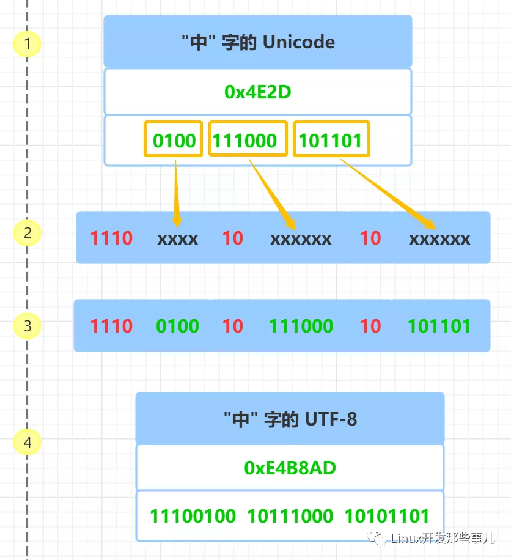

# Unicode、UTF-8、UTF-16

原文：https://www.toutiao.com/i6978616950339650061/


计算机起源于美国，上个世纪，他们对英语字符与二进制位之间的关系做了统一规定，并制定了一套字符编码规则，这套编码规则被称为ASCII编码。

ASCII编码一共定义了128个字符的编码规则，用七位二进制表示（0x00 - 0x7F），这些字符组成的集合就叫做ASCII字符集。

随着计算机的普及，在不同地区和国家又出现了很多字符编码，比如：中国大陆的GB2312，港台的BIG5，日本的Shift JIS等等。

由于字符编码不同，计算机在不同国家之间的交流变得很困难，经常会出现乱码的问题。比如：对于同一个二进制数据，不同的编码会解析出不同的字符。

当互联网迅猛发展，地域限制打破之后，人们迫切的希望有一种统一的规则，对所有国家和地区的字符进行编码，于是Unicode就出现了。


## Unicode介绍

Unicode是国际标准字符集，它将世界各种语言的每个字符定义一个唯一的编码，以满足跨语言、跨平台的文本信息转换。

Unicode字符集的编码范围是0x0000 - 0x10FFFF，可以容纳一百多万个字符，每个字符都有一个独一无二的编码，也即每个字符都有一个二进制数值和它对应，这里的**二进制数值也叫做码点**。比如：汉子“中”的码点事0x4E2D，大写字母A的码点是0x41，具体字符对应的Unicode编码可以查询Unicode字符编码表。

## 字符集和字符编码

字符集，是很多个字符的集合，例如GB2312是简体中文的字符集，它收录了六千多个常用字的简体汉字及一些符号、数字、拼音等字符。

字符编码，是字符集的一个种实现方式，把字符集中的字符映射为特定的字节或字节序列，它是一种规则。例如：Unicode只是字符集、UTF-8、UTF-16、UTF-32才是真正的字符编码规则。

## Unicode字符存储

Unicode是一个字符集，它只规定了每个符号的二进制值，但是符号具体如何存储，它并没有规定。

前面提到，Unicode字符集的编码范围是0x000 - 0x10FFFF，因此需要1到3个字节来表示。那么，对于三个字节的Unicode字符，计算机怎么知道它表示的是一个字符而不是三个字符呢？

如果所有字符都用三个字节表示，那么对于那些一个字节就能表示的字符来说，有两个字节是无意义的，对于存储来说，是极大的浪费。假如，一个普通的文本，大部分字符都只需要一个字节就能表示，现在都是用三个字节才能表示，文本的大小会大出三倍左右。

因此，Unicode出现了多种存储方式，常见的有UTF-8、UTF-16、UTF-32，它们分别用不同的二进制格式来表示Unicode字符。

UTF-8、UTF-16、UTF-32中的“UTF”是“Unicode Transformation Format”的缩写，意思是“Unicode转换格式”，后面的数字表明，至少使用多少个比特位来存储字符。比如：UTF-8最少需要8个比特位（也就是一个字节）来存储；相应的，UTF-16和UTF-32分别需要最少2个字节和4个字节来存储。 

## UTF-8编码

​        UTF-8，是一种变长字符编码，被定义为将码点编码为1至4个字节，具体取决于码点数值中有效二进制位的数量。

​        UTF-8的编码规则：

1. 对于单字节的符号，字节的第一位设为0，后面 7 位为这个符号的Unicode码。因此对于英语字母，UTF-8编码和ASCII码是相同的，所以UTF-8能兼容ASCII编码，这也是互联网普遍采用UTF-8的原因之一
2. 对于 n 字节的符号（n>1），第一个字节的前 n 位都设为1，第 n+1 位设为 0，后面字节的前两位一律设为 10。剩下的没有提及的二进制位，全部为这个符号的Unicode码。

​        下表是Unicode编码对应UTF-8需要的字节数量以及编码格式：

| Unicode编码范围（16进制） | UTF-8编码方式（二进制）                                      |
| ------------------------- | ------------------------------------------------------------ |
| 000000 - 00007F           | <font color='red'>0</font>xxxxxxx ASCII码                    |
| 000080 - 0007FF           | <font color='red'>110</font>xxxxx <font color='red'>10</font>xxxxxx |
| 000800 - 00FFFF           | <font color='red'>1110</font>xxxx <font color='red'>10</font>xxxxxx <font color='red'>10</font>xxxxxx |
| 01 0000 - 10 FFFF         | <font color='red'>11110</font>xxx <font color='red'>10</font>xxxxxx <font color='red'>10</font>xxxxxx <font color='red'>10</font>xxxxxx |

​        表格中第一列是编码的范围，第二列是对应UTF-8编码方式，其中红色的二进制<font color='red'>“1”</font> 和 <font color='red'>“0” </font> 是固定的前缀，字母 <font color='red'>x</font> 表示可用编码的二进制位。

​        根据上面表格，要解析UTF-8编码就很简单了，如果一个字节第一位是 <font color='red'>0</font> ，则这个字节就是一个单独的字符，如果第一位是 <font color='red'>1</font>，则连续有多少个 <font color='red'>1</font>，就表示当前字符占用多少个字节。

​        下面以<font color='red'>“中”</font>字为例，来说明UTF-8的编码，具体的步骤如下图，为了便于说明，图中左边加了1，2，3，4的步骤号：



​        首先查询“中”字的Unicode码 0x4E2D，转成二进制，总共有 16 个二进制位，具体请看上图步骤一所示。

​        通过前面的Unicode编码和UTF-8编码的表格知道，Unicode码0x4E2D对应000800 - 00FFFF的范围，所以“中”字的UTF-8编码需要3个字节，即格式是：<font color='red'>1110</font>xxxx <font color='red'>10</font>xxxxxx <font color='red'>10</font>xxxxxx。

​        然后从“中”字的最后一个二进制位开始，按照从后向前的顺序依次填入格式中的 x 字符，多出的二进制补位 0 ， 具体请看上图的步骤二、三所示。

​        于是，就得到了“中”的UTF-8编码是 11100100 10111000 10101101, 转换成十六进制就是0xE4B8AD，具体请看上图步骤四所示。

## UTF-16 编码

​        UTF-16 也是一种变长字符编码，这种编码方式比较特殊，它将字符编码成**2字节**，或者**4字节**。具体的编码规则如下：

1. 对于Unicode码小于 **0x10000** 的字符，使用 **2** 个字节存储，并且是直接存储Unicode码，不用进行编码转换
2. 对于Unicode码在 **0x10000** 和 **0x10FFFF** 之间的字符，使用 4 个字节存储，这 4 个字节分成前后两部分，每个部分各两个字节，其中，前面两个字节的前 **6** 位二进制固定为 **110110**，后面两个字节的前 **6** 位二进制固定为 **110111**，前后各部分剩余 10 位二进制表示符号的Unicode码减去 0x10000 的结果
3. 大于 0x10FFFF的Unicdoe码无法用UTF-16编码

​        下表是Unicode编码对应UTF-16编码格式：

| Unicode 编码范围（16进制） | 具体Unicode码（二进制） | UTF-16编码方式（二进制）            | 字节 |
| -------------------------- | ----------------------- | ----------------------------------- | ---- |
| 0000 0000 - 0000 FFFF      | xxxxxxxx xxxxxxxx       | xxxxxxxx xxxxxxxx                   | 2    |
| 0001 0000 - 0010 FFFF      | yy yyyyyyyy xx xxxxxxxx | 110110yy yyyyyyyy 110111xx xxxxxxxx | 4    |

​        表格中第一列，是Unicode编码的范围，第二列是具体Unicode码的二进制（第二行的第二列表示的是Unicode码减去0x10000后的二进制），第三列是对应UTF-16编码方式，其中红色的二进制“1”和“0”是固定的前缀，字母x和y表示可用编码的二进制位，第四列表示编码占用的字节数。

​        前面提到过，“中”字的Unicode码是 4E2D，它小于 0x10000， 根据表格知道，它的UTF-16编码占用两个字节，并且和Unicode码相同，所以，“中”字的UTF-16编码为4E2D。

​        下面，以这个符号来解析一下UTF-16的编码过程：


这个老的南阿拉伯字母的Unicode码是 0x10A6F，它是一个4字节的编码。具体步骤如下图：


​        首先，把Unicode 码 0x10A6F 转成二进制，对应上图步骤一

​        然后把Unicode码 0x10A6F 减去 0x10000， 结果为 0xA6F ，并把这个值转成二进制 00 00000010 10 01101111，对应上图的步骤二

​        然后从二进制00 00000010 10 01101111 的最后一个二进制位开始，按照从后向前的顺序依次填入格式中的 x 和 y 字符，多出的二进制补位 0， 对应上图步骤三、四

​        于是，就计算出了 Unicode 码 0x10A6F 的UTF-16 编码是 11011000 0000001011011110 01101111 , 转换成十六进制就是 0xD802DE6F，对应上图步骤五

## UTF-32 编码

​        UTF-32 是固定长度的编码，始终占用 4 个字节，足以容纳所有的 Unicode 字符，所以直接存储 Unicode 码即可，不需要任何编码转换。虽然浪费了空间，但提高了效率。

## UTF-8、UTF-16、UTF-32 之间如何转换

​        前面介绍过，UTF-8、UTF-16、UTF-32 是 Unicode 码表示成不同的二进制格式的编码规则，同样，通过这三种编码的二进制表示，也能获得对应的 Unicode 码，有了字符的 Unicode 码，按照上面介绍的 UTF-8、UTF-16、UTF-32 的编码方法 就能转换成任一种编码了。

### UTF字节序

​        最小编码单元是多字节才会有字节序的问题存在。UTF-8 最小编码单元是一个字节，所以它没有字节序的问题；UTF-16 最小编码单元是 2 个字节，在解析一个UTF-16字符之前，需要知道每个编码单元的字节序。

​        比如：前面的“中”字的Unicode码是 4E2D，"ⵎ" 字符的 Unicode 码是 2D4E， 当收到一个 UTF-16 字节流 4E2D 时，计算机如何识别它表示的是字符 "中" 还是 字符 "ⵎ" 呢 ?

​        所以，对于多字节码的编码单元，需要有一个标记显示的告诉计算机，按照什么样的顺序解析字符，也就是字节序，字节序分为 **大端字节序** 和 **小端字节序**。

* 小端字节序：Little-Endian，缩写 LE。表示低位字节在前，高位字节在后，高位字节保存在内存的高地址端，而低位字节保存在内存的低地址端
* 大端字节序：Big-Endian，缩写 BE。表示高位字节在前，低位字节在后，高位字节保存在内存的低地址端，低位字节保存在内存的高地址端

​        下图以 0x4E2D为例，说明大端、小端：


​        数据是从高位字节到低位字节显示的，这也符合人们阅读数据的习惯。而内存地址是从低位地址向高位地址增加的，所以，字符 0x4E2D 数据的高位字节是 4E，低位字节是 2D。

​        按照大端字节的高位字节保存内存低地址端的规则， 4E 保存到低内存地址 0x10001 上，2D 则保存到高内存地址 0x10002 上。

​        对于小端字节序，正好相反。数据的高位字节保存到内存的高地址端，低位字节保存到内存低地址端，所以 4E 保存到高内存地址 0x10002 上，2D 则保存到低内存地址 0x10001 上。

### BOM

​        BOM 是 Byte-order Mark 的缩写，是“字节序标记”的意思。它常被用来当作标识文件是以UTF-8、UTF-16或UTF-32编码的标记。

​        在Unicode编码中有一个叫做“零宽度非换行空格”的字符（ZERO WIDTH NO-BREAK SPACE），用字符 **FEFF** 来表示。

​        对于 UTF-16 ，如果接收到以 FEFF **开头**的字节流， 就表明是大端字节序，如果接收到 **FFFE**， 就表明字节流 是小端字节序。

​        UTF-8 没有字节序问题，上述字符只是用来标识它是 UTF-8 文件，而不是用来说明字节顺序的。"零宽度非换行空格" 字符 的 UTF-8 编码是 EF BB BF, 所以如果接收到以 **EF BB BF** 开头的字节流，就知道这是UTF-8 文件。

​        下面的表格列出了不同UTF格式的固定文件头：

| UTF编码  | 固定文件头  |
| -------- | ----------- |
| UTF-8    | EF BB BF    |
| UTF-16LE | FF FE       |
| UTF-16BE | FEFF        |
| UTF-32LE | FF FE 00 00 |
| UTF-32BE | 00 00 FE FF |

​        根据上面的 **固定文件头**，下面列出了 "中" 字在文件中的存储 ( 包含文件头 )

| 编码         | 固定文件头              |
| ------------ | ----------------------- |
| Unicode 编码 | 0x004E2D                |
| UTF-8        | EF BB BF 4E 2D          |
| UTF-16BE     | FE FF 4E 2D             |
| UTF-16LE     | FF FE 2D 4E             |
| UTF-32BE     | 00 00 FE FF 00 00 4E 2D |
| UTF-32LE     | FF FE 00 00 2D 4E 00 00 |


## 常见的字符编码的问题

### Redis中文key的显示

​        有时候需要向redis中写入含有中文的数据，然后在查看数据，但是会看到一些其他的字符，而不是之前写入的中文：


​        上图中，向Redis写入一个“中”字，通过 get 命令查看的时候无法显示我们写入的 "中" 字。这时候加一个 --raw 参数，重新启动 redis-cli 即可，也即 执行 redis-cli --raw 命令启动redis客户端，具体的如下图所示：


### MySQL中的UTF8 和 UTF8mb4

​        MySQL 中的 "utf8" 实际上不是真正的 UTF-8， "utf8" 只支持每个字符最多 3 个字节, 对于超过 3 个字节的字符就会出错, 而真正的 UTF-8 至少要支持 4 个字节

​        MySQL 中的 "utf8mb4" 才是真正的 UTF-8。

​        下面以 test 表为例来说明, 表结构如下:

```sql
mysql> show create table test\G
*************************** 1. row ***************************
       Table: test
Create Table: CREATE TABLE `test` (
  `name` char(32) NOT NULL
) ENGINE=InnoDB DEFAULT CHARSET=utf8
1 row in set (0.00 sec)
```

​        向 test 表分别插入 "中" 字 和 Unicode 码为 0x10A6F 的字符，这个字符需要从 
https://unicode-table.com/cn/10A6F/ 直接复制到 MySQL 控制台上，手工输入会无效，具体的执行结果如下图:


​        从上图可以看出，插入 "中" 字 成功，插入 0x10A6F 字符失败，错误提示无效的字符串，\xF0\X90\XA9\xAF 正是 0x10A6F 字符的 UTF-8 编码，占用 4 个字节, 因为 MySQL 的 utf8 编码最多只支持 3 个字节，所以插入会失败。

​        把 test 表的字符集改成 utf8mb4 , 排序规则 改成 utf8bm4_unicode_ci, 具体如下图所示：


​        字符集和排序方式修改之后，再次插入 0x10A6F 字符， 结果是成功的，具体执行结果如下图所示：


​        上图中，set names utf8mb4 是为了测试方便，临时修改当前会话的字符集，以便保持和 服务器一致，实际解决这个问题需要修改 my.cnf 配置中 服务器和客户端的字符集。

## 小结

​       本文从字符编码的历史介绍了 Unicode 出现的原因，接着介绍了 Unicode 字符集中 三种不同的编码方式：UTF-8、UTF-16、UTF-32 以及它们的的编码方法，紧接着介绍了 字节序、BOM ，最后讲到了字符集在 MySQL 和 Redis 应用中常见的问题以及解决方案 ，更多关于 Unicode 的介绍请参考 Unicode 的 RFC 文档。