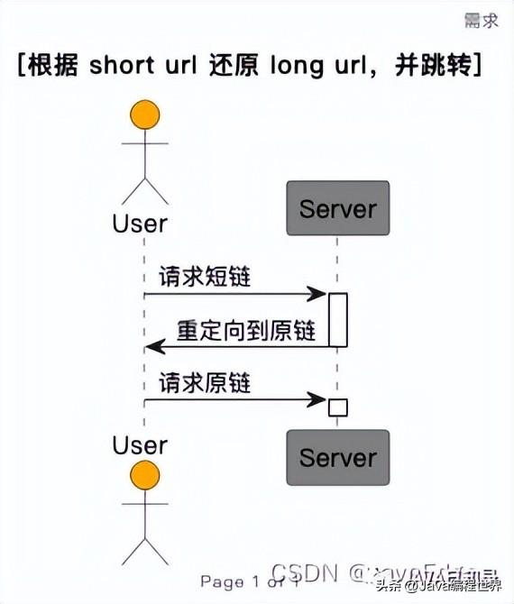
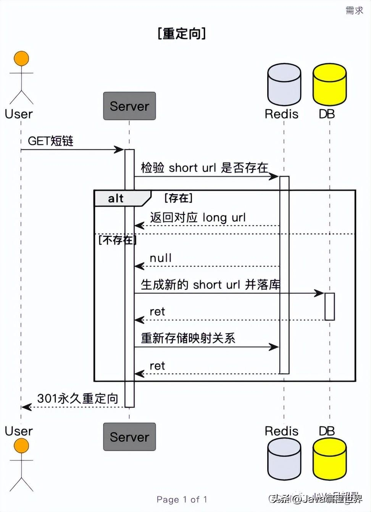
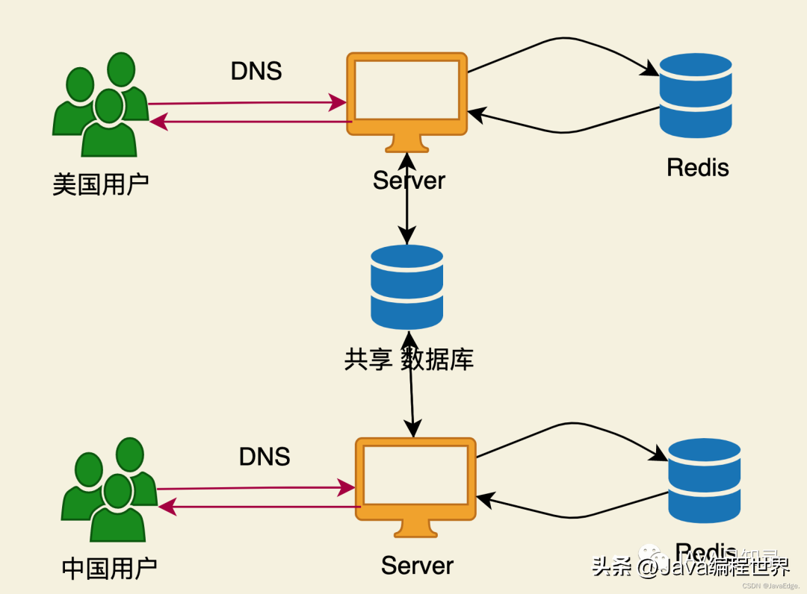
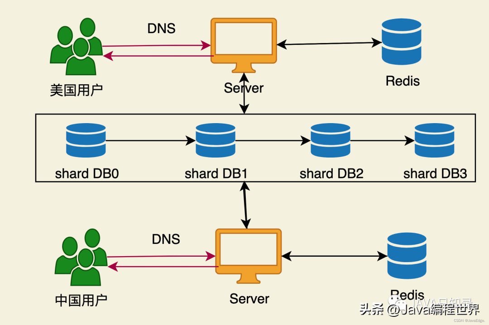
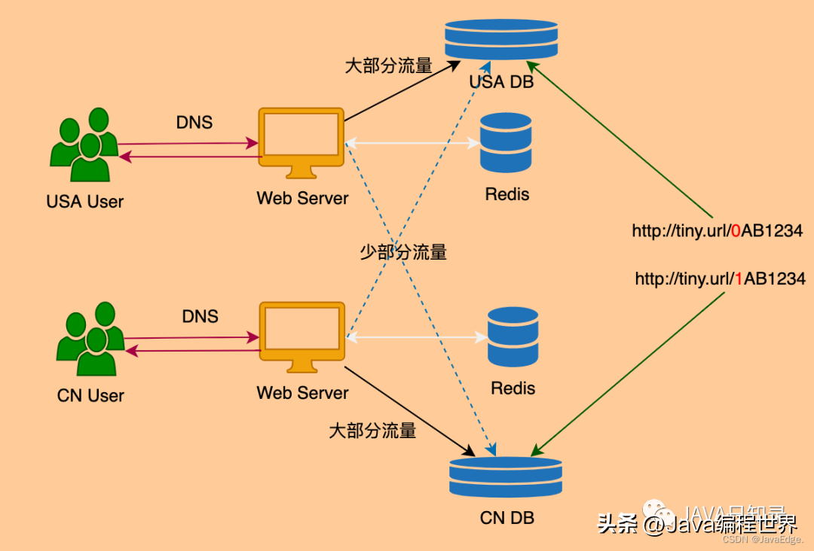

## 如何设计一个高并发的短链接系统

原文：https://www.toutiao.com/article/7147976071697695245/?log_from=6e1acce8c547b8_1674631810243


### 1. 场景说明

根据一个长URI生成一个短URI。例如：把 http://www.alibabatiydan.com 转成 http://ali.ba/abcd，再根据短链接还原成长连接，并跳转。整个过程如下图所示：



这里需要确认：

* 长URI和短URI是否必须一一对应？
* 短URI长时间没有人用，是否需要清除（释放）？

#### 1.1 QPS分析

高并发的情况，需要进行QPS分析。

1. 日活量有多大？日微博是100M
2. 推算产生一个 tiny URL的QPS
   1. 假设每个用户平均每天0.1（发10条，有一条带有链接）条带URL的微博
   2. 平均写 QPS = 100M * 0.1 / 86400 = 100
   3. 峰值写 QPS = 100 * 2  = 200
3. 推算点击一条 tiny URL的QPS
   1. 假设每个用户平均点1个tiny URL
   2. 平均读 QPS = 100M * 1 / 86400 = 1K
   3. 峰值读 QPS = 1k * 2 = 2K
4. Deduce每天产生的新URL所占用的存储
   1. 100M * 0.1 = 10M 条
   2.  每条 URL 长度平均按 100 算，共 1G
   3. 1T硬盘能用3年

由2、3分析可知，并不需要分布式存储，支持 2K QPS，一台 SSD的MySQL即可。

### 2. Service 服务 - 逻辑块聚类与接口设计

该系统其实很简单，只需要一个 service即可： URL Servcie。由于 tiny URL只有一个 UrlServcie，因此：

* 本身其实就是一个小的独立应用
* 也无需关心其他任何业务功能

#### 2.1 方法设计

设计两个API，一个是通过长URL变成短URL，一个反之：

* UrlService.encode(String longUrl) 编码方法
* UrlService.decode(String shotUrl) 解码方法 （原文参数是 longUrl）

采用GET方法，也可用POST方法。建议用GET

### 3. 数据存储

数据存储则需要根据具体实际情况来决定。

#### 3.1 SQL vs NoSQL

选择RDMS的SQL还是流行的NoSQL，可以根据以下问题的答案来做出选择：

* 是否需要事务处理？不需要，NoSQL+1； 需要，SQL+1
* 是否需要复杂的SQL查询？ 不需要，NoSQL+1； 需要，SQL+1
* 编写转换代码是否复杂？不复杂，NoSQL+1；复杂，SQL+1
* QPS高？2K属于不高的情况，SQL+1；
* 可扩展性需求是否高？高，NoSQL+1；不高，SQL+1
* 存储量大？大，NoSQL+1；不大，SQL+1
* 是否需要Sequential ID？不需要，NoSQL+1；需要， SQL +1

#### 3.2 算法

长URL转化成一个6位的短URL，给出一个长网址，返回一个短网址。有两个实现方法：

* longToShort(String url)
* shotToLong(String url)

标准：

* 短网址的key的长度应为6（不算域名和反斜杠），可用字符只有[a-zA-Z0-9]
* 任意两个长的URL不会对应成同一个短URL，反之亦然

用两个哈希表：

* 一个是短链接映射到长链接
* 一个是长链接映射到短链接

短网址的固定格式： http://tiny.url/ + 6个字符，字符可以任意

为了避免重复，可以按照字典顺序依次使用，或者在随机生成的基础上用一个集合来记录是否使用过。

#### 3.3 使用哈希函数（不可行）

如取 长URL的MD5的最后6位，有如下2个特点：

* 快
* 难以设计一个无哈希冲突的哈希算法

#### 3.4 随机生成短URL+DB去重

随机取一个6位的短URL，如果之前没有生成，就绑定到这个长URL上。

```java
public String long2Short(String url) {
  while(true) {
    String shortURL = randomShortURL();
    if (!databse.filter(shortURL=shortURL).exists()) {
      database.create(shortURL=shortURL, longURL=url);
      return shortURL;
    }
  }
  
}

public class TinyUrl {
    
    public TinyUrl() {
        long2Short = new HashMap<String, String>();
        short2Long = new HashMap<String, String>();
    }

    /**
     * @param url a long url
     * @return a short url starts with http://tiny.url/
     */
    public String longToShort(String url) {
        if (long2Short.containsKey(url)) {
            return long2Short.get(url);
        }

        while (true) {
            String shortURL = generateShortURL();
            if (!short2Long.containsKey(shortURL)) {
                short2Long.put(shortURL, url);
                long2Short.put(url, shortURL);
                return shortURL;
            }
        }
    }

    /**
     * @param url a short url starts with http://tiny.url/
     * @return a long url
     */
    public String shortToLong(String url) {
        if (!short2Long.containsKey(url)) {
            return null;
        }

        return short2Long.get(url);
    }

    private String generateShortURL() {
        String allowedChars = "0123456789" + "abcdefghijklmnopqrstuvwxyz" + "ABCDEFGHIJKLMNOPQRSTUVWXYZ";

        Random rand = new Random();
        String shortURL = "http://tiny.url/";
        for (int i = 0; i < 6; i++) {
            int index = rand.nextInt(62);
            shortURL += allowedChars.charAt(index);
        }

        return shortURL;
    }
}
```

* 优点：实现简单
* 缺点：生成短链接的速度，随着短链接越多越慢
* 关系型数据库：只需短URL和长URL两列，并分别建立索引

也可以使用NoSQL，但需要建立两张表：

* 根据long URL查询short key=longurl， 列=short url， value = null or timestamp
* 根据short URL查询 long key = shorturl，列=long url，value=null or timestamp

#### 3.5 进制转换 Base32（微博实现方案）

Base32:

* 将6位short url 看作一个62位进制数（0-9，a-z，A-Z）
* 每个short url 对应到一个整数
* 该整数对应DB表的主键

6 位可表示不同的URL：

* 5位 = 62 ^5 = 0.9B = 9亿
* 6位 = 62 ^6 = 57B = 570亿
* 7位 = 62 ^7 = 3.5T = 35000亿

优点： 效率高

缺点：强依赖于全局的自增id

```java
public class TinyUrl {
    public static int GLOBAL_ID = 0;
    private HashMap<Integer, String> id2url = new HashMap<Integer, String>();
    private HashMap<String, Integer> url2id = new HashMap<String, Integer>();

    private String getShortKey(String url) {
        return url.substring("http://tiny.url/".length());
    }

    private int toBase62(char c) {
        if (c >= '0' && c <= '9') {
            return c - '0';
        }
        if (c >= 'a' && c <= 'z') {
            return c - 'a' + 10;
        }
        return c - 'A' + 36;
    }

    private int shortKeytoID(String short_key) {
        int id = 0;
        for (int i = 0; i < short_key.length(); ++i) {
            id = id * 62 + toBase62(short_key.charAt(i));
        }
        return id;
    }

    private String idToShortKey(int id) {
        String chars = "0123456789abcdefghijklmnopqrstuvwxyzABCDEFGHIJKLMNOPQRSTUVWXYZ";
        String short_url = "";
        while (id > 0) {
            short_url = chars.charAt(id % 62) + short_url;
            id = id / 62;
        }
        while (short_url.length() < 6) {
            short_url = "0" + short_url;
        }
        return short_url;
    }

    /**
     * @param url a long url
     * @return a short url starts with http://tiny.url/
     */
    public String longToShort(String url) {
        if (url2id.containsKey(url)) {
            return "http://tiny.url/" + idToShortKey(url2id.get(url));
        }
        GLOBAL_ID++;
        url2id.put(url, GLOBAL_ID);
        id2url.put(GLOBAL_ID, url);
        return "http://tiny.url/" + idToShortKey(GLOBAL_ID);
    }

    /**
     * @param url a short url starts with http://tiny.url/
     * @return a long url
     */
    public String shortToLong(String url) {
        String short_key = getShortKey(url);
        int id = shortKeytoID(short_key);
        return id2url.get(id);
    }
}
```

因为要用到自增id，所以只能使用关系型数据库。两个字段：

id主键（自增）、long url（索引）

### 4. Scale （扩展性）

如何提高响应速度，和直接打开原链接一样的效率呢？

需要明确，这是个读多写少的业务。

#### 4.1 缓存提速

缓存需要存储两类数据：

* long2short （生成新 short url 需要）
* short2long （查询short url 需要）



#### 4.2 CDN

利用地理位置优势提速。

优化服务器访问速度：

* 不同地区，使用不同web服务器
* 通过DNS解析不同地区用户，分配到不同地区的服务器

优化数据访问速度：

* 使用中心化的 MySQL + 分布式的Redis
* 一个MySQL配多个Redis，Redis跨地区分布



#### 4.3 何时需要多台DB服务器

* cache资源不够或者命中率低
* 写操作过多
* 越来越多请求无法通过 cache 满足

多台DB服务器可以优化什么？

* 解决存不下（解决存储问题）
* 解决忙不过来（解决QPS低问题）

那么 tiny URL 的只要问题是什么？存储是没有问题的，重点是QPS。那么如何sharding呢？

* 垂直拆分：将表拆成多张表，并分别分配给多台机器。但是表就2列，没什么可再拆
* 横行拆分：
  * 将id，shortURL做成分片键：
    * long2short查询时，只能广播给N台DB查询
    * 为何要查long2short？要避免重复创建
    * 若不需要避免重复创建，则两个字段同时分片可行
  * 用 long url做分片：
    * short2long查询时，只能广播给N台DB查询

##### 4.3.1 分片键选择

**若一个 long 可以对应多个 short **

* 使用cache缓存所有long2short
* 在为一个 long url 创建 short url 时，若cache 失败，则创建新 short url

**若一个 long 只能对应一个 short**

* 若使用随机生成算法
  * 两张表，一个long2short，一个short2long
  * 每个映射关系存两份，则能同时支持 long2short，short2long查询
* 若使用 base62进制转换法
  * 有个严重问题，多台机器之间如何维护一个全局自增的id？
  * 一般关系DB只支持一台机器上的全局自增id

#### 4.4 全局自增 id

##### 4.4.1 专用一台DB做自增服务

该DB不存储真实数据，也不负责其他查询

为避免单点故障，可能需要多台DB

##### 4.4.2 使用ZooKeeper

但是使用全局自增ID不是解决 tiny url 最佳方案。需要一个分布式全局ID，可以使用ZK

#### 4.5 基于 base62 的分片策略

Hash(long_url) % 62 作为分片键

并将 hash(long_url)%62直接放到 short url

若原来的 short key 是 AB1234，则现在的 short key 是：

* Hash(long_url) % 62 + AB1234
* 若 hash(long_url) % 62 = 0，那么就是0AB234

这样，就能同时通过 short 、long 得到分片键。

缺点：DB的机器数据不能超过62

所以，最后的最佳架构：



#### 4.6 还能优化吗？

web server 和 DB Server 之间的通信。

中心化的服务器集群和跨地域的 Web Server之间通信较慢。如果做到同一区域的Web Server访问同一区域的DB呢？这就需要把其他区域的数据写到当前区域的DB中。那么，这个过程如何解决一致性问题呢？很难解决。

思考用户的习惯（这里采用不同国家的划分-中国+美国）：

* 中国用户反问时，会被DNS分配到中国的服务器
* 中国用户访问的网站一般都是中国的网站
* 所以可按网站的地域信息来sharding
  * 如何获得网站的地理信息？只需要将用户常访问的网站汇总在一张表里
* 中国用户访问美国的网站咋办？
  * 就在中国 server 访问美国DB，也不会慢太多
  * 中国访问中国的服务器是用户主流，优化系统就是针对主要需求。

于是得到下图的最终架构：



还可以维护一份域名白名单，访问对应地域的DB。

### 5. 用户自定义短链接

实现一个顾客短网址，使得顾客能创立自己的短网址，需要在上面的基础上再实现一个 createCustom方法。

需要实现三个方法：

* long2Short(url) 把一个长网址转换成一个以 http://tiny.url/ 开头的短网址
* short2Long(url) 把一个短网址转换成一个长网址
* createCustom(url, key) 设定一个长网址的短网址为 http://tiny.url/ + key

注意：

1. long2Short 生成的短网址的key的长度应该等于6 （不算域名和反斜杠）。可以使用的字符只有 [a-zA-Z0-9]。如: abcD9E
2. 任意两个长的url不会对应成同一个短url，反之亦然
3. 如果 createCustom 不能完成用户期望的设定, 那么应该返回 "error", 反之如果成功将长网址与短网址对应，应该返回这个短网址

#### 5.1 基于 Base62

在URLTable里，直接新增一列custom_url记录对应的custom url是否可行？

不可行！对于大部分数据，该列其实都为空，就会浪费存储空间。

新增一个表，存储自定义 URL：CustomURLTable。


创建自定义短链接：在 CustomURLTable 中查询和插入

根据长链接创建普通短链接：

- 先查询CustomURLTable是否存在
- 再在URLTable查询和插入

同前文一样，用两个哈希表处理长网址和短网址之间的相互映射关系。需额外处理的是用户设定的网址与已有冲突时，需返回 "error"。注意：若用户设定的和已有恰好相同，则同样应该返回短网址。

```java
public class TinyUrl2 {
    private HashMap<String,String> s2l = new HashMap<String,String>();
    private HashMap<String,String> l2s = new HashMap<String,String>();
    private int cnt = 0;
    private final StringBuffer tinyUrl = new StringBuffer("http://tiny.url/");
    private final String charset = "qwertyuiopasdfghjklzxcvbnm1234567890QWERTYUIOPASDFGHJKLZXCVBNM";
    
    private String newShortUrl() {
        StringBuffer res = new StringBuffer();
        for (int i = 0, j = cnt; i < 6; i++, j /= 62)
            res.append(charset.charAt(j % 62));
        cnt++;
        return tinyUrl + res.toString();
    }
    
    /*
     * @param long_url: a long url
     * @param key: a short key
     * @return: a short url starts with http://tiny.url/
     */
    public String createCustom(String long_url, String key) {
        String short_url = tinyUrl + key;
        if (l2s.containsKey(long_url)) {
            if (l2s.get(long_url).equals(short_url))
                return short_url;
            else
                return "error";
        }
        if (s2l.containsKey(short_url))
            return "error";
        l2s.put(long_url, short_url); 
        s2l.put(short_url, long_url);
        return short_url;
    }

    /*
     * @param long_url: a long url
     * @return: a short url starts with http://tiny.url/
     */
    public String longToShort(String long_url) {
        if (l2s.containsKey(long_url))
            return l2s.get(long_url);
        String short_url = newShortUrl(); 
        l2s.put(long_url, short_url); 
        s2l.put(short_url, long_url);
        return short_url; 
    }

    /*
     * @param short_url: a short url starts with http://tiny.url/
     * @return: a long url
     */
    public String shortToLong(String short_url) {
        if (s2l.containsKey(short_url))
            return s2l.get(short_url);
        return "error";
    }
}
```

#### 5.2 基于随机生成算法

无需做任何改动，直接把custom url当short url创建即可！