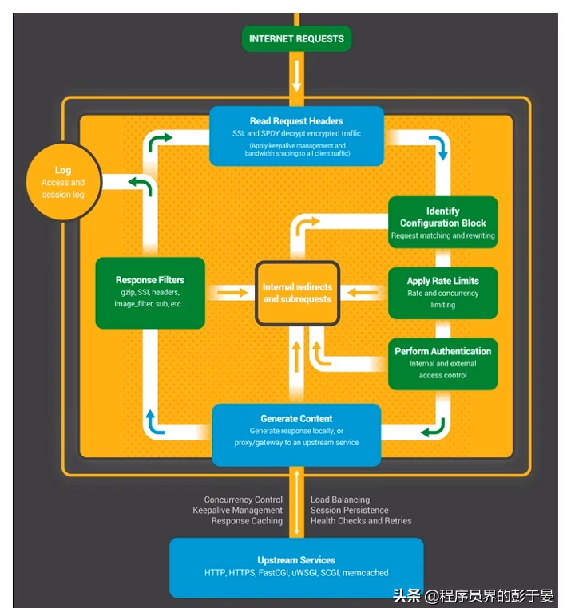
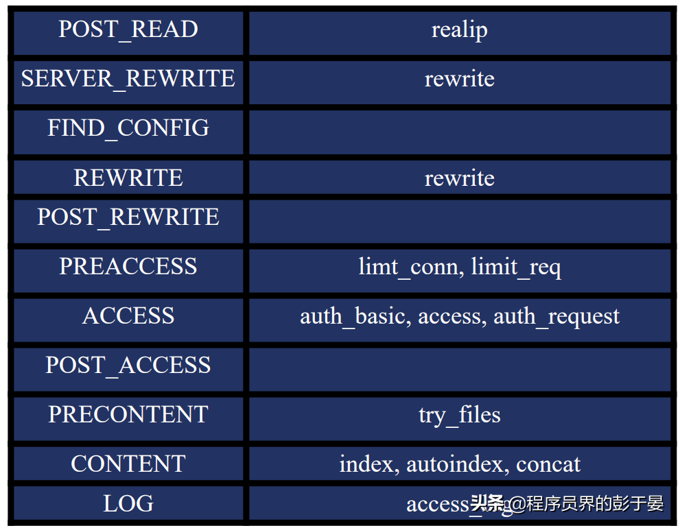
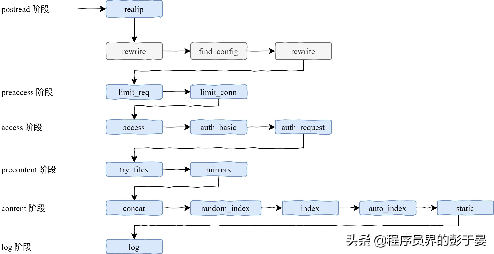
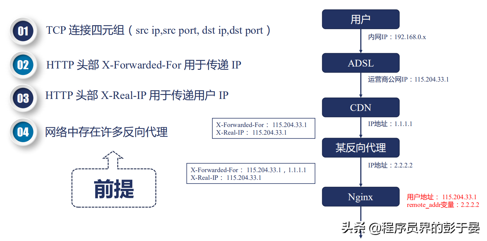

# Nginx 处理一个 HTTP 请求的全过程

原文：https://www.toutiao.com/article/6830790749227844099/?log_from=e0921f11971f78_1658642467275


下面的图，是Nginx处理HTTP请求HTTP请求的示意图，虽然简单，但是很好的说明了整个过程：

* Read Request Headers: 解析请求头
* Identify Configuration Block：识别由哪个一 Location 进行处理，匹配URL
* Apply Rate Limits：判断是否限速。例如，可能这个请求并发的连接数太多超过了限制，或者QPS太高
* Perform Authentication：连接控制，验证请求。例如可能根据Referrer 头部做一些防盗链的设置，或者验证用户的权限
* Generate Content：生成返回给用户的响应。为了生成这个响应，做反向代理的时候可能会和上游服务（Upstream Services）进行通信，然后这个过程中还肯能会有些子请求或者重定向，那么还会走一下这个过程（Internal redirects and subrequests）
* Response Filters：过滤返回给用户的响应。比如压缩响应，或者对图片进行处理
* Log：记录日志




以上这七步从整体上介绍了一下处理流程，下面还会再说一下实际的处理过程。


## Nignx 处理HTTP请求的11个阶段

下面介绍一下详细的11个阶段。每个阶段都可能对应着一个甚至多个HTTP模块，通过这样一个模块对比，也能很好的理解这些模块具体怎么样发挥作用的。



1. POST_READ：在 read 完成请求的头部之后，在没有对头部做任何处理之前，想要获取到一些原始的值，就应该在这个阶段进行处理。这里会涉及到一个realip 模块

2. SERVER_REWRITE：和下面的 REWRITE 阶段一样，都只有一个模块叫 rewrite 模块，一般没有第三方模块会处理这个阶段

3. FIND_CONFIG：做 location 的匹配，暂时没有模块会用到

4. REWRITE：对URL做一些处理

5. POST_REWRITE：处于REWRITE之后，也是暂时没有模块会在这个阶段出现

   

   接下来是确认用户访问权限的三个模块：

6. PREACCESS：是在ACCESS 之前要做一些工作，例如并发连接和QPS需要进行限制，涉及到两个模块：limit_conn 和 limit_req

7. ACCESS：核心要解决的是用户能不能访问的问题，例如 auth_basic是用户名和密码，access是用户访问IP，auth_request 根据第三方服务返回是否可以去访问

8. POST_ACCESS：是在 ACCESS 之后会做一些事情，同样暂时没有模块会用到

   

   最后的三个阶段处理响应和日志：

9. PRECONTENT：在处理 CONTENT 之前会做一些事情，例如会把子请求发送给第三方的服务处理，try_files 模块也是在这个阶段中

10. CONTENT：这个阶段涉及到的模块就非常多了，例如 index，autoindex，concat 等都是这个阶段生效的

11. LOG：记录日志 access_log 模块

以上的这些阶段都是严格按照顺序进行处理的。当然，每个阶段中各个HTTP 模块的处理顺序也很重要，如果某个模块不把请求向下传递，后面的模块是接收不到请求的。而且每个阶段中的模块也不一定所有都要执行一遍，下面就接着讲一下各个阶段模块之间的请求顺序。


### 11 个阶段的顺序处理

如下图所示，每一个模块处理之间是有序的，那么这个顺序怎么才能得到呢？其实非常简单，在源码 ngx_module.c 中，有一个数组 ngx_module_name，其中包含了在编译 Nginx 的时候的 with 指令所包含的所有模块，它们之间的恶顺序非常关键，在数组中顺序是相反的：

``` c
char *ngx_module_names[] = {
        "ngx_http_static_module",    "ngx_http_autoindex_module",       "ngx_http_index_module",    "ngx_http_random_index_module",    "ngx_http_mirror_module",    "ngx_http_try_files_module",    "ngx_http_auth_request_module",    "ngx_http_auth_basic_module",    "ngx_http_access_module",    "ngx_http_limit_conn_module",    "ngx_http_limit_req_module",    "ngx_http_realip_module",    "ngx_http_referer_module",    "ngx_http_rewrite_module",    "ngx_http_concat_module", 
}
```

灰色部分的模块是 Nginx 的框架部分去执行处理的，第三方模块没有机会在这里得到处理。

在依次向下执行的过程中，也可能不按照这样的顺序。例如，在 access 阶段中，有一个指令叫做 satisfy，它可以指示当有一个满足的时候就直接跳到下一个阶段进行处理，例如当 access 满足了，就直接跳到 try_files 模块进行处理，而不会再执行aut_basic、auth_request 模块。

在 content 阶段中，当 index 模块执行了，就不会再执行 auto_index 模块，而是直接跳到 log 模块。

整个 11 个阶段所涉及到的模块和先后顺序如下图所示：



下面开始详细讲解各个阶段，先来看下第一个阶段 postread 阶段，顾名思义，postread 阶段是在正式处理请求之前起作用的。


#### postread 阶段

postread 阶段，是 11 个阶段的第一个阶段，这个阶段刚刚获取到了请求的头部，还没有进行任何处理，可以拿到一些原始的信息。例如：拿到用户的真实IP地址。

##### 问题：如何拿到用户的真实 IP 地址？



TCP 连接是由一个四元组构成的，在四元组中，包含了源 IP 地址。而在真实的互联网中，存在非常多的正向代理和反向代理。例如，最终的用户有自己的内网 IP 地址，运营商会分配一个公网 IP，然后访问某个网站的时候，这个网站可能使用了 CDN 加速一些静态文件或者图片，如果 CDN 没有命中，那么就会回源，回源的时候可能要经过一个反向代理，例如阿里云的 SLB，然后才会到达 Nginx。

要拿到这个地址应该是运营商给用户分配的公网 IP 地址 115.204.33.1，对这个 IP 来进行并发连接的控制或者限速，而 Nginx 拿到的却是 2.2.2.2，那么怎么才能拿到真实的用户 IP 呢？

HTTP 协议中，有两个头部可以用来获取用户 IP：

* X-Forwaredex-For ：用来传递 IP，这个头部会把经过的节点 IP 都记录下
* X-Real-IP：可以记录用户真实的 IP 地址，只能有一个

##### 拿到真实用户 IP 后如何使用？

针对这个问题，Nginx 是基于变量来使用。

例如，binary_remote_addr、remote_addr 这样的变量，其值就是真实的 IP，这样做连接限制也就是 limit_conn 模块才有意义，这也说明了， limit_conn 模块只能在 preaccess 阶段，而不能在 postread 阶段生效。

###### realip 模块

* 默认不会编译进 Nginx ，需要通过 --with-http_realip_module 启用功能

* 变量：如果还想要使用原来的 TCP 连接中的地址和端口，需要通过这两个变量保存 realip_remote_addr，realip_remote_port

* 功能修改客户端地址

* 指令 set_real_ip_from 指定可信的地址，只有从该地址建立的连接，获取的 realip 才是可信的。real_ip_header 指定从哪个头部获取真实的 IP 地址，默认从 X-Read-IP 中获取，如果设置从 X-Forwarded-For 中取，会先从最后一个 IP 开始取 real_ip_recursive 环回地址，默认关闭，打开的时候，如果 X-Forwarded-For 最后一个地址与客户端地址相同，会过滤掉该地址

  ```` shell
  Syntax: set_real_ip_from address | CIDR | unix:;Default: —Context: http, server, locationSyntax: real_ip_header field | X-Real-IP | X-Forwarded-For | proxy_protocol;Default: real_ip_header X-Real-IP; Context: http, server, locationSyntax: real_ip_recursive on | off;Default: real_ip_recursive off; Context: http, server, location
  ````

##### 实战

上面关于 real_ip_recursive 指令可能不太容易理解，来实战练习一下。先来看看 real_ip_recursive 默认关闭的情况：

* 重新编译一个带有 realip 模块的 nginx：

  ``` shell
  # 下载 nginx 源码，在源码目录下执行./configure --prefix=自己指定的目录 --with-http_realip_modulemakemake install
  ```

* 然后去上一步中自己指定的 Nginx 安装目录：

  ``` shell
  #屏蔽默认的 nginx.conf 文件的 server 块内容，并添加一行include /Users/mtdp/myproject/nginx/test_nginx/conf/example/*.conf;
  ```

  ``` json
  # 在 example 目录下建立 realip.conf，set_real_ip_from 可以设置为自己的本机 
  IPserver {    
     listen 80;    
     server_name ziyang.realip.com;    
     error_log /Users/mtdp/myproject/nginx/nginx/logs/myerror.log debug;    
     set_real_ip_from 192.168.0.108;  
      #real_ip_header X-Real-IP;  
     real_ip_recursive off;           
      # real_ip_recursive on;   
     real_ip_header X-Forwarded-For;    
     location / {        
         return 200 "Client real ip: $remote_addr\n";    
     }
  }
  
  ```

  在上面的配置文件中，设置了可信代理地址为本机地址， real_ip_recursive 为哦人的 off，real_ip_header 设为从 X-Forwarded-For 中取。

* 重载配置文件

  ``` shell
  ./sbin/nginx -s reload
  ```

* 测试响应结果

  ``` shell
  test_nginx curl -H 'X-Forwarded-For: 1.1.1.1,192.168.0.108' ziyang.realip.comClient real ip: 192.168.0.108
  ```

  然后再来测试 real_ip_recursive 打开的情况：

  * 配置文件中打开 real_ip_recursive

  ``` json
  server {    
      listen 80;    
      server_name ziyang.realip.com;    
      error_log /Users/mtdp/myproject/nginx/nginx/logs/myerror.log debug;    
      set_real_ip_from 192.168.0.108;    
      #real_ip_header X-Real-IP;    
      #real_ip_recursive off;   
      real_ip_recursive on;    
      real_ip_header X-Forwarded-For;   
      location / {        
          return 200 "Client real ip: $remote_addr\n";    
      }
  }
  ```

  * 测试响应结果

    ``` shell
    test_nginx curl -H 'X-Forwarded-For: 1.1.1.1,2.2.2.2,192.168.0.108' ziyang.realip.comClient real ip: 2.2.2.2
    ```

从上面的测试可以看出，如果使用 X-Forwarded-For 获取 realip 的话，需要打开 real_ip_recursive，并且 realip 依赖于 set_real_ip_from 设置的可信地址。

可能有人会问，直接用 X-Real-IP 来获取真实的 IP 地址不就可以了？这是可以的，但是 X-Real-IP 是 Nginx 独有的，不是 RFC 规范的。如果客户端与服务器之间还有其他非 Nginx 软件实现的代理，就会造成取不到 X-Real-IP 头部，所以这个要根据实际情况来定。

##### rewrite 阶段和 rewrite 模块

下面看一下 rewrite 模块。

首先，rewrite 阶段分为两个，一个是 server_rewrite 阶段，一个是 rewrite。这两个阶段都涉及到一个 rewrite 模块。而在 rewrite 模块中，有一个 return 指令，遇到该指令就不会再向下执行，直接返回响应。


##### return 指令

return 指令的语法如下：

* 返回状态码，然后跟上 body
* 返回状态码，然后跟上 URL
* 直接返回 URL

``` shell
Syntax: return code [text];        
return code URL;        
return URL;Default: —Context: server, location, if
```

返回状态码包括一下几种：

* Nginx 自定义 444：立刻关闭连接，用户收不到响应
* HTTP 1.0 标准301：永久重定向302；临时重定向，禁止被缓存
* HTTP 1.1 标准303：临时重定向，允许改变方法，禁止被缓存；307：临时重定向，不允许改变方法，禁止被缓存； 309：永久重定向，不允许改变方法

##### return 指令与 error_page

error_page的作用大家经常见到。当访问一个网站出现404的时候，一般不会直接出现一个 404 NOT FOUND，而是会有一个比较友好的界面，这就是 error_page 的功能。

``` shell
Syntax: error_page code ... [=[response]] uri;Default: —Context: http, server, location, if in location
```

看几个例子：

``` shell
1. error_page 404 /404.html; 
2. error_page 500 502 503 504 /50x.html;
3. error_page 404 =200 /empty.gif; 
4. error_page 404 = /404.php; 
5. location / {        
        error_page 404 = @fallback;    
   }    
   location @fallback {        
        proxy_pass http://backend;    
   } 
6. error_page 403 http://example.com/forbidden.html; 
7. error_page 404 =301 http://example.com/notfound.html;
```

那么现在就会有两个问题，看看下面的配置文件：

``` json
server {    
    server_name ziyang.return.com;    
    listen 80;    
    root html/;    
    error_page 404 /403.html;    
    #return 405;    
    location / {        
        #return 404 "find nothing!";    
    }
}
```

1. 当 server 下包含 error_page 且 location 下有 return 指令的时候，会执行哪个一呢？
2. return 指令同时出现在 server 模块下和同时出现在 location 模块下，它有合并关系吗？

这两个问题通过实战验证一下。

##### 实战

* 将上面的配置添加到配置文件 return.conf

* 在本机的 hosts 文件中绑定 ziyang.return.com 为本地 IP 地址

* 访问一个不存在的页面

  ``` shell
  test_nginx curl  ziyang.return.com/text<html><head><title>403 Forbidden</title></head><body><center><h1>403 Forbidden</h1></center><hr><center>nginx/1.17.8</center></body></html>
  ```

  这个时候看到，是 error_page 生效了，返回的响应是 403.

  假如打开了 location 下的 return 指令的注释呢？

* 打开 return 指令注释，reload 配置文件

* 重新访问页面

  ``` shelll
  test_nginx curl  ziyang.return.com/textfind nothing!%    
  ```

  这个时候， return 指令得到了执行。也就是第一个问题，当 server 下包含 error_page 且 location 下有 return 指令的时候，会执行 return 指令

  下面再看一下 server 下的 return 指令和 location 下的return 指令会执行哪一个。

* 打开 server 下的 return指令注释，relaod 配置文件

* 重新访问页面

  ``` shell
  test_nginx curl  ziyang.return.com/text<html><head><title>405 Not Allowed</title></head><body><center><h1>405 Not Allowed</h1></center><hr><center>nginx/1.17.8</center></body></html>
  ```

  针对上面两个问题也就有了答案：

  1. 当 server下包含 error_page 且 location 下有 return 指令的时候，会执行哪个？会执行 location 下的 return指令
  2. return 指令同时出现在 server 块下和同时出现在 location 块下，它们有合并关系吗？没有合并关系，先遇到哪个 return 指令就先执行哪一个

#### rewrite 指令

