# 图解 TCP 的通信机制

原文：https://www.toutiao.com/a7005080884617445900/

​        **TCP**（*Transmission Control Protocol*）是传输控制协议，其作用于传输层，是一种提供了面向连接通信服务的协议。

​        看TCP的英文全称就知道，其主要作用就是**传输** 、**控制**，传输的是数据，控制的是在传输过程中丢包后的重发 、分包乱序后的有序重组 、控制数据传输的速率防止网络拥塞等。这也是TCP是一种**可靠的传输协议**的原因。本文就将对TCP的作用过程以及一些机制进行讲解。

## TCP的通讯机制

* 一、TCP连接管理
* 二、分段数据发送
* 三、重发控制
* 四、滑动窗口控制
* 五、滑动窗口的重发控制
* 六、流控制
* 七、拥塞控制

## 一、TCP连接管理

​        TCP 是面向连接进行通信服务的协议，所谓连接，其实就是在两台需要数据交互的主机之间建立一条虚拟的线路，所有的数据交互都是通过这条线路进行的，而 TCP 就负责这整个线路的创建、销毁、维护管理等工作。

​        在建立连接之前，需要做一些准备，为了确保通信两段是否可以进行正常通信，发送端会通过 TCP 的首部发送一个 **SYN** 包，作为建立连接的请求并等待接收端确认应答。如果接收端确认应答并返回一个 **ACK** 包，则表示接收端同意与发送端进行通信，然后发送端再次发送一个 **ACK** 包给接收端，表示已收到你的同意通信的消息了，此后两端就可以正常通信了；若接收端没有返回给发送端一个确认应答的 **ACK** 包，则表示不同意与发送端进行通信，那么两端自然无法进行后续的通信了。

​        两端若在通信完成以后肯定需要断开通信，同样也需要两端互发包来确认是否要断开通信。比如，发送端先发来一个 **FIN** 包给接收端，告知要断开连接，然后接收端可以返回给发送端一个 **ACK** 包表示同意断开连接的请求，紧接着接收端也向发送端发送一个 **FIN** 包，表示其也想断开连接的意愿，发送端在接收到该包后**随即**返回给接收端一个 **ACK** 包表示也同意断开连接。这样，两端就断开连接了。

​        总结一下，一次完整的 TCP 连接的建立与断开至少需要来回发送 7 个包，其中建立连接需要发送 3 个包，断开则需要4 个包。下面是一个完整的通信过程的简图：

​     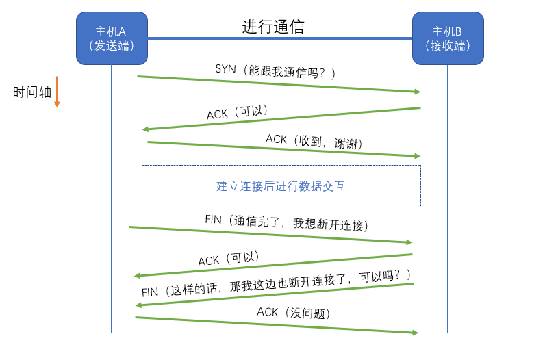

​        这就是常常提到的 **三次握手，四次挥手** 的过程。

## 二、分段数据发送

​        TCP 不是拿到一整个包就直接原封不动地传给接收端的，因为如果这样做的话，即使是发生了数据丢失，也不知道到底丢失了哪部分的数据，因此，其采用的就是将数据分段发送的方式。

​        这里先说明一点，不光建立和断开连接时接收端要向发送端发送请求应答，在数据交互时也需要的。

​        例如，有一个数据包，可以将其按顺序给每一个字节都标上一个序号，然后假设每次发送1000个序号区间的数据给接收端，所以第一次发送的是 序号 $[1, 1000]$  的数据，接收端接收到了以后，会返回发送端一个请求应答，告知发送端**下一次**请求发送序号 $[1001, 2000]$ 的数据过来。过程如下图所示：

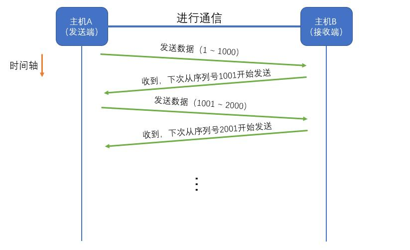

​        上面假设的是每次发送 1000 个***区间的单位，而实际过程中，却不一定是这个数值。

​        在前面的学习过程中，得知数据在数据链路层中传输会收到 **MTU**（最大传输单元）的影响，若数据大于该值，IP 则会被分片处理，因此尽可能地不让这种事情发生，就要让传输的每段数据大小小于等于（Jaly 加的 等于）该通信线路上最小的 MTU，该值称为 **MSS**（最大消息长度）。

​        **该值（MSS）是会在建立连接的三次握手时被计算获得的**。比如发送端在请求接收端的时候，在发送的包上附带上七线路上的MTU大小为4000，然后接收端在发送确认应答给发送端时，也会在包上附带上其线路上的MTU大小为为1460，此时发送端接收到确认应答后比较两个MTU的大小，取其中小的那个值作为之后数据传输每段的数据大小。如图所示：

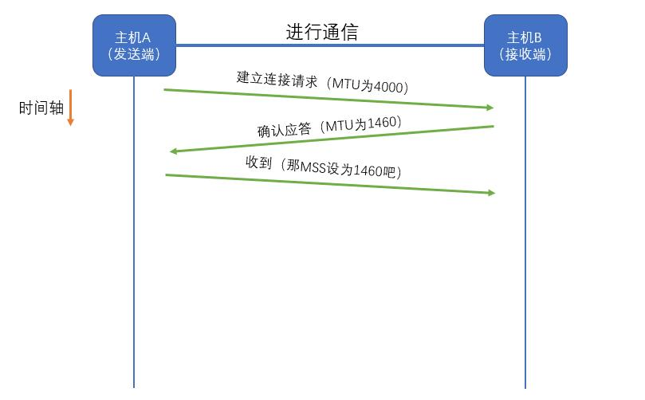

## 三、重发控制

​        通常，在数据传输过程中可能会因为各种原因出现丢包现象。所谓丢包现象，就是发送端在发完数据后等待一段时间，并未收到接收端的确认应答，则视为丢包。于是就会进行重发。

​        启宗丢包现象又分为两种：

1. 发送端向接收端发送数据的过程中，发生了丢包现象，接收端并未接收到数据，因此不会给发送端发送确认应答
2. 接收端收到了发送端发来的数据，并且也向发送端返回了确认应答，但是确认应答的包却在发送的途中出现了丢包，所以发送端接收不到确认应答

​        以上两种情况如下图所示：

* 第一种情况

  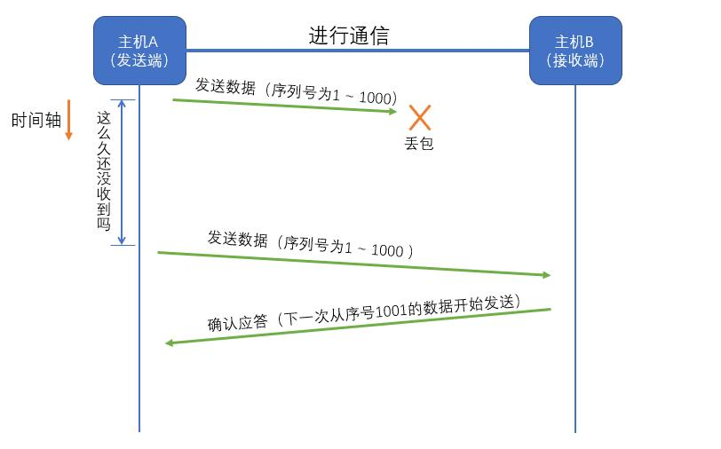

* 第二种情况

  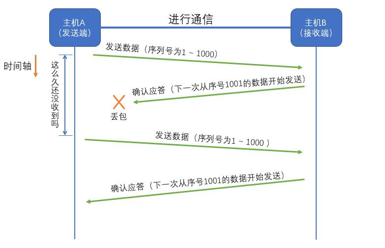

  ​     

  ​        那么发送端发送完数据后，多久没有收到确认应答才判定数据丢包了呢？这个都是随着网络环境的变化而变化的。TCP 会在每次发包时计算往返时间以及偏差来决定等待的时间。

  ​        若重发后又出现了丢包，则下一次等待的时间会以2倍、4倍的**指数函数**延长，但其又不会无限进行重发。当重发次数达到一定程度后，会判定为网络异常，两端通信就会被强制关闭。

## 四、滑动窗口控制

​        上面介绍了 TCP 将数据分段发送，虽然提高了传输的可靠性，但是存在一个致命的缺点，那就是效率非常低下，因为每次发送一段都要等待接收端的确认应答，若整个数据的分段较多，那么通信的性能可能就会很低了，因此 TCP 引入了**窗口**这个概念。

​        所谓窗口，就是无需等待确认应答而可以连续发送的连续多端数据的区域。如图所示：

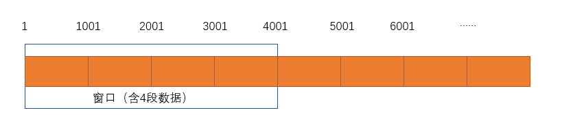

​        假设每段数据长度为 1000，这里的窗口大小为 4 段，因此发送端可以将这 4 段数据都发送出去并且不需要发送一段数据以后等待一个确认应答，如图：

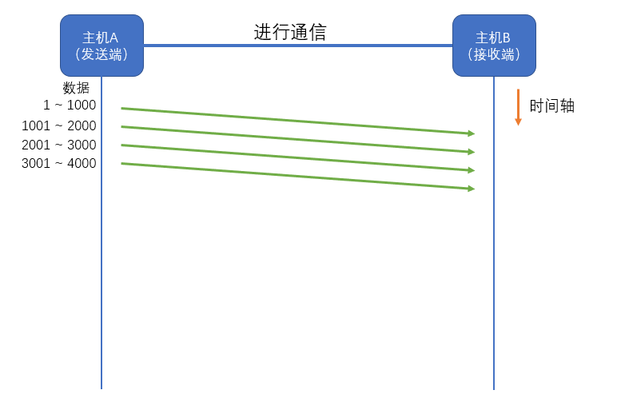

​        接收端在返回相应的确认应答给发送端时，发送端会根据收到的确认应答，继续发送比确认应答中 *** 大4000 的数据，如下图所示：

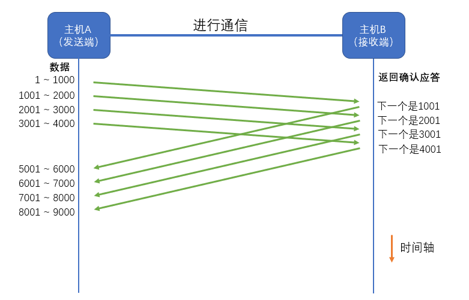

## 五、滑动窗口的重发控制

​        若使用了滑动窗口控制这一技术后，即使某段数据出现了丢包现象，也不会造成太大的影响，因为接收端会一边接收发送端传过来的数据，一边用某种方式告知发送端刚才丢失了哪段数据。过程如下图所示：

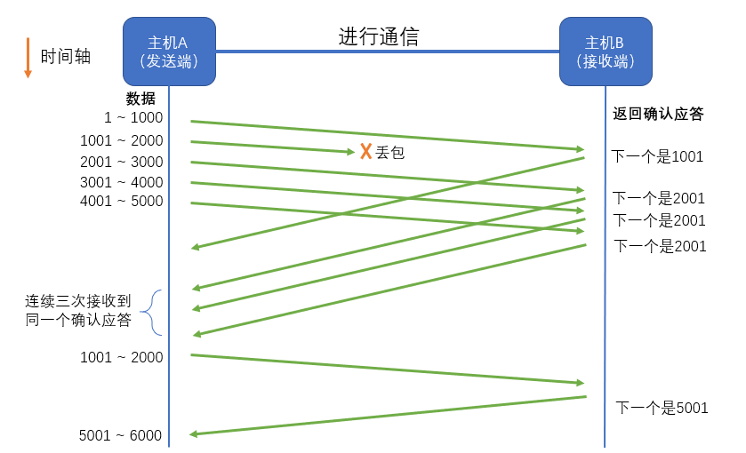

​        图中，在发送第二段（1001 ～ 2000）时发送了丢包，因此接收端没有接收到对应的包，所以当发送端传过来第三段数据的时候，接收端返回的仍是第二段的确认应答，紧接着发送端分别发送了第四段、第五段数据，可接收端都返回的都是第二段的确认应答。

​        就这样连着三次发送了同一个确认应答给发送端，所以发送端得知刚才传输数据的过程中第二段数据发送了丢包，因此此时会将丢失的数据重发一份。

​        然后接收端在接收到之前丢掉的那段数据之后，因为之前的数据都成功接收了，所以下一次就开始请求 5001～6000 这段数据了。

## 六、流控制

​        有时，发送端发送给接收端的数据超过了接收端的最大承载能力，因此会造成数据无法接收的情况，从而导致之后会进行数据重发，这非常的浪费性能。

​        为了防止上述情况发生，TCP 提供了一种机制，可以使发送端每次发送的数据尽可能的在接收端的承载能力之内。而其实现的方式就是接收端向发送端告知自己能够接收的数据大小，因此发送端每次发送的数据就都不会超过该值。这个**值称为窗口大小**。

​        一旦接收端暂时无法接收任何数据，它会告诉发送端，因此发送端会暂停数据的发送，但是为了后续数据的正常发送，发送端会不时地向接收端发送一个窗口探测，试探性地看一下接收端是否能够继续接收数据了。

​        整个过程如下图所示：

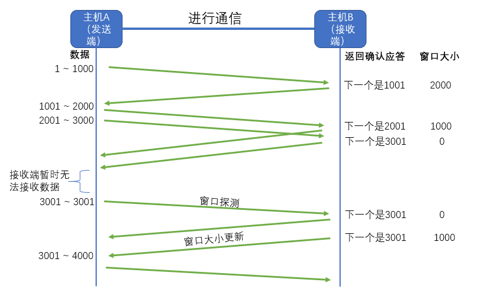

## 七、拥塞控制

​        采用了窗口机制，数据是连续发送多段数据包，因此，如果遇到网络拥堵的情况，同时发送端又发送了大量的数据包，可能会导致网络瘫痪。

​        TCP 运用了一种叫做“**慢启动**”技巧缓解这种情况。什么是慢启动呢？就是不要在一开始就瞬间发送大量数据包，而是先发送一部分，然后根据发送情况在发送更多的数据包。这个过程如下图所示：

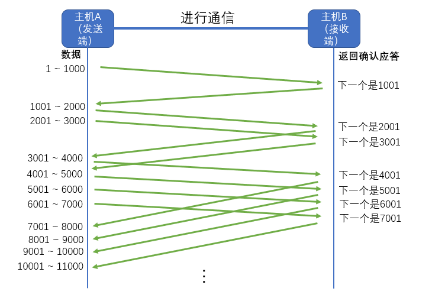

​        如上图所示，发送端的窗口大小为 1000，因此只发送了一段长度为 1000 字节的数据包，此时接收端收到数据并返回一个确认应答，因此发送端将窗口大小翻倍，即窗口大小为2000；发送端又发送了两段长度为 1000 的数据包，接收端收到数据并返回两个确认应答，因此发送端将窗口大小再次翻倍，变为 4000；以此类推……

**总结**

​        发送端每次发送的数据包会以1，2，4的指数型增长，但窗口大小也不会无限指数型增大，而是会在达到某个值时进行一些调整，该值称为**慢启动阈值**。