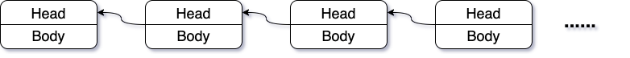
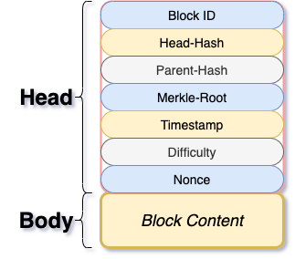
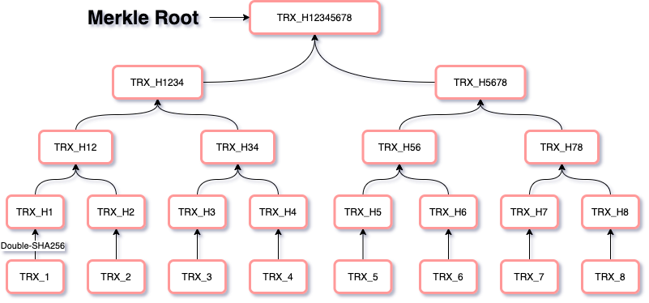

# 区块链

一个不错的参考资料：https://zhuanlan.zhihu.com/p/23243289

妈咪叔视频：https://www.ixigua.com/6759090792804909579

## 区块链定义

​        从字面来解释，就是一个个数据块，以链式结构组成的一个数据库。整个链的内容形成完整的内容，每个小块（Block）的内容，是组成完成内容的一小部分。抽象成图形，大致如下的形式：

​        

​        在“比特币”应用中，每个小块（Block）Body里记录的内容，就是比特币交易的信息。

## 区块的数据结构

​        Block的结构简单的可以由下图表示：



### Head

​        Block的Head很重要，下面详细介绍Head的每项内容。

#### Block ID

​        有一个专门的名称，叫做”**区块高度**“，是每个区块的唯一ID。从 *0* 开始的“创世块”（即高度为0）。经过一段时间会生成一块，块的高度增 *1* 

#### Head-Hash

​        每个区块（Block）都有一个唯一的哈希值。

​        这个哈希值是通过如下的公式产生：

```powershell
Head_Hash = SHA256 ( SHA256 ( Parent_Hash + Body_Hash + Nonce_Hash ) )
```

​        这个公式中的每个hash值（*Parent_Hash、Body_Hash、Nonce_Hash*），也都是经过双层SHA-256后的结果。

#### Parent-Hash

​        放置上一个区块的Head-Hash串。“区块链”就是通过这个 ***Parent-Hash***  “**链**”起来的。

#### Merkle-Root

​        名称上，就是“二进制哈希树根”。这里存放的也是一个双层SHA-256后的哈希值。这个哈希值的由来，大致可以这样理解：

​        假设当前区块存放了8条交易记录：[TRX_1，TRX_2，TRX_3，TRX_4，TRX_5，TRX_6，TRX_7，TRX_8]，那么分别给每一笔交易做一次双层的SHA-256 。假设，某个交易双SHA-256后的结果叫做TRX_H(x)，其中x是交易号，那么：

* 第一步就得到8个Hash值：[TRX_H(1)，TRX_H(2)，TRX_H(3)，TRX_H(4)，TRX_H(5)，TRX_H(6)，TRX_H(7)，TRX_H(8)]

* 第二步，把得到的hash值进行两两组合，再进行双层SHA-256，又分别得到4个：[TRX_H(12)，TRX_H(23)，TRX_H(56)，TRX_H(78)]

* 第三步，再进行两两组合，得到2个：[TRX_H(1234)，TRX_H(5678)]

* 第四步，再两两组合，最后得到一个hash [TRX_H(12345678)]。 这个唯一的Hash串就是Merkle Root

  这个过程，就像建立一棵树一样：




#### Timestamp

​        这个好理解，就是创建当前Block时的服务器的时间戳信息

#### Difficulty

#### Nonce

​        一个随机数，是 ***Number once*** 或者 ***Number used once*** 的缩写。在密码学中Nonce是一个只被使用一次的任意或非重复的随机数值。

​        在密码学中Nonce是一个只被使用一次的任意或非重复的随机数值，在加密技术中的初始向量和加密散列函数都发挥着重要作用，在各类验证协议的通信应用中确保验证信息不被重复使用以对抗重放攻击(Replay Attack)。在[信息安全](https://baike.baidu.com/item/信息安全/339810)中，**Nonce**是一个在加密通信只能使用一次的数字。在认证协议中，它往往是一个[随机](https://baike.baidu.com/item/随机)或[伪随机](https://baike.baidu.com/item/伪随机)数，以避免[重放攻击](https://baike.baidu.com/item/重放攻击/2229240)。Nonce也用于[流密码](https://baike.baidu.com/item/流密码/1395110)以确保安全。如果需要使用相同的密钥加密一个以上的消息，就需要Nonce来确保不同的消息与该密钥加密的密钥流不同。

## 区块链分叉

最长有效链原则

51%算力攻击

## 比特币的总量计算