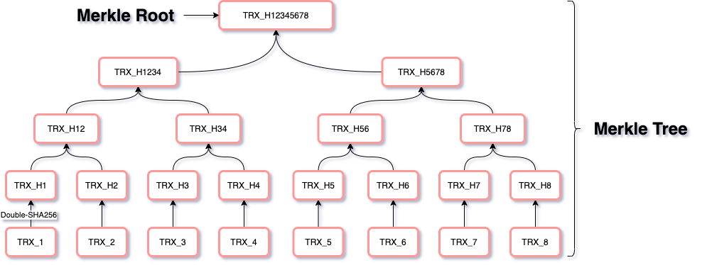

# 区块链

一个不错的参考资料：https://zhuanlan.zhihu.com/p/23243289

妈咪叔视频：https://www.ixigua.com/6759090792804909579

## 区块链定义

​        从字面来解释，就是一个个数据块，以链式结构组成的一个数据库。整个链的内容形成完整的内容，每个小块（Block）的内容，是组成完成内容的一小部分。

在“比特币”应用中，每个小块（Block）记录的内容，就是比特币交易的信息。

## 区块的数据结构

​        Block的结构简单的可以由下图表示：

### Head

​        Block的Head很重要，下面详细介绍Head的每项内容。

#### Block ID

​        有一个专门的名称，叫做”**区块高度**“，是每个区块的唯一ID。从 *0* 开始的“创世块”（即高度为0）。经过一段时间会生成一块，块的高度增 *1* 

#### Head-Hash

​        每个区块（Block）都有一个唯一的哈希值。这个哈希值是通过如下的内容产生的：

* Head-Hash = SHA256 ( SHA256 ( ***Parent-Hash** + **Body-Hash** + **Nonce-Hash*** ) )

​        公式里的每个hash值，都是双层SHA-256后的结果

#### Parent-Hash

​        上一个区块的Hash串。这个值，就是“head-hash”的串

#### Merkle-Root

​        名称上，就是“二进制哈希树根”。这里存放的也是一个双层SHA-256后的哈希值。这个哈希值的由来，大致可以这样理解：

​        假设当前区块存放了8条交易记录：[TRX_1，TRX_2，TRX_3，TRX_4，TRX_5，TRX_6，TRX_7，TRX_8]，那么分别给每一笔交易做一次双层的SHA-256 。假设，某个交易双SHA-256后的结果叫做TRX_H(x)，其中x是交易号，那么：

* 第一步就得到8个Hash值：[TRX_H(1)，TRX_H(2)，TRX_H(3)，TRX_H(4)，TRX_H(5)，TRX_H(6)，TRX_H(7)，TRX_H(8)]

* 第二步，把得到的hash值进行两两组合，再进行双层SHA-256，又分别得到4个：[TRX_H(12)，TRX_H(23)，TRX_H(56)，TRX_H(78)]

* 第三步，再进行两两组合，得到2个：[TRX_H(1234)，TRX_H(5678)]

* 第四步，再两两组合，最后得到一个hash [TRX_H(12345678)]。 这个唯一的Hash串就是Merkle Root

  这个过程，就像建立一棵树一样：

#### Timestamp

​        这个好理解，就是创建当前Block时的服务器的时间戳信息

#### Difficulty

## 区块链分叉

最长有效链原则

51%算力攻击

## 比特币的总量计算