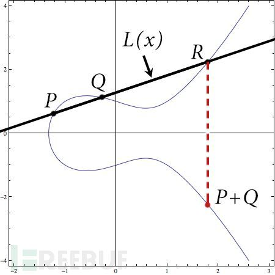

# Secp256k1

原文：https://www.freebuf.com/articles/database/165851.html

​        Secp256k1为基于$$Fp$$有限域上的椭圆曲线，由于其特殊构造的特殊性，其优化后的实现比其他曲线性能上可以提高30％，有明显以下两个优点：

1. 占用很少的带宽和存储资源，密钥的长度很短
2. 让所有的用户都可以使用同样的操作完成域运算

​       

## 椭圆曲线数字签名算法(ECDSA)

* 用户密码对：$$(d , Q)$$
* 待签名的信息： $$M$$
* 签名：$$ Signature(M) = (r, s)$$
* 签名过程：
  * 根据ECC算法随机生成一个密钥对：$$(k,R), R = (xR, yR)$$
  * 令： $$r = xR mod n$$ ，如果$$ r = 0 $$，返回第一步
  * 计算： $$ H= Hash(M)$$
  * 按照数据类型转换规则，将$$H$$转化为一个big endian的整数$$e$$
  * 计算： $$ s = k^{-1}(e +rd) mod n $$， 如果 $$ s = 0 $$， 则返回第一步
  * 得到的 $$S = (r, s) $$ 就是签名
* 验证过程：
  * 计算： $$ H = Hash(M) $$
  * 按照数据类型转换规则，将$$H$$转化为一个big endian的整数$$e$$
  * 计算： $$ u1 = es^{-1} mod n, u2 = rs^{-1} mod n 
  * 计算：$$ R = (xR, yR) = u1G + u2Q $$， 如果$$ R = 零点$$，则验证签名无效
  * 令： $$ v = xR mod n $$
  * 若 $$ v== r $$， 则签名有效； 若 $$ v \neq r $$，则签名无效

### Secp256k1曲线

​        这条椭圆曲线的代数方程形式为：
$$
y^2 = x^3 +ax + b
$$
​        椭圆曲线域参数由单元 $$T= (p, a, b, G, n, h) $$ 指定。 这条曲线的图形大致如下：

其中：

* $$ p = $$ FFFFFFFF FFFFFFFF FFFFFFFF FFFFFFFF FFFFFFFF FFFFFFFF FFFFFFFF FFFFFC2F

  转换为可理解的数：

  $$ p = 2^{256} - 2^{32} - 2^{9} - 2^{8} - 2^{7} - 2^{6} - 2^{4} - 1$$ 

* $$ a, b$$ 分别为：

  $$ a = $$ 00000000 00000000 00000000 00000000 00000000 00000000 00000000 00000000

  $$b = $$ 00000000 00000000 00000000 00000000 00000000 00000000 00000000 00000007

  所以曲线方程变为：
  $$
  y^2 = x^3 + 7
  $$

* 基点$$G$$ ：

  压缩形式：

  $$ G= $$ 02 79BE667E F9DCBBAC 55A06295 CE870B07 029BFCDB 2DCE28D9 59F2815B 16F81798

  未压缩形式：

  $$ G = $$ 04 79BE667E F9DCBBAC 55A06295 CE870B07 029BFCDB 2DCE28D9 59F2815B 16F81798 483ADA77 26A3C465 5DA4FBFC 0E1108A8 FD17B448 A6855419 9C47D08F FB10D4B8

* $$ G$$的阶$$ n $$：

  $$ n = $$ FFFFFFFF FFFFFFFF FFFFFFFF FFFFFFFE BAAEDCE6 AF48A03B BFD25E8C D0364141

* 协因子h：

   $$ h = $$ 01

