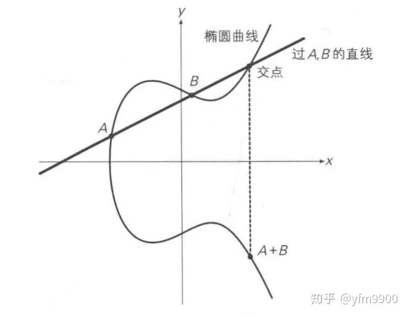
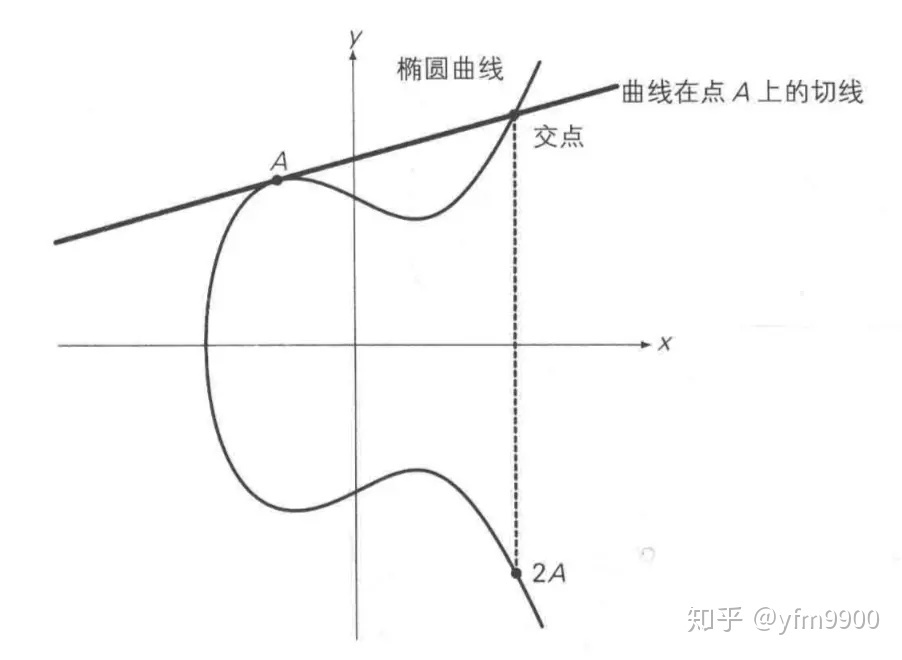

# 比特币中使用的加密算法ECC

原文：https://zhuanlan.zhihu.com/p/101907402

群论： https://baike.baidu.com/item/群论

数学公式：https://blog.csdn.net/mingzhuo_126/article/details/82722455

​                     https://www.cnblogs.com/muyisir/p/11440164.html

​        椭圆曲线加密算法，简称ECC，是基于椭圆曲线数学理论实现的一种非对称加密算法。相比RSA，ECC优势是可以使用更短的密钥，来实现与RSA相当或更高的安全，RSA加密算法也是一种非对称加密算法，在公开密钥加密和电子商业中RSA被广泛使用。据研究，160位ECC加密安全性相当于1024位RSA加密，210位ECC加密安全性相当于2048位RSA加密（有待考证）。

​         比特币Bitcoin使用了 ***secp256k1*** 这条特殊的椭圆曲线：
$$
y^2 = x^3 + 7
$$

## Abel群 

​        Abel群，是***群论***里一个特殊的群。如果想进一步了解“**群论**”，可以找机会聊聊。这里先介绍***Abel群***的概念。可以通过这个简单介绍，对**群**有个简单了解。

​        椭圆曲线也可以有**运算**，像实数的加减乘除一样，这就需要使用到“**加群**”。19世纪的挪威数学家*尼尔斯-阿贝尔*抽象出了加群（又叫做阿贝尔群，或交换群）。数学中的群，是一个集合，可以为它定义“加法”，并用符号“+”表示。

### Abel群的定义

​        Abel群是一个**加法群**，假设用**G**表示，则Abel群必须遵循如下的5个特性：

* **封闭性**：如果有 $$a, b \in G$$,  那么 $$a + b \in G$$
  
* **结合律**：对于任何元素a, b, c，都有$$(a + b) + c = a + (b + c)$$ 成立
  
* **交换律**：对于任意的两个元素$$a, b \in G $$，都有$$a + b = b + a$$ 成立
  
* **单位元**：设存在一个$$ e \in G$$，对于任意的 $$a \in G$$，满足：$$ a + e = e + a = a $$， 则这个$$e$$，就是这个群的单位元
  
* **逆元**：对于任意的元素 $$ a \in G $$，必定存在一个元素 $$ b \in G $$，使得 $$ a + b = e $$ 成立

## 椭圆曲线的加法

​        椭圆曲线上两个点的加法是这样定义的：过曲线上的两点A、B，画一条直线。找到这条直线与椭圆曲线的交点，然后找到这个交点关于X轴对称位置的点C，这个点C就被定义为A + B，即椭圆曲线上两点的加法，记作： A + B = C。这个过程如下图所示：

## 椭圆曲线的二倍运算

​        上面定义的加法针对的是位于椭圆曲线上两个不同的点，对于同一个点（或者2个重合点）的“相加”没有做出定义，即A + A没有定义。

​        这种情况下，将椭圆曲线在A点的切线与椭圆曲线的交点，交点关于X轴对称位置的点，定义为A + A，即2A，二倍运算。如下图所示：

## 同余运算

​        同余就是有相同的余数。两个整数a、b，若它们除以正整数m，所得到的余数相等，则称a、b对于模m同余。数学公式如下：

​        $$ a \equiv b (modm)$$

## 有限域

​        **椭圆曲线是连续的，并不适合用于加密**。所以，必须把椭圆曲线变成离散的点。要把椭圆曲线定义在有限域上。

​        椭圆曲线密码所使用的椭圆曲线是定义在有限域内，有限域最常见的例子是有限域GF(p)，指给定某质数p，由0,1,2 ... p-1共p个元素组成的整数集合中加法、二倍运算。例如：GF(233)就是：$$ y^2 = (x^3 + 7)(mod233)$$

> 注 - 为什么连续的椭圆曲线并不适合加密：
>
> ​        *主要问题在于计算机的精度误差，会导致如果用连续的数（如果有除法运算，会得到小数）。明文经过加密解密后会出现偏差，得不到原来的明文。*
>
> ​        *而有限群，定义域里的数是非连续的，而且根据群的定义，可以保证群运算得到的数一定是在同一个有限群里边。明文经过加密解密后可以得到原明文，没有偏差。*

## 乘法逆元

​        这里使用**模7乘法**来做示例。这个例子的群$$G=[1,2,3,4,5,6]$$，单位元是$$1$$：

* 1的逆元为 1 :  (1 * 1)%7 = 1
* 2的逆元为4 : (2 * 4)%7 = 1
* 3的逆元为5 : (3 * 5)%7 = 1
* 4的逆元为2 : (4 * 2)%7 = 1
* 5的逆元为3 : (5 * 3)%7 = 1
* 6的逆元为6 : (6 * 6)%7 = 1

​        从这个例子，可以看出“逆元”的定义：群$$G$$中任意一个元素$$a$$，都在$$G$$中有唯一的元素$$a'$$，使得 $$aa' = a'a = e$$, 其中$$e$$是群的单位元。

## 数学解释

​        并不是所有的椭圆曲线都适合加密， $$y^2 = X^3 +ax + b$$是一类可以用来加密的椭圆曲线，也是最为简单的一类。

​        针对曲线Ep(a,b)表示为 $$y^2 = X^3 +ax + b(modp), x, y \in [0, p], p$$为质数，该曲线关于$$x$$轴对称。选择两个满足下列条件的小于p(p为素数)的非负整数$$a, b$$，要求满足以下条件：$$3a^3 + 27b^2 \neq 0$$

1. 有限域的负元

   $$P(x,y)$$的负元是 $$(x, -ymodp) = (x, p - y)$$

2. 有限域的加法， $$ P + Q $$

   $$P(x1, y1), Q(x2, y2)$$ 和 $$R(x3,y3)$$ 三点（其中$$R$$是$$PQ$$直线与曲线的交点关于$$X$$轴的对称点，即$$R = P + Q$$）有如下的关系：
   $$
   x3 \equiv k^2 - x1 -x2(modp)
   $$

   $$
   y3 \equiv k(x1 - x3) - y(modp)
   $$

3. 斜率计算 ($$P = Q，即要计算P点切线，需要求导$$)

   若 $$ P = Q,$$ 则 $$ k = (3x2 + a) / 2y1$$

   若 $$ P \neq Q,$$ 则 $$ k = (y2 - y1) / (x2 - x1)$$

​        通过上面的公式，来解这道题：

​                *已知  $$E_{23}(1,1)$$  上两点  $$P(3, 10), Q(9,7)$$  ， 求：*

1. $$-P$$
2. $$ P + Q $$
3. $$2P$$

​        解：

1. $$P(3, 10)$$ 的负元是 $$ (3, -10mod23) = (3,23 - 10) = (3, 13)$$

2. $$P \neq Q, k = (7 - 10)/(9 - 3) = -\frac{1}{2} $$,  因为 $$ 2 * 12 \equiv 1(mod23)$$， 所以2的乘法逆元是12，

   $$k \equiv -1 * 2^-1(mod23) \equiv -1 * 12(mod23)$$，故$$k = 11$$

   $$x^3 \equiv k^2 - x1 -x2(mod23) \equiv 11^2 - 3- 9(mod23) = 109(mod23) \equiv 17$$

   $$y^3 \equiv k(x1 - x3) - y1(mod23) \equiv 11[3-(-6)] - 10(mod23) = 89(mod23) \equiv 20$$， 故$$ P + Q$$的坐标为 (17, 20)

3. $$ P = Q, k = [3*(3^2) + 1]/(2 * 10)(mod23) = 7 * 5^-1(mod23)$$ ，因为 $$5 * 14 \equiv 1(mod23)$$，5的乘法逆元为14， 故 k = 6.  $$x3 \equiv k^2 - x1 -x2(modp) = 6^2 -3 -3(mod23) = 30(mod23) \equiv 7, y3 \equiv k(x1-x3) - y1(modp) = 6 * (3 - 7) - 10(mod23) = -34(mod23) \equiv 12$$ ，故$$2P$$的坐标是(7, 12)

## 椭圆曲线加密算法原理

​        设私钥、公钥分别为 $$d、Q$$，即 $$Q = dG$$，其中$$G$$为基点，椭圆曲线上的已知$$G$$和$$dG$$，求d是非常困难的，也就是说，已知公钥和基点，想要算出私钥是非常困难的。

* **公钥加密**：选择随机数$$r$$，将消息$$M$$生成密文$$C$$，该密文是一个点对， $$C = (rG,  M + rQ)$$，其中$$Q$$为公钥
* **私钥加密**：$$M + rQ - d(rG) = M + r(dG) - d(rG) = M$$， 其中$$d，Q$$分别是私钥、公钥

## 椭圆曲线签名算法原理

​        椭圆曲线签名算法(ECDSA)，设私钥、公钥分别是$$d, Q, 即 Q=dG$$，其中$$G$$为基点。

* 私钥签名

  * 选择随机数$$r$$，计算点$$ rG(x,y)$$
  * 根据随机数$$r$$、消息$$M$$的哈希$$h$$、私钥$$d$$，计算 $$s=(h +dx) / r$$
  * 将消息$$M$$、签名$$(rG, s)$$发送给接收方

* 公钥验证签名

  * 接收方收到消息$$M$$、以及签名$$(rG = (x,y), s)$$
  * 根据消息求哈希$$h$$
  * 使用发送方公钥$$Q$$计算：$$hG/s + xQ/s$$ ， 并与$$rG$$比较，如果相等即验签成功

  原理：$$hG/s + xQ/s = hG/s + x(dG)/s = (h+xd)G/s = r(h+xd)G/(h+dx)= rG$$

## 签名过程

​        假设要签名的消息是一个字符串"Hello World"。 DSA签名的第一个步骤是对待签名的消息生成一个消息摘要，不同的签名算法使用不同的消息摘要算法，而ECDSA256使用SHA256生成256比特的摘要。

​        摘要生成结束后，应用签名算法对摘要进行签名：

* 产生一个随机数$$k$$
* 利用随机数$$k$$，计算出两个大数$$r$$和$$s$$。将$$r$$和$$s$$拼在一起就构成了对消息摘要的签名

​        这里需要注意的是，因为随机数$$k$$的存在，对于同一条消息，使用同一个算法，产生的签名是不一样的。从函数的角度来理解，签名函数对同样的输入会产生不同的输出。因为函数内部会将随机数混入签名的过程。

## 验证过程

​        关于验证过程，这里不讨论它的算法细节。从宏观上看，消息的接收方从签名中分离出$$r$$和$$s$$，然后利用公开的密钥信息和$$s$$计算出$$r$$。如果计算出的r和接收到的r值相同，则表示验证成功，否则，表示验证失败。

