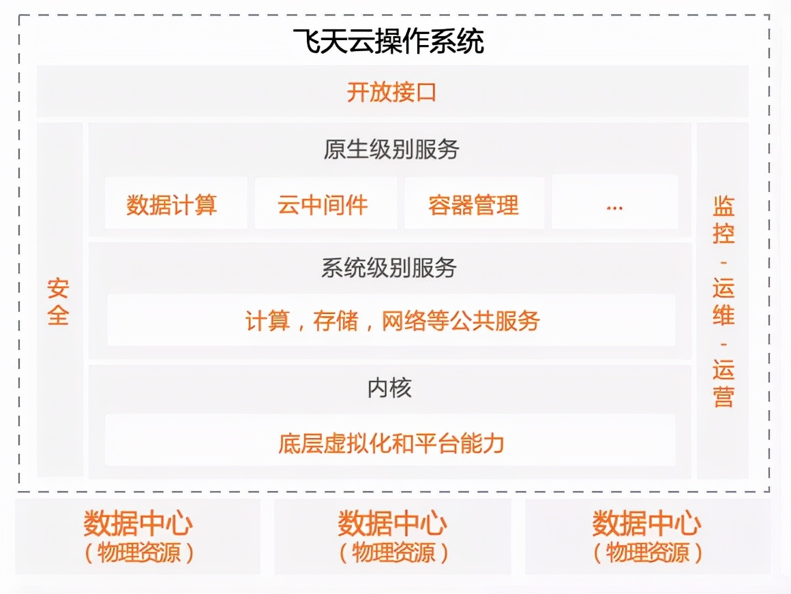
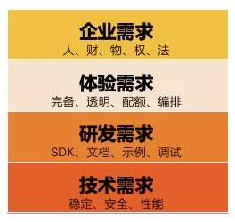
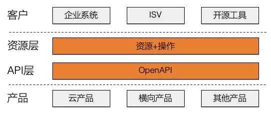

# 深入理解云计算 OpenAPI 体系

原文：https://www.toutiao.com/a7013550030791492100/?log_from=81e4c828909748_1633150768581

## 一. 导读

​        提到 API，从事技术的人都十分熟悉，无论是在操作系统上开发软件，还是打造分布式网络服务，都离不开各种 API 调用。对应用程序开发人员来说，都会通过各种编程语言、系统调用和各类类库、编程框架构建系统，为了提升开发效率和统一性，就出现了各种各样的 API 标准，例如 **POSIX**。这些标准的实现，保障了应用程序可以不做过多修改就能运行在各种软硬件平台上，大大促进了整个 IT 生态的发展。

​        然而就云计算 API 来说，当前并没有类似 POSIX 这样的 API 标准，基本上各大厂商各自为政。当然，有一些业界主流标准，例如 OAS 获得多数云厂商的支持，但云厂商本身的 API 却由于历史原因、技术路线原因，形成了百花齐放的局面。例如，AWS的 OpenAPI 属于 RPC 风格，而 Azure 则是 WebSercie 风格，GCP 则是基于 gRPC 为主流。技术方面的论述很多，现在从客户体验、研发效能的角度来阐述 OpenAPI 对云计算整体竞争力的重要性。

## 二. 云计算 OpenAPI 特点

​        如果将阿里云飞天操作系统与传统操作系统类比，那么它也是由内核层、接口层、操作界面、业务应用组层，计算、存储、网络等核心产品构成了内核，API 层承担内核的管控和数据通信，各式各样的控制界面则相当于操作系统的 Terminal / Windows / masOS UI，基于云计算的各种行业应用则是跑在这个操作系统上的应用。

​        阿里云不同于传统操作系统，OpenAPI 自然也不同于其他业态的 API 体系，例如：淘系、b2b的开放平台。**业务开放平台**输出的是以业务数据为主的服务，目的是为了整合商业生态，而**阿里云开放平台**输出的是云操作系统的管控能力、数据操作能力和其他企业级能力。前者重心是服务商业模型，而后者重心是服务技术底座。因此，云计算的 OpenAPI 体系要以服务技术开发者和企业场景为中心，保障技术体系的健全稳定，对外紧密对接行业技术体系（例如开源工具、三方厂商），对内促进众多云服务协同管理。

​        阿里云的 OpenAPI 有如下特点：

* **数量多**：当前阿里云OpenAPI数量高达1万多个，每天调用量上百亿，分布在近300个产品上
* **增速快**：业务发展快，近年来每年数量的增速接近100%
* **API 类型多**：OpenAPI大体分为**管控、数据**两类。管控类又分为 ***RPC/ROA*** 两种形式，数据类又会分为数据流、文件等具体类型，还有很多业务需要有自己的格式
* **产品协同要求高**：单个OpenAPI是不能满足用户要求的，场景化的用户需求需要多个产品的多个 OpenAPI 组合才能服务，这对 API 编排、产品间 API 协同提出了更高的要求。例如在稳定性方面，一个产品的OpenAPI出问题有可能造成整个管控链路的雪崩
* **企业能力需求强烈**：OpenAPI 主要是用来进行云资源管理或数据传输的，操作对象都是用户资产，除了常规的身份管理、权限管理外，对企业来说还要服务于运维、财务、法务、监管等部门，当涉及众多的云产品时对架构和底层设施的完备性、准确性、及时性要求很高
* **与行业技术趋势结合紧密**：云是全球化的，作为平台它要想服务好各种场景、人群就离不开与各种业界标准和技术体系相结合，云计算与开源行业高度结合证明了我们做的技术不能闭门造车
* **稳定性风险加大**：商业开放平台的OpenAPI如果不稳定影响的可能只是客户侧某个业务功能模块或流程，但是云OpenAPI出问题影响的可能是客户底层技术系统，爆炸半径会更大
* **调用热点集中**：调用量分布基本符合二八原则，20%的云产品承担了80%的调用量，核心产品的体验决定了用户对阿里云的体感，保障客户典型场景的运作至关重要

​        上述特点决定了云上的 OpenAPI 相比于传统开放平台，**要侧重技术能力的建设，同时又要兼顾客户企业级场景**，才能做好体验工作。

### 三. 管理自动化是企业客户的核心诉求

​        云计算客户在 OpenAPI 领域核心体验是什么？以阿里云上某实际案例来分析，具体包括以下几点：

* 客户希望全部的流程都是能够自动化的，从代码提交到服务器部署全部通过自动化工具进行
* 许多客户希望使用混合云体系，云上云下两部分结合，业务系统与云平台紧密集成
* 客户系统中大量使用多种开源软件，如： git / Terraform 等，希望能够整合形成完整的自动化流程

​        总结起来，客户核心诉求就是：客户业务系统要能够与云平台高度自动化地集成。不仅是客户，云厂商经常强调弹性、自愈性等概念，其背后也是高度自动化的架构在支撑。

​        要做到高度自动化地集成，对 OpenAPI 体系是全方位的要求。对比一下 POSIX，一套标准的、完备的、质量良好的 API 能够促进各操作系统之间的兼容性，确保上层应用的开发移植成本最低。而对于云计算，这样的规范应该在哪几个方面来满足客户的需求呢？从实践中总结如下：

* **风格一致性**：POSIX API 的风格基本是一致的。例如：文件处理 API，其核心错误码都是一致的。一致的风格、术语、错误、操作模式，可以让应用程序开发着降低理解成本，提高效率

  而如果不同产品 API 设计风格不一致，用户理解成本很高，使用不便，就会对云平台专业性产生质疑。例如：当前阿里云的 OpenAPI 就存在专业术语在不同产品中描述不一样，同样的资源信息，各个产品属性和数据不一致，分页 API 的形式不一致，甚至大小写命名也不一样的问题

* **功能完整性**：功能完整其实不难理解，但是如何定义功能完整性一直有争议，一个云产品是开放10个API就够了，还是开放100个才够？有点见仁见智，况且产品也是在一直演进的。

  POSIX 文件处理涵盖了一套标准的文件处理API，包括create/close/dup/dup2/fcntl/flock/fsync/lseek/mkstemp/open/read/sync/write等 API，所有关于文件操作可能的API都存在了，这样用户才能精细控制文件。所以对于云上资源，由于客户需要对其进行全生命周期自动化管理，那么客户视角的所有管理动作都应该被开放。**在实践中一般用实体关系模型去设计一组相互配合的API，不可随意零散处理**

* **服务有效性**：实践中最大的问题是不同团队对于 **API SLA** 的标准不一样。例如在可用性上有些产品要求99.99%，有些产品觉得99%也能接受。极端的例子，如果某些OpenAPI 只能允许一个并发，这样的 OpenAPI 对用户来说是没有服务质量可言的，自动化也会因为各种异常被终止。同时，如果必须某些限制，例如限流，ToB场景下是要告知客户的，否则客户端将不知道如何去优化自己的调用频率

* **配套体系健全性**：客户体验是客户从知晓到使用产品的心理感受的全过程。Linux/Mac上的开发体验很优秀是因为配套的工具链很成熟，具备完整的体系。云上客户基于OpenAPI 开发时也应该能够获取专业的、详细的工具支持和技术支持，就像visual studio要有MSDN，java开发要能够有IDE，任何语言都需要debug工具一样。像SDK、文档、调试工具是必备产品，同时诸如代码示例、API调用可视化等功能也是非常有价值的

​        除此之外，云计算内部系统也需要通过 API 实现高度自动化。一些典型的场景，例如：专有云部署、新 region 扩展、单产品扩容，如果不能够自动化部署，对公司整体人效是不利的，更重要的是实施时间会拉长，客户体验也会变差。

​        要解决上述问题，主要难点在于如何统一标准、如何建立全面的配套平台体系、如何衡量服务质量、如何持续推动服务达标以及如何考察客户体验。

## 四. 云计算需要面向资源编程

​        Linux/Unix 世界中，有一个著名的说法：万物皆可文件化。那么云上的万物能否资源化呢？

​        阿里云对外的 OpenAPI 都是基于 HTTP协议的， RESTful 规范有提出基于资源设计的理念。而实际工作中，能坚持这样的原则的 API 确实不多。经常会碰到的疑问是：“什么样的东西应该定义为资源？”、“我的 API 没有资源化设计不也工作的挺好？”、“我设计的时候有资源概念，但是客户没有这个需求” 等等……

​        然而，客户的困惑确实真实存在的：

* 想自建一个资源管理系统，阿里云上怎么能知道我拥有的所有资源列表？

* 如果通过 OpenAPI 获取，怎么能知道这个 API 对应的是什么资源，资源能做什么操作，资源与资源之间有什么关系？

* 不同的产品在同一个资源类型情况下，怎么返回的属性不一样？

* 想查询不同产品若干资源的组合状态，目前一个一个写代码太麻烦了，有啥好办法？

* 自己去梳理那么多 API 对应的资源类型工作量太大了，能不能说说阿里云自己是怎么做的呢？

  

​        面对客户的需求，需要回答一下几个问题：

* 什么是资源？哪些资源应该被管理？无需管理的服务是否也要被定义为资源？
* 阿里云到底有哪些资源类型？统一的列表在哪里？能不能通过 OpenAPI 自动获取？
* 这些资源类型的属性是怎样的？能做什么操作？对应的 API 是什么？ 资源有哪些状态？资源与资源之间的关系如何？能否保证资源都是一致的？
* 用什么方法能够面向资源编程减少开发成本？

​        对于云计算场景，如果没有资源模型，内部研发效率也会受到影响。原因是企业客户不同于个人客户，相对成熟的企业都对人、财、物、权、法的监督需求强烈，面对内部管理、盈利、监督约束等挑战，一套成熟的 IT 治理体系对资源概念的依赖是极高的，如阿里云的 RAM/ActionTrail/Config/RD/ResourceManager 等。没有资源模型，这些产品就要个自定义资源，分别找云产品沟通，实施落地进度和质量也不能保证一致。开源软件也一样，例如 terraform 就是面向资源的。甚至很多平台服务，如账单，也需要资源的概念才能更好的管理。

​        如果能够统一资源模型，就相当于客户和阿里云在有一套面向对象的Java类或者数据库表，凡是依赖该资源模型的产品都将从中受益，理解更容易，沟通上保持一致性，研发上可以提供统一的技术方案提高效率。

所以，面向资源编程的API设计，对于客户和云平台自身都是非常重要的，如果前期不考虑，后期会付出更大的成本，必将影响阿里云整体服务质量。        

## 五. 云计算需要沉淀统一的 OpenAPI / 资源元数据

元数据是关于数据的数据，它描述的是数据组织、数据域及其关系的信息。元数据平台并不是新鲜事物，比如在大数据领域就有很多应用。由于阿里云有数百个产品，上万个OpenAPI，所以资源的数量也必定是庞大的，这时候就有必要有一个统一的平台来管理资源信息。而资源只是一种抽象，背后还需要依赖 OpenAPI的元数据，两者结合才能对外提供完整的服务。

那么统一OpenAPI/资源元数据能带来哪些价值呢：

1. 促进产品体验一致性：阿里云各个产品线独立发展，但是会面临此资源非彼资源的尴尬境地，每个产品都有自己的认识，非常不利于统一客户体验。
2. 提升沟通效率：统一的模型就像一个标准的数据库schema，能够让相关的业务方都能够在一个语境中沟通。
3. 提升研发效率：结构化的标准模型，能够让程序代替人来处理模式化的数据；以Terraform为例，有了资源元数据，可以直接编写自动化脚本生成terraform模块，将云产品的接入效率提升了50%左右，过程中就节省了go语言研发资源和联调成本。
