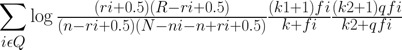

# BM25详解

原文一：https://blog.csdn.net/wdxin1322/article/details/38093261

原文二：https://blog.csdn.net/wang_shen_tao/article/details/50682478

## 什么是BM25

BM25算法通过加入文档权值和查询权值，扩展了二元独立模型的得分函数。这种拓展是基于概率论和实验验证的，并不是一个正式的模型。BM25模型在二元独立模型的基础上，考虑了单词在查询中的权值，拟合综合上述考虑的公式，并通过实验引入经验参数。

BM25的原始公式：

Log后由三部分组成，其中第一部分是二元独立模型的计算得分。

要了解BM25模型，先要了解二元假设模型（BIM）。

## 二元假设模型(BIM)

**假设一：二元假设**

​        所谓二元假设，类似布尔二模型的表示方法。一篇文章在由特征表示的时候，以特征“出现”和不出现“两种情况表示，也可以理解为相关不相关。用P(D|R)表示。

**假设二：词汇独立性假设**

​        所谓独立性假设，是指文档里出现的单词之间没有任何关联，任意一个单词在文章中的分布率不依赖于另一个单词是否出现，这个假设明显与事实不符，但是为了简化计算，很多地方需要做出独立性假设，这种假设是普遍的。用P(D|NR)表示。

​        

​        在以上两个假设的前提下，二元独立模型即可以对两个因子P(D|R)和P(D|NR)进行估算（条件概率）。举个简单例子，文档D中五个档次的出现情况如下：{1, 0, 1, 0, 1}，其中0表示不出现，1表示出现。

​        用Pi表示第i个单词在相关文档中出现的概率，在已知相关文档集合的情况下，观察到文档D的概率为：

.png)

​        对于因子P(D|NR)，我们假设用Si表示第i个单词在在不相关文档集合中出现的概率，于是在已知不相关文档集合的情况下，观察到文档D的概率为：

.jpg)

​        于是就可以的到下面的估算：

-divide-P(D|NR).jpg)

​        可以将各个因子规划为两个部分，一部分是文档D中出现的各个单词的概率乘积，另一部分是没在文档D中出现的各个单词的概率乘积，于是公式可以理解为下面的形式：

-divide-P(D|NR)-new.jpg)

​        进一步对公式进行变化，可得：

-divide-P(D|NR)-new2.jpg)

​        第一部分代表在文章中出现过单词所计算得到的单词概率乘积，第二部分表示所有特征词计算得到单词概率乘积，它与具体的文档无关，所有文档该项的得分一致，所以在排序中不起作用，可以抹掉。最后得到估算公式：

​        为了方便计算，对上面的公式两边取对数([为什么要取对数](https://zhuanlan.zhihu.com/p/106232513))得到：

​        或者这样的形式：

​        那么如何估算概率Si和Pi呢？如果给定用户查询，能确定哪些文档集合构成了相关文档集合，哪些文档构成了不相关文档集合，那么就可以用如下的数据对概率进行估算：

根据上表，可以计算出Pi和Si的概率估值，为了避免log(0)，对估值公式进行平滑操作，分子+0.5， 分母+1.0：

代入估值公式，得到：

​        这个公式代表的含义是：对于同时出现在查询Q和文档D中的单词，累加每个单词的估值结果就是文档D和查询Q的相关性度量。在预先不知道哪些文档相关哪些文档不相关的情况下，可以使用固定只替代，这种情况下，该公式等价于向量空间模型（VSM）中的IDF因子，实际证明该模型的实际使用结果不好，但是它是BM25模型的基础。

## BM25模型详解

​        BIM(二元假设模型)对于单词特征，只考虑单词是否在文档D中出现过，并不考虑单词本身的相关特征，BM25在BIM的基础上引入单词在查询中的权值，单词在文档D中的权值，以及一些经验参数，所以BM25在实际应用中效果远远好于BIM模型。

​        在开篇，已经介绍了BM25公式，也说明该公式由三部分组成。下图就是对该公式的分解：

* 第一部分是BIM模型得分。上面提到了，在一定的情况下该部分等价于IDF

* 第二部分是查询词在文档D中的权值，f是查询词在文档中的频率，K1和K是经验参数

* 第三部分是查询词自身的特征，qf是查询词在用户查询中的频率，但一般用户查询都比较短，qf一般是1， K2是经验参数

​        从上面的公式可以看出BM25是查询中单词的分值叠加得到，每个单词是一个个体，而整个文档被作为一个整体。

​        在第二部分中，**K**因子代表了文档长度的考虑，dl是文档的长度，avdl是文档的平均长度，k1和b是调整参数，b为0时即不考虑文档长度的影响，经验表明，b=0.75左右效果比较好。但是也要根据相应的场景进行调整。b越大对文档长度的惩罚越大。k1因子用于调整词频，极限情况下k1=0，则第二部分退化成1，即词频特征失效，可以证明k1越大词频的作用越大。

​        在不知道哪些文档相关、哪些文档不相关的情况下，将文档相关数R及包含查询相关文档数 r设为0，那么第一部分的BIM公式退化成：

这就是IDF因子的定义，N是总文档数，n是查询词的tf信息，0.5是平滑因子。

​        以上就是BM25的完整定义及其解释了。

## BM25F

​        BM25在计算相关性时，把文档当作整体来考虑，但是随着搜索技术的发展，文档慢慢的被结构化数据所替代（比如非结构化数据被存储在了Hive，HBase等存储里），每个文档都会被切分成多个独立的域，尤其是垂直化的搜索。

​        例如，网也有可能被切分成成标题、内容、主题词等域，这些域对文章主题的贡献不能同等对待，所有权终究要有所偏重，BM25没有考虑这点。

​        BM25F就是在此基础上做了一些改进，就是不再单单地将单词作为个体考虑，而是将文档也按照field（field是分词术语，也是BM25F名称的由来）划分为个体再考虑，所以BM25F是每个单词在各个field中分值的权求和。

* boost：相应域的权值
* lc：field的长度
* avlc：field的平均长度
* bc：调节因子

BM25F的最终值，就是各个field的分值的加权求和。