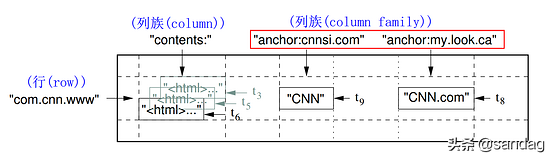
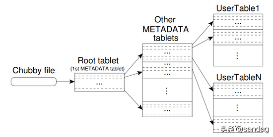
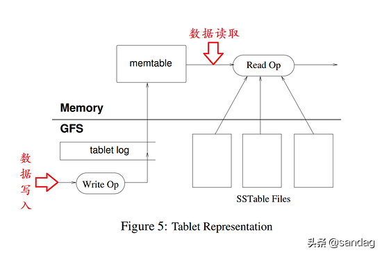

# 缘起：BigTable

原文：https://www.toutiao.com/a6846559076592288270/


2006年 Google 发表了  BigTable的论文：BigTable 是一个用来管理结构化数据的分布式存储系统，其本质上是一个分布式 KV 的存储系统。

## 一. BigTable是什么？

BigTable 是 Google 内部用来管理结构化数据的分布式存储系统，BigTable 可以轻易的扩展到上千台机器，BigTable 具有以下的优点：

1. **使用场景广**：从需要吞吐量的批处理作业到低延迟的用户数据服务
2. **可伸缩**：集群规模可水平扩展，BigTable 部署规模可以小到3～5台，大到数千台，从而支撑不同的数据量
3. **高性能**：
4. **高可用**：BigTable 是主从结构，不会产生单点故障；底层是 GFS，数据冗余备份

与关系型数据库不同，BigTable 并不支持完整的关系数据模型，也就是说，BigTable 是一个 NoSQL 数据库，BigTable 为用户提供了一个简单的数据模型，该模型主要有以下两个特点：

1. 客户端可以对数据的布局和格式动态控制。这点与关系数据库有很大的差别：关系数据库中，表创建完成后，表中存储的数据格式基本就固定了，列的数量以及格式都无法再更改了；BigTable 却可以动态增加，完全由客户端控制
2. 客户端可以推理底层数据存储系统中表示的数据的局部属性

BigTable 中的数据是通过行（Row）和列（Column）进行索引的，行和列可以是任意字符串。

客户端可以将各种形式的结构化和半结构数据序列化字符串，但 BigTable 只是将数据（Data）看做是未解释字符串（字节数组）进行处理。

客户端可以通过模式（Schema）参数来控制底层数据存储的位置，BigTable 的模式参数允许客户端动态控制是从内存还是磁盘提供数据。

## 二. BitTable 数据模型

先来看看 BigTable 论文中是如何对 BigTable 定义的：

> A BigTable is a Sparse, Distributed, Persisitent Multi-Dimensional Sorted Map. The **Map** is indexed by a **row key, column key, and a timestamp**; each value in the map is an uninterpreted array of bytes.

BigTabel 是一个 Map，即 Key/Value 键值对，这个 Map 有啥特点呢？稀缺的，分布式的，持久化存储的，且多维度排序的。

对于 Map 数据结构来说，最常用的操作就是通过 Key 检索 Value，BigTable 中的 Value 是通过行、列、时间戳进行索引的。

```sql
# BigTable / Map 的索引结构
(row:string, column:string, time:int64) ==> string
```



上图是为 Web 页面创建的 BigTable 表 Webtable：

1. **row**：url地址的逆序
2. **列促 contents**：存储 web 页面内容
3. **列簇 anchor**：存储 Web 页面中任何引用其他页面的锚点链接

注意：BigTable 中，每个 Cell 都有多个 Version，每个 Version 对应一个时间戳


### 2.1 Row Key

BigTable 中的 row key 可以是任意字符串（大部分场景下，用户使用的 row key 大小为 10-100 字节，但 BigTable 当前分配大小为 64 kb）。

客户端每次读取/写入数据时，指定 row key 时，无论有多少列同时被读取/写入，该读写操作都是原子操作的。

BigTable 底层是按 row key 的字典顺序存储的，给定 BigTable 表，其 Row Key range 是动态分区的，每个分区称为一个 Tablet。

Tips：

> 1. 较小范围的 row key 数据读取会更高效，原因在于，这些数据读取时，只需要与很少的机器通信即可，效率较高
> 2. 客户端可以充分利用上述属性，从而加快其数据访问，获取更高的吞吐量。例如，在 Webtable 中，使用 url 的逆序作为 row key，这样做的好处是，访问同一网站的页面时，这些页面通常会对应同一台机器，不需要与集群中多个节点通信，读取效率更高

### 2.2 Column Families

**多个 Column Key 构成的集合称为列簇 Column Families**。Column Key 是最基本的访问控制单元。

同一列簇中的数据通常具有相同的数据类型（一般情况下，同一列簇的数据会放在一起进行压缩存储）。

数据以列簇（Column Families ）中某个列（Column key）进行存储之前，必须先创建该列簇才行。

Tops：

> 通常情况下，一张 BitTable 表的列簇的数量可能比较小（最多几百个），而且在使用过程中，列簇通常是不变的，相反的，每个表可以拥有无数个列，也就是说，每个列簇都可以拥有无数个列，而且列是不需要提前定义的。

Column Key 通常使用语法 family:qualifier 进行命名，列簇必须由可打印字符构成，而列名可以由任意字符构成。


### 2.3 Timestamps

BigTable 表中每个 Cell 包含同一数据的多个版本，这些版本通过时间戳进行索引，BitTable 中的时间戳是 64 位整数。

时间戳可以由服务端生成，也可以由客户端生成，需要避免冲突的应用程序必须由自身生成相应的时间戳。

不同版本的 Cell 以时间戳降序的方式进行存储，以至于时间戳最近的版本最先会读取到。

为了避免 Cell 的数据版本过多，提供列簇级别的配置项，以便 BigTable 自动删除旧的数据版本，一种是只保留最近的几个版本；另一种是只保留足够新的数据版本（例如，保留最近7天的写入的数据版本）。

## 三. BigTable API

BigTable API 提供 创建/删除 表和列簇的方法。

BigTable API 提供修改集群、表、列簇元数据方法，例如，修改访问控制权限等。

客户端应用程序可以执行写入/删除 BigTable 中的值，根据 row key 查询值，迭代表中部分数据集等操作。

```java
// open table
Table *t = OpenOrDie("/bigtable/web/wetable");
// write a new anchor and delete on old anchor
RowMutation r1(T, "com.cnn.www");
r1.Set("anchor:www.c-span.org","CNN");
r1.Delete("anchor:www.abc.com");
Operation op;
// 应用原子操作到 Webtable 中的 r1 上
Apply(&op, &r1);
```

客户端可以在多个列簇上进行迭代操作，同时，BigTable 提供了几种 row、columns、timestamps 构建方法来生成 Scan 实例。

```java
Scanner scanner(T);
ScanStream *stream;
stream = scanner.FetchColumnFamily("anchor");
stream->SetReturnAllVersions();
scanner.Lookup("com.cnn.www");
for (; !stream->Done(); stream -> Next()) {
    print("%s %s %lld %s\n",
          scanner.RowName(),
          stream->ColumnName(),
          stream->MicroTimestamp(),
          stream->Value()
          );
}
```

 另外，BigTable 支持其他更复杂的操作数据的方式：

1. 支持单行（single-row）事物，可以实现给定 row key 时执行原子性的 **读-改-写** 操作
2. BigTable 提供了批量接口，但不支持多行的事物操作
3. BIgTable 允许将 Cell 用作整数计数器
4. BigTable 支持在服务端地址空间内执行客户端脚步，该脚本为 Sawzall 语言


## 四. BigTable 构建基础

BigTable 是基于 Google 的一些基础组件构建而成的，使用 GFS（Google File System）来存储日志（log）和数据（data）文件。

BigTable 集群通常运行在一个共享的服务器集群中，BigTable 的进程通常与其他分布式应用程序进程共享同一台服务器。

BigTable 依赖集群管理系统来实现作业调度，管理共享机器上的资源，处理机器故障以及监视机器状态。

BigTable 使用Google 的 **SSTable** 文件格式来存储内部数据。SSTable 提供了从 Keys 到 Values 的持久化的、顺序的、不可变的映射。另外，SSTable 中 keys 和 values 均是任意字节数组。另外，SSTable 提供了根据 key 检索 value 以及根据 key 范围检索 value 的功能。

SSTable 由很多 Block （每个 Block 默认大小是 64KB，可配置）组成，Block Index（存储在 Block 尾部）用来定位 Blocks，当客户端打开 SSTable时，会将 Block Index 加载到内存。

从 SSTable 中检索指定 key 的 values 时可以通过 Single Disk Seek 实现：

> 首先加载 Block Index 到内存中，然后通过二分检索到 Key 所在的 Block，最后将磁盘中合适的 Block 加载到内存件错即可。

BigTable 依赖高可用且持久化的分布式锁服务 Chubby。 Chubby 服务包含 4 个 活跃的副本（节点），其中一个节点选举为 Master 并处理用户请求，当大多数副本正常运行且可以相互通信时，Chubby 被认为是正常运行的。Chubby 使用 Paxos 算法实现副本数据一致。

Chubby 提供了包含目录和小文件的命名空间，每个目录或文件可以当成一个锁来使用，读取和写入文件时原子操作。

Chubby 客户端会同步缓存 Chubby 文件，每个 Chubby 客户端会自动维护一个与 Chubby 服务的会话，在会话到期时，如果客户端无法通过 Chubby 服务更细到期时间，则会话会被中断，会话到期时，客户端会丢失所有锁并且无法执行open操作。

Chubby 客户单可以在 Chubby 文件/目录上注册回调方法，当会话到期或文件/目录改变时回调改方法。

BigTable 使用 Chubby 完成各种各样的任务：

1. 保证集群内同时最多存在一个 Master 节点
2. 存储 BitTable 表数据的启动位置
3. 发现 Tablet 服务器以及检测 Tablet 是否存活
4. 存储 BigTable 表 Schema 信息（每张表的列簇信息）
5. 存储访问控制列表

## 五. BigTable 实现原理

BigTable 实现主要包括三部分：

1. 客户端需要使用的库
2. 一个 Master Server 分配 Tablet 到哪个 Tablet Server 上：检测是否有 Tablet Server 新增或到期；Tablet Server 负载均衡；GFS 上垃圾文件回收；处理 BigTable 表 Schema 修改
3. 多个 Tablet Server：每个 Tablet Server 维护一个 Tablet集合（每个 Tablet Server 通常可以维护 10 到 1000 个 Tablet）；处理其负责的 Tablet 的读写请求，在 Tablet 太大时，负责 Tablet 的分裂；根据集群负载情况，Tablet Server 可以动态添加或移除

Tips：

> 1. 与其他单 Master 分布式存储系统类似，客户端数据不会路由到 Master，而是直接与 Tablet Server 通信，进而实现数据的读写
> 2. 很多 BigTable 客户端不需要依赖 Master 定位 Tablet 信息，即大部分场景下客户端不需要与 Master 通信

### 5.1 Tablet 定位模型

BigTable 使用类似 B+Tree 的三层结构来存储 Tablet 位置信息：



* 第一层：一个 Chubby 文件

  该文件存储了 root tablet 的位置信息。由于该文件是 Chubby 文件，也就意味着，一旦 Chubby 服务不可用，整个BigTable 就丢失了 root tablet 的位置，整个服务也就不可用了。

* 第二层：Root tablet

  Root tablet 其实就是元数据表 **METADATA Table** 的第一个 Tablet。该 Tablet 中保存着元数据表和其他 Tablet 的位置信息，Root Tablet 很特殊，为了保证整个树的深度不变，Root Tablet 从不分裂。

  Tips：

  > 1. MetaData Table 存储 Tablet 位置信息时，Row Key 是通过对 Tablet Table Idnetifier 和 该 Tablet 的 End Row 生成的
  > 2. 每个 MetaData Table 的 Row Key 大约占用 1kb 的内存，一般情况下，配置 MetaData Table 的大小限制为 128Mb，即三层的定位模式大约可以寻址 $2 ^ {34}$ 个 Tablets

* 第三层：其他元数据表的 Tablet

  这些 Tablet 与 Root Tablet 共同构成整个元数据表。

  Tips：

  > 元数据表虽然特殊，但仍然服从前面介绍的数据模型，每个 Tablet 也由专门的 Tablet Server 负责。这就是为什么不需要 Master Server 提供位置信息的原因，客户端会缓存 Tablet 的位置信息，如果在缓存中找不到指定 Tablet 的位置信息，则需要查询该三层结构了，一次访问 Chubby 服务，两次 Tablet Server 访问

### 5.2 Tablet 分配模型

每个 Tablet 只能分配给某个 Tablet Server。

Master Server 维护当前哪些 Tablet Server 是活跃的，哪些 Tablet 分配给了哪些 Tablet Server，哪些 Tablet 还未分配，当某个 Tablet 还未分配、且刚好存在于 Tablet Server 有足够的空间装载该 Tablet 时，Master Server 会向该 Tablet Server 发送装载请求。

BigTable使用 Chubby 服务来检测 Tablet Server 是否存活，当Tablet Server启动时，会在特定的Chubby目录下创建排它锁，BigTable会监控该目录来发现哪些Tablet Server存活，当Tablet Server丢失其排它锁时（例如，网络原因导致Tablet Server丢失Chubby会话）。

Chubby 服务提供了非常高效地检测会话是否持有锁的机制，且不会导致网络拥塞。

当 Tablet Server 的排他锁文件存在时，Tablet Server 可能会重新获取该锁，也就是，该锁是可重入的；排他锁文件不存在，则 Tablet Server 不会再次请求该锁，而不是自杀。

Tablet Server进程终止时，会尝试释放锁，以便Master Server可以尽快地将其维护的Tablet分配到其他节点上。

Master负责检测Tablet Server是否还在为其他Tablet提供服务，并尽快重新分配其负责的Tablet到其他Tablet Server上。

**问题来了：Master 是如何检测的呢？**

Master 会定期向每个 Tablet Server 询问其锁的状态。如果 Tablet Server 向其报告锁已丢失，或者 Master 最后几次尝试都无法访问服务器，则 Master 将尝试获取该 Tablet Server 对应的排他锁文件。如果可以获取，则说明 Chubby 处于活跃状态，而 Tablet Server 已死或者无法访问 Chubbty，Master 可以通过删除其服务器文件来确保 Tablet Server 不再提供服务。一旦 Tablet Server 对应的排他锁文件被删除后，Master Server 可以将先前分配给该 Tablet Server 的所有 Tablet 移动到其他未分配的 Tablet Server 中。

为了确保 BigTable 集群不受 Master Server 与 Chubby 服务之间网络问题影响，如果 Master 的 Chubby 会话到期，则 Master 会自动杀死自己。如上所述，Master Server 设备故障不会更改 Tablet 分配到其他 Tablet Server 上。

当 Master Server 启动时，在其可以修改 Tablet 分配之前，需要先感知到当前 Tablet 分布才行，启动流程如下：

1. 获取 Chubby 文件（排他锁），阻止并发实例化 Master
2. Master 会扫描 Tablet Server 排它锁的 Chubby 文件目录，拿到当前活跃 Tablet Server 信息
3. Master 与所有 Tablet Server 通信获取其所维护的 Tablet 信息
4. Master 会同时扫描 MetaData 表获取 Tablets 集合，在扫描的过程中，当 Master 发现了还未分配的 Tablet 时，Master 将该 Tablet 加入未分配的 Tablet 集合等待合适的时机分配

在第四步扫描 MetaData 表时可能会遇到一种复杂的情况：MetaData 表的 Tablet 还未分配之前是不能够扫描它的。

步骤三扫描过程中，如果发现 Root Tablet 还没有分配，Master 就把 Root Tablet 加入到未分配的 Tablet 集合中。

上面这个附加操作确保了 Root Tablet 会被分配。Root Tablet 包括了所有 MetaData 的 Tablet 的名字，意味着 Master 扫描完 Root Tablet 后就得到了所有 MetaData 表的 Tablet 的名字了。

现有的 Tablet 集合只有在创建新表或者删除了旧表、两个 Tablet 被合并了或者 Tablet 被分割成两个小的 Tablet 时才会发生改变。

Master 可以跟踪记录所有这些事件，除了 Tablet 分割外的事件都是 Master 发起的。

Tablet 分割时间需要特殊处理，因为该事件是由 Tablet 服务器发起的。

Tablet 分割结束后，Tablet Server 通过在 MetaData 表添加 Tablet 的信息来提交这个操作：分割结束后，Tablet Server 会通知 Master。

如果分割信息已提交，却没有通知到 Master（可能两个服务器中有一个宕机了），Master 在要求 Tablet 服务器装载已经被分割的子表的时候会发现一个新的 Tablet。对比 MetaData 表中 Tablet 信息，Tablet Server 会发现 Master 要求其装载的 Tablet 并不完整，就会重新向 Master 发送通知信息，从而更新 MetaData 表。

### 5.3 Tablet Server

Tablet 的数据持久化存储在 GFS 中，具体持久化流程如下图所示：



Updates 操作会先提交到 log（WAL）中，log 主要用来进行数据恢复的。所有的 Updates 中，最近提交的那部分会存放在**排序的**缓存中，这个缓存称为 **MemTable**，更早的 Updates 会存放在一系列 **SSTable** 中，这些 SSTable 本质上就是 memTable 刷盘生成的。

为了恢复 Tablet，Tablet Server 首先从 MemTable 中读取元数据信息，元数据信息包含组成该 Tablet 的 SSTable 列表及一系列重启点。这些重启点指向包含该 Tablet 数据的已提交日志记录，Tablet Server 会把 SSTable 的索引读入内存，根据重点恢复 MemTable。

Tablet Server 接收到数据写入请求时，Tablet Server 首先要检查操作格式是否正确、操作发起者是否有执行这个操作的权限。权限验证的方法是根据从 Chubby 文件里读取出来的具有写权限的操作者列表来进行验证（这个文件几乎一定会存放在 Chubby 客户端缓存里）。成功的修改操作会记录在提交日志里。可以采用批量提交的方式来提高大量小的修改操作的应用程序的吞吐量。

数据写入操作提交后，数据最终会被插入到 **MemTable** 里。

Tablet Sever 接收到数据读取请求时，Tablet Server 会做类似的完整性和权限检查。一个有效的读操作在一个由一系列 SSTable 和 memTable 合并的试图里执行的。由于 SSTable 和 memTable  是按字典排序的数据结构，因此可以高效生成合并视图。

Tablet 合并和分割时，正在进行的读写操作能够继续进行。

### 5.4 Compaction（合并）

随着数据的不断写入，**MemTable** 占用的内存会不断增加。当 MemTable 占用的内存超过一定阈值时，内存中的 memTable 会被冻结，切换为只读状态，同时创建一个新的 memTable，新的数据写入请求会写入到新的 memTable 中，只读的 memTable 会被转换为 SSTable 并最终写入底层存储系统（GFS）中，这个过程被称为小合并（Minor Compaction）。

小合并的作用主要有两个：

* 降低 Tablet Server 的内存使用
* 在 Tablet Server 意外宕机时，降低从 WAL 恢复 MemTable 需要读取的数据量

每次小合并都会生成 SSTable。如果只有小合并，一直这么持续下去，那么在 Tablet Server 接收到数据读取操作时，就需要从所有可能存在待检索 row key 的 SSTable 检索，然后合并所有更新操作，才能最终得到最新的 value 值。

为了避免上面这种情况发生，在后台周期性地执行**大合并**（Major Compaction）。大合并会读取几个 SSTable，然后进行数据合并，合并结束后，即可将原先的 SSTable 文件删除。

## 六. 优化及改进

第五节描述了 BigTable 的底层实现原理。不过为了满足用户所需的高性能、高可用和可靠性，在具体实现时需要各种优化才行。

### 6.1 Locality Groups

**客户端**可以将多个列簇组成 Locality Groups。每个 Tablet 会为 Locality Group 中的数据单独生成 SSTable。

将通常不会一切访问的列簇分离到单独的 Locality Group 中，可以实现更高效的数据读取。

例如，可以将 Webtable 中的页面元数据（例如，语言和检验和）放在同一个 Locality Group 中，页面的内容不在同组中，当应用程序想要读取页面的元数据信息时，不需要读取所有的页面内容即可完成。

此外，还可以针对每个 Locality Group 做相应的参数优化。例如：可以声明将某个 Localicy Group 放到内存中。

内存中 Locality Group 对应的 SSTable 会被延迟加载到 Tablet Server 中，一旦加载完成，在不访问磁盘的情况下，实现 Locality Group 数据访问，此功能对于频繁访问的小块数据十分有用，Google 内部用来存储元数据表。

### 6.2 Compression（压缩）

客户端可以控制是否压缩 Locality Group 的 SSTable 以及使用哪种方式进行压缩。

用户指定的压缩格式应用于每个 SSTable Block （其大小通过特定于局部性组的调整参数进行控制）。

通过单独压缩每个块会损失一些空间，但好处是可以读取 SSTable 的小部分，而无需对整个文件进行解压缩。

许多客户端使用两遍自定义压缩方案。第一遍压缩过程使用了Bentley和McIlroy的方案[6]，在一个大范围内使用前缀压缩算法对普通的长字符串进行压缩。第二遍压缩使用了一个快速压缩算法，该算法在一个16kb的小窗口中寻找重复数据。两种压缩过程都非常快，现代机器上，它们的编码速度为100-200 MB/s，解码速度为400-1000 MB/s。尽管我们在选择压缩算法时强调的是速度而不是空间缩减，但这种两遍压缩方案做得非常好。

### 6.3 Caching（缓存）

为了提升数据读取性能，Tablet Server 使用两级缓存。

**Scan Cache** 时 Higher-Lever 缓存，该缓存会缓存 SSTable 接口返回的 Key-Value 键值对。

**Block Cache** 时 Lower-Lever 缓存，该缓存会缓存从 GFS 读取的 SSTable Block。

Scan Cache 对于需要频繁访问相同数据的应用程序来说是非常有用的。

Block Cache 则对需要访问临近数据的应用程序来说非常有用。

### 6.4 Bloom Filters（布隆过滤器）

如第五节中对 BigTable 底层实现原理描述的一样，数据读取操作最终是从 Tablet 的 SSTable 中读取的。如果 SSTable 不在内存中，最终就需要通过读取磁盘来实现数据读取了。通过为特定 **Locality Group** 的SSTable创建布隆过滤器，可以减少磁盘的访问次数。

布隆过滤器使得通过查询布隆过滤器来判断 SSTable 是否包含指定行/列的数据，对于某些应用程序，通过使用布隆过滤器可以显著降低 Tablet Server 的磁盘寻道次数。另外，使用布隆过滤器意味着对于不存在的行/列数据可以避免大量不必要的磁盘读取。

### 6.5 WAL（提交日志实现）

如果为每个 Tablet 都生成相应的WAL文件，那么GFS就需要同时写入很多文件，并发量很高，这种场景下，底层每个GFS服务器为了将日志数据写入不同的物理文件，会导致大量磁盘寻道，效率极低。此外，每个Tablet提交单独的日志文件也会降低批量提交优化性能，原因在于，由于分Tablet进行提交，对应的批量数据就会比较少。为了解决这些问题，将每个 Talbet Server 中所有的 Tablet 的数据写入日志追加到同一日志文件中，从而降低 GFS 的并发量，也降低底层 GFS 的物理磁盘寻道。

每个 Tablet Server 仅创建一个提交日志(WAL)文件，在正常操作场景下，可以大幅度提高性能，但数据恢复时却很复杂。

一台 Tablet Server 宕机时，其维护的所有 Tablets 将被转移到其他 Tablet Server 上，每台 Tablet Server 仅会装载少量原始 Tablet Server 的 Tablet。为了恢复 Tablet Server 的状态，新的 Tablet Server 需要从原始 Tablet 写入的提交日志中重新应用该 Tablet 的更新。然而，该宕机 Tablet Server 上的所有的 Tablet 的更新操作混合在同一个物理日志文件中。

一种方法是让每个新的Tablet Server读取完整的提交日志文件，并只应用它需要恢复的Tablet所需的条目。然而，在这种方案下，如果当前集群有100台机器从一台故障的Tablet Server上分别分配Tablet，那么日志文件将被读取100次（每台服务器一次）。

为了避免日志的重复读取，首先按照 **<table; row name; log sequence number>** 对提交日志条目进行排序。在已排序的输出中，特定Tablet的所有更新操作都是连续的，因此，可通过一次磁盘搜索和顺序读取有效地读取。为了并行排序，将日志文件按 64MB 切分，在不同的Tablet Server上并行排序。排序过程由 Master 协调，并指示每台Tablet Server需要从某些提交日志文件中恢复更新日志时启动。

WAL日志写入GFS有时会由于各种原因导致性能中断（例如，涉及写操作的GFS服务器计算机，或为到达三个GFS服务器的特定集合而穿越的网络路径遇到网络拥塞或负载过重）。

为了保护更新操作不受GFS延迟峰值的影响，每个Tablet Server实际上**有两个日志写入线程**，每个线程都写入自己的日志文件；这两个线程一次只有一个处于活动状态。如果对WAL日志文件的写入执行得很差，则日志文件写入将切换到另一个线程，提交日志队列中的更新操作将由新活动的日志写入线程写入。日志条目包含序列号，以便在恢复过程消除此日志线程切换过程中产生的重复条目。

### 6.6 加速 Tablet 恢复

如果Master将Tablet从一个Tablet Server移动到另一个Tablet Server，则源Tablet Server首先对该Tablet Server进行一次小合并。这种合并通过减少Tablet Server提交日志中未压缩状态的数量来缩短恢复时间。完成压缩后，Tablet Server停止为该Tablet提供服务。

在实际卸载Tablet之前，Tablet Server会执行另一次（通常非常快速）小合并，以消除执行第一次小合并时到达的Tablet Server日志中的任何剩余未压缩状态。完成第二次小压缩后，可以将Tablet加载到另一台Tablet Server上，而无需恢复任何日志条目。

## 七 总结

之所以写这篇文章，其实，是为了引出 **LevelDB** ，LevelDB又是啥呢？

LevelDB一个单机的开源的高效的KV存储系统，该单机KV存储系统，可以说是高度复刻了BigTable中的Tablet，而BigTable毕竟不是开源哒，我们通过Google的这篇论文，也只是能了解到BigTable的整体架构，但是具体细节就只能YY，或者去看HBase（参考BigTable实现的一个开源分布式列式数据库）的源码了。

不过呢，出于工作需要呢，目前对HBase需求不大，更需要弄懂单机KV系统是如何实现的，所以呢，我就屁颠屁颠地去看LevelDB了，相比于BigTable/HBase，仅仅是单机和分布式的区别了，而且，LevelDB代码量更小，更容易学习和掌控。
