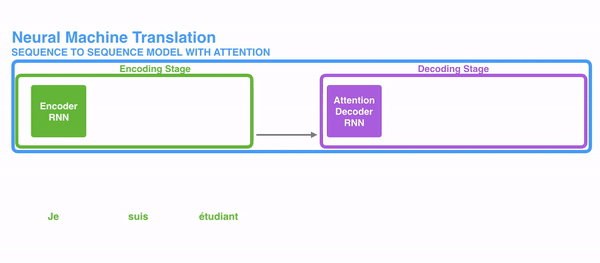
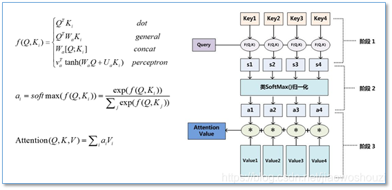
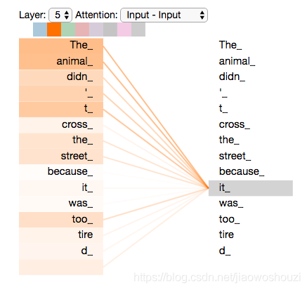

# 一文读懂BERT（原理）

原文：https://blog.csdn.net/jiaowoshouzi/article/details/89073944

## 资源

* BERT: Pre-training of Deep Bidirectional Transformers for Language Understanding

  论文原文:
  [BERT: Pre-training of Deep Bidirectional Transformers for Language Understanding](https://arxiv.org/abs/1810.04805)

* 官方代码和预训练模型
  Github: https://github.com/google-research/bert

* Google AI Blog:
  [Open Sourcing BERT: State-of-the-Art Pre-training for Natural Language Processing](https://link.zhihu.com/?target=https%3A//ai.googleblog.com/2018/11/open-sourcing-bert-state-of-art-pre.html)

* 第三方代码

  * [pytorch-pretrained-BERT](https://github.com/huggingface/pytorch-pretrained-BERT)
    Google官方推荐的PyTorch BERB版本实现，可加载Google预训练的模型：PyTorch version of Google AI’s BERT model with script to load Google’s pre-trained models

  * [BERT-pytorch](https://github.com/codertimo/BERT-pytorch)
    另一个Pytorch版本实现：Google AI 2018 BERT pytorch implementation

  * [BERT-tensorflow](https://github.com/guotong1988/BERT-tensorflow)
    Tensorflow版本：BERT: Pre-training of Deep Bidirectional Transformers for Language Understanding

  * [bert-chainer](https://github.com/soskek/bert-chainer)
    Chanier版本: Chainer implementation of “BERT: Pre-training of Deep Bidirectional Transformers for Language Understanding”

  * [bert-as-service](https://github.com/hanxiao/bert-as-service)
    将不同长度的句子用BERT预训练模型编码，映射到一个固定长度的向量上：Mapping a variable-length sentence to a fixed-length vector using pretrained BERT model
    进一步是否可以做一个句子相似度计算服务？有没有同学一试？

  * [bert_language_understanding](https://github.com/brightmart/bert_language_understanding)
    BERT实战：Pre-training of Deep Bidirectional Transformers for Language Understanding: pre-train TextCNN

  * [sentiment_analysis_fine_grain](https://github.com/brightmart/sentiment_analysis_fine_grain)
    BERT实战，多标签文本分类，在 AI Challenger 2018 细粒度情感分析任务上的尝试：Multi-label Classification with BERT; Fine Grained Sentiment Analysis from AI challenger

  * [BERT-NER](https://github.com/kyzhouhzau/BERT-NER)
    BERT实战，命名实体识别: Use google BERT to do CoNLL-2003 NER !

  * [BERT-keras](https://github.com/Separius/BERT-keras)
    Keras版: Keras implementation of BERT with pre-trained weights

  * [tbert](https://github.com/innodatalabs/tbert)
    PyTorch port of BERT ML model

## NLP发展历史

关于NLP发展史，特别推荐weizier大佬的[NLP的巨人肩膀](https://zhuanlan.zhihu.com/p/50443871)。学术性和文学性都很棒，纵览NLP近几年的重要发展，对各算法如数家珍，深入浅出，思路清晰，文不加点，一气呵成。
现对NLP发展脉络简要梳理如下：

* 2001 - Neutal Language Models (神经语言模型)
* 2008 - Multi-task learning (多任务学习)
* 2013 - Word embeddings (词嵌入)
* 2013 - Neural networks for NLP (NLP神经网络)
* 2014 - Sequence-to-sequence models
* 2015 - Attention (注意力机制)
* 2015 - Memory-based networks (基于记忆的网络)
* 2018 - Pretrained languaged models (预训练语言模型)

### 2001 - 神经语言模型

​        第一个神经语言模型是Bengio等人在2001年提出的前馈神经网络，如下图所示：

​        这个模型将从表$C$中查找到的$n$个单词作为输入向量特征。这种向量被现在的学者们称为“词嵌入”。这些词嵌入级联后，被输入到一个隐藏层中，该隐藏层的输出又被输入到softmax层。

​        语言建模通常是应用RNN时的第一步，是一种非监督学习形式。尽管它很简单，但却是文本后面讨论的许多技术发展的核心：

* 词嵌入：word2vec的目标是简化语言模型
* Sequence-to-sequence模型：这种模型通过一次预测一个单词生成一个输出序列
* 预训练语言模型：这些方法使用来自语言模型的表述进行迁移学习

​        反过来讲，这意味着近年来NLP的许多重要进展都可以归结为某些形式的语言模型。为了“真正”理解自然语言，仅仅从文本的原始形式中学习是不够的。需要新的方法和模型。

### 2008 - 多任务学习

​        多任务学习是在多个任务上训练的模型之间共享参数的一种通用方法。在神经网络中，可以通过给不同层施以不同的权重，来很容易地实现多任务学习。多任务学习的概念最初由Rich Caruana 在1993年提出，并被应用于道路跟踪和肺炎预测（Caruana,1998）。直观地说，多任务学习鼓励模型学习对许多任务有用的表述。这对于学习一般的、低级的表述形式、集中模型的注意力或在训练数据有限的环境中特别有用。[详情请看这篇文章](https://www.facebook.com/722677142/posts/10155393881507143/)

​        在2008年，Collobert 和 Weston 将多任务学习首次应用于 NLP 的神经网络。在他们的模型中，查询表（或单词嵌入矩阵）在两个接受不同任务训练的模型之间共享，如下面的图所示。

### 2013 - 词嵌入

​        用稀疏向量表示文本，即所谓的词袋模型在NLP有着悠久的历史。正如上文介绍的，早在2001年就开始使用密集向量表示词或者词嵌入。Mikolov等人在2013年提出的创新技术是通过去除隐藏层，逼近目标，进而使这些单词嵌入的训练更加高效。虽然这些技术变更本质上很简单，但它们与高效的word2vec配合使用，便能使大规模的词嵌入训练成为可能。

​        Word2vec有两种风格，如下面的图所示：连续字袋 CBOW 和 skip-gram。不过他们的目标不同：一个是根据周围的单词预测中心单词，而另一个则相反。

​        虽然这些嵌入在概念上与使用前馈神经网络学习的嵌入在概念上没有区别，但是在一个非常大的语料库上训练之后，它们就能够捕获诸如性别、动词时态和国家-首都关系等单词之间的特定关系，如下图所示。

### 2013 - NLP神经网络

​        2013 年和 2014 年是 NLP 问题开始引入神经网络模型的时期。使用最广泛的三种主要的神经网络是：循环神经网络、卷积神经网络和递归神经网络。

​        **循环神经网络（RNNs）** -  循环神经网络是处理 NLP 中普遍存在的动态输入序列的一个最佳的技术方案。Vanilla RNNs （Elman,1990）很快被经典的长-短期记忆网络（Hochreiter & Schmidhuber,1997）所取代，它被证明对消失和爆炸梯度问题更有弹性。在 2013 年之前，RNN 仍被认为很难训练；Ilya Sutskever 的博士论文为改变这种现状提供了一个关键性的例子。下面的图对 LSTM 单元进行了可视化显示。双向 LSTM（Graves等,2013）通常用于处理左右两边的上下文。

​        **卷积神经网络（CNNs）** - 卷积神经网络本来是广泛应用于计算机视觉领域的技术，现在也开始应用于语言（Kalchbrenner等,2014；Kim等,2014）。文本的卷积神经网络只在两个维度上工作，其中滤波器（卷积核）只需要沿着时间维度移动。下面的图显示了NLP中使用的典型 CNN。

​        卷积神经网络的一个优点是它们比 RNN 更可并行化，因为其在每个时间步长的状态只依赖于本地上下文（通过卷积运算），而不是像 RNN 那样依赖过去所有的状态。使用膨胀卷积，可以扩大 CNN 的感受野，使网络有能力捕获更长的上下文（Kalchbrenner等,2016）。CNN 和 LSTM 可以组合和叠加（Wang等,2016），卷积也可以用来加速 LSTM（Bradbury等, 2017）。

​        **递归神经网络** - RNN 和 CNN 都将语言视为一个序列。然而，从语言学的角度来看，语言本质上是层次化的：单词被组合成高阶短语和从句，这些短语和从句本身可以根据一组生产规则递归地组合。将句子视为树而不是序列的语言学启发思想产生了递归神经网络（Socher 等人， 2013），如下图所示

​        递归神经网络从下到上构建序列的表示，这一点不同于从左到右或从右到左处理句子的 RNN。在树的每个节点上，通过组合子节点的结果来计算新的结果。由于树也可以被视为在 RNN 上强加不同的处理顺序，所以 LSTM 自然地也被扩展到树上（Tai等,2015）。

​        RNN 和 LSTM 可以扩展到使用层次结构。单词嵌入不仅可以在本地学习，还可以在语法语境中学习（Levy & Goldberg等,2014）；语言模型可以基于句法堆栈生成单词（Dyer等,2016）；图卷积神经网络可以基于树结构运行（Bastings等,2017）。

### 2014 - Sequence-To-Sequence 模型

​        2014 年，Sutskever 等人提出了 sequence-to-sequence 模型。这是一个使用神经网络将一个序列映射到另一个序列的通用框架。在该框架中，编码器神经网络逐符号处理一个句子，并将其压缩为一个向量表示；然后，一个解码器神经网络根据编码器状态逐符号输出预测值，并将之前预测的符号作为每一步的输入，如下图所示：

​        机器翻译是对这个框架比较成功的应用。2016 年，谷歌宣布将开始用神经 MT 模型取代基于单片短语的 MT 模型（Wu等,2016）。根据 Jeff Dean 的说法，这意味着用 500 行神经网络模型替换 50 万行基于短语的MT代码。

​        由于其灵活性，这个框架现在是自然语言生成任务的首选框架，其中不同的模型承担了编码器和解码器的角色。重要的是，解码器模型不仅可以解码一个序列，而且可以解码任意表征。例如，可以基于图像生成标题（Vinyals等,2015）（如下图所示）、基于表生成文本（Lebret等,2016）和基于应用程序中源代码更改描述（Loyola等,2017）。

​        sequence-to-sequence 学习甚至可以应用于 NLP 中输出具有特定结构的结构化预测任务。为了简单起见，输出被线性化，如下面的图所示，用于进行选区解析。神经网络已经证明了在有足够数量的训练数据进行选区分析（Vinyals等,2015）和命名实体识别（Gillick等, 2016）的情况下，直接学习可以产生这种线性化输出的能力。

### 2015 - 注意力机制

​        注意力机制（Bahdanau 等,2015）是神经网络机器翻译（NMT）的核心创新之一，也是使 NMT模型胜过经典的基于短语的MT系统的关键思想。sequence-to-sequence模型的主要瓶颈是需要将源序列的全部内容压缩为一个固定大小的向量。注意力机制通过允许解码器回头查看源序列隐藏状态来缓解这一问题，然后将其加权平均作为额外输入提供给解码器，如下面的图所示

注意力机制有很多不同的形式（Luong等,2015）。这里有一个简短的概述。注意力机制广泛适用于任何需要根据输入的特定部分做出决策的任务，并且效果不错。它已被应用于一致性解析（Vinyals等,2015）、阅读理解（Hermann等,2015）和一次性学习（Vinyals等,2016）等诸多领域。输入甚至不需要是一个序列，即可以包含其他表示，如图像字幕（Xu等,2015），如下图所示。注意力机制的一个额外的功能是，它提供了一种少见的功能，我们可以通过检查输入的哪些部分与基于注意力权重的特定输出相关来了解模型的内部工作方式。

### 2015 - 基于记忆的网络

​        注意力机制可以看作是模糊记忆的一种形式。记忆由模型的隐藏状态组成，模型选择从记忆中检索内容。研究者们提出了许多具有更明确记忆的模型。这些模型有不同的变体，如神经图灵机（Graves等,2014）、记忆网络（Weston等,2015）和端到端记忆网络（Sukhbaatar等,2015）、动态记忆网络（Kumar等,2015）、神经微分计算机（Graves等,2016）和循环实体网络（Henaff等,2017）。

​        记忆的访问通常基于与当前状态的相似度，类似于注意力，通常可以写入和读取。模型在如何实现和利用内存方面有所不同。例如，端到端记忆网络多次处理输入，并更新记忆以实现多个推理步骤。神经图灵机也有一个基于位置的寻址，这允许他们学习简单的计算机程序，如排序。基于记忆的模型通常应用于一些特定任务中，如语言建模和阅读理解。在这些任务中，长时间保存信息应该很有用。记忆的概念是非常通用的：知识库或表可以充当记忆，而记忆也可以根据整个输入或它的特定部分填充。

### 2018 - 预训练语言模型

​        预训练的词嵌入与上下文无关，仅用于初始化模型中的第一层。一系列监督型任务被用于神经网络的预训练。相反，语言模型只需要无标签的文本；因此，训练可以扩展到数十亿个tokens, new domains, new languages。预训练语言模型于 2015 年被首次提出（Dai & Le,2015）；直到最近，它们才被证明在各种任务中效果还是不错的。语言模型嵌入可以作为目标模型中的特征（Peters等，2018），或者使用语言模型对目标任务数据进行微调（Ramachandranden等,2017; Howard & Ruder,2018）。添加语言模型嵌入可以在许多不同的任务中提供比最先进的技术更大的改进，如下面的图所示。

​        预训练的语言模型已经被证明可以用更少的数据进行学习。由于语言模型只需要无标记的数据，因此对于标记数据稀缺的低资源语言尤其有用。

#### 其他里程碑事件

​        其他一些技术发展没有上面提到的那样流行，但仍然有广泛的影响。

* **基于字符的表示**
          在字符上使用 CNN 或 LSTM 以获得基于字符的词表示的做法现在相当普遍，特别是对于形态信息重要或有许多未知单词的丰富的语言和任务，效果更加明显。据我所知，序列标签使用基于字符的表示（Lample 等人，2016；普兰克等人，2016），可以减轻在计算成本增加的情况下必须处理固定词汇表的需要，并支持完全基于字符的 NMT （Ling 等人， 2016；Lee 等人，2017）。

* **对抗学习**
          对抗学习方法已经在 ML 领域掀起了风暴，在 NLP 中也有不同形式的应用。对抗性的例子越来越被广泛使用，它不仅是作为一种工具来探究模型和理解它们的失败案例，而且也使自身更加鲁棒（Jia & Liang， 2017）。（虚拟）对抗性训练，即最坏情况扰动（Miyato 等人，2017）和领域对抗性损失（Ganin 等人， 2016；Kim 等人，2017），同样可以使模型更加鲁棒。生成对抗网络（GANs）对于自然语言生成还不是很有效（Semeniuta 等人， 2018），但在匹配分布时很有用（Conneau 等人， 2018）。

* **强化学习**
          强化学习已被证明对具有时间依赖性的任务有效，例如在训练期间选择数据（Fang 等人， 2017；Wu 等人， 2018）和建模对话（Liu 等人， 2018）。RL 对于直接优化不可微的末端度量（如 ROUGE 或 BLEU）也有效，反而在汇总中优化替代损失（如交叉熵）（Paulus 等人， 2018；Celikyilmaz 等人，2018）和机器翻译场景效果就不明显了（Ranzato 等人，2016）。类似地，逆向强化学习在过于复杂而无法指定数据的情况下也很有用，比看图说话任务（Wang 等人， 2018）。

## BERT

#### Attention机制讲解

​        attention是一种能让模型对重要信息重点关注并充分学习吸收的技术，它不算是一个完整的模型，应当是一种技术，能够作用于任何序列模型中。本文较多引用了[本篇](https://jalammar.github.io/illustrated-transformer/)文章思路，如感兴趣可以跳转学习。

### Seq2Seq

​        在开始讲解Attention之前，我们先简单回顾一下Seq2Seq模型，传统的机器翻译基本都是基于Seq2Seq模型来做的，该模型分为encoder层与decoder层，并均为RNN或RNN的变体构成，如下图所示：

​        在encoding阶段，第一个节点输入一个词，之后的节点输入的是下一个词与前一个节点的hidden state， 最终encode会输出一个context，这个context又作为decode输入，每经过一个decoder的节点就输出一个翻译后的词，并把decoder的hidden state作为下一层的输入。该模型对于短文本的翻译效果很好，但是其也存在一定的缺点，如果文本稍长一些，就很容易丢失文本的一些信息，为了解决这个问题，Attention应运而生。

### Attention

​        Attention，正如其名，注意力，该模型在decode阶段，会选择最适合当前节点的context作为输入。Attention与传统的Seq2Seq模型主要有以下两点不同：

1. encoder提供了更多的数据给到decoder，encoder会把所有的节点的hidden state提供给decoder，而不仅仅只是encoder最后一个节点的hidden state

   

2. decoder并不是直接把所有encoder提供的hidden state作为输入，而是采取一种选择机制，把最符合当前位置的hidden state选出来，具体的步骤如下

   * 确定哪一个hidden state与当前节点关系最为密切
   * 计算每一个hidden state的分数值
   * 对每个分数值做一个softmax的计算，这能让相关性高的hidden state的分数值最大，相关性低的hidden state的分数值更低

​        这里以一个具体的例子来看下其中的详细步骤：

​        把每一个encoder节点的hidden states的值与decoder当前节点的上一个节点的hidden state相乘，如上图，h1、h2、h3分别与当前节点的上一节点的hidden state进行相乘(如果是第一个decoder节点，需要随机初始化一个hidden state)，最后会获得三个值，这三个值就是上文提到的hidden state的分数，注意，这个数值对于每一个encoder的节点来说是不一样的，把该分数值进行softmax计算，计算之后的值就是每一个encoder节点的hidden states对于当前节点的权重，把权重与原hidden states相乘并相加，得到的结果即是当前节点的hidden state。可以发现，其实Atttention的关键就是计算这个分值。

​        明白每一个节点是怎么获取hidden state之后，接下来就是decoder层的工作原理了，其具体过程如下：

​        第一个decoder的节点初始化一个向量，并计算当前节点的hidden state，把该hidden state作为第一个节点的输入，经过RNN节点后得到一个新的hidden state与输出值。注意，这里和Seq2Seq有一个很大的区别，Seq2Seq是直接把输出值作为当前节点的输出，但是Attention会把该值与hidden state做一个连接，并把连接好的值作为context，并送入一个前馈神经网络，最终当前节点的输出内容由该网络决定，重复以上步骤，直到所有decoder的节点都输出相应内容。

​        Attention模型并不只是盲目地将输出的第一个单词与输入的第一个词对齐。实际上，它在训练阶段学习了如何在该语言对中对齐单词(示例中是法语和英语)。Attention函数的本质可以被描述为一个查询（query）到一系列（键key-值value）对的映射。

​        在计算attention时主要分为三步，第一步是将query和每个key进行相似度计算得到权重，常用的相似度函数有点积，拼接，感知机等；然后第二步一般是使用一个softmax函数对这些权重进行归一化；最后将权重和相应的键值value进行加权求和得到最后的attention。目前在NLP研究中，key和value常常都是同一个，即key=value。

## Transformer模型讲解

​        接下来我将介绍《Attention is all you need》这篇论文。这篇论文是google机器翻译团队在2017年6月放在arXiv上，最后发表在2017年nips上，到目前为止google学术显示引用量为2203，可见也是受到了大家广泛关注和应用。这篇论文主要亮点在于

1. 不同于以往主流机器翻译使用基于RNN的seq2seq模型框架，该论文用attention机制代替了RNN搭建了整个模型框架。
2. 提出了多头注意力（Multi-headed attention）机制方法，在编码器和解码器中大量的使用了多头自注意力机制（Multi-headed self-attention）。
3. 在WMT2014语料中的英德和英法任务上取得了先进结果，并且训练速度比主流模型更快。

​        《Attention Is All You Need》是一篇Google提出的将Attention思想发挥到极致的论文。这篇论文中提出一个全新的模型，叫 Transformer，抛弃了以往深度学习任务里面使用到的 CNN 和 RNN ，Bert就是基于Transformer构建的，这个模型广泛应用于NLP领域，例如机器翻译，问答系统，文本摘要和语音识别等等方向。关于Transrofmer模型的理解特别推荐一位国外博主文章《The Illustrated Transformer》。

### Transformer总体架构

​        和Attention模型一样，Transformer模型中也采用了 encoer-decoder 架构。但其结构相比于Attention更加复杂，论文中encoder层由6个encoder堆叠在一起，decoder层也一样。

每一个encoder和decoder的内部简版结构如下图:

​        对于encoder，包含两层，一个self-attention层和一个前馈神经网络，self-attention能帮助当前节点不仅仅只关注当前的词，从而能获取到上下文的语义。decoder也包含encoder提到的两层网络，但是在这两层中间还有一层attention层，帮助当前节点获取到当前需要关注的重点内容。

​        现在我们知道了模型的主要组件，接下来我们看下模型的内部细节。首先，模型需要对输入的数据进行一个embedding操作，（也可以理解为类似w2c的操作），enmbedding结束之后，输入到encoder层，self-attention处理完数据后把数据送给前馈神经网络，前馈神经网络的计算可以并行，得到的输出会输入到下一个encoder。

### Self-Attention

​        接下来我们详细看一下self-attention，其思想和attention类似，但是self-attention是Transformer用来将其他相关单词的“理解”转换成我们正常理解的单词的一种思路，我们看个例子：
The animal didn't cross the street because it was too tired
​        这里的it到底代表的是animal还是street呢，对于我们来说能很简单的判断出来，但是对于机器来说，是很难判断的，self-attention就能够让机器把it和animal联系起来

