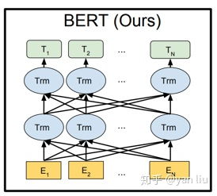

# 词向量的BERT

原文：https://zhuanlan.zhihu.com/p/48612853

## 前言

BERT(Bidirectional Encoder Representations from Transformers) 近期提出后，作为一个Word2Vec的替代者，其在NLP领域的11个方向上大幅刷新了精度，可以说是近年来自残差网络最优突破性的一项技术。论文主要特点有：

1. 使用了Transformer[2]作为算法的主要框架，Transformer能更彻底的捕捉语句中的双向关系
2. 使用了Mask Language Model(MLM)[3]和Next Sentence Prediction(NSP)的多任务训练目标
3. 使用更强大的机器训练更大规模的数据，是BERT的结果达到了全新的高度，并且Google开源了BERT模型，用户可以直接使用BERT作为Word2Vec的转换矩阵并高效的将其应用到自己的任务中

BERT的本质上是通过在海量的语料的基础上，运行自监督学习方法为单词学习一个好的特征表示，所谓自监督学习是指在没有人工标注的数据上运行的监督学习。在以后特定的NLP任务中，我们可以直接使用BERT的特征表示作为该任务的词嵌入特种。所以BERT提供的是一个任其它任务迁移学习的模型，该模型可以根据任务微调或固定之后作为特征提取器。BERT的源码和模型10月31号在Github上已经[开源](https://github.com/google-research/bert)，简体中文和多语言模型也于11月3号开源。

## BERT详解

### 网络架构

BERT的网络框架使用的是《Attention is all you need》中提出的多层Transformer结构，其最大的特点是抛弃了传统的RNN和CNN，通过Attention机制将任意位置的两个单词的距离转换成1，有效的解决了NLP中棘手的长期依赖问题。Transformer的结构在NLP领域中已经得到了广泛应用，并且作者已经发布了TensorFlow的tensor2tensor库中。

Trnasformer的网络架构图如图1所示，Transformer是一个encoder-decoder的结构，由若干个编码器和解码器堆叠形成。图1的左侧部分为编码器，有Multi-Head Attention和一个全连接组成，用于将输入语料转化成特征向量。右侧部分是解码器，其输入为编码器的输出以及已经预测的结果，有Masked Multi-Head Attention, Multi-Head Attention以及一个全连接组成，用于输出最后结果的条件概率。关于Transformer的详细解析，参考[这里](https://zhuanlan.zhihu.com/p/48508221)。

​                                                                              图1 ： BERT中采用的Transformer 网络

图1 中的左侧部分是一个Transformer Block， 对应到图2中国的一个“Trm”。

​                                                                              图2 ： BERT的网络结构

BERT提供了简单和复杂两个模型，对应的超参数分别如下：

* $BERT_{BASE}$ ：L=12， H=768， A=12，参数总量110M
* $BERT_{LARGE}$: L=24， H=1024， A=16， 参数总量340M

在上面的超参数中，L表示网络的层数（即 Transformer blocker的数量）， A表示Multi-Head Attention中的self-Attention的数量，filter的尺寸是4H。

论文中还对比了BERT和GPT[4]和ELMo[5]，他们两个的结构图如图3所示：

​                                                                              图3 ： OpenAI GPT 和 ELMo

BERT对比这两个算法的优点是，只有BERT表征会基于所有层中的左右两侧语境。BERT能做到这一点得益于Transformer中Attention机制将任意位置的两个单词的距离转换为1。

### 输入表示

BERT的输入的编码向量（长度是512）是3个**嵌入特征的单位和**，如图4，这三个词嵌入特征是：

1. WordPiece嵌入[6]：WordPiece是指将单词划分成一组有限的公共子词单元，能在单词的有效性和字符的灵活性之间取得一个折中平衡。例如图4的示例中，“playing”被拆分成了“play”和“ing”
2. 位置嵌入（Position Embeddding）：位置嵌入是指将单词的位置信息编码成特征向量，位置嵌入是向模型中引入单词位置关系的至关重要一环。位置嵌入的具体内容，请参考[这里](https://link.zhihu.com/?target=https%3A//senliuy.gitbooks.io/advanced-deep-learning/content/di-er-zhang-ff1a-xu-lie-mo-xing/attention-is-all-you-need.html)
3. 分割嵌入（Segment Embedding）：用于区分两个句子，例如B是否是A的下文（对话场景，问答场景等）。对于句子对，第一个句子的特征值是0，第二个句子的特征值是1

最后，说明一下图4中的两个特种符号[CLS]和[SEP]，其中[CLS]表示该特征用于分类模型，对非分类模型，该符合可以省略。[SEP]表示分句符号，用于断开输入语料中的两个句子。

​                                                图4 ： BERT的输入特征。特征是Token嵌入，位置嵌入和分割嵌入的单位和

### 预训练任务

BERT是一个多任务模型，它的任务是由两个自监督任务组成，即MLM和NSP。

#### Task #1： Masked Language Model - MLM

Masked Language Model（MLM）和核心思想取自Wilson Taylor在1953年发表的一篇论文[7]。所谓MLM是指，在训练的时候随机从输入语料上mask掉一些单词，然后通过上下文预测该单词，该任务非常像在中学时经常做的完形填空。正如传统的语言模型算法和RNN匹配那样，MLM的这个性质和Transformer的结构是非常匹配的。

在BERT的实验中，15%的WordPiece Token会被随机Mask掉。在训练模型时，一个句子会被多次喂到模型中用于参数学习，但是Google并没有在每次都mask掉这些单词，而是在确定要mask掉的单词后，80%的时候会直接替换为[mask]，10%的时候将其替换为其他任意单词，10%的时候保留原始Token：

* 80%：my dog is hairy -> my dog is [mask]
* 10%：my dog is hairy -> my dog is apple
* 10%：my dog is hairy -> my dog is hairy

这么做的原因是如果句子中的某个Token 100%都会被mask掉，那么在fine-tuning的时候模型就会有一些没有见过的单词。加入随机Token的原因是因为Transformer要保持对每个输入token的分布式表征，否则模型就会记住这个[mask]是token ’hairy‘。至于单词带来的负面影响，因为一个单词被随机替换掉的概率只有15%*10%=1.5%，这个负面影响其实是可以忽略不计的。

另外文章指出每次只预测15%的单词，因此模型收敛的比较慢。

#### Task #2: Next Sentence Prediction - NSP

Next Sentence Prediction（NSP）的任务是判断句子B是否是句子A的下文。如果是的话输出’IsNext‘，否则输出’NotNext‘。训练数据的生成方式是从平行语料中随机抽取的连续两句话，其中50%保留抽取的两句话，它们符合IsNext关系，另外50%的第二句话是随机从预料中提取的，它们的关系是NotNext的。这个关系保存在图4中的`[CLS]`符号中。

### 微调

在海量语料上训练完BERT之后，便可以将其应用到NLP的各个任务中了。对于NSP任务来说，其条件概率表示为$P = softmax(CW^T)$，其中$C$是BERT输出中的[CLS]符号，$W$ 是可学习的权值矩阵。

对于其它任务来说，我们也可以根据BERT的输出信息作出对应的预测。图5展示了BERT在11个不同任务中的模型，它们只需要在BERT的基础上再添加一个输出层便可以完成对特定任务的微调。这些任务类似于我们做过的文科试卷，其中有选择题，简答题等等。图5中其中Tok表示不同的Token， $E$ 表示嵌入向量，$T_i$表示第$i$个Token在经过BERT处理之后得到的特征向量。

​                                                                              图5 ： BERT用于模型微调

微调的任务包括：

1. **基于句子对的分类任务**

   * MNLI：给定一个前提（Premise），根据这个前提去推断假设（Hypothesis）与前提的关系。该任务的关系分为三种：蕴含关系（Entailment）、矛盾关系（Contradiction）以及中立关系（Neutral）。所以这个问题本质上是一个分类问题，需要做的就是去发掘前提和假设这两个句子对之间的交互信息
   * QQP：基于Quora，判断Quora上的两个问题句是否表示一样的意思
   * QNLI：用于判断问是否包含问题的答案，类似于做阅读理解定位问题所在的段落
   * STS-B：预测两个句子的相似性，包括5个级别
   * MRPC：也是判断两个句子是否是等价
   * RTE：类似于MNLI，但是只对蕴含关系的二分类判断，而且数据集更小
   * SWAG：从四个句子中选择为可能为前句下文的那个

2. **基于单个句子的分类任务**

   * SST-2：电影评价的感情分析
   * CoLA：句子语义判断，是否可接受的（Acceptable）

   对于GLUE数据集的分类任务（MNLI，QQP，QNLI，SST-B，MRPC，RTE，SST-2，CoLA），BERT的微调方法是根据[CLS]标志生成一组特征向量$C$，并通过一层全连接进行微调。损失函数根据任务类型自行设计，例如多分类的softmax或者二分类的sigmoid

   SWAG的微调方法与GLUE数据集类似，只不过其输出是四个可能选项的softmax：
   $$
   P_i = \frac{e^{V.C_i}}{\sum_{j=1}^4{e^{V.C_i}}}
   $$
   
3. **问答任务**

   * SQuAD v1.1：给定一个句子（通常是一个问句）和一段描述文本，输出这个问题的答案，类似于做阅读理解的简答题。如图5（C）表示的，SQuAD的输入是问题和描述文本的句子对。输出是特征向量，通过在描述文本上接一层激活函数为softmax的全连接来获得输出文本的条件概率，全连接的输出节点个数是语料中Token的个数：
     $$
     P_i = \frac{e^{S.T_i}}{\sum_j{e^{S.T_i}}}
     $$

4. **命名实体识别**

   * CoNLL-2003 NER：判断一个句子中的单词是不是Person，Organization，Location，Miscellaneous或者other（无命名实体）。微调CoNLL-2003 NER时将整个句子作为输入，在每个时间片输出一个概率，并通过softmax得到这个Token的实体类别。

## 总结

BERT近期火得一塌糊涂不是没有原因的：

1. 使用Transformer的结构将已经走向瓶颈期的Word2Vec带向了一个新的方向，并再一次炒火了《Attention is All you Need》这篇论文；
2. 11个NLP任务的精度大幅提升足以震惊整个深度学习领域；
3. 无私的开源了多种语言的源码和模型，具有非常高的商业价值。
4. 迁移学习又一次胜利，而且这次是在NLP领域的大胜，狂胜。

BERT算法还有很大的优化空间，例如我们在Transformer中讲的如何让模型有捕捉Token序列关系的能力，而不是简单依靠位置嵌入。BERT的训练在目前的计算资源下很难完成，论文中说 ![[公式]](https://www.zhihu.com/equation?tex=%5Ctext%7BBERT%7D_%7B%5Ctext%7BLARGE%7D%7D) 的训练需要在64块TPU芯片上训练4天完成，而一块TPU的速度约是目前主流GPU的7-8倍。非常幸运的是谷歌开源了各种语言的模型，免去了我们自己训练的工作。