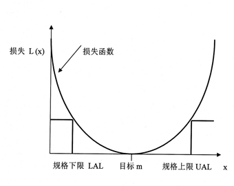

# 常见的损失函数

原文： https://www.toutiao.com/a6585133695361876487/

​        损失函数（Loss Function）又叫做代价函数（cost function），是用来评估模型的预测值与真实值不一致的程度，也是神经网络中优化的目标函数，神经网络训练或者优化的过程就是最小化损失函数的过程，损失函数越小，说明模型的预测值就越接近真实值，模型的健壮性也就越好。

常见的损失函数有一下几种：

### 0-1损失函数 (0-1 loss function)

​        **0-1损失函数** 是最为简单的一种损失函数，多适用于分类问题中。如果预测值与目标值不相等，说明预测错误，输出值为1；如果预测值与目标值相同，说明预测正确，输出为0，言外之意没有损失。数学公式可以表示为：
$$
L(Y, f(X)) = \left \{ \begin{array}{rcl} 1, Y \neq f(X) \\ 0, Y = f(X) \end{array}\right.
$$
​        由于**0-1损失函数**过于理想化、严格化，且数学性质不是很好，难以优化，所以在实际问题中，经常会用以下的损失函数替代。

### 感知损失函数 (Perceptron Loss)

​        感知损失函数是对 **0-1损失函数** 的改进，它并不会像**0-1损失函数** 那样严格，哪怕预测值为 0.99，真实值为 1，都会认为是错误的；而是给一个误差区间，只要在误差区间内，就认为是正确的。数学公式为：
$$
\ell(y_i, \hat{y_i}) = \left \{ \begin{array}{rcl}1 , |y_i - \hat{y_i}| > t \\
0, |y_i - \hat{y_i}| \leqslant t \end{array}\right.
$$

### 平方损失函数 (Quadratic Loss Function)

​        平方损失函数是指预测值与真实值**差值的平方**。损失越大，说明预测值与真实值的差值越大。平方损失函数多用于线性回归任务中，其数学公式为：
$$
L(Y, f(X)) = (Y - f(X))^2
$$
接下来，延伸到样本个数为 $N$ 的情况，此时的平方损失函数为：
$$
L(Y,f(X)) = \sum_{i=1}^n{(Y_i - f(X_i))^2}
$$

### Hinge损失函数 (Hinge Loss Function)

​        Hinge损失函数通常适用于**二分类**的场景中，可以用来解决间隔最大化的问题，常应用于著名的SVM算法中。其数学公式为：
$$
\ell(y) = max(0,1-t \cdot y)
$$
其中，$t$ 是目标值 $(-1, +1)$ ，$y$ 为预测值的输出，取值范围在 $(-1, 1)$ 之间。

### 对数损失函数 (Log Loss Function)

​        对数损失函数也是常见的一种损失函数，常用于**逻辑回归问题**中，其标准形式为：
$$
L（Y,P(Y|X)) = - logP(Y|X)
$$
其中，$y$ 为已知分类的类别， $x$ 为样本值，需要让概率$p(y|x)$ 达到最大值，也就是说要求一个参数值，使得输出的目前这组数据的概率值最大。因为概率 $P(Y|X)$ 的取值范围为 $[0,1]$，$log(x)$ 函数在区间 $[0, 1]$ 的取值为负数，所以为了保证值为正数要在 $log$ 函数前加**负号**。

### 交叉熵损失函数 (Cross-entropy Loss Function)

​        交叉熵损失函数本质上是一种对数损失函数，常用于**多分类**问题中。公式为：
$$
C = -\frac{1}{n}\sum_x{[yln\alpha + (1-y)ln(1 - \alpha)]}
$$
其中，$x$ 表示样本， $y$ 代表预测的输出， $\alpha$ 为实际输出， $n$ 表示样本总数量。交叉熵损失函数常用于当sigmoid函数作为激活函数的情景，因为它可以完美解决平方损失函数权重更新过慢的问题。