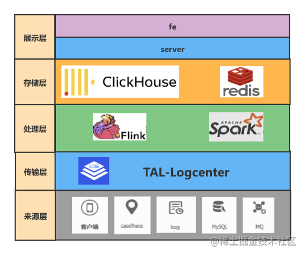

# 实时大屏技术解决方案

原文：https://juejin.cn/post/7001804363807227934

## 一. 背景

实时监控大屏，作为大数据领域的经典应用，已经普遍存在各大互联网公司的应用案例中。像淘宝双11的实时销售大屏、滴滴的用户地域分布等场景，那么在“好未来”的业务体系中，也有很多核心场景需要通过实时大屏来进行统一监控。这里介绍《未来云-业务监控》提供的实时监控大屏解决方案。

## 二. 关键点

整个实时大屏的建设分为“技术”和“产品”两部分。下面分别列出一些项目中的关键点和难点：

### 2.1 技术维度

* 海量日志的秒级实时指标计算
* 日志流量潮汐性较大的计算保障
* 不同类型指标的存储类型

### 2.2 产品维度

* 哪些业务需要实时大屏
* 哪些指标需要展示在大屏上
* 怎么去定义一个实时大屏的价值

## 三. 技术架构

### 3.1 架构详解

#### 3.1.1 数据来源层

来源层主要包括所有和目标业务关联的核心日志信息，业务数据等。主要包括：

* 客户端日志：用户埋点信息、操作行为、网络请求、崩溃异常等
* 链路日志：请求调用链路中涉及的关键步骤日志，包括DCDN、原站、服务端Trace等
* 业务日志：业务事件的关键日志信息，映射到关键业务行为的痕迹
* 业务数据：结构化的数据库中的多维度业务基础信息，例如用户、课程、订单等

#### 3.1.2 传输层

主要依托于未来云-日志中心的采集通道，将来源层的各源数据进行统一采集分发，需要在日志中心平台上进行统一采集注册，满足采集投递的元数据的规范

#### 3.1.3 处理层

主要基于分布式实时计算引擎来进行数据处理，目前任务主要分布在 Flink 集群和 Spark 集群

* Flink：

  流处理引擎，流式处理时延低，支持 SQL，目前有 on K8s 和 on Yarn 两种部署模式

* Spark：

  微批处理引擎，对时延要求相对不高，支持SQL，目前 on Yarn 部署

#### 3.1.4 存储层

主要是实时 OLAP 场景下，流量潮汐性较大的场景，经过选型，基于以下两类组建建设：

* ClickHouse：

  面向列的DBMS，分布式架构，高效的实时数据更新，支持SQL，丰富的函数，但是不支持 update 和事务。场景选型时需要关注。目前代理选用 CHProxy，避免多分片表节点数据分布不均、读写分离、提高高可用性

* Redis：

  内存数据库，性能表现优异，操作原子性，在秒级、毫秒级场景下可以快速支持数据读写，不支持SQL，数据建模成本略高。目前基于 Twemporxy 代理实现集群方案，主要作为缓存和体量较大的暴力实时数据指标请求

#### 3.1.5 展示层

后端服务和存储层做逻辑交互，将数据拼装，和前端进行数据交互展示，和前端交互协议：

* http：

  客户端发起，分钟级别以上的数据刷新频率。适用请求量及请求频率不高的场景

* webSocket：

  服务端推送，秒级及秒级以内的刷新频率。例如秒级销量、秒级在线人数、秒级告警推送等等

### 3.2 经验分享

#### 3.2.1 潮汐性大的场景

目前可触达的业务模式，大多数时潮汐性较大的，以网校为例，直播在线的每天的高峰主要集中在白天固定的时间段，在没有课程的时候，日志的峰值和高峰时相差很大。而由于各个端、服务模块频繁的版本迭代，对日志体量的预估无法单纯的和业务数据线性关联，这个时候可以从以下几个方向去提升计算任务的稳定性：

##### 3.2.1.1 压测

实时计算场景的压测和业务压测有一定的区别，在流式数据计算下，数据实时QPS，单条数据的大小，关键字段的种类，都会对计算任务的稳定造成影响，单纯的模拟规范日志发压，可能并不能真实的压出计算任务的瓶颈和问题，所以在压测的时候，会选用线上高峰时段的真实日志，结合任务场景，制造出合理场景下多种数据倾斜的案例去进行压测，除了在低峰期压测，也会在可控容量范围内，在业务高峰时候，以最小单位计算资源去进行测试高峰时期的任务表现，是否可以和压测的结果相匹配。

##### 3.2.1.2 任务调度

在业务流量较小的时候，很多实时任务是健康的，当业务日志高峰到来的时候，往往会形成峰值交叉的情况，这个时候计算任务不能只关注逻辑，也要关注物理部署环境，要保证任务的网络开销最小，和上下游做好沟通，保障数据流在合理的物理机房内闭环，尽量不做过长的网络传输行为，一旦出现跨机房拉取行为，机房间的专线带宽是交叉使用的，很有可能会生成连带问题，产生更大的事故

##### 3.2.1.3 资源伸缩

在压测充分以及任务部署合理的情况下，也总会有超过"预估"峰值的场景，对于这种场景，可以利用计算引擎层的能力来帮助解决，基于 spark on Yarn 的动态资源机制，可以实现在自身队列资源内，任务自行做资源扩充，也在测试基于 flink on k8s 的 native 模式来实现动态的资源伸缩。在上述基础上，依然会保留一定的资源 buffer 给资源高峰去做冗余，不会完全依靠资源伸缩去抗住高峰，前面必要的资源扩容是不可少的。

#### 3.2.2 不同指标的存储选型

实时大屏会存在多种维度，多种时效的指标数据。针对不同的指标，也要有合理的存储选型：

1. **秒级指标**

   ClickHouse 和 Redis 都有足够的写入性能去支持秒级的指标。比如像秒级 qps、reqTime、错误率等等。但是在读取的时候，就要进行场景的区分。

   如果涉及到页面大量获取数据，频繁简单请求，没有复杂的统计或者维度关联的，会选用 Redis。

   又如猫头鹰监控，如果是需要进行链路关联查询，复杂算法，同环比分析等操作，会选用给予 ClickHouse 完成。这样可以充分利用 SQL，和其他自身丰富的函数支持业务需求

2. **分钟级+指标**

   分钟或者分钟以上的指标，写入频率和读取频率也不高，大多数这类指标是为了分析，可以统一选择 ClickHouse 来存储。如果数据源在 MySQL，对于业务峰值写入不高的，可以直接读取业务从库来获取指标；对于峰值 MySQL 压力较高的，可以通过实时 binlog 采集来进行增量计算，写入 ClickHouse 来进行读取

## 四. 产品思考

### 4.1 哪些业务需要实时大屏

实时大屏具有两个最重要的特点。针对这两点来分析。

#### 4.1.1 实时性

在大屏上看到的数据都是随着时间变化的，用户期望通过大屏关注到的是最新的情况、信息和问题。所以对实效性非常敏感的业务是适合建设实时监控大屏的。

#### 4.1.2 高度抽象化

实时大屏不是用来分析问题和找问题原因的，而是快速捕捉问题和获取实时最新信息的。所以对于复杂核心业务、所涉及到的模块、调用、业务耦合非常多，涉及到的伙伴角色也有很多的时候，大屏的价值就体现出来了。它会快速的提升大规模作战时的协同性和工作效率，大家只需要盯住自己的核心指标的异动即可，简洁清爽。

### 4.2 哪些指标需要展示在大屏上

#### 4.2.1 业务指标

快速了解其业务架构，从用户触达端，到服务层、组件层、资源层构建清晰的核心链路，对其进行模块拆解，把整个目标业务拆解为几个核心单元。

对于业务单元，需要展示此业务的北极星指标，比如订单量、在线人数、消息数等，

对于技术架构单元，需要展示此单元的压力、水位线、实时质量，比如接口QPS、系统容量、SLA指标等。

这样就可以把业务指标和技术指标直观的通过时间去做关联，辅助分析问题

#### 4.2.2 客诉指标

在核心的业务链路外，要考虑用户的反馈情况，比如客诉平台、用户求助平台等指标的变化，实时监控各类问题用户反馈人数的增长情况，也可以直观了解当前用户体验及质量，辅助判断问题

#### 4.2.3 告警

对于大屏的告警设计，在告警范围上，控制在大屏展示的指标范围内，让用户所见即所得，需要告警的指标按照阈值划分为预警和告警，在大屏上用橙色、红色来进行区分，告警触发时，展示指标变色，同时告警模块中弹出告警留存，对于在同一时间打开大屏的所有用户，都会收到同样的告警推送，持续累加，刷新之后页面不再留存，转为后台存储

