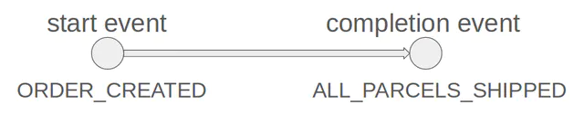
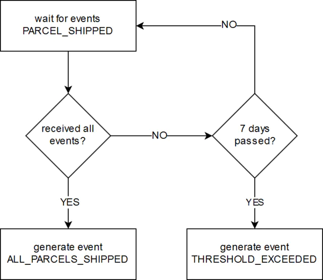
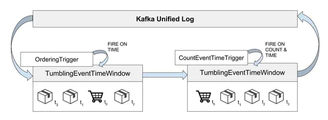

# Flink在业务监控中的应用

原文：https://engineering.zalando.com/posts/2017/07/complex-event-generation-for-business-process-monitoring-using-apache-flink.html


这是一篇个人翻译的文章。如果晦涩难懂，请参考原文链接。

## 业务流程

首先，先来熟悉一下问题领域。看看我们对业务流程监控的解决方案。

> *To start off, we would like to offer more context on the problem domain. Let’s begin by having a look at the business processes monitored by our solution.*


**业务流程**，简单的说，就是相关事件链。它具有一个“开始”和一个“完成”事件。如下图所示：

> *A **business process** is, in its simplest form, a chain of correlated events. It has a start and a completion event. See the example depicted below:*




示例中的“**开始事件**“是”ORDER_CREATED"。每当客户下单时，Zalando平台（内部）就会生成一个"ORDER_CREATED"事件。这个事件的大致是如下的JSON结构：

> *The **start event** of the example business process is ORDER_CREATED. This event is generated inside Zalando’s platform whenever a customer places an order. It could have the following simplified JSON representation:*

```json
{
 "event_type":          "ORDER_CREATED",
 "event_id":            1,
 "occurred_at":         "2017-04-18T20:00:00.000Z",
 "order_number":        123
}
```


“**完成事件**”命名为"ALL_PARCELS_SHIPPED"，这个事件的意思是，一个订单的包含的所有包裹都已经打包好，可以提供给物流公司运输了。这个事件的JSON结构如下：

> *The **completion event** is ALL_PARCELS_SHIPPED. It means that all parcels pertaining to an order have been handed over for shipment to the logistic provider. The JSON representation is therefore:*

```json
{
 "event_type":      "ALL_PARCELS_SHIPPED",
 "event_id":        11,
 "occurred_at":     "2017-04-19T08:00:00.000Z",
 "order_number":    123
}
```


注意到，这两个事件，都与**订单号**（order_number）相关联，而且它们都根据**发生时间**（occurred_at）排序。

> *Notice that the events are correlated on **order_number**, and also that they occur in order according to their **occurred_at** values.*


所以，可以监控这两个事件的间隔时间。假设，设定一个特定的阈值，比如7天，那么就可以判单哪些订单已经过期，然后就可以采取一些措施，保证相关的包裹立即发货。这样一来，就可以保证客户的满意度。

> *So we can monitor the time interval between these two events, ORDER_CREATED and ALL_PARCELS_SHIPPED. If we specify a threshold, e.g. 7 days, we can tell for which orders the threshold has been exceeded and then can take action to ensure that the parcels are shipped immediately, thus keeping our customers satisfied.*


## 问题陈述

**复杂事件**，就是从其它事件“**推测**”出来的事件。

> *A **complex event** is an event which is inferred from a pattern of other events.*


还是用业务流程的例子，比如，从一系列 "PARCEL_SHIPPED" 事件，通过一定的规则（pattern）可以“推测”出 ALL_PARCELS_SHIPPED 事件。例如：在7天内，系统收到某一个订单的所有 "PAECEL_SHIPPED"事件，那么就可以生成一个 “ALL_PARCELS_SHIPPED”事件；相反的，如果过了7天，只收到部分 “PARCEL_SHIPPED” 事件，那么就可以生成一个警告事件 “THRESHOLD_EXCEEDED”。

> *For our example business process, we want to infer the event ALL_PARCELS_SHIPPED from a pattern of PARCEL_SHIPPED events, i.e. generate ALL_PARCELS_SHIPPED when all distinct PARCEL_SHIPPED events pertaining to an order have been received within 7 days. If the received set of PARCEL_SHIPPED events is incomplete after 7 days, we generate the alert event THRESHOLD_EXCEEDED.*


假设，如果提前知道某个订单需要发货多少个包裹，就可以知道接收到多少个 “PARCEL_SHIPPED” 事件表示发货已经结束了。这个信息，实际上包含在 “ORDER_CREATED” 事件的某个属性里，比如属性 "parcels_to_ship":3* 。

> *We assume that we know beforehand how many parcels we will ship for a specific order, thus allowing us to determine if a set of PARCEL_SHIPPED events is complete. This information is contained in the ORDER_CREATED event in the form of an additional attribute, e.g. "parcels_to_ship":  3.*


此外，假设这些事件按顺序依次发出去后，例如， 事件"ORDER_CREATED" 的 “occurred_at” 时间戳应该 **小于** 事件“PARCEL_SHIPPED”事件的时间戳。

> *Furthermore, we assume that the events are emitted in order, i.e. the **occurred_at** timestamp of ORDER_CREATED is smaller than all of the PARCEL_SHIPPED’s timestamps.*


另外，要求完成事件 "ALL_PARCELS_SHIPPED" 也有一个时间戳，这个时间戳与最后一个 “PARCEL_SHIPPED” 事件的时间戳相等。

> *Additionally we require the complex event ALL_PARCELS_SHIPPED to have the timestamp of the last PARCEL_SHIPPED event.*


下面流程图展示了这个原始的思路：

> *The raw specification can be represented through the following flowchart:*




现在，使用Flink替代Kafka来处理这些事件。

> *We process all events from separate Apache Kafka topics using Apache Flink. For a more detailed look of our architecture for business process monitoring, [please have a look here](https://www.slideshare.net/ZalandoTech/stream-processing-using-apache-flink-in-zalandos-world-of-microservices-reactive-summit/33).*


## 生成复合事件 (Generating Complex Events)

现在，已经知道了问题是什么了，可以着手解决问题了：生成复合事件 “ALL_PARCELS_SHIPPED” 和 “THRESHOLD_EXCEEDED”

> *We now have all the required prerequisites to solve the problem at hand, which is to generate the complex events ALL_PARCELS_SHIPPED and THRESHOLD_EXCEEDED.*


首先，看看Flink的Job的实现方式：

> *First, let’s have an overview on our Flink job’s implementation:*



1. 从 Kafka 读取事件 "ORDER_CREATED" 和 "PARCEL_SHIPPED"
2. 为了事件的时间处理，给事件添加“水印”（watermark）信息
3. 通过关键属性，如 *order_number*，把属于同一个订单的事件归并到一起
4. 给每个 *oder_number* 的客户事件触发器分配一个 *TumblingEventTimeWindows*
5. 在事件触发前，在触发窗口时间内给事件排序。


> 1. *Read the Kafka topics ORDER_CREATED and PARCEL_SHIPPED.*
> 2. *Assign watermarks for event time processing.*
> 3. *Group together all events belonging to the same order, by keying by the correlation attribute, i.e. order_number.*
> 4. *Assign TumblingEventTimeWindows to each unique order_number key with a custom time trigger.*
> 5. *Order the events inside the window upon trigger firing. The trigger checks whether the watermark has passed the biggest timestamp in the window. This ensures that the window has collected enough elements to order.*
> 6. *Assign a second TumblingEventTimeWindow of 7 days with a custom count and time trigger.*
> 7. *Fire by count and generate ALL_PARCELS_SHIPPED or fire by time and generate THRESHOLD_EXCEEDED. The count is determined by the "parcels_to_ship" attribute of the ORDER_CREATED event present in the same window.*
> 8. *Split the stream containing events ALL_PARCELS_SHIPPED and THRESHOLD_EXCEEDED into two separate streams and write those into distinct Kafka topics.*