# Flink架构及其工作原理

原文：https://www.cnblogs.com/code2one/p/10123112.html


目录：

* System Architecture
* Data Transfer in Flink
* Event Time Processing
* State Management
* Checkpoints, Savepoints, and State Recovery


## 1. System Architeture

分布式系统需要解决：分配和管理在集群的计算资源、处理配合、持久和可访问的数据存储、失败恢复。而**Flink专注于分布式流处理**。

### 1.1Components of Flink Setup

* **JobManager**： 接受 application，包含StreamGraph ( DAG )、JobGraph ( logical dataflow graph，已经进过优化，如task chain ) 和JAR，将JobGraph 转化为 ExecutionGraph ( physical data flow graph， 并行化 )，包含可以并发执行的tasks。其它工作类似 Spark Driver，如向RM申请资源、schedule tasks、保存作业的元数据，如 checkpoints。如今JM 和 ResourceManager ( 和下面的不同 )，分别负责任务和资源，在 Session 模式下启动多个 Job 就会有多个 JobManager。

* **ResourceManager**：一般是 Yarn，当TM ( Task Manager ) 有空闲的slot就会告诉JM，没有足够的slot也会启动新的TM。Kill 掉长时间空闲的TM。

* **TaskManager**：类似Spark的executor，会跑多个线程的 task、数据缓存与交换。

* **Dispatcher** ( Application Master ) ：提供REST接口来接收 client 的application 提交，它负责启动JM和提交application，同时运行 web UI。

  > ​        *Task 是最基本的调度单位，有一个线程执行，里面包含一个或多个 operator。多个operators就成为operation chain，需要上下游并发度一致，且传递模式（之前的Data exchange strategies）是forward。*
  >
  > ​        *Slot 是TM的资源子集。结合下面Task Execution 的图，一个slot并不代表一个线程，它里面并不一定只放一个task。 多个task在一个slot就涉及slot sharing group。一个JobGraph的任务需要多少slot，取决于最大的并发度，这样的话，并发1 和 并发2 就不会放到一个slot中。 Co-Location Group 是在此基础上，数据的forward形式，即一个slot中，如果它处理的是Key1的数据，那么接下来的task也是处理Key1的数据，此时就达到Co-Location Group。*
  >
  > ​        *尽管有Slot sharing group，但一个group里串联起来的task各自所需资源的大小并不好确定。阿里日常用的最多的还是一个task一个slot的方式。*

* **Session 模式**：下图展示的是Session模式。预先启动好AM和TM，每提交一个job就启动一个Job Manager并向Flink的RM申请资源，不够的话，Flink的RM向YARN的RM申请资源。**这种模式，适合规模小、运行时间短的作业。** 下面是启动命令示例：

  ```shell
  ./bin/flink run ./path/to/job.jar
  ```


* **Job模式**：每一个job都重新启动一个Flink集群，完成后结束Flink，且只有一个Job Manager。资源按需申请，适合大作业。下面是启动示例：

  ```shell
  ./bin/flink run -m yarn-cluster ./path/to/job.jar
  ```

  下面是简单的例子，详细看[官网](https://ci.apache.org/projects/flink/flink-docs-release-1.7/ops/deployment/yarn_setup.html)：

  ```shell
  # 启动yarn-session，4个TM，每个有4GB堆内存，4个slot
  cd flink-1.7.0/
  ./bin/yarn-session.sh -n 4 -jm 1024m -tm 4096m -s 4
  # 启动作业
  ./bin/flink run -m yarn-cluster -yn 4 -yjm 1024m -ytm 4096m ./example/batch/WordCount.jar
  ```

  > *细节取决于具体环节，如不同的RM*

### 1.2 Application Deployment

* **Framework模式**：Flink作业为JAR，并提交到Dispatcher or JM or YARN
* **Library模式**：Flink的作业为application-specfiic container image, 如Docker image，适合微服务

### 1.3 Task Execution

* **作业调度**：在流计算中预先启动好节点，而在批计算中，每当某个阶段完成计算才启动下一个节点

* **资源管理**：slot作为基本单位，有大小和位置属性。JM有SlotPool，向Flink RM申请 Slot，FlinkRM发现自己的SlotManager中没有足够的slot，就会向集群RM申请。后者（集群RM）返回可用TM的IP，让Flink RM去启动，TM启动后向Flink RM注册。然后Flink RM再向TM请求slot，TM向JM提供相应的slot。

  JM用完后释放slot，TM会把释放的slot报告给Flink RM。在Blink版中，Job模式会根据申请slot的大小分配相应的TM，而session模式则预先设置好TM大小，每当有slot申请就从TM中划分相应的资源。

* **任务**：任务可以是相同Operator（data parallelism），不同operator（task parallelism），甚至不同application（job parallelism）。TM提供一定数量的slots来控制并发的任务数。


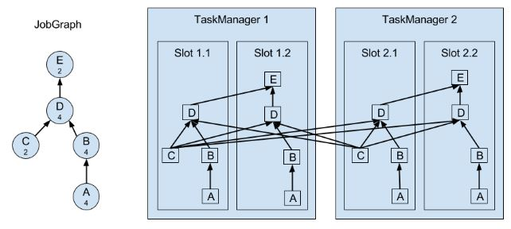

​        上图 A 和 C 是source function，E 是sink function，小数字表示并行度。


一个TM是一个JVM进程，它通过多线程完成任务。线程的隔离不太好，一个线程失败有可能导致整个TM失败。

### 1.4 Highly-Available Setup

从失败中恢复需要重启失败进程、作业和恢复他的state。

当一个TM挂掉而RM又无法找到空闲的资源时，就只能暂时降低并行度，直到有空闲的资源重启TM。

当JM挂掉就靠ZK来重现选举，和找到JM存储在远程storage的元数据、JobGraph。重启JM并从最后一个完成的checkpoint开始。

> *JM在执行期间会得到每个task checkpoints的state存储路径（task将state写到远程storgae）并写到远程storage，同时在ZK的存储路径留下pointer指明到哪里找上面的存储路径。*

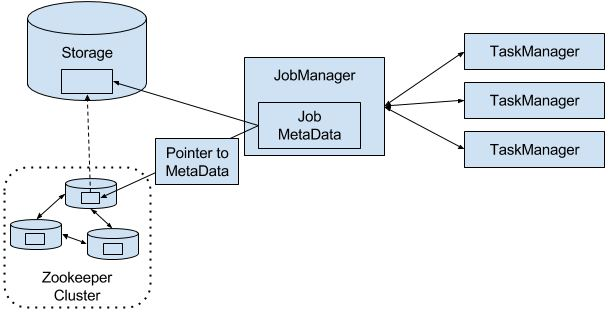

### 1.5 backpressure（背压）

**数据涌入的速度大于处理的速度。**在source operator中，可通过Kafka解决。在任务间的operator有如下机制应对：

* **Local Exchange**：task1 和 task2 在同一个工作节点，那么buffer pool 可以直接交给下一个任务，但下一个任务task2 消费buffer pool中的信息速度减慢时，当前任务task1 填充buffer pool 的速度也会减慢
* **Remote Exchange**：TM保证每个task至少有一个 incoming 和一个 outgoing 缓冲区。当下游receiver 的处理速度低于上游的sender 的发送速度，receiver 的incoming 缓冲区就会开始积累数据（需要空闲的buffer来放置从TCP连接中接收的数据），当挤满后就不再接收数据。上游sender 利用***netty水位机制***，当网络中的缓冲数据过多时暂停发送。

## 2. Date Transfer in Flink

TM负责数据在tasks间的转移，转移之前会存储到buffer（这又变回micro-batches）。每个TM有 **32KB** 的网络buffer用于接收和发送数据。

***如果sender和receiver在不同进程，那么会通过操作系统的网络栈来通信***。每对TM保持permanent TCP连接交换数据。每个sender任务能够给所有receiving任务发送数据，反之，所有receiver任务能够接收所有sender任务的数据。TM保证每个任务都**至少**有一个incoming和outgoing的buffer，并增加额外的缓冲区分配约束来避免死锁。

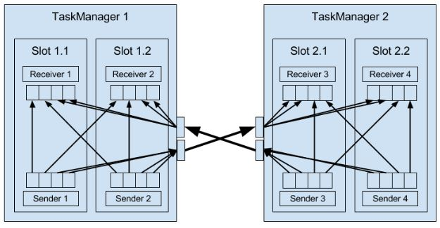

***如果sender和receiver任务在同一个TM进程，sender会序列化结果数据到buffer，如果满了就放到队列***。receiver任务通过队列得到数据并进行反序列化。这样的好处是解耦任务并允许在任务中使用可变对象，从而减少了对象实例化和垃圾回收。一旦数据被序列化，就能安全地修改。而缺点就是计算消耗大，在一些条件下能够把task串起来，避免序列化。

### 2.1 Flow Control with Back pressure

receiver放到缓冲区的数据变为队列，sender将要发送的数据变为队列，最后sender减慢发送数据。

## 3. Event Time Processing

Event Time处理的数据必须有时间戳（Long Unix Timestamp）并定义了watermarks (缩写：WM)。watermark是一种特殊的records holding a timestamp long value。它**必须是递增的**（防止倒退），有一个timestamp（下图标记**5**处），暗示所有接下来的数据都会大于这个值。后来的，小于这个值，就会被视为迟来的数据，Flink有其他机制处理。

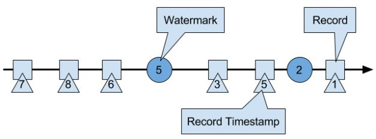

​                                             **Watermarks and EventTime**

WM在Flink是一种特殊的record，它会被operator tasks接收和释放。

tasks有时间服务来维持timers（timers注册到时间服务上），在time-window task中，timers分别记录了各个window的结束时间。当任务获得一个watermark时，task会根据这个watermark的timestamp更新内部的event-time clock。任务内部的时间服务确定所有timer时间是否小于watermark的timestamp，如果大于，则触发call-back算子来释放记录并返回结果。最后task还会将更新的event-time clock的WM进行广播（参考下图）。

只有ProcessFunction可以读取和修改timestamp或者watermark（ The *ProcessFunction* can read the timestamp of a currently processed record, request the current event-time of the operator, and register timers）。下面是PF的行为：

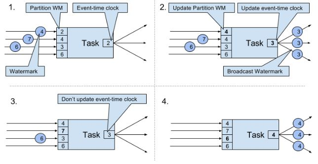

当收到WM**大于**所有目前*拥有的WM*，就会把event-time clock更新为所有WM中**最小的**那个，并广播这个最小的WM。即便是多个streams输入，机制也是一样，只是增加Partition WM数量。这种机制要求获得的WM必须是累加的，而且task必须有新的WM接收，否则clock就不会更新，task的timers就不会被触发。另外，当多个streams输入时，timers会被WM比较离散的stream主导，从而使更密集的stream的state不断积累。

### 3.1 Timestamp Assignment and Watermark Generation

WM在Streaming application消化流时产生，Flink有三种方式：

* **SourceFunction**（缩写：SF）：产生的record带有timestamp，一些特殊时点产生WM。如果SF暂时不再发送WM，则会被认为是 ***idle***。Flink会从接下来的watermark operators 中排除由这个SF生产的分区（上图有4个分区），从而解决timer不触发的问题。
* **AssignerWithPeriodicWatermarks**：提取每条记录的timestamp，并周期性的查询当前WM，即上图的Partition WM。
* **AssignerWithPunctuatedWatermarks**：可以从每条数据提取WM

> *上面两个User-defined timestamp assignment functions通常用在source operator附近，因为stream一经处理就很难把握record的时间顺序了。所以UDF可以修改timestamp和WM，但在数据处理时使用不是一个好主意。*


## 4. State Management

由任务维护并用于计算函数结果的所有数据都属于任务的state。其实state可以理解为task业务逻辑的本地或实例变量。

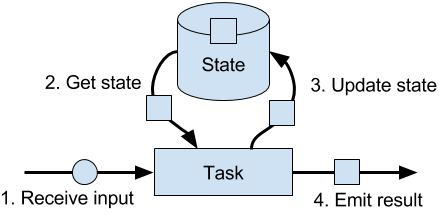

在Flink，state总是和特定的operator关联。operator需要注册它的state，而state有两种类型：

* **Operator State**: 由同一并行任务处理的所有记录都可以访问相同的state，而其他的task或operator不能访问，即一个task专属一个state。这种state有三种primitives：
  * List State represents state as a list of entries
  * Union List State同上，但在任务失败和作业从savepoint重启的行为不一样
  * Broadcast State(v.15)，同样一个task专属一个state，但state都是一样的（需要自己注意保持一致，对state更新时，实际上只对当前task的state进行更新。只有所有task的更新一样时，即输入数据一样（一开始广播所以一样，但数据的顺序可能不一样），对数据的处理一样，才能保证state一样）。这种state只能存储在内存，所以没有RockDB backend。
* **Keyed State**: 相同key的record共享一个state。
  * Value State：每个Key一个值，这个值可以是复杂的数据结构
  * List State：每个Key一个list
  * Map State：每个Key一个map

上面两种state的存在方式有两种：raw和managed，一般都是用后者，也推荐用后者（更好的内存管理、不需造轮子）。

### 4.1 State Backends

State backend决定了state如何被存储、访问和维持。它的主要职责是本地的state管理和chekcpoint state到远程。在管理方面，可以选择将state存储到内存还是磁盘。

MemoryStateBackend, FsStateBackend, RocksDBStateBackend适合越来越大的state。都支持异步checkpoint，其中RockDB还支持incremental的checkpoint。

> 注意：As RocksDB's JNI bridge API is based on byte[], the maximum supported size per key and per value is 2^31 bytes each. Impornt: states that use merge operations in RocksDB (e.g. ListState) can silently accumulate value sizes > 2^31 bytes and will then fail on their next retrieval. This is currently a limitation of RacksDB JNI.

### 4.2 Scaling Stateful Operators

Flink 会根据input rate 调整并发度。对于stateful operators有以下4种方式：

* **keyed state:** 根据key group来调整，即分为同一组的key-value会被分到相同的task

* **list state:** 所有list entries会被收集并重新均匀分布，当增加并发度时，要新建list

* **union list state:** 增加并发时，广播整个list，所有rescaling后，所有task都有所有的list state

  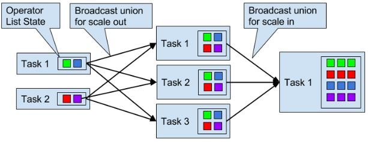

* **broadcast state:** 

  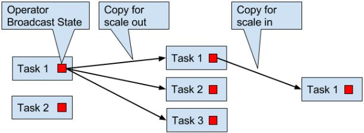

## 5. Checkpoints, Savepoints, and State Recovery

### 5.1 Flink's Lightweght Checkpointing Algorithm

在分布式开源算法Chandy-Lamport的基础上实现。**有一种特殊的record叫做 checkpoint barrier** (简称：**CB**，由JM产生)，它带有checkpoint ID 来把流进行划分。在 CB 前面的records 会被包含到checkpoint，之后的会被包含在之后的checkpoint

当source task 收到这种信息，就会停止发送 records，触发 state backend对本地state的checkpoint，并广播checkpoint ID到所有下游task。当checkpoint完成时，state backend唤醒source task，后者向JM确定相应的checkpoint ID 已经完成任务。


当下游获得其中一个CB时，就会暂停处理这个CB对应的source的数据（完成checkpoint后发送的数据），并将这些数据存到缓冲区，直到其它相同ID的CB都到齐，就会把state（下图的12、8）进行checkpoint，并广播CB到下游。知道所有CB被广播到下游，才开始处理排队在缓冲区的数据。当然，其它没有发送CB的source的数据会继续处理。

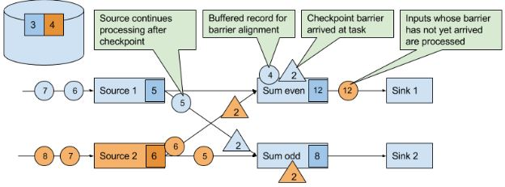

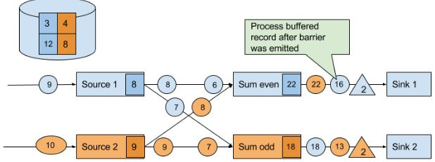

最后，当所有sink会向JM发送CB确定checkpoint已完成。

这种机制还有两个优化：

* 当operator的state很大时，复制整个state并发送到远程Storage会很费时。而RocksDB state backend支持aynchronous and incremental的checkpoints。当触发checkpoint时，backend会快照所有本地的state的修改（直至上一次checkpoint），然后马上让task继续执行。后台线程异步发送快照到远程storage。
* 在等待其余CB时，已经完成checkpoint的source数据需要排队。但如果使用at-least-once就不需要等了。但当所有CB到齐在checkpoint，存储的state就已经包含了下一次checkpoint才记录的数据（如果是取最值，这种state就无所谓）。

### 5.2 Recovery from Consistent Checkpoints

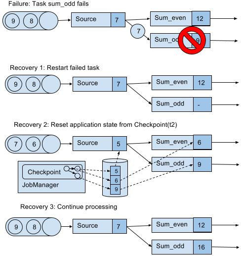

上图队列中的7和6之所以能恢复，取决于数据源是否resettable，如Kafka，不会因为发送信息就把信息删除。这才能实现处理过程的exactly-once state consistency（严格来讲，数据还是被重复处理，但是在读档后重复的）。但是下游系统有可能接收到多个结果。这方面，Flink提供sink算子实现output的exactly-once，例如给checkpoint提交records释放记录。另一个方法是idempotent updates。

### 5.3 Savepoints

checkpoints加上一些额外的元数据，功能也是在checkpoint的基础上丰富。不同于checkpoints，savepoint不会被Flink自动创造（由用户或者外部scheduler触发创造）和销毁。savepoint可以重启不同但兼容的作业，从而：

- 修复bugs进而修复错误的结果，也可用于A/B test或者what-if场景。
- 调整并发度
- 迁移作业到其他集群、新版Flink

也可以用于暂停作业，通过savepoint查看作业情况。