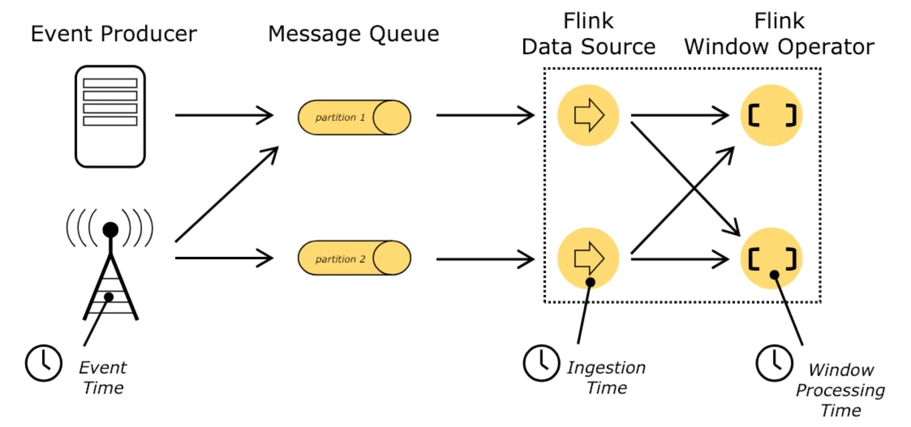
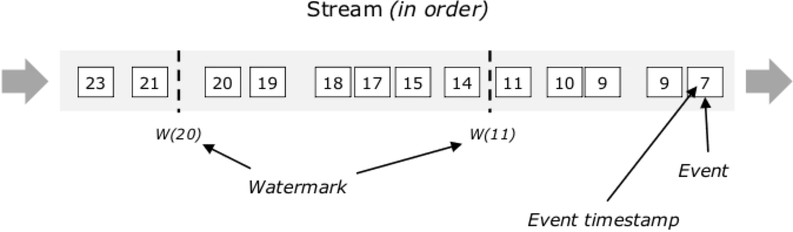
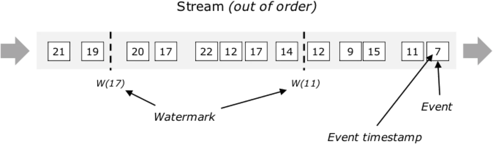
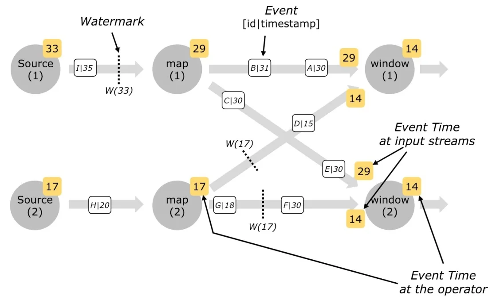
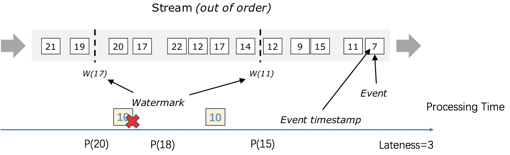
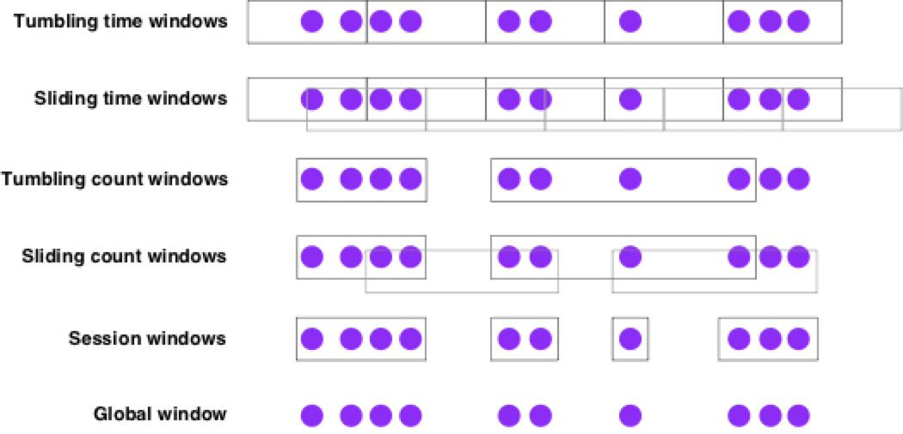
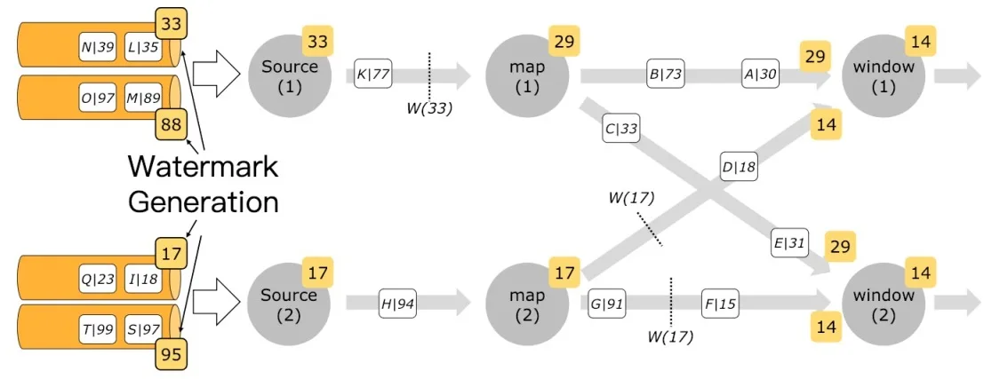

# Flink EventTime 和 Watermark

原文：https://xie.infoq.cn/article/b001d745b35067ca1665edbbe


## 时间概念

时间在流式计算中起很重要的作用。Flink 提供了 3 种时间模型：EventTime、ProcessingTime、IngestionTime (1.13版已经不再提Ingestion Time了)。底层实现上分 2 种：ProcessingTime 和 EventTime，IngestionTime本质上也是一种ProcessingTime，对于 3 着的描述，参考下图：



* **Event Time**：事件创建的时间，即数据产生时自带时间戳
* **Processing Time**：每一个执行 window 操作的**本地时间**
* **Ingestion Time**：事件进入 Flink 的时间，即进入 source operator 时给定的时间戳

### Flink 如何设置时间域

调用 `setStreamTimeCharacteristic` 设置时间域，枚举类 `TimeCharacteristic` 预设了三种时间域，不显式设置的情况下，默认使用 `TimeCharacteristic.EventTime`（1.12 版本以前默认是 `TimeCharacteristic.ProcessingTime`）。

```java
env = StreamExecutionEnvironment.getExecutionEnvironment();
// 已经是过期方法
env.setStreamTimeCharacteristic(TimeCharacteristic.ProcessingTime);
```

在 1.12 以后版本默认是使用 EventTime，如果要显示使用 ProcessingTime，可以关闭 watermark（自动生成 watermark 的间隔设置为 0），设置：

```java
env.getConfig().setAutoWatermarkInterval(0);
```

## EventTime 和 Watermark

### 为什么必须处理事件时间

在大多数情况下，消息进入系统中是无序的（网络、硬件、分布式逻辑都可能影响），并且会有消息延迟到达（例如移动场景中，由于手机无信号，导致一系列的操作消息在手机重新连接信号后发送），如果按照消息进入系统的时间计算，结果会与实时严重不符合。**理想情况是 event time 和 processing time 是一致的（发生时间即处理时间），但是现实情况是不一致的，两者存在 skew**。

因此，支持事件时间的流式处理程序需要一种方法来测量事件时间的进度。例如，有一个按小时构建的窗口，当事件时间超过了一小时的时间范围，需要通知该窗口，以便关闭正在进行的窗口。

### 什么是 Watermark

Flink 中检测事件时间处理进度的机制就是 Watermark，Watermark 作为数据处理流中的一部分进行传输，并且携带一个时间戳 `t`。一个 `Watermark(t)` 表示流中应该不再有事件时间比 `t` 小的元素（只是让系统这样认为，并不代表实际情况）。

### Watermark 有助于解决乱序问题

下图表示一个顺序的事件流中的 Watermark，w(x) 代表 Watermark 更新值：



下图表示一个**乱序的事件流**中的 Watermark，表示所有事件时间戳小于 Watermark 时间戳的数据都已经处理完了，任何事件大于 Watermark 的元素都不应该再出现（如果出现，系统可以丢弃改消息，或其他处理行为），当然这只是一种推测性的结果（基于多种信息的推测）




### 并行流中的 Watermark

Watermark 是在 Source function 处或之后**立即生成**的。Source function 的每个并行子任务通常独立地生成 Watermark。这些 Watermark 定义了该特定并行源的事件时间。

当 Watermark 经过流处理程序时，会将该算子的事件时间向前推进。当算子推进其事件时间时，会为下游的算子生成新 Watermark。

一些算子使用多个输入流，例如，使用 keyBy/partition 函数的算子。此类算子的当前事件时间是其输入流事件时间的最小值。当它的输入流更新它们的事件时间时，算子也会更新。

下图显示了事件和 Watermark 经过并行流的示例，以及跟踪事件时间的运算符。



## 延迟记录(Late Elements)

某些记录可能会违反 Watermark 的条件，事件时间小于 `t` 但是晚于 `Watermark(t)` 到达。实际运行过程中，事件可能被延迟任意的时间，所以不可能指定一个时间，保证该时间之前的所有事件都被处理了。而且，即使延时时间是有界限的，过多的延迟的时间也是不理想的，会造成时间窗口处理的太多延时。

系统允许设置一个可容忍的延迟时间，在距离 `t` 的时间在可容忍的延迟时间内，可以继续处理数据，否则丢弃。



## 窗口计算 (Windowing)

聚合事件（如 count、sum）在流处理和批处理中的工作方式不同。例如，无法计算流中的所有元素（认为流是无界的，数据是无限的）。流上的聚合由窗口来确定计算范围，例如，在过去 5 分钟内计数或最后 100 个元素的总和。

窗口可以是时间驱动或数据驱动，一种窗口的分类方式：滚动窗口（tumbling，窗口无重叠）、滑动窗口（sliding，窗口有重叠）、会话窗口（session，以无活动时间间隔划分）。



## 生成时间戳和 Watermark

### Watermark 策略 (Watermark Strategy)

为了处理事件时间，Flink 需要知道事件时间戳，这意味着流中的每个元素都需要分配其事件时间戳。这通常是通过使用 TimestampAssigner 从元素中的某个字段提取时间戳来完成的。

时间戳分配与生成 Watermark 密切相关，Watermark 告诉系统事件时间的进度，可以通过指定 WatermarkGenerator 进行配置。

Flink API 需要一个同时包含 TimestampAssigner 和 WatermarkGenerator 的 WatermarkStrategy（Watermark 生成策略）。提供了一些常见的策略可以直接使用（作为 WatermarkStrategy 的静态方法），用户也可以在需要时自定义构建策略。

```java
public interface WatermarkStrategy<T> 
    extends TimestampAssignerSupplier<T>, WatermarkGeneratorSupplier<T>{
    /**
     * 实例化一个 TimestampAssigner 对象，来生成/指定时间戳
     */
    @Override
    TimestampAssigner<T> createTimestampAssigner(TimestampAssignerSupplier.Context context);

    /**
     * 实例化一个 WatermarkGenerator 对象，生成 watermark
     */
    @Override
    WatermarkGenerator<T> createWatermarkGenerator(WatermarkGeneratorSupplier.Context context);
}
```

通常不需要自己实现此接口，而是使用 WatermarkStrategy 提供的实现常见的水印策略。例如，要使用有界无序 watermark，lambda 函数作为时间戳赋值器：

```java
WatermarkStrategy
        .<Tuple2<Long, String>>forBoundedOutOfOrderness(Duration.ofSeconds(20))
        .withTimestampAssigner((event, timestamp) -> event.f0);
// 指定 TimestampAssigner 是可选的，有些场景下不需要指定，例如可以直接从 Kafka 记录中获取
```

### 使用 Watermark 策略

在 Flink 应用程序中有两个地方可以使用 WatermarkStrategy：1. 直接在 Source 算子上，2.在非 Source 算子之后。

第一种选择更可取，因为允许 Source 利用 watermark 逻辑中关于 shards/partitions/splits 的信息。Source 通常可以在更精细的层次上跟踪 watermark，并且 Source 生成的整体水印将更精确。直接在源上指定水印策略通常意味着您必须使用特定于源的接口，后文介绍了在 Kafka Connector 上的工作方式，以及每个分区水印在其中的工作方式的更多详细信息。

第二个选项（在任意操作后设置 WatermarkStrategy）应该只在无法直接在 Source 上设置策略时使用：

```java
final StreamExecutionEnvironment env = StreamExecutionEnvironment.getExecutionEnvironment();

DataStream<MyEvent> stream = ...;

DataStream<MyEvent> withTimestampsAndWatermarks = 
      stream
        .assignTimestampsAndWatermarks(<watermark strategy>)
        .keyBy( (event) -> event.getGroup() )
        .window(TumblingEventTimeWindows.of(Time.seconds(10)))
        .reduce( (a, b) -> a.add(b) )
        .addSink(...);
```

### Idle Source 处理

如果其中一个输入的 splits/partitions/shards 在一段时间内没有任何事件，这意味着 WatermarkGenerator 也不会获得任何新的水印信息，可以称之为 Idle input 或 Idle source。

这是一个问题，因为其他的一些分区可能仍然有事件发生，在这种情况下，Watermark 不会更新（因为有多个 input 的算子的 Watermark 被计算为所有 input 的 watermark 的最小值）。

为了解决这个问题，可以使用 WatermarkStrategy 检测并将 input 标记为空闲：

```java
WatermarkStrategy
        .<Tuple2<Long, String>>forBoundedOutOfOrderness(Duration.ofSeconds(20))
        .withIdleness(Duration.ofMinutes(1));
```

## Watermark Generator

TimestampAssigner 是一个从事件中提取字段的简单函数，因此不需要详细研究它们。另一方面，WatermarkGenerator 有点复杂，这是 WatermarkGenerator 接口：

```java
/**
 * 根据事件，或周期性地生成 watermark
 *
 * <p><b>Note:</b> WatermarkGenerator 包含了以前版本 AssignerWithPunctuatedWatermarks 的
 * AssignerWithPeriodicWatermarks 的功能（已经弃用）
 */
@Public
public interface WatermarkGenerator<T> {

    /**
     * 为每个事件调用，允许 watermark generator 检查并记住事件时间戳
     * 或基于事件本身发出 watermark
     */
    void onEvent(T event, long eventTimestamp, WatermarkOutput output);

    /**
     * 定期调用，可能会发出新的 watermark，也可能不会
     *
     * 调用间隔取决于 ExecutionConfig#getAutoWatermarkInterval() 设置的值
     */
    void onPeriodicEmit(WatermarkOutput output);
}
```

有两种不同的 Watermark 生成方式：periodic（周期的）和 punctuated（带标记的）。

- 周期的生成器通过 `onEvent()` 观察传入事件，然后在框架调用 `onPeriodicEmit()` 时发出水印。
- 带标记的生成器通过 `onEvent()` 观察传入事件，并等待流中带有 watermark 信息的特殊标记事件（special marker events）或标记（punctuations）。当观察到其中一个时，会立即发出水印。

### Periodic WatermarkGenerator

周期生成器定期观察流事件并生成 watermark（可能取决于流元素，或者完全基于处理时间）。

生成 watermark 的间隔通过 `ExecutionConfig.setAutoWatermarkInterval()` 定义，每次都会调用生成器的 `onPeriodicEmit()` 方法，如果返回的 watermark 不为空且大于上一个 watermark，则会发出新的 watermark。

这里展示两个简单的例子。请注意，Flink 自带的 BoundedOutOfOrdernessWatermarks 是类似的水印生成器，可以在这里查看更详细内容。

```java
// 事件时间 watermark
// 事件到达时在一定程度上是无序的，某个时间戳 t 的最后达到元素相比时间戳 t 的最早到达元素，最大延迟 n 毫秒。
public class BoundedOutOfOrdernessGenerator implements WatermarkGenerator<MyEvent> {
    // 允许数据的延迟，3.5 seconds
    private final long maxOutOfOrderness = 3500; 

    private long currentMaxTimestamp;

    @Override
    public void onEvent(MyEvent event, long eventTimestamp, WatermarkOutput output) {
        currentMaxTimestamp = Math.max(currentMaxTimestamp, eventTimestamp);
    }

    @Override
    public void onPeriodicEmit(WatermarkOutput output) {
        output.emitWatermark(new Watermark(currentMaxTimestamp - maxOutOfOrderness - 1));
    }

}

// 处理时间 watermark
// 生成的 watermark 比处理时间滞后固定时间长度。
public class TimeLagWatermarkGenerator implements WatermarkGenerator<MyEvent> {

    private final long maxTimeLag = 5000; 

    @Override
    public void onEvent(MyEvent event, long eventTimestamp, WatermarkOutput output) {
        // 处理时间不关心事件
    }

    @Override
    public void onPeriodicEmit(WatermarkOutput output) {
        output.emitWatermark(new Watermark(System.currentTimeMillis() - maxTimeLag));
    }
}
```

### Punctuated WatermarkGenerator

带标记的生成器将观察事件流，并在遇到带有特殊信息的元素时发出 watermark。

```java
public class PunctuatedAssigner implements WatermarkGenerator<MyEvent> {

    @Override
    public void onEvent(MyEvent event, long eventTimestamp, WatermarkOutput output) {
        // 事件只要带有特殊标记，就发出 watermark
        if (event.hasWatermarkMarker()) {
            output.emitWatermark(new Watermark(event.getWatermarkTimestamp()));
        }
    }

    @Override
    public void onPeriodicEmit(WatermarkOutput output) {
        // to do nothing
    }
}
```

**需要注意的是**，可以在每个事件上生成 watermark。但是，由于每个 watermark 都会引起下游的一些计算，过多的 watermark 会降低性能。

## Kafka Connector 应用 WatermarkStrategy

### 每个 Kafka 分区一个时间戳

当使用 Kafka 作为数据源的时候，每个分区可能有一个简单的事件时间模式（按时间戳升序或其他）。当消费来自 Kafka 的流数据时，多个分区一般会并行消费。分区中的事件交替消费，会破坏分区中的模式。

在这种情况下，可以使用 Flink 的 Kafka-partition-aware（分区感知）watermark 生成器。使用这个特性的时候，watermark 会在 Kafka 消费者内部为每个分区生成，并且每个分区 watermark 的合并方式与在流进行 shuffle 时合并的方式相同。

例如，如果事件时间戳严格按每个 Kafka 分区升序排列，那么使用 [ascending timestamps watermark generator](https://ci.apache.org/projects/flink/flink-docs-release-1.13/docs/dev/datastream/event-time/generating_watermarks/event_timestamp_extractors.html#assigners-with-ascending-timestamps)。下图显示了如何为每个 Kafka 分区生成 watermark，以及在这种情况下 watermark 如何通过数据流传播。

```java
FlinkKafkaConsumer<MyType> kafkaSource = new FlinkKafkaConsumer<>("myTopic", schema, props);

kafkaSource.assignTimestampsAndWatermarks(
        WatermarkStrategy.
                .forBoundedOutOfOrderness(Duration.ofSeconds(20)));

DataStream<MyType> stream = env.addSource(kafkaSource);
```




### How Operators Process Watermarks

作为一般规则，Operator 需要完全处理一个给定的 watermater，然后再转发到下游。例如，WindowOperator 将首先计算所有应该触发的窗口，只有在生成由 watermark 触发的所有输出之后，watermark 才会被发送到下游。

同样的规则也适用于 TwoInputStreamOperator。但是，在这种情况下，Operator 的当前 watermark 被定义为其两个输入的最小值。

详细内容可查看对应算子的实现：`OneInputStreamOperator#processWatermark`、`TwoInputStreamOperator#processWatermark1` 和 `TwoInputStreamOperator#processWatermark2`。

