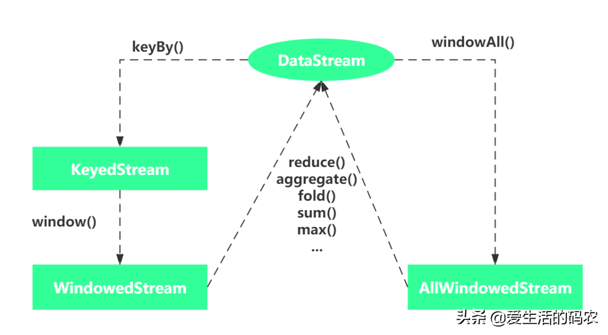

# Flink内置Window的全面解析

原文：https://www.toutiao.com/a6991483867177796099/


​        窗口是流式应用中十分常见的操作。它们可以在不限数据流上基于有界区间实现聚合等转换。通常情况下，这些区间都是基于时间算子定义的。窗口函数提供了一种基于有限大小的桶对事件进行分组，并对这些桶中的有限内容进行计算。例如，窗口算子可以将数据流中的事件按每 5 分钟的窗口进行分组，并计算出每个窗口中收到的事件数。此外，Flink 还支持自定义窗口功能。

## 1. 定义窗口算子

​        窗口算子可用在键值分区或非键值分区的数据流上。用于键值分区窗口的算子可以并行计算，而非键值分区窗口只能单线程处理。

​        新建一个窗口算子需要指定两个窗口组件：

### 1.1 窗口分配器

​        一个用于决定输入流中的元素该如何划分的窗口分配器（window assigner）。窗口分配器会产生一个 WindowedStream（如果用在非键值分区的 DataStream 上则是 AllWindowedStream）。

### 1.2 窗口函数

​        一个作用于 WindowedStream（或 AllWindowedStream）上，用于处理分配到窗口中元素的窗口函数。



## 2 如何使用 

​        上面介绍了什么是窗口，那么该如何使用窗口呢？具体如下面的代码片段

### 2.1 Keyed Windows

```java
stream
       .keyBy(...)               		// keyedStream上使用window
       .window(...)              		// 必选: 指定窗口分配器( window assigner)
      [.trigger(...)]            		// 可选: 指定触发器(trigger),如果不指定，则使用默认值
      [.evictor(...)]            		// 可选: 指定清除器(evictor),如果不指定，则没有
      [.allowedLateness(...)]   		// 可选: 指定是否延迟处理数据，如果不指定，默认使用0
      [.sideOutputLateData(...)] 		// 可选: 配置side output，如果不指定，则没有
       .reduce/aggregate/fold/apply() 	// 必选: 指定窗口计算函数
      [.getSideOutput(...)]      		// 可选: 从side output中获取数据
```

### 2.2 Non-Keyed Windows

```java
stream
       .windowAll(...)           		// 必选: 指定窗口分配器( window assigner)
      [.trigger(...)]            		// 可选: 指定触发器(trigger),如果不指定，则使用默认值
      [.evictor(...)]           	 	// 可选: 指定清除器(evictor),如果不指定，则没有
      [.allowedLateness(...)]    		// 可选: 指定是否延迟处理数据，如果不指定，默认使用0
      [.sideOutputLateData(...)] 		// 可选: 配置side output，如果不指定，则没有
       .reduce/aggregate/fold/apply() 	// 必选: 指定窗口计算函数
      [.getSideOutput(...)]     		// 可选: 从side output中获取数据
```

## 3. 内置窗口分配器

​        WindowAssigner 负责将输入的数据分配到一个或多个窗口，Flink内置了许多WindowAssigner，这些WindowAssigner可以满足大部分的使用场景。比如 tumbling windows，sliding Windows， session Windows， global Windows。如果这些内置的WindowAssigner不能满足需求，则可以通过继承WindowAssigner类来实现自定义的WindowAssigner。

​        上面的WindowAssigner是基于时间的（Time-Based windows）（左闭右开）。它对外提供了获取窗口边界、检查窗口是否相交，以及合并重叠窗口等方法。

​        接下里介绍 DataStream API 中的多种内置窗口分配器以及如何使用它们来定义窗口算子。

### 3.1 滚动窗口（Tumbling Windows）

​        如下图所示，滚动窗口分配器会将元素放入**大小固定且互不重叠**的窗口中。


​        DataStream API 针对事件时间和处理时间的滚动窗口分别提供了对应的分配器--TumblingEventTimeWindows 和 TumblingProcessingTimeWindows。滚动窗口分配器只接收的一个参数：以时间单位表示的窗口大小。它可以利用分配器的 *of(Time Size)* 方法制定。时间间隔允许以毫秒、秒、分钟、小时或者天。

#### 使用EventTime

```java
StreamExecutionEnvironment env = StreamExecutionEnvironment.getExecutionEnvironment();
        DataStream<SensorReading> inputStream = env.addSource(new SensorSource());
        inputStream.keyBy("id")
            	// 将输入流数据按照1秒钟事件时间窗口分组
                .window(TumblingEventTimeWindows.of(Time.seconds(1)))
                .process(new MinTemperatureWindow());
```

#### 使用ProcessTime

```java
StreamExecutionEnvironment env = StreamExecutionEnvironment.getExecutionEnvironment();
        DataStream<SensorReading> inputStream = env.addSource(new SensorSource());
        inputStream.keyBy("id")
                // 将输入流数据按照1秒钟处理时间窗口分组
                .window(TumblingProcessingTimeWindows.of(Time.seconds(1)))
                .process(new MinTemperatureWindow());
```

​        默认情况下，滚动窗口会和纪元时间 1970-01-01 -00 :00:00.000 对齐。例如，大小为 1 小时的分配器将会在 00:00:00、01:00:00、02:00:00 定义窗口。或者也可以通过第二个参数指定一个偏移量。以下代码展示了偏移量为 15 分钟的窗口，它们将从 00:15:00、01:15:00、02:15:00 …… 时间点开始：

```java
StreamExecutionEnvironment env = StreamExecutionEnvironment.getExecutionEnvironment();
        DataStreamSource<SensorReading> inputStream = env.addSource(new SensorSource());
        inputStream.keyBy("id")
                // 将输入流数据按照1秒钟处理时间窗口分组
                .window(TumblingEventTimeWindows.of(Time.hours(1), Time.minutes(15)))
                .process(new MinTemperatureWindow());
```

### 3.2 滑动窗口（Sliding Windows）

​        如下图所示，滑动窗口分配器将元素分配给大小固定且按制定滑动间隔移动的窗口。


​         对于滑动窗口而言，需要指定窗口大小以及用于定义新窗口开始频率的滑动间隔。如果滑动间隔小于窗口大小，则窗口会出现重叠，此时元素会被分配给多个窗口；如果滑动间隔大于窗口大小，则一些元素可能不会分配给任何窗口，因此可能会被直接丢弃。

​        关于时间的选择，可以使用 EventTime 或者 ProcessingTime，分别对应的 window assigner为：SlidingEventTimeWindows 、SlidingProcessingTimeWindows。 用户可以使用Window Assigner的 *of(size)* 方法指定时间间隔。

​        以下代码展示了如何将传感器读数按照大小为 1 小时、滚动间隔为 15 分钟的滑动窗口进行分组。每个读数将被放入四个窗口中。

#### 使用EventTime

```java
// 事件时间滑动窗口分配器
DataStream<Tuple2<String, Long>> slidingMinTemp = inputStream.keyBy("id")
                // 每隔15分钟创建1小时的事件时间窗口
                .window(SlidingEventTimeWindows.of(Time.hours(1), Time.minutes(15)))
                .process(new MinTemperatureWindow());
```

#### 使用ProcessTime

```java
// 处理时间滑动窗口分配器
DataStream<Tuple2<String, Long>> slidingProcessMinTemp = inputStream.keyBy("id")
                // 每隔15分钟创建1小时的处理时间窗口
                .window(SlidingProcessingTimeWindows.of(Time.hours(1), Time.minutes(15)))
                .process(new MinTemperatureWindow());
```

### 3.3 会话窗口（Session Window）

​        会话窗口将元素放入长度可变且不重叠的窗口中。会话窗口的边界由非活动间隔，即持续没有收到记录的时间间隔来定义。下图解释了如何将元素分配到会话窗口中。


​        以下示例展示了如何将传感器读数按照会话窗口进行分组，其中每个会话的非活动时间都设置为15分钟：

#### 使用EventTime

```java
// 事件时间会话窗口分配器
DataStream<Tuple2<String, Long>> sessionEventMinTemp = inputStream.keyBy("id")
                // 创建 15 分钟间隔的事件时间会话窗口
                .window(EventTimeSessionWindows.withGap(Time.minutes(15)))
                .process(new MinTemperatureWindow());
```

#### 使用ProcessTime

```java
// 处理时间会话窗口分配器
DataStream<Tuple2<String, Long>> sessionProcessMinTemp = inputStream.keyBy("id")
                // 创建 15 分钟间隔的处理时间会话窗口
                .window(ProcessingTimeSessionWindows.withGap(Time.minutes(15)))
                .process(new MinTemperatureWindow());
```

​        由于会话窗口的开始和结束都取决于接收的元素，所以窗口分配器无法实时将所有元素分配到正确的窗口。事实上，SessionWindows 分配器会将每个到来的元素映射到一个它自己的窗口中。该窗口的起始时间是元素的时间戳，大小为会话间隔。随后分配器会将所有范围存在重叠的窗口合并。

## 4. 在窗口上应用函数

​        窗口函数定义了针对窗口内元素的计算逻辑。可用于窗口的函数类型有两种：

1. **增量聚合函数**：它的应用场景是窗口内以状态形式存储某个值且需要根据每个加入窗口的元素对该值进行更新。此类函数通常会十分节省空间且最终会将聚合值作为单个结果发送出去。ReduceFunction 和 AggregateFunction 就属于增量聚合函数。
2. **全量窗口函数**：它会收集窗口内的所有元素，并在执行计算时对它们进行遍历。虽然全量窗口函数通常需要占用更多空间，但它和增量聚合函数相比，支持更复杂的逻辑。ProcessWindowFunction 就是一个全量窗口的函数。

​        下面介绍如何在窗口算子上同时应用增量聚合及全量窗口函数。

### 4.1 ReduceFunction

​        输入两个相同类型的数据元素按照指定的计算方法进行聚合，然后输出类型相同的一个结果元素。<font color='red'>要求输入元素的数据类型与输出元素的数据类型必须一致</font>。实现的效果是使用上一次的结果值与当前值进行聚合。

​        下面的示例展示的是Lamda函数，计算每 15 秒的最低温度。

```java
DataStream<Tuple2<String, Double>> minTempPerWindow = inputStream.map(new MapFunction<SensorReading, Tuple2<String, Double>>() {
            @Override
            public Tuple2<String, Double> map(SensorReading value) throws Exception {
                return Tuple2.of(value.getId(), value.getTemperature());
            }
        }).keyBy(0)
                .timeWindow(Time.seconds(15))
                .reduce(new ReduceFunction<Tuple2<String, Double>>() {
                    @Override
                    public Tuple2<String, Double> reduce(Tuple2<String, Double> value1,     Tuple2<String, Double> value2) throws Exception {
                        return Tuple2.of(value1.f0, Math.min(value1.f1, value2.f1));
                    }
                });
```

### 4.2 AggregateFunction

​        和 ReduceFunction 类似，AggregateFunction 也会以增量的方式应用于窗口内的元素。此外，使用了 AggregateFunction 的窗口算子，其状态也只有一个值。

​        虽然 AggreateFunction 和 ReduceFunction 相比，接口更灵活，但同时实现也更为复杂。以下代码展示了 AggregateFunction 接口：

```java
/** @param <IN>  输入元素的数据类型
 *  @param <ACC> 中间聚合结果的数据类型
 *  @param <OUT> 最终聚合结果的数据类型
 */
@PublicEvolving
public interface AggregateFunction<IN, ACC, OUT> extends Function, Serializable {
	// 创建一个新的累加器
	ACC createAccumulator();
	
    // 将新的数据与累加器进行聚合，返回一个新的累加器
	ACC add(IN value, ACC accumulator);

	// 从累加器中计算最终结果并返回
	OUT getResult(ACC accumulator);

	// 合并两个累加器并返回结果
	ACC merge(ACC a, ACC b);
}
```

​        该接口定义了输入类型 IN，累加器类型 ACC，以及结果类型 OUT。它和 ReduceFunction 不同的是中间数据类型以及结果类型不再依赖输入类型。

​        下面的示例展示了如何使用 AggregateFunction 计算每个窗口内传感器读数的平均温度。其累加器负责维护不断变化的温度总和及数量， getResult() 方法用来计算平均值：

```java
public class BuildinWindowOperator {
    public static void main(String[] args) throws Exception {
        StreamExecutionEnvironment env = StreamExecutionEnvironment.getExecutionEnvironment();
        
        DataStream<SensorReading> inputStream = env.addSource(new SensorSource());
        // AggregateFunction
        DataStream<Tuple2<String, Double>> aggregate = inputStream.map(new MapFunction<SensorReading, Tuple2<String, Double>>() {
            @Override
            public Tuple2<String, Double> map(SensorReading value) throws Exception {
                return Tuple2.of(value.getId(), value.getTemperature());
            }
        }).keyBy(0)
                .timeWindow(Time.seconds(15))
                .aggregate(new AvgTempFunction());
        aggregate.print();
        env.execute();
    }

    /**
     * 用于计算每个传感器平均温度的 AggregateFunction
     * 累加器用于保存温度总和及事件数量
     */
    private static class AvgTempFunction implements AggregateFunction<Tuple2<String, Double>, Tuple3<String, Double, Integer>, Tuple2<String, Double>> {
        DecimalFormat df = new DecimalFormat("#.0");
        @Override
        public Tuple3<String, Double, Integer> createAccumulator() {
            return Tuple3.of("", 0.0, 0);
        }

        @Override
        public Tuple3<String, Double, Integer> add(Tuple2<String, Double> value, Tuple3<String, Double, Integer> accumulator) {
            return Tuple3.of(value.f0, accumulator.f1+value.f1, accumulator.f2 + 1);
        }

        @Override
        public Tuple2<String, Double> getResult(Tuple3<String, Double, Integer> accumulator) {
            // Double.parseDouble(df.format((curFTemp[i]-32)/1.8)))
            return Tuple2.of(accumulator.f0, Double.parseDouble(df.format(accumulator.f1/accumulator.f2)));
        }

        @Override
        public Tuple3<String, Double, Integer> merge(Tuple3<String, Double, Integer> a, Tuple3<String, Double, Integer> b) {
            return Tuple3.of(a.f0, a.f1 + b.f1, a.f2 + b.f2);
        }
    }
}
```

### 4.3 ProcessWindowFunction

​        前面提到的 ReduceFunction 和 AggregateFunction 都是基于中间状态实现增量计算的窗口函数。有些时候，需要使用整个窗口的所有数据进行计算，比如求**中位数**和**众数**。另外，ProcessWindowFunction 的Context 对象可以访问窗口的一些元数据信息，比如窗口结束时间、水位线等。ProcessWindowFunction 能够更加灵活地支持基于窗口全部数据元素的结果计算。

​        在系统内部，由ProcessWindowFunction 处理的窗口会将所有已分配的数据存储到ListState中，通过将数据收集起来且提供对于窗口的元数据及其它一些特征的访问和使用，应用场景比 ReduceFunction 和 AggregateFunction 更加广泛。关于 ProcessWindowFunction 抽象类的源码，如下：

```java
/**
 * @param <IN> 输入的数据类型.
 * @param <OUT> 输出的数据类型.
 * @param <KEY> key的数据类型.
 * @param <W> window的类型.
 */
@PublicEvolving
public abstract class ProcessWindowFunction<IN, OUT, KEY, W extends Window> extends AbstractRichFunction {

	private static final long serialVersionUID = 1L;

	/**
	 * 计算窗口数据，输出0个或多个元素.
	 *
	 * @param key 窗口的key.
	 * @param context 窗口的上下文.
	 * @param elements 窗口内的所有元素.
	 * @param out 输出元素的collector对象.
	 *
	 * @throws Exception
	 */
	public abstract void process(KEY key, Context context, Iterable<IN> elements, Collector<OUT> out) throws Exception;

	/**
	 * 当窗口被销毁时，删除状态.
	 *
	 * @param context .
	 * @throws Exception.
	 */
	public void clear(Context context) throws Exception {}

	// context 可以访问窗口的元数据信息.
	public abstract class Context implements java.io.Serializable {
		// 返回当前被计算的窗口
		public abstract W window();

		// 返回当前processing time.
		public abstract long currentProcessingTime();

		// 返回当前event-time 水位线.
		public abstract long currentWatermark();

		// 每个key和每个window的状态访问器
		public abstract KeyedStateStore windowState();

		// 每个key的global state的状态访问器.
		public abstract KeyedStateStore globalState();

		/**
		 * 向side output输出数据
		 *
		 * @param outputTag the {@code OutputTag} side output 输出的标识.
		 * @param value 输出的数据.
		 */
		public abstract <X> void output(OutputTag<X> outputTag, X value);
	}
}
```

​        process() 方法在被调用时会传入窗口的键值、一个用于访问窗口内元素的 Iterator 以及一个用于发出结果的 Collector。此外，该方法和其他处理方法一样，都有一个 Context 参数。 ProcessWindowFunction 的 Context 对象可以访问窗口的元数据，当前处理时间和水位线，用于管理单个窗口和每个键值全局状态的状态存储以及用于发出数据的侧输出。

​        下面的示例，将传感器温度的数据流按照每 5 秒的滚动窗口进行分组，随后使用 ProcessWindowFunction 计算每个窗口内的最低温和最高温。每个窗口都会发出一条记录，其中包含了窗口的开始、结束时间，以及窗口内的最低、最高温。

```java
public class BuildinWindowProcess {
    public static void main(String[] args) throws Exception {
        StreamExecutionEnvironment env = StreamExecutionEnvironment.getExecutionEnvironment().setParallelism(1);
        env.setStreamTimeCharacteristic(TimeCharacteristic.EventTime);

        DataStream<SensorReading> inputStream = env.addSource(new SensorSource()).assignTimestampsAndWatermarks(new AscendingTimestampExtractor<SensorReading>() {
            @Override
            public long extractAscendingTimestamp(SensorReading element) {
                return element.getTimestamp() * 1000;
            }
        });

        // 每 5 秒输出最低温和最高温
        DataStream<Tuple4<String, Double, Double, Long>> minMaxTempPerWindow = inputStream.keyBy(t -> t.getId())
                .window(TumblingEventTimeWindows.of(Time.seconds(5)))
                .process(new HighAndlowTempProcessFunction());
        minMaxTempPerWindow.print();
        env.execute();
    }

    /**
     * 该 ProcessWindowFunction 用干计算每个窗口内的最低和最高温度，
     * 会将温度数连同窗口结束时间戳一起发出。
     */
    public static class HighAndlowTempProcessFunction extends ProcessWindowFunction<SensorReading, Tuple4<String, Double, Double, Long>, String, TimeWindow> {
        @Override
        public void process(String key, Context context, Iterable<SensorReading> elements, Collector<Tuple4<String, Double, Double, Long>> out) throws Exception {

            Double lowTemp=Double.MAX_VALUE;
            Double highTemp=Double.MIN_VALUE;
            for (SensorReading element : elements) {
                lowTemp = Math.min(lowTemp, element.getTemperature());
                highTemp = Math.max(highTemp, element.getTemperature());
            }
            long windowEnd = context.window().getEnd();
            out.collect(Tuple4.of(key, lowTemp, highTemp, windowEnd));
        }
    }
}
```

​        在系统内部，由 ProcessWinodwFunction 处理的窗口会将所有已分配的事件存储在 ListState中。ProcessWindowFunction 的应用场景比 ReduceFunction 和 AggregateFunction 更加广泛。但和执行增量聚合的窗口相比，收集全部事件的窗口状态要大得多。

### 4.4 增量聚合与 ProcessWindowFunction

​        ProcessWinodwFunction 提供了强大的功能，但是唯一的缺点就是需要更大的状态存储数据。在很多时候，增量聚合的使用非常频繁，那么如何实现既支持增量聚合，又支持窗口元数据的操作呢？可以将 ReduceFunction 和 AggregateFunction 与 ProcessWinodwFunction 整合在一起使用。通过这种组合方式，分配给窗口的元素会立即被执行计算。当窗口触发时，会把聚合的结果传给 ProcessWinodwFunction，这样 ProcessWinodwFunction 的 process 方法的 iterable 参数就只有一个值，即增量聚合的结果。

​        在 DataStream API 中，实现上述过程的途径是将 ProcessWinodwFunction 作为 reduce() 或者 aggregate() 方法的第二个参数：

```java
input
	.keyBy(...)
	.timeWindow(...)
	.reduce(
		incrAggregator: ReduceFunction[IN],
		function: ProcessWindowFunction[IN, OUT, K, W])
```

```scala
input
	.keyBy(...)
	.timeWindow(...)
	.aggregate(
		incrAggregator: AggregateFunction[IN, ACC, V],
		windowFunction: ProcessWindowFunction[V, OUT, K, W])
```

#### 4.4.1 ReduceFunction 与 ProcessWindowFunction 组合

​        下面的示例展示了如何使用ReduceFunction和ProcessWindowFunction的组合来实现为每个传感器，每5秒发出一次最高和最低温度以及窗口的结束时间戳。

```java
public class ReduceProcessWindowFunction {
    public static void main(String[] args) throws Exception {
        StreamExecutionEnvironment env = StreamExecutionEnvironment.getExecutionEnvironment().setParallelism(1);
        env.setStreamTimeCharacteristic(TimeCharacteristic.EventTime);

        // 模拟数据源
        DataStream<SensorReading> inputStream = env.addSource(new SensorSource()).assignTimestampsAndWatermarks(new AscendingTimestampExtractor<SensorReading>() {
            @Override
            public long extractAscendingTimestamp(SensorReading element) {
                return element.getTimestamp() * 1000;
            }
        });

        // 每 5 秒输出最低温和最高温
        inputStream.map(new MapFunction<SensorReading, Tuple3<String, Double, Double>>() {
            @Override
            public Tuple3<String, Double, Double> map(SensorReading value) throws Exception {
                return Tuple3.of(value.getId(), value.getTemperature(), value.getTemperature());
            }
        }).keyBy(t -> t.f0)
                .window(TumblingEventTimeWindows.of(Time.seconds(5)))
                // 增量计算最低和最高温度
                .reduce(new ReduceFunction<Tuple3<String, Double, Double>>() {
                    @Override
                    public Tuple3<String, Double, Double> reduce(Tuple3<String, Double, Double> value1, Tuple3<String, Double, Double> value2) throws Exception {
                        return Tuple3.of(value1.f0, Math.min(value1.f1, value2.f1), Math.max(value1.f2, value2.f2));
                    }
                },
                new AssignWindowEndProcessFunction()).print();
        env.execute();
    }

    private static class AssignWindowEndProcessFunction extends ProcessWindowFunction<Tuple3<String, Double, Double>, Tuple4<String, Double, Double, Long>, String, TimeWindow> {
        @Override
        public void process(String key, Context context, Iterable<Tuple3<String, Double, Double>> elements, Collector<Tuple4<String, Double, Double, Long>> out) throws Exception {
            out.collect(Tuple4.of(key, elements.iterator().next().f1, elements.iterator().next().f2, context.window().getEnd()));
        }
    }
}
```

#### 4.4.2. AggregateFunction 与 ProcessWindowFunction 组合

​        下面的示例展示了如何使用AggregateFunction和ProcessWindowFunction的组合来实现为每个传感器，每5秒发出一次最高和最低温度以及窗口的结束时间戳。

```java
public class AggregateProcessWindowFunction {
    public static void main(String[] args) throws Exception {
        StreamExecutionEnvironment env = StreamExecutionEnvironment.getExecutionEnvironment().setParallelism(1);
        env.setStreamTimeCharacteristic(TimeCharacteristic.EventTime);

        // 模拟数据源
        DataStream<SensorReading> inputStream = env.addSource(new SensorSource())
                .assignTimestampsAndWatermarks(new AscendingTimestampExtractor<SensorReading>() {
                    @Override
                    public long extractAscendingTimestamp(SensorReading element) {
                        return element.getTimestamp() * 1000;
                    }
                });

        // 每 5 秒输出最低温和最高温
        inputStream.keyBy(t -> t.getId())
                .window(TumblingEventTimeWindows.of(Time.seconds(5)))
                .aggregate(new TempAggregateFunction(), new AssignWindowEndProcessFunction())
                .print();
        env.execute();
    }

    private static class TempAggregateFunction implements AggregateFunction<SensorReading, Tuple3<String, Double, Double>, Tuple3<String, Double, Double>> {
        @Override
        public Tuple3<String, Double, Double> createAccumulator() {
            return Tuple3.of("", Double.MAX_VALUE, Double.MIN_VALUE);
        }

        @Override
        public Tuple3<String, Double, Double> add(SensorReading value, Tuple3<String, Double, Double> accumulator) {
            return Tuple3.of(value.getId(), Math.min(value.getTemperature(), accumulator.f1), Math.max(value.getTemperature(), accumulator.f2));
        }

        @Override
        public Tuple3<String, Double, Double> getResult(Tuple3<String, Double, Double> accumulator) {
            return accumulator;
        }

        @Override
        public Tuple3<String, Double, Double> merge(Tuple3<String, Double, Double> a, Tuple3<String, Double, Double> b) {
            return Tuple3.of(a.f0, Math.min(a.f1, b.f1), Math.max(a.f2, b.f2));
        }
    }

    private static class AssignWindowEndProcessFunction extends ProcessWindowFunction<Tuple3<String, Double, Double>, Tuple4<String, Double, Double, Long>, String, TimeWindow> {
        @Override
        public void process(String key, Context context, Iterable<Tuple3<String, Double, Double>> elements, Collector<Tuple4<String, Double, Double, Long>> out) throws Exception {
            out.collect(Tuple4.of(key, elements.iterator().next().f1, elements.iterator().next().f2, context.window().getEnd()));
        }
    }
}
```

