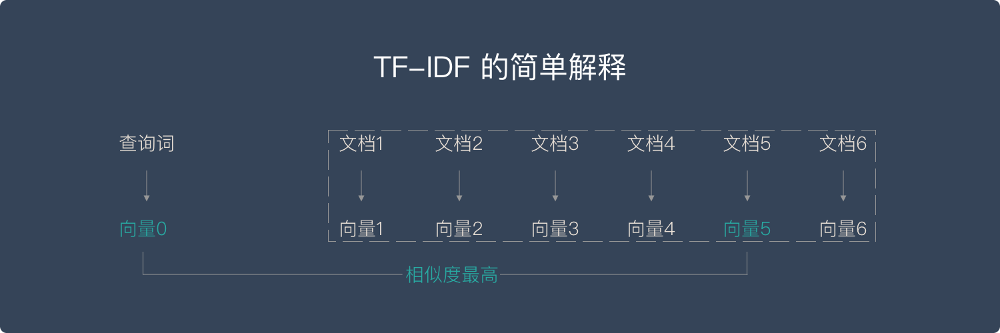
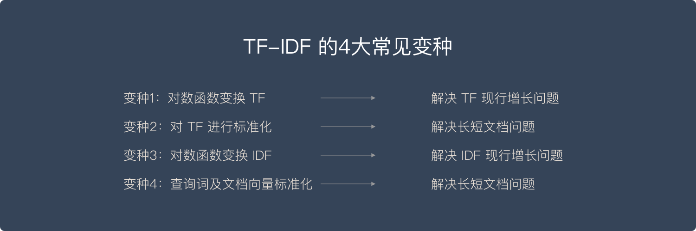

# IF-IDF介绍

原文： https://easyai.tech/ai-definition/tf-idf/

## 什么是IF-IDF

​        简单来说，**向量空间模型就是希望把查询关键字和文档都表达成向量，然后利用向量之间的运算来进一步表达向量间的关系**。比如，一个比较常用的运算就是计算查询关键字所对应的向量和文档所对应的向量之间的 “**相关度**”。

### TF(Term Frequency) - 单词频率

​        TF，简单的说，就是计算一个查询关键字中某一个单词在目标文档中出现的次数。

举个例子，比如我们要查询“Car Insurance”，那么对于每一个文档，我们都计算“Car”这个单词出现了多少次，“Insurance”这个单词在其中出现了多少次。这就是TF的计算方法。

​        TF背后的隐含假设是，查询关键字中单词应该相对于其他单词更加重要，而文档的重要程度，也就是相关度，与单词在文档中出现的次数成正比。比如：“Car”这个词在文档A中出现了5次，而在文档B中出现了20次，那么TF计算就认为文档B可能更相关。

​        然而，信息检索工作者很快就发现，仅有TF不能比较完整地描述文档的相关度。因为语言的因素，一些单词可能会比较自然的在很多文档中反复出现，比如英语中的“The”、“An”，“But”等等。这些词大多起到了连接语句的作用，是保持语言连贯不可或缺的部分。然而，如果我们去搜索“How to build a car”这个关键词，其中的“How”、“To”以及“A”都极可能在绝大多数的文档中出现，这个时候，TF就无法帮助我们区分文档的相关度了。

### IDF(Iverse Document Frequency) - 逆文档频率

​        显然，IDF就是为了去除那么出现在太多文档中的单词。

​        也就是说，真正携带“相关”信息的单词仅仅出现在相对少、有时候可能是极少数的文档里。这个信息，很容易用“**文档频率**”来计算，**即“有多少文档涵盖了这个词”**。显然，如果有太多文档都涵盖了某个词，这个词也就越不重要，或者说是这个词就越没有信息量。因此，需要对TF的值进行修正。而IDF的想法是用DF的**倒数**来进行修正。倒数的应用，正好表达了这样的思想：DF值越大越不重要。

> TF-IDF算法主要适用于英文，中文首先要分词，分词后要解决多词一义，以及一词多义问题。这两个问题通过简单的TF-IDF是不能解决的。于是就有了后来的**词嵌入方法**，用向量来表征一个词。

## TF-IDF的4个变种

### 变种一：通过对数函数避免TF线性增长

​       很多人注意到TF的值在原始的定义中没有任何上限。虽然我们一般认为一个文档包含查询关键词多次相对来说表达了某种相关度，但是这样的关系很难说是线性的。刚才的例子“Car Insurance”，文档A可能包含“Car”这个词100次，而文档B可能包含200次，是不是说文档B的相关度就是文档A的2倍呢？其实很多人意识到，超过了某个阈值之后，这个TF就没有那么有区分度了。

​       使用对数函数，对TF进行变换，就是一个不让TF线性增长的技巧。具体来说，人们常用 ***1 + Log(TF)*** 这个值来代替原来的TF的值。在这样的计算下，假设“Car”出现一次，新的值是1， 出现100次，新的值是5.6，而出现200次，新的值是6.3。可以看出，这样的计算保持了一个平很，既有区分度，又不至于完全线性增长。

### 变种二：标准化解决长文档、段文档问题

​       经典的计算并没有考虑“长文档”和“短文档”的区别。一个文档A有3000个单词，文档B有250个单词。很明显，即便 “Car” 在这两个文档中都同样出现过 20 次，也不能说这两个文档都同等相关。对TF进行**“标准化”（Normalization）**，特别是根据文档的最大TF值进行的标准化，成为了另外一个比较常用的技巧。

### 变种三：对数函数处理IDF

​       对IDF也进行对数处理，原理同TF。相对于直接使用 IDF 来作为 “惩罚因素”，我们可以使用 ***N+1*** **除以** ***DF*** 作为一个***新的 DF 的倒数***，并且再在这个基础上通过一个对数变化。这里的 N 是所有文档的总数。这样做的好处就是：

* 第一，使用了文档总数来做标准化，很类似上面提到的标准化的思路
* 第二，利用对数来达到非线性增长的目的

### 变种四：查询词及文档向量标准化

​       还有一个重要的 TF-IDF 变种，则是对查询关键字向量，以及文档向量进行标准化，使得这些向量能够不受向量里有效元素多少的影响，也就是不同的文档可能有不同的长度。在线性代数里，可以把向量都标准化为一个单位向量的长度。这个时候再进行点积运算，就相当于在原来的向量上进行余弦相似度的运算。所以，另外一个角度利用这个规则就是直接在多数时候进行余弦相似度运算，以代替点积运算。