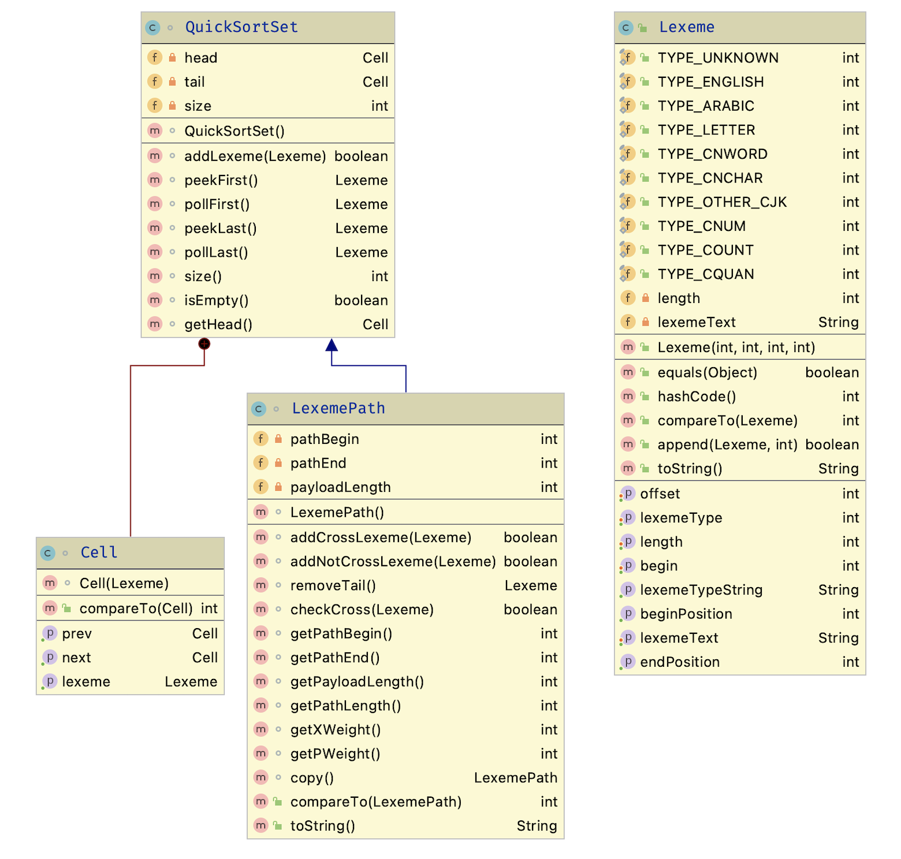
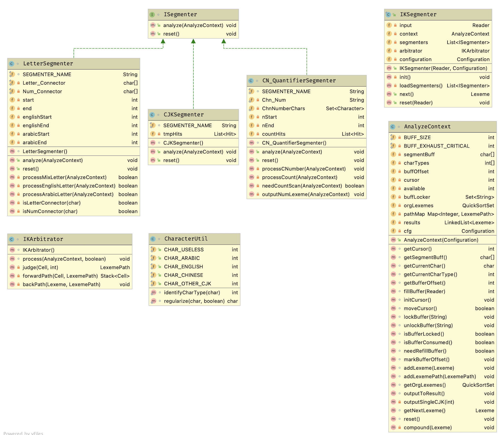

# IK分词器

***原创***

IK分词器，是针对ES的一个插件。基于词库的分词器。

## IK分词器的数据结构

主要有一下几个数据结构组成：

* Lexeme： 词元。分析出的每一个单词、中文词语，构成一个Lexeme对象

* LexemePath：一个增强功能的QuickSortSet

* QuickSortSet：以其说是一个Set，不如说是一个double-Linked List。

## KI分词器的体系结构

* IKSegmenter：分词器的分词入口。一般在IKTokenizer中被调用

* ISegmenter： 具体分词器的行为定义。IK提供了3种：
  * LetterSegmenter：解析英文和阿拉伯数字
  * CJKSegmenter：解析中文（韩文、日文）
  * CN_QuantifierSegmenter：解析中文数量词

* AnalyzeContext：分词过程中，用来存储一些零时变量的对象

