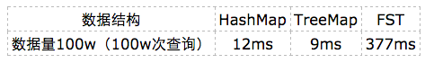

# Lucene 字典实现原理 - FST

原文：https://www.cnblogs.com/bonelee/p/6226185.html


## 1. Lucene 字典

使用 Lucene 进行查询不可避免的都会使用到其提供的字典功能，即根据给定的 term 找到该 term 所对应的倒排文档 id 列表等信息。实际上 Lucene 索引文件后缀名为 tim 和 tip 的文件实现的就是 Lucene 的字典功能。

怎么实现一个字典呢？马上能想到的就是排序数组，即 term 字典是一个已经按字母顺序排序好的数组，数组每一项存放着 term 和对应的倒排文档id 列表。每次载入索引的时候只要将 term 数组载入内存，通过二分查找即可。这种方法查询时间复杂度为 log(N)，N 指的是 term 的数量，占用的空间大小是 O(N * str(term))。排序数组的缺点就是消耗内存，即需要完整存储每一个 term，当 term 数据多达上千万时，占用的内存将不可接受。


## 2. 常用字典数据结构

很多数据结构均能完成字典功能，如下表：

| 数据结构                       | 优缺点                                                       |
| ------------------------------ | ------------------------------------------------------------ |
| 排序列表Array/List             | 使用二分法查找，不平衡                                       |
| HashMap/TreeMap                | 性能高，内存消耗大，几乎是原始数据的三倍                     |
| Skip List                      | 跳跃表，可快速查找词语，在lucene、redis、Hbase等均有实现。相对于TreeMap等结构，特别适合高并发场景（[Skip List介绍](http://kenby.iteye.com/blog/1187303)） |
| Trie                           | 适合英文词典，如果系统中存在大量字符串且这些字符串基本没有公共前缀，则相应的trie树将非常消耗内存（[数据结构之trie树](http://dongxicheng.org/structure/trietree/)） |
| Double Array Trie              | 适合做中文词典，内存占用小，很多分词工具均采用此种算法（[深入双数组Trie](http://blog.csdn.net/zhoubl668/article/details/6957830)） |
| Ternary Search Tree            | 三叉树，每一个node有3个节点，兼具省空间和查询快的优点（[Ternary Search Tree](http://www.drdobbs.com/database/ternary-search-trees/184410528)） |
| Finite State Transducers (FST) | 一种有限状态转移机，Lucene 4有开源实现，并大量使用           |

## 3. FST原理分析

Lucene 从 4 开始大量使用的数据结构是 FST（Finite State Transducer）。FST有两个优点：

1. 空间占用小。通过对字典中单词前缀和后缀的重复利用，压缩了存储空间
2. 查询速度快。O(len(str)) 的查询时间复杂度

下面简单描述一下 FST 的构造过程。对“cat”、“deep”、“do”、“dog”、“dogs” 这5歌单词进行插入构建 FST（注意，必须已排序）。

1. 插入“cat”

   插入cat，每个字母形成一条边，其中 t 边 指向终点

   

2. 插入“deep”

   与前一个单词“cat”进行最大前缀匹配，发现没有匹配则直接插入，P 边指向终点

   

3. 插入“do”

   与前一个单词“deep”进行最大前缀匹配，发现是 d，则在d边后增加新边 o，o边指向终点

   

4. 插入“dog”

   与前一个单词“do”进行最大前缀匹配，发现是 do，则在 o 边后增加新边 g，g边指向终点

   

5. 插入“dogs”

   与前一个单词“dog”进行最大前缀匹配，发现是 dog，则在 g 边后增加新边 s，s边指向终点

   

最终得到了如上最后一个有向无环图。利用该结构可以很方便的进行查询。如，给定一个 term “dog”，可以通过上述结构很方便的查询存不存在，甚至在构建过程中可以将单词与某一个数字、单词进行关联，从而实现 key - value 的映射。

## 4. FST 使用与性能评测

可以将FST当做Key-Value数据结构来进行使用，特别在对内存开销要求少的应用场景。Lucene已经提供了开源的 FST 工具，下面的代码是使用说明。

```java
public static void main(String[] args) {
    try {
        String inputValues[] = {"cat", "deep", "do", "dog", "dogs"};
        long outputValues[] = {5, 7, 17, 18, 21};
        PositiveIntOutputs outputs = PositiveIntOutputs.getSingleton(true);
        Builder<Long> builder = new Builder<Long>(FST.INPUT_TYPE.BYTE1, outputs);
        BytesRef scratchBytes = new BytesRef();
        IntsRef scratchInts = new IntsRef();
        for (int i = 0; i < inputValues.length; i++) {
            scratchBytes.copyChars(inputValues[i]);
            builder.add(Util.toIntsRef(scratchBytes, scratchInts), outputValues[i]);
        }
        FST<Long> fst = builder.finish();
        Long value = Util.get(fst, new BytesRef("dog"));
        System.out.println(value); // 18
    } catch (Exception e) {          
    }
}
```

FST压缩率一般在3倍~20倍之间，相对于TreeMap/HashMap的膨胀3倍，内存节省就有9倍到60倍！那FST在性能方面真的能满足要求吗？

下面是在苹果笔记本（i7处理器）进行的简单测试，性能虽不如TreeMap和HashMap，但也算良好，能够满足大部分应用的需求。

