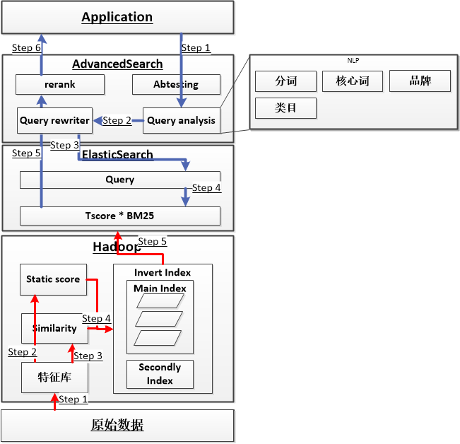
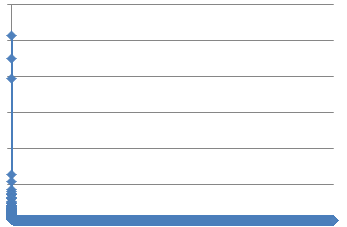
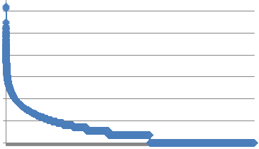
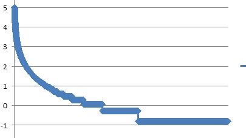
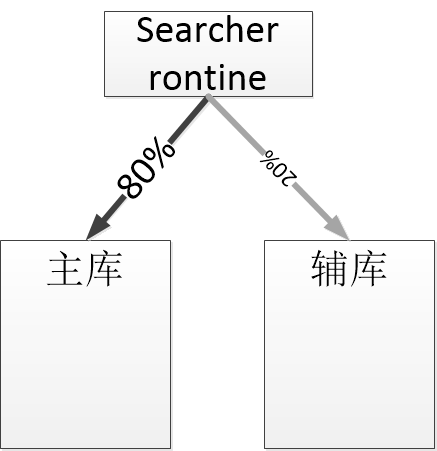
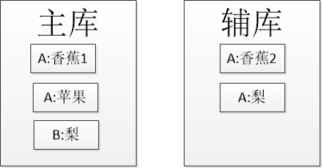
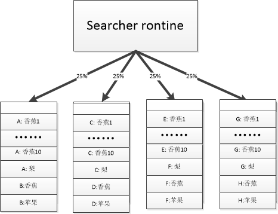
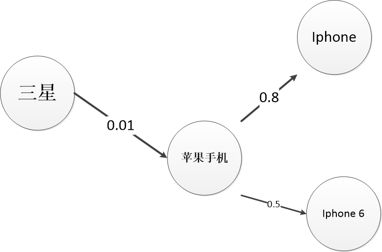

# 有赞搜索引擎实践(算法篇)

原文：https://www.cnblogs.com/hsydj/p/5402945.html


## 搜索算法总体架构

有赞搜索引擎的基本框架. 搜索引擎主要3个部件构成：

1. hadoop集群, 用于生成大规模搜索和实时索引
2. ElasticSearch集群, 提供分布式搜索方案
3. 高级搜索集群, 用于提供商业搜索的特殊功能.

商业电商搜索由于搜索的特殊性，独立的ElasticSearch集群是无法满足多样的算法需求的，需要在搜索的各个部件上都有相应的算法插件，用于构建商业电商搜索引擎的算法体系。

### 搜索过程

创建索引过程从原始数据创建倒排索引的过程。这个过程中我们对商品(doc)进行分析，计算商品**静态分**，并对商品进行相似度计算。

商品的静态分对于提升搜索引擎质量起到至关重要的作用，相当于网页搜索的pagerank， 想象一下如果没有pagerank算法， 网页搜索的质量会有多么差。

在**电商搜索中， 最常见的问题是相似商品太多**，必须在建立索引过程中就对商品间的相似度进行预计算， 以便在检索过程中**进行有效去重**。

创建索引的过程如下：

1. 计算每个doc的静态分
2. 计算两两doc的相似度
3. 根据相似度和其他信息对数据进行分库
4. 建立ES索引

### 检索过程

检索过程是搜索引擎接收用户query进行一系列处理并返回相关结果的过程。商业搜索引擎在检索过程中需考虑2个因素：

* 相关性
* 重要性

**相关性**：是指返回结果和输入query是否相关， 这是搜索引擎基本问题之一。 目前常用的算法有BM25和空间向量模型。 这个两个算法ElasticSearch都支持， 一般商业搜索引擎都用BM25算法。 BM25算法会计算每个doc和query的相关性分，使用$D{score}$表示。

**重要性**：是指商品被信赖的程度。应该把最被消费信赖的商品返回给消费者，而不是让消费之自己鉴别。尤其是在商品充分竞争的电商搜索，必须赋予商品合理的重要性分数，才能保证搜索结果的优质。重要性分，又叫做静态分，使用$T{score}$表示。

搜索引擎最终的排序依据是：
$$
Score = Dscore \times Tscore
$$
即综合考虑静态分和动态分，给用户相关且重要的商品。

检索的过程大致抽象为如下几个步骤（AS：Advanced Search）：

1. 对原始query进行query分析
2. 在AS中根据query分析结果进行query重写
3. 在AS中使用重写后的query检索ES
4. 在ES查询过程中根据静态分和动态分综合排序
5. 在AS中把ES返回的结果进行重排
6. 返回结果




## 商品静态分计算技术

在电商搜索引擎里面商品的静态分是有网页搜索里面的 pagerank 同等的价值和重要性，它们都是 doc 固有的和查询query 无关的价值度量。 pagerank 通过doc之间的投票关系进行运算，相对而言商品的静态分的因素会更多一些。商品静态计算过程和pagerank一样需要解决如下2个问题：

1. **稳定性**。 pagerank可以保证一个网站不会因为简单链接堆砌可以线性提升网站的排名。 同样，商品静态分的计算不可以让商品可以通过增加单一指标线性增加分值（比如刷单对搜索引擎的质量的影响）。
2. **区分度**。 在保证稳定性的基础上商品静态分要有足够的区分度可以保证同样搜索的条件下，排在前面的商品的质量比排在后面的商品的质量高。

假设商品的**静态分**有3个决定性因素：

1. 下单数
2. 好评率
3. 发货速度

静态分我们使用Tsocre表示，Tscore可以写成如下形式：
$$
Tscore = a \times f(下单数) + b \times g(好评率) + c \times h(发货速度)
$$
$a, b, c$ 是权重参数，用于平衡各个指标的影响程度。$f, g, h$ 是代表函数用于把原始的指标转化成合理的度量。 

首先，需要寻找合理的代表函数。

1. 首先对各个指标取 $log$。 $log$ 的导数是一个减函数，表示为了获得更好的分数需要花费越来越多的代价

2. 标准化。标准化的目的让各个度量可以在同一区间内进行比较。比如下单数的取值是0~10000，而好评率的取值为0~1。 这种情况会影响到数据分析的结果和方便性，为了消除指标之间的量纲的影响，需要进行数据标准化处理，以解决数据指标之间的可比性。最常用的标准化方法是z-score标准化方法。 

### z-score 标准化方法

"概率论"阐明，对于满足**正态分布**的数据来说，均值前后3个z-score的范围可以覆盖99%的数据。经验地, 把大于(>) 5个zscore 或者小于(<) -5个zscore的分数设置成 $5*zscore$ 或者$-5 * zscore$。

特别说明的是，不建议使用min-max标准化方法。 这种方法又叫**离差标准化**，是对原始数据的线性变换，使结果值映射到 $[0-1]$ 之间，转化函数如下：
$$
\frac{x - min(X)}{max(X) - min(X)}
$$
这种方法非常不稳定，假设一个奇异点是第二大的值的 1000 倍， 会让大部分的值都集中在 $[0 - 0.01]$ ， 同样失去了归一化的目的。

下图是使用 *min-max* 归一化后的数据分布，显然大部分数据被 "压扁" 在很小的范围；图二使用 $log$ 归一化后的数据分布, 由于 $log$ 缓解了增长速度，可以看出来已经有一个不错的结果了， 图三是在 $log$ 的基础上进行z-score归一化，可以看出来， z-score让数据变得非常平滑。



​                                                                                图一：min-max归一化



​                                                                                图二：log归一化



​                                                                                图三：log-zscore归一化

最后，选择合适的权重。

经过 log-zscore 归一化以后，基本上把 $f,g,h$ 的表示的代表函数说明清楚。 $Tscore = a*f(下单数) + b*g(好评率) + c*h(发货速度)$， 下一步就是确定 $a,b,c$ 的参数。一般有两个方法：

* 专家法。根据日常经验动态调整权重参数
* 实验法。 首先在专家的帮助下赋一个初始值，然后改变单一变量的方法根据abtest的结果来动态调整参数

## 商品标题去重

商品标题去重在电商搜索中起到重要作用。根据数据，**用户通过搜索页购买商品80%选择搜索的前4页**。商品标题的重复会导致重要的页面没有含金量，极大降低了搜索的购买率。

举个例子:

* Title1：美味/香蕉/包邮/广东/高州/香蕉/banana//无/催熟剂/

* Title2：美味/香蕉/广东/高州/香蕉//非/粉蕉/包邮/

**首先, 进行特征向量化。**

这里用到 "bag of word" 技术，将词汇表作为空间向量的维度。标题的每个term的词频作为这个feature的值。以这个例子来说。

> ​        这个词汇的维度为：
>
> ​        美味(0), 香蕉(1), 包邮(2), 广东(3), 高州(4), banana(5), 无(6), 催熟剂(7), 非(8), 粉蕉(9)
>
> ​        位置:  0,1,2,3,4,5,6,7,8,9
>
> ​        Title1: 1,2,1,1,1,1,1,1,0,0
>
> ​        Title2: 1,2,1,1,1,0,0,0,1,1

这个每个title都用一个固定长度的向量表示。

**再次, 计算两两相似度**

相似度一般是通过计算两个向量的距离实现的。不失一般性， 在这里使用 $1-cosine(x,y)$ 来表示两个向量的距离。 这是一个"All Pair Similarity"的问题， 即需要两两比较， 复杂度在$O(n^2)$。 在商品量巨大的时候单机很难处理。 这里给出两种方法用于实现"All Pair Similarity"。

方法一：spark的矩阵运算

```java
rddRows = sc.parallelize(["1 0 2 0 0 1", "0 0 4 2 0 0"])
raddRows.map(lambda x: Vectors.dense([float(each) for each in str(x).split("")]))
mat = RowMatrix(rddRows)
...
simsPerfect = mat.columnSimilarities()
...
```

方法二：map-reduce 线性方法

这个方法参考论文"Pairwise Document Similarity in Large Collections with MapReduce"。可以实现几乎线性的时间复杂度。相对于矩阵运算在大规模(10亿以上)pair similarity 运算上面有优势。

> 这个方法简单的描述如下:
> 首先, 按照倒排索引的计算方式计算每个term到doc的映射.
> 比如3个doc:
>
> ```
> doc1 = 我 爱 北京 
> doc2 = 我 北京 天安门
> doc3 = 我 天安门
> ```
> 转化为倒排格式, 这个需要一次mapper reduce
> ```
> 我     -> doc1, doc2, doc3
> 爱     -> doc1
> 北京   -> doc1, doc2
> 天安门 -> doc2, doc3 
> ```
> 然后, 对于value只有一个元素的过滤掉, 对于value大于2个doc的两两组合:
> ```
> doc1,doc2 <---- from: 我     -> doc1, doc2, doc3
> doc1,doc3 <---- from: 我     -> doc1, doc2, doc3
> doc2,doc3 <---- form: 我     -> doc1, doc2, doc3
> doc1,doc2 <---- from: 北京   -> doc1, doc2
> doc2,doc3 <---- from: 天安门 -> doc2, doc3
> ```
>
> 最后, 对于输出进行聚合,value为重复次数和两个doc乘积开根号的比.
> ```
> doc1,doc2 -> 2/(len(doc1)*len(doc2))^1/2 = 0.7
> doc1,doc3 -> 1/(len(doc1)*len(doc3))^1/2 = 0.3
> doc2,doc3 -> 2/(len(doc2)*len(doc3))^1/2 = 0.3
> ```
> 对于2个title1, title2, 如果X(title1, title2) > 0.7 则认为title1和title2相似, 对于相似的两个doc, 静态分大的定义为主doc, 静态分小的定义为辅doc. 主doc和辅doc分别建库. 



区别于网页搜索(网页搜索直接将辅doc删除)，将主doc和辅doc分别建库。每一次搜索按比例分别搜主库和辅库, 并将结果融合返回。这样可以保证结果的多样性。

## 店铺去重

店铺去重和商品标题去重有点不同。**由于电商特定场景的需要，不希望搜索结果一家独大**，这样会引发强烈的马太效应。店铺去重不能使用如上的方法进行。因为上面的方法的主要依据是文本相似，在结果都相关的前提下，进行适当的取舍。但是店铺去重不是这样的特性。

设想一下，如果根据店铺是否相同，把同一店铺的商品分到主库和从库中， 如下图所示：



​                                                                                A和B代表不同店铺

在搜索香蕉的时候，的确可以控制A店铺结果的数量，但是在搜索"梨"的时候就错误的把B店铺的梨排在前面了(假设A:梨比B:梨静态分高)。

实际上想达到店铺去重的效果，通过**分桶搜索**是很容易做的事情。假设每页搜索20个结果，把索引库分成4个桶，每个商品对桶数取模得到所在桶的编号。这样可以**保证同一店铺的商品仅在一个桶里面**。



搜索的过程每个桶平均分摊搜索任务的25%，并根据静态分合并成一页的结果。这样同一保证结果的相对顺序，又达到了店铺去重的目的。

如上图所示，搜索"香蕉"，虽然A店铺有10个满足需求的结果，但是每页搜索醉倒只有5个结果可以展示。

## Query分析与Query改写技术

上面介绍了几个建立索引过程中几项技术，检索过程中的关键技术有很多。其中最著名的是query分析技术。使用的query分析技术主要包括 **核心词识别**， **同义词拓展**，**品牌词识别** 等等。

query分析技术大部分都是NLP研究范围，本文就不详细阐述很多理论知识。这里重点介绍 **同义词拓展技术**。**这个技术一般都需要根据自己的商品和和用户日志特定训练，无法像分词技术和品牌词识别一样有标准的库可以适用**。

同义词拓展一般是通过分析用户session日志获取。如果一个用户输入"苹果手机"没有得到想要的结果，接着输入"iphone"，在"苹果手机"和"iphone"之间创建一个转移关系。基于统计，可以把用户query创建一个相互联系的权重图。



用户输入query "苹果手机"，根据query分析，"苹果手机"有 $"iphone"*0.8$ ，  $ "iphone 6"* 0.5$  两个同义词。$0.8$ 和 $0.5$ 分别表示同义的程度。想要"苹果手机", "iphone", "iphone 6" 3个query同时输入，并且按照同义的程度对不同的query赋予不同的权重。

ElasticSearch提供的 BoostingQuery 可以支持这个需求. 参考: https://www.elastic.co/guide/en/elasticsearch/guide/current/_boosting_query_clauses.html

原始query：

```json
{
  "query" {
      "match": {
          "query":"苹果手机"
      }
   }
}
```

改写后的Query：

```json
{
  "query": {
    "should": [
        { "match": {
            "content": {
                "query": "苹果手机",
                "boost": 10 
            }
        }},
        { "match": {
            "content": {
                "query": "iphone",
                "boost": 8
            }
        }},
        { "match": {
            "content": {
                "query": "iphone6",
                "boost": 5
            }
        }}
    ]
  }
}
```

其他比如核心词识别，歧义词纠正等方法差不多， 本文不做详细阐述。

## 其他

商业电商搜索算法另外两个重要技术, 一个是类目体系建立和应用，另一个是个性化技术。类目体系主要使用机器学习的方法进行训练，个性化主要通过用户画像进行 Query 改写来实现。