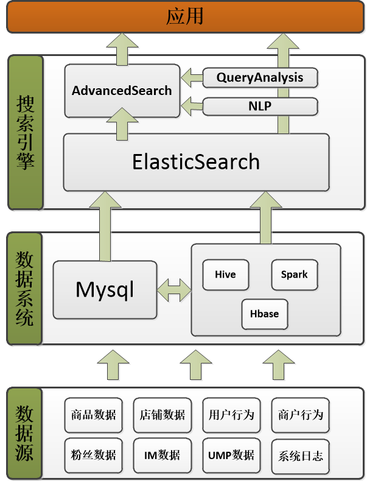
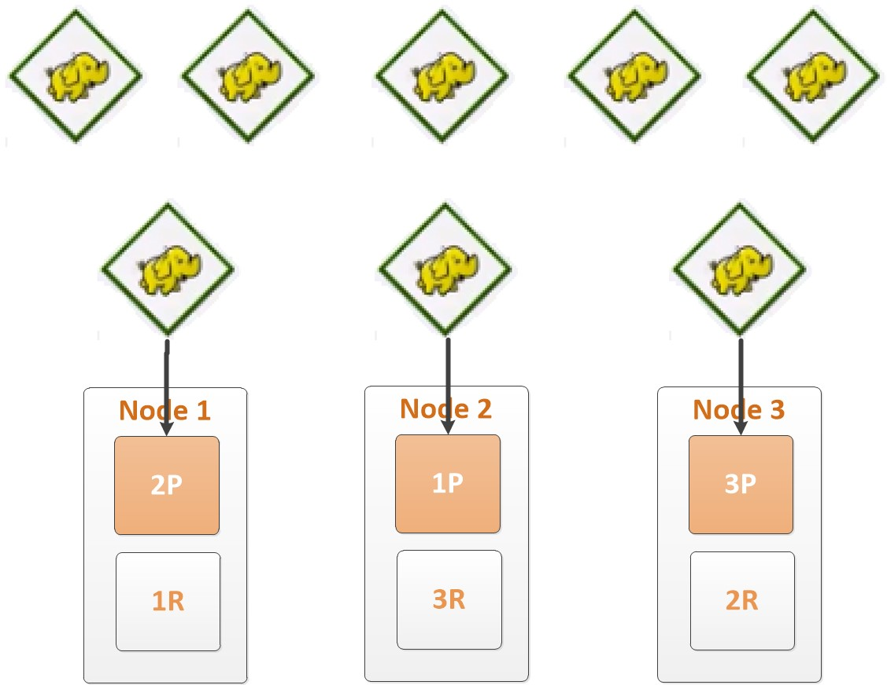
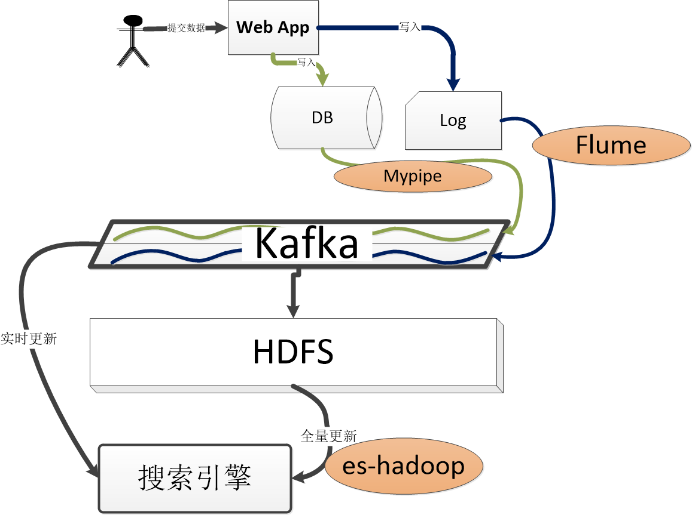
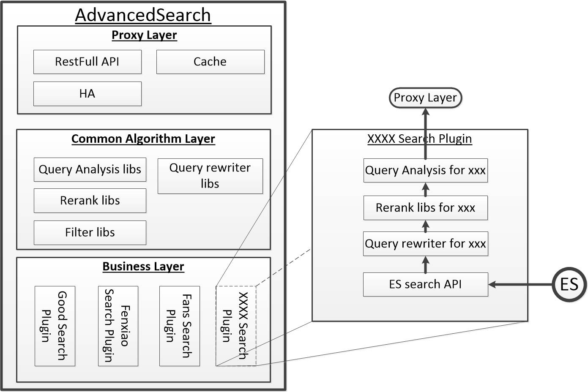
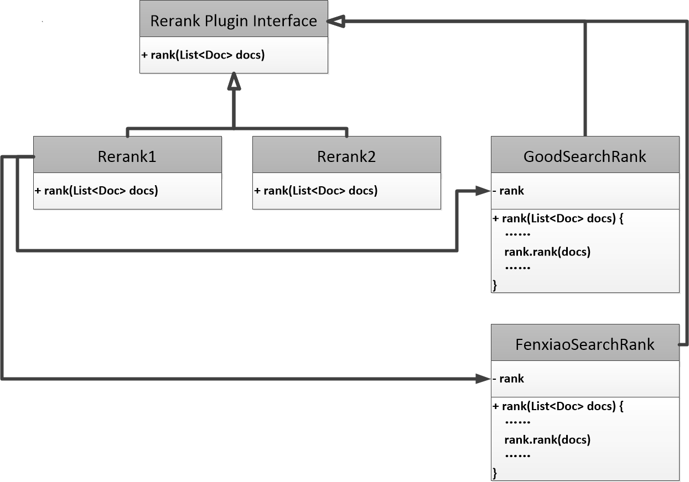
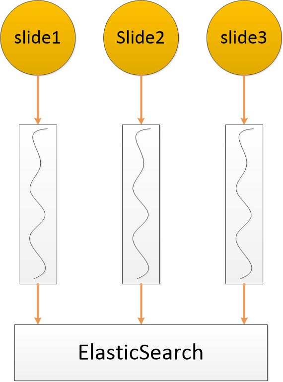

# 有赞搜索引擎实践(工程篇)

原文：https://www.cnblogs.com/hsydj/p/5303050.html


​        随着互联网数据规模的爆炸式增长, 如何从海量的历史, 实时数据中快速获取有用的信息, 变得越来越有挑战性. 一个中等的电商平台, 每天都要产生百万条原始数据, 上亿条用户行为数据. 一般来说, 电商数据一般有3种主要类型的数据系统:

1. 关系型数据库, 大多数互联网公司会选用mysql作为关数据库的主选, 用于存储商品, 用户信息等数据. 关系型数据库对于事务性非常高的OLTP操作(比如订单, 结算等)支持良好。
2. hadoop生态, hadoop是数据仓库主要的载体, 除了备份关系型数据库的所有版本, 还存储用户行为, 点击, 曝光, 互动等海量日志数据, hadoop对于数据分析, 数据挖掘等OLAP支持比关系型数据库更加具有扩展性和稳定性.
3. 搜索引擎. 以elasticsearch和solr为代表. 搜索引擎是获取信息最高效的途径, 几乎成为各类网站, 应用的基础标配设施(地位仅次于数据库).

​        目前搜索引擎技术已经有非常成熟的开源解决方案, 最出名的ElasticSearch和Solr都是基于lucence的. 很多中小型互联网公司搜索引擎都是基于这两个开源系统搭建的, 但是即便如此, 一个搜索引擎团队想把搜索引擎质量做到商用标准, 从系统熟悉, 服务搭建, 功能定制, 通常需要花费较长时间. 通用搜索引擎应用在互联网商用搜索通常会遇到如下几个问题:

1. 搜索引擎与公司现有数据系统的集成. mysql 和 hadoop是电商的两个主要数据载体, 搜索引擎在全量和增量建索引过程中必须和mysql或hadoop无缝集成, 才能发挥搜索引擎自身的实时性, 水平扩展性(性能与容量和机器数量成正比)等优势.
2. 商用搜索高度定制化与通用搜索引擎的矛盾. 商用搜索的问题有时候超越了搜索引擎本身解决的范围, 比如商品的去重, 店铺的去重需要很专业的搜索引擎使用技巧; 商品的权重, 用户意图的识别需要算法和模型的支持.
3. 在不了解搜索引擎专业知识的前提下, 很难创建对性能友好的索引. 结果造成了通用搜索性能很差的假象.

​        

​        笔者是有赞大数据架构师, 从自身的搜索实践出发, 分享搜索引擎实际的架构和解决的问题. 

​        有赞搜索引擎实践分2篇, 第一篇是工程篇, 主要介绍搜索引擎的架构和性能优化方面的经验; 第二篇是算法篇, 介绍有赞实际需要的搜索算法的问题和解决方案. 文章仅仅介绍一个中型电商公司实际的使用现状和笔者个人的经验, 不代表搜索引擎最佳实践方法, 也不代表可以适用所有的场景. 如果读者有问题可以和笔者联系, 共同探讨.


## 1. 技术架构

​        有赞搜索引擎基于分布式实时引擎elasticsearch(ES). ES构建在开源社区最稳定成熟的索引库lucence上, 支持多用户租用, 高可用, 可水平扩展; 并有自动容错和自动伸缩的机制. 我们同事还实现了es与mysql和hadoop的无缝集成; 我们自主开发了高级搜索模块提供灵活的相关性计算框架等功能. 



## 2. 索引构建

​        互联网索引的特点是实时性高, 数据量大. 时效性要求用户和客户的各种行为能够第一时间进入索引; 数据量大要求一个有效分布式方案可以在常数时间内创建不断增长的TB数量级索引.

​        实时索引我们采用面向队列的架构, 数据首先写入DB(或文件), 然后通过数据库同步机制将数据流写入kafka队列. 这种同步机制和数据库主从同步的原理相同, 主要的开源产品有mypipe和阿里推出的canal. es通过订阅相应的topic实现实时建立索引. 

​        如果数据源是文件, 则使用flume实时写入Kafka.

​        另外一个索引问题是全量索引. 有如下几个场景让全量索引是一个必要过程：

1. 实时更新有可能会丢数据, 每次很少的丢失时间长了降低搜索引擎的质量. 周期性的全量更新是解决这个问题的最直接的方法;
2. 即使能够保证实时更新, 业务的发展有可能有重新建索引的需求(比如增加字段, 修改属性, 修改分词算法等).
3. 很多搜索引擎是在业务开始后很久才搭建的, 冷启动必须全量创建索引.

​        采用Hadoop-es利用hadoop分布式的特性来创建索引. hadoop-es让分布式索引对用户透明, 就像单机更新索引一样. 一个是分布式的数据平台, 一个是分布式搜索引擎, 如果能把这两个结合就能够实现分布式的全量索引过程. Hadoop-es正式非常适合的工具.




​        现在举一个通过Hive sql创建索引的例子:

```sql
drop table search.goods_index;
CREATE EXTERNAL TABLE search.goods_index (
    is_virtual int,
    created_time string,
    update_time string,
    title string,
    tag_ids array<int>
  ) STORED BY 'org.elasticsearch.hadoop.hive.EsStorageHandler' TBLPROPERTIES (
    'es.batch.size.bytes'='1mb',
    'es.batch.size.entries'='0',
    'es.batch.write.refresh'='false',
    'es.batch.write.retry.count'='3',
    'es.mapping.id'='id',
    'es.write.operation'='index',
    'es.nodes'='192.168.1.10:9200',
    'es.resource'='goods/goods');
```

​        系统把es映射成hive的一个外部表, 更新索引就像是写入一个hive表一样. 实际上所有分布式问题都被系统透明了.

​        不建议从数据库或文件系统来全量索引. 一方面这会对业务系统造成很大的压力, 另一方面因为数据库和文件系统都不是真正分布式系统, 自己写程序保证全量索引的水平扩展性很容易出问题, 也没有必要这么做.

​        全量索引和增量索引的架构如下图所示. 另外一点是hadoop也是订阅kafka备份数据库和日志的. 我个人建议一个公司所有DB和文件都存储在hadoop上, 这样做起码有2个好处：

1. hadoop上使用hive或者spark创建的数据仓库为大数据提供统一的操作接口. 
2. hadoop数据相对于线上更加稳定, 可以作为数据恢复的最后一个防线.

​        数据仓库的话题不在本篇文章的讨论范围, 这里只是简单提一下.




​        **为什么我们选择Kafka?** 

​        Kafka 是一个以高吞吐著名的消息系统. Kafka开启了日志合并(log compaction)功能后, 可以永久保存每条消息. 每一条消息都有一个key, 正好对应数据库的主键, kafka始终保存一个key最新的一条消息, 历史版本会被垃圾回收掉. 有了这个特性, kafka不仅可以保存数据库最新的快照, 而且可以实现实时更新的消息系统. 第一次同步的时候, 数据表中每行记录都转化成以主键为key的消息进入kafka, 并且可以被任意数量的broker消费. 之后数据库的每次更新(insert, updated, delete)都会被转化成kafka的消息. 如果一行记录频繁被更改, kafka会识别这些重复的消息, 把旧的消息回收掉. 

​        Kafka既保存数据库最新的全量数据, 又提供实时数据流的这个特性为架构的可维护性提供极大便捷. 如果你想从零扫描整个数据库, 你只需要从开始消费这个kafka的topic即可完成, 当读到topic末端, 自动获得实时更新的特性.

​        Kakfa的另一个特性是支持从任意断点读取数据, 比如我们全量索引是从HDFS中读取, 我们可以根据HDFS保存的数据的最后一条的时间戳, 直接切换到Kafka读取之后的数据.

## 3. 高级搜索：超越ES功能限制

​        高级搜索模块(AS)在商业搜索引擎起到至关重要的作用. 在各大商业搜索引擎公司里面AS已经成为标配, 也是变更最为频繁的模块.

​        AS在商业搜索引擎中主要起到如下作用:

1. 反向代理, 实现基于分片的分布式搜索(实际上es有这个功能); 提供必要的容灾支持

2. 提供插件化的相关性计算框架

3. 提供丰富的相关性库, 比如query分析库, query改写库, 排序库, 过滤库等.

4. 管理不同的搜索业务

   


​        AS一个主要的功能是通过一个个业务插件来代表相应的搜索. 一个最简单的插件只需要包含对应的ES search API, 它实际上就是一个配置项, 说明es的地址. 这样AS就是一个纯代理. 但是商业搜索的需求都是不是ES本身能够支持的, 所以就需要根据需求写相应的Query rewriter, rerank等算法插件. 这样就实现了框架和业务分离, AS具有极强的扩展性和复用性.

​        AS另一个功能是提供通用算法库, 实际上它只为每种算法提供编程框架. 算法也是通过插件的方式加入算法库的. 这种方法可以让算法工程师抽象公共算法库供业务方使用, 避免重新造轮子. 一个具体业务要么使用已经存在的算法(并修改参数), 要么自己实现算法.



​        上图是一个实例. 商品搜索和分销搜索各自实现一个rerank的的算法, 同时都调用了系统提供的rerank1的算法库, 并加入了自己特有的逻辑.   

​        AS除了基本proxy功能外, 还提供基于query的cache功能用于应用级别的缓存. 内部有一个缓冲队列, 防止出现雪崩现象. 下一节性能优化中会详细说明.

## 4. ES性能优化

​        下面几个小结, 我们写了几个我们遇到的性能优化场景. 

### 4.1 使用应用级队列防止雪崩

​        ES一个问题是在高峰期时候极容易发生雪崩. ES有健全的线程池系统来保证并发与稳定性问题. 但是在流量突变的情况下(比如双十一秒杀)还是很容易发生瘫痪的现象, 主要的原因如下:

1. ES几乎为每类操作配置一个线程池; 只能保证每个线程池的资源使用是合理的, 当2个以上的线程池竞争资源时容易造成资源响应不过来.
2. ES没有考虑网络负载导致稳定的问题. 

​        在AS里我们实现了面向请求的全局队列来保证稳定性. 它主要做了3件事情.



1. 根据业务把请求分成一个个slide, 每个slide对应一个队列. 默认一个应用就是一个slide, 一个应用也可以区分不同的slide, 这样可以保护一个应用内重要的查询.
2. 每个队列配置一个队列长度, 默认为50. 
3. 每个队列计算这个队列的平均响应时间. 当队列平均响应时间超过200ms, 停止工作1s, 如果请求溢出就写入溢出日志留数据恢复使用. 如果连续10次队列平均响应时间超过500ms就报警, 以便工程师第一时间处理.

### 4.2 自动降级

​        应用级队列解决雪崩问题有点粗暴, 如果一个应用本身查询就非常慢, 很容易让一个应用持续超时很久. 我们根据搜索引擎的特点编写了自动降级功能.

​        比如商品搜索的例子, 商品搜索最基本的功能是布尔查询, 但是还需要按照相关性分数和质量度排序等功能, 甚至还有个性化需求. 完成简单的布尔查询, ES使用bitsets操作就可以做到, 但是如果如果需要相关性分, 就必须使用倒排索引, 并有大量CPU消耗来计算分数. ES的bitsets比倒排索引快50倍左右. 

​        对于有降级方案的slide, AS在队列响应过慢时候直接使用降级query代替正常query. 这种方法让我们在不扩容的情况下成功度过了双十一的流量陡增.

### 4.3 善用filtered query

​        理解lucence filter工作原理对于写出高性能查询语句至关重要. 许多搜索性能优化都和filter的使用有关. filter使用bitsets进行布尔运算, query使用倒排索引进行计算, 这是filter比query快的原因. bitsets的优势主要体现在:

1. bitsetcache在内存里面, 永不消失(除非被LRU).
2. bitsets利用CPU原生支持的位运算操作, 比倒排索引快个数量级
3. 多个bitsets的与运算也是非常的快(一个64位CPU可以同时计算64个DOC的与运算)
4. bitsets 在内存的存储是独立于query的, 有很强的复用性
5. 如果一个bitset片段全是0, 计算会自动跳过这些片段, 让bitsets在数据稀疏情况下同样表现优于倒排索引.

举个例子:

```json
query:bool:
    tag:'mac'
    region:'beijing'
    title: "apple"
```

lucence处理这个query的方式是在倒排索引中寻找这三个term的倒排链 ,并使用跳指针技术求交, 在运算过程中需要对每个doc进行算分. 实际上tag和region对于算分并没有作用, 他们充当是过滤器的作用.

​        这就是过滤器使用场景, 它只存储存在和不存在两种状态. 如果我们把tag和region使用bitsets进行存储, 这样这两个过滤器可以一直都被缓存在内存里面, 这样会快很多. 另外tag和region之间的求交非常迅速, 因为64位机器可以时间一个CPU周期同时处理64个doc的位运算.

​        一个lucence金科玉律是: 能用filter就用filter, 除非必须使用query(当且仅当你需要算分的时候).

正确的写法为:

```json
query: 
    filtered: 
        query:  
             title:"apple" 
         filter:
             tag:"elasticsearch"
             region:"beijing"
```

lucence的filtered query会智能的先计算filter语句, 然后才计算query语句, 尽可能在进行复杂的倒排算法前减少计算空间.

### 4.3 其他性能优化

1. 线上集群关闭分片自动均衡. 分片的自动均衡主要目的防止更新造成各个分片数据分布不均匀. 但是如果线上一个节点挂掉后, 很容易触发自动均衡, 一时间集群内部的数据移动占用所有带宽. 建议采用闲时定时均衡策略来保证数据的均匀.
2. 尽可能延长refresh时间间隔. 为了确保实时索引es索引刷新时间间隔默认为1秒, 索引刷新会导致查询性能受影响, 在确保业务时效性保证的基础上可以适当延长refresh时间间隔保证查询的性能.
3. 除非有必要把_all字段去掉. 索引默认除了索引每个字段外, 还有额外创建一个_all的字段, 保存所有文本, 去掉这个字段可以把索引大小降低50%.
4. 创建索引时候, 尽可能把查询比较慢的索引和快的索引物理分离.