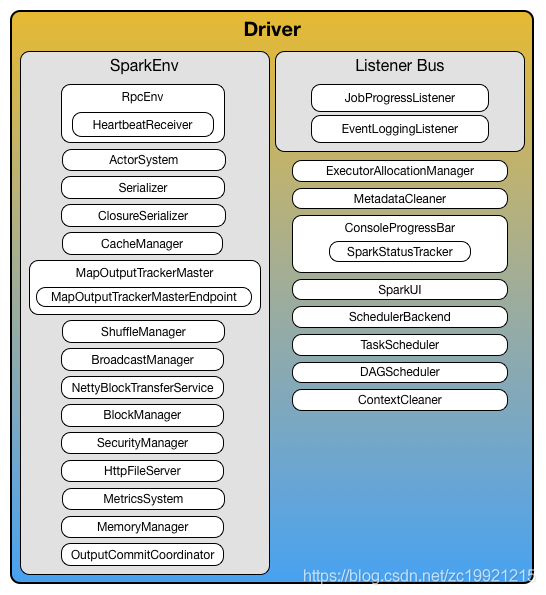

# SparkContext初始化流程

原文：https://blog.csdn.net/zc19921215/article/details/83934175


​        SparkContext的初始化，包括：事件总线（LiveListenerBus），UI界面，心跳，JobProcessListener，ExecutorAllocationManager（资源动态分配管理）等等。总之，一堆东西。现在介绍核心部分的内容：

1. **DAGScheduler**：负责创建Job，RDD的Stage划分以及提交，还有一些监控数据
2. **TaskScheduler**：负责Task的调度，它所调度的Task是有DAGScheduler创建的
3. **\*\*\*SchedulerBackend**：负责连接Master并注册当前的程序；申请资源（Executor）和task具体到Executor的执行和管理，具体类型和 deploy Mode 有关，比如：standalone或者on yarn
4. **SparkEnv**：Spark运行环境。Executor 依赖 SparkEnv，它内部包含很多组件，例如：serializerManager，RpcEnv，BlockManager。（Driver中也有SparkEnv，这歌是为了Local[*]模式下能运行）

## DAGScheduler

​        一句代码就搞定了：

```scala
_dagScheduler = new DAGScheduler(this)
```

分析它的构造函数，可以看到需要初始化6个变量：

```scala
def this(sc: SparkContext, taskScheduler: TaskScheduler) = {
    this(
        sc,
        taskScheduler,
        sc.listenerBus,
        sc.env.mapOutputTracker.asInstanceOf[MapOutputTrackerMaster],
        sc.env.blockManager.master,
        sc.env
    )
}
```

​        可以看出，taskScheduler是在它之前就创建好了的。sc 就是SparkContext，sc.listenerBus就是事件总线，异步监听Spark的各种事件。还有两个变量，需要重点说明：

* **mapOutputTracker**：

  ​        用于记录map将数据结果写到哪里去，用于Reduce阶段任务获取地址以及结果。每个map/reduce任务都会有唯一的ID标识，一个reduce如果到多个map任务的节点上拉取Block，这个就是宽依赖，它的过程叫shuffle

* **blockManager.master**：

  ​        BlockManager是对Executor上的Block的数据进行管理，而Driver上的master是对存在于Executor上的BlockManager进行统一管理，记录Block相关的信息（位置，是否移除等等）

## TaskScheduler & ***SchedulerBackend

```scala
// Create and start the scheduler
val (sched, ts) = SparkContext.createTaskScheduler(this, master, deployMode)
_schedulerBockend = sched
_taskScheduler = ts
_dagScheduler = new DAGScheduler(this)

// start TaskScheduler after taskScheduler sets DAGScheduler reference in DAGScheduler's constructor
_taskScheduler.start()
```

​        这里创建的时候，一口气创建了两个变量，taskScheduler自然不用说，是用来执行具体的task用的，另外一个schedulerBackend则适用于Application运行期间与底层资源调度系统交互，申请资源和Task的执行和管理。

​        入参中的deployMode，也就是说task的执行和调度方式适合程序设置的任务与性方式有关的，根据不同的deployMode创建不同的调度方式。此处设置为StandAlone模式为例，看看代码是如何走的：

```scala
case SPARK_REGEX(sparkUrl) => 
    val scheduler = new TaskSchedulerImpl(sc)
    val masterUrl = sparkUrl.split(",").map("spark://" + _)
    val backend = new StandaloneSchedulerBackend(scheduler, sc, masterUrl)
    scheduler.initialize(backend)
    (backend, scheduler)
```

1. 首先 new TaskSchedulerImpl， 这里设定了单个Task相关的一些配置，例如每个task默认用一个cpu，host和Executors之间的映射

   ```scala
   // How often to check for speculative tasks
   val SPECULATION_INITERVAL_MS = conf.getTimeAsMs("spark.speculation.interval","100ms")
   
   // Duplicate copies of a task will only be launched if the original copy has been running for at least this amount of time.
   // This is to avoid the overhead of launching speculative copies of tasks that are very short.
   val MIN_TIME_TO_SPECULATION = 100
   
   private val speculationScheduler= ThreadUtils.newDaemonSingleThreadsScheduledExecuter("task-scheduler-speculation")
   
   // Threshold above which we warn user initial TaskSet may be starved
   val STARVATION_TIMEOUT_MS = conf.getTimeMs("spark.starvation.timeout","15s")
   
   //CPUs to request per task
   val CPUS_PER_TASK = conf.getInt("spark.task.cpus", 1)
   ```

    还有三个很重要的变量都在这里可以找到：

   ```scala
   // Listener object to pass upcalls into
   var dagScheduler: DAGScheduler = null
   var backend: SchedulerBacked = null
   val mapOutputTracker = SparkEvn.get.mapOutputTracker
   var schedulableBuilder : SchedulableBuilder = null
   
   var rootPool: Pool = null
   
   // default scheduler is FIFO
   private val schedulingModeConf = conf.get("spark.scheduler.mode", "FIFO")
   val schedulingMode:SchdulingMode = try {
       SchedulingMode.withName(schedulingModeConf.toUpperCase)
   } catch{
       case e: java.util.NoSuchElementException =>
        throw new SparkException("")
   }
   ```

2. 接着 new ***Backend()， 这里就是设置了最多可以用多少 cores: conf.getOption("spark.cores.max")

3. 然后就是调度方式，默认是FIFO：这个调度是用于调动单个App中的多个Task用的。

   ```scala
   def initialize(backend: SchedulerBackend) {
       this.backend = backend
       // temporarily set rootPool name to empty
       rootPool = new Pool("", schedulingMode, 0, 0)
       scheduableBuilder = {
           schedulingMode match {
               case SchedulingMode.FIFO =>
                   new FIFOSchedulableBuilder(rootPool)
               case SchedulingMode.FAIR =>
                   new FairSchedulableBuilder(rootPool, conf)
               case _ =>
                   throw new IllegalArgumentException("xxxx")
           }
       }
       schedulableBuilder.buildPools()
   }
   ```

4. 最后执行 ： _taskScheduler.start()

   ​        此处看启动schedulerBuckend，它的启动就是创建了driverEndPoint，这个可以用来和Executor之间进行通信，这时单独开一个线程，进入它的 connect() 方法里可以到看到。

   ​        接着记录了App的相关信息：name/maxCores/executorMemory...， 将其封装在ApplicationDescription类里。

   ​        最后，使用这个Descriptionhe/Master/SparkConf/RPCEndPoint等信息，创建并启动了StandaloneAppClient，这个是和Spark集群交互用的，用于Register应用并接受处理来自Master的这种消息，如 RegisterApplication、ApplicationRemoved、ExecutorAdded等，在接受到这种消息的同时会调用SchedulerBackend进行一些处理。

   ​        在 client.start() 中会调用它的onStart() 方法，先是向Spark集群的Master注册App，然后经过一系列的操作最终启动Executor，过程很复杂。

   ​        执行 _taskScheduler.start()的时候，Executor就已经ADD了。

   ​        start() 方法的内部是这样的：

## SparkEnv

​        SparkEnv中包括了与存储、计算、通信相关的很多功能，在Driver和Executor进程中都存在，因为两者的功能不同，所以创造出来的变量也有所不同，大致上会创建如下功能：序列化管理、map/shuffle管理、block管理、memory管理等等，相当于**所有资源管理功能（除了CPU核数）**都会在这里创建。

| 名称                      | 说明                                                         |
| ------------------------- | ------------------------------------------------------------ |
| SecurityManager           | 主要对账户、权限及身份认证进行设置与管理                     |
| RpcEnv                    | 各个组件之间通信的执行环境                                   |
| SerializerManager         | Spark中很多对象在通信网络传输或者写入存储体系时，都需要序列化 |
| BroadcastManager          | 用于将配置信息和序列化后的RDD、Job以及ShuffleDependency等信息在本地存储 |
| MapOutputTracker          | 用于跟踪Map阶段任务的输出状态，此状态便于Reduce阶段任务获取地址及中间结果 |
| ShuffleManager            | 负责管理本地及远程的Block数据的shuffle操作                   |
| MemoryManager             | 一个抽象的内存管理器，用于执行内存如何在执行和存储之间共享   |
| NettyBlockTransferService | 使用Netty提供的异步事件驱动的网络应用框架，提供web服务及客户端，获取远程节点上Block的集合 |
| BlockManagerMaster        | 负责对BlockManager的管理和协调                               |
| BlockManager              | 负责对Block的管理，管理整个Spark运行时的数据读写的，当然也包含数据存储本身，在这个基础上进行读写操作 |
| MetricsSystem             | 一般是为了衡量系统的各种指标的度量系统                       |
| OutputCommitCoordinator   | 确定任务是否可以把输出提到HDFS的管理者，使用先提交者胜的策略 |

​        注意，初始化SparkEnv代码中的这个的两个功能：前一个是对Shuffle进行的优化，后一个是对内存管理进行的优化，主要是动态调整内存模型。


​         至此，SparkContext的初始化已经完成，总结下就是。SparkContext先是初始化了TaskSchedule和***SchedulerBackend分别进行Task的调度和注册APP并申请资源启动Executor。然后再初始化DAGSchedule，负责Job的执行管理和RDD Stage的划分。然后还有一个SparkEnv,对存储、计算、通信等很多功能进行管理。



参考：

https://blog.csdn.net/qq_21383435/article/details/78603123(MapOutputTracker介绍)

https://blog.csdn.net/lvbiao_62/article/details/79751560(Spark/Hadoop的推测执行机制说明)

https://www.cnblogs.com/xia520pi/p/8609625.html(SparkEnv介绍，非常详细)