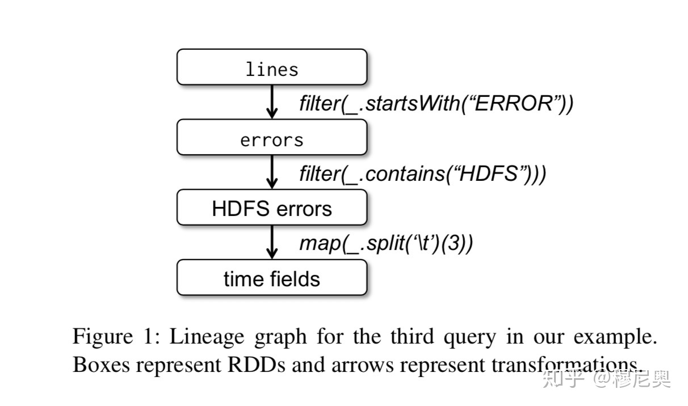
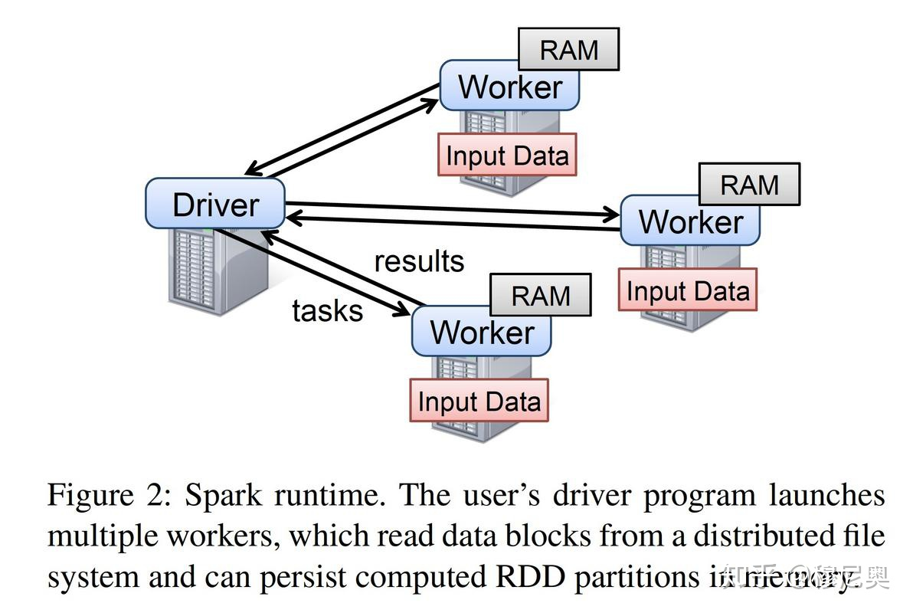
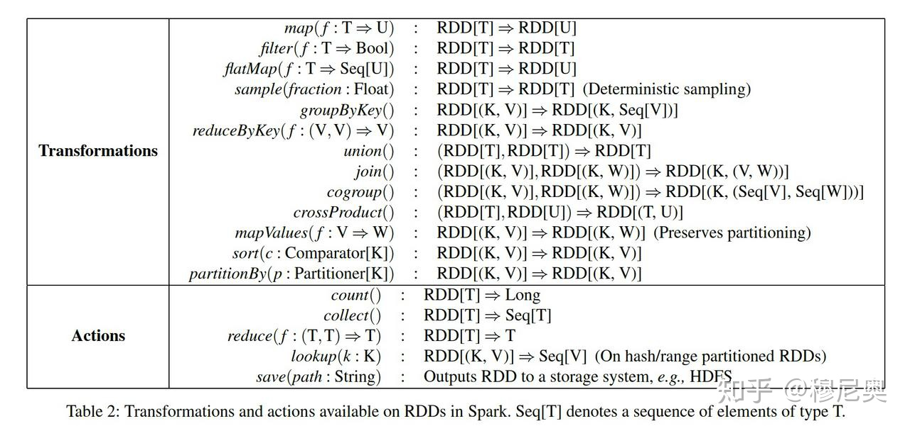

# Spark基础 - RDD

原文：https://zhuanlan.zhihu.com/p/91749572

*作者：青藤木鸟* [Muniao's blog](https://link.zhihu.com/?target=https%3A//www.qtmuniao.com/) 

## 1 概述

​        RDD，学名：可伸缩的分布式数据集（Resilient Distributed Dataset）。是一种对数据集形态的抽象，基于此抽象，使用者可以在集群中执行一些列的计算，而不用将中间结果落盘。而这正是之前 MR 抽象的一个重要痛点，每一个步骤都要落盘，使得不必要的开销很高。

​        为了分布式系统，容错支持是必不可少的。为了支持容错，RDD 只支持**粗粒度**的变换。即：输入数据集是 immutable （或者说只读）的，每次运算会产生新的输出。不支持对一个数据集中细粒度的更新操作。这种约束，大大简化了容错支持，并且能够满足很大一类的计算需求。

​        初次接触 RDD 的概念时，不大能够理解**为什么要以数据集为中心做抽象**。后来随着不断深入的了解，**对数据集的一致性抽象正式计算流水线（Pipeline）得以存在和优化**的精髓所在。在定义了数据集的基本属性（不可变、分区、依赖关系、存放位置等）后，就可以在此基础上施加各种高阶算子，以构建 DAG 执行引擎，并作适当优化。从这个角度说，RDD 实在是一种精妙的设计。

​        例行总结一下 RDD 论文的主要设计要点：

* **显示抽象**。将运算中的数据集进行显示抽象，定义了其接口和属性。由于数据集抽象的统一，从而可以将不同的计算过程组合起来进行统一的 DAG 调度。
* **基于内存**。相较于 MapReduce 中间结果必须落盘，RDD 通过将结果保存在内存中，从而大大降低了单个算子计算延迟以及不同算子之间的加载延迟。
* **宽窄依赖**。在进行 DAG 调度时，定义了宽窄依赖的概念，并以此进行划分，优化调度计算
* **谱系容错**。主要依赖谱系图计算来进行错误恢复，而非进行冗余备份，因为内存实在是有限的，只能以计算换存储了。
* **交互查询**。修改了 scala 的解释器，使得可以交互式的查询基于多机内存的大型数据集。进而支持类SQL等高阶查询语言。


## 2 引子

​       Dryad 和 MapReduce 是业已流行的大数据分析工具。它们给用户提供了一些高阶算子来使用，而不用去关心底层的分布式和容错细节。但他们都缺少对分布式内存的抽象，不同计算过程之间只能通过外存来耦合：前驱任务将计算结果写到外存上去，后续任务再将其作为输入加载到内存，然后才能接着执行后续计算任务。这样的设计有两个很大的劣势：复用性差、延迟较高。这对于像 Page-Rand、K-Means，LR等要求迭代式计算的机器学习算法（需要数据复用）极其不友好；对于一些随机的交互式查询（要求延迟低）也是个灾难。因为它们将大部分的时间都耗费在数据备份、磁盘IO和数据序列化上了。

​        在 RDD 之前，为了解决数据复用的问题，业界已经诸多尝试。包括将中间结果放在内存中的迭代式图计算系统--Pregel，以及将多个 MR 串在一起，缓存循环不变量的 HaLoop。但这些系统只支持受限的计算模型（比如 MR），而且只进行隐士的数据复用。如何进行更通用的数据复用，一直吃更复杂的查询计算，仍是一个难题。

​        RDD 正是为了解决这个问题而设计的，高效地复用数据的一个**数据结构抽象**。RDD 支持数据容错、数据并行；在此之上，能够让用户利用多机内存、控制数据分区、构建一些列运算过程。从而解决很多应用中连续计算过程对于数据复用的需求。

​        其中比较难的一个设计，是如何针对内存数据进行**高效的容错**。现有的一些基于集群内存的系统，比如分布式KV、共享内存、Piccolo 都提供一种可以细粒度的修改的可变数据抽象。为了支持这种抽象之上的容错，就需要进行数据多机冗余或者操作日志备份。这些操作都会导致多机间大量的数据传输，由于网络带宽远慢于 RAM，使得分布式利用内存这件事失去其优势。

​       与之相对，RDD 只提供粗粒度的、基于整个数据集的计算接口，即数据集中的所有条目都施加同一操作。这样一来，为了容错，**只需要备份每个操作而非数据本身**（因为是整体更新的）；在某个分区数据出现问题进行错误恢复时，只需要从原始数据集出发，按顺序再算一遍即可。

​        初看起来，这种计算抽象很受限，但它其实能够满足现有的一大类的集群计算需求，包括 MR、DryadLINQ、SQL、Pregel 和 HaLoop。并且能够满足一些其他计算需求，比如说交互计算。RDD 的实现系统 Spark，提供类似于 DraydLINQ 的高阶算子，应该是第一个提供交互式的集群运算接口。 

## 3 RDD

​        本节首先给出 RDD 的详细定义，然后介绍 Spark 中针对 RDD 的操作接口，继而对比了 RDD 与提供细粒度更新接口的共享内存抽象优劣。最后就 RDD 的局限性讨论一下。

### 3.1 RDD抽象

​        RDD 是一个基于分区的、只读的数据记录集抽象。RDD 只可以通过对持久存储或者其他 RDD **进行确定性运算**得来，这种运算被称为变换。常用的变换算子包括：map、filter 和 join。

​        RDD 没有选择不断的做检查点以进行容错，而是会记下 RDD 从最初的外存的数据集变化而来的变化路径，也就是其**谱系**（Lineage）。理论上，所有的 RDD 都可以在出错后从外存中依据谱系图进行重建。一般来说，重建的粒度是分区（Partition）而非整个数据集，一来代价更小，二来不同分区可能在不同机器上。

​        用户可以对 RDD 的两个方面进行控制：持久化和分区控制。对于前者，如果某些 RDD 需要复用，那么用户可以指示系统按照某种策略将其进行持久化；对后者来说，用户可以定制分区路由函数，将数据集合中的记录按照某个键值路由到不同分区。比如进行 join 操作的时候，可以将待 join 的数据集按照相同的策略进行分区，以进行 join。

### 3.2 Spark 编程接口

​        Spark 通过暴露与编程语言集成的算子来提供操作 RDD 的接口。其中 **RDD 表现为编程语言中的类，而 RDD 的算子为作用于这些类上的函数**。之前的系统如 DryadLINQ 和 FlumeJava 也是用了类似的形式。

​        用户使用 RDD 时，首先将数据从持久化存储中通过变换（Transformations，如 map 或者 filter）将其载入内存中，然后可以对 RDD 施加任何系统支持的一些列变换，最后利用 **动作（Action）** 算子，将 RDD 重新持久化道外存中或者将控制权交还用户。和 DryadLINQ 一样，这个***加载-变换-落盘*** 的过程时***声明式***（Declarative，或者说是惰式）的，Spark 在拿到整个拓扑后会利用执行引擎进行执行优化（比如将并行化、流水线化、之后会进一步讨论）。

​        此外，一个很重要的接口是 ***persist***，可以由用户来告诉系统哪些 RDD 需要持久化，如何持久化（本机硬盘还是跨机存储），如果有多个 RDD 需要持久化，那么优先级如何确定。 Spark 默认将 RDD 包存在内存中，如果内存不够用了会根据用户配置将数据溢出（spill）到硬盘上。

### 3.3 举个例子

​        假设相对存在于 HDFS 上的日志文件，找出错误条目，针对出现 hdfs 关键字的具体条目进行分析。利用 Spark 接口，使用scala语言实现，代码如下：

```scala
lines = spark.textFile("hdfs://...")
errors = lines.filter(_.startsWith("ERROR"))
errors.persist()

// Return the time fields of errors mentioning
// HDFS as an array (assuming time is field numer 3 in a tab-separated format):
errors.filter(_.contains("HDFS"))
      .map(_.split('\t')(3))
      .collect()
```

​        第一行基于某个 HDFS 上的文件定义一个 RDD （第一行作为集合中的一个条目）。第二行通过 filter 变换生成新的 RDD，第三行请求 Spark 将其结果进行暂存。最后一行是链式操作，以一个 collect 的动作结尾，求出包含 HDFS 关键字的所有行数的各个字段。

​        其计算谱系图（lineage）如下：



​        有两点需要注意：

1. 直到遇到 collect 这个动作（action）之前，都没有发生实际的运算
2. 链式操作时，不保存中间结果

​        由于第三行将结果在内存中进行了缓存，因此还可以基于此做其他动作。比如，计算包含 ’MySQL‘ 关键字的错误条数：

```scala
// Count errors mentioning MySQL:
errors.filter(_.contains("MySQL")).count()
```

### 3.4 RDD模型的优点

​        为了理解 RDD 带来的好处，可以看下表，将 RDD 与 DSM（Distributed Shared Memory）做了详细对比。DSM 在这里是一个很宽泛的抽象，不仅包括一般的内存共享系统，还包括其他支持细粒度的状态更新的框架，比如说 Piccolo、分布式数据库等。

| Aspect                     | RDDs                                        | Distr. Shared Mem                         |
| -------------------------- | ------------------------------------------- | ----------------------------------------- |
| Reads                      | Coarse- or fine-grained                     | Fine-grained                              |
| Writes                     | Coarse-grained                              | Fine-grained                              |
| Consistency                | Trivial (immutable)                         | Up to app / runtime                       |
| Fault Recovery             | Fine-grained and low-overhead using lineage | Requires checkpoints and program rollback |
| Straggler mitigation       | Possible using backup tasks                 | Difficult                                 |
| Work placement             | Automatic based on data locality            | Up to app (runtimes aim for transparency) |
| Behavior if not enough RAM | Similar to existing data flow systems       | Poor performance (swapping?)              |

​        首先，DSM 和 RDD 最主要的区别在于，DSM 支持对数据集细粒度的更新。即：可以对任意内存位置进行更新。而 RDD 舍弃了这一点，只允许批量的写入数据，从而提高容错效率：

1. 使用 lineage 来按需恢复数据，而不用定期 snapshot， 减少了不必要的开销
2. 每个 patitoin 出错后可以单独进行恢复，而不用进行全数据集的重建

​        其次，RDD 的不可变的特点，允许系统较容易的对某些计算进行迁移。比如说 MR 中的某些 Stragger 任务就可以很方便的迁移到其他计算节点上去，因为其输入数据一定不会被改变，因此不用考虑一致性的问题。

​        最后还有两个值得一提的是：

1. 由于只支持批量计算，因此调度系统可以比较好的利用数据局部性的特点加快运算速度
2. 如果集群内存不够，只要数据支持迭代，就可以分批加载到内存进行运算，或者分批将结果 spill 到外存。如此一来，在内存不够时能提供很优雅的退化操作，并不损失性能

### 3.5 RDD 不适用的场景

​        如前所述，RDD 适用于针对全数据集统一处理的粗粒度变换的抽象。相对的，就不适用于要求对数据进行细粒度的、异步更新的数据集。比如说 web 应用，再比如说爬虫等等。对于这些应用类型，传统的快照 + 操作日志的容错方式可能更适合一些。如数据库 RAMCloud、Percolator 和 Piccolo。RDD 的目标在于批量分析型应用，而将这些异步应用的需求留给那些专有系统。

## 4 Spark 编程接口

​        Spark 利用 Scala 语言作为 RDD 抽象的接口，因为 Scala 兼顾了精确（其函数式语意适合交互式场景）与高效（使用静态类型）。当然，对于 RDD 本身来说，不限定于任何特定的语言表达。下面从**执行流程**和**代码分发**两个方面来详细说明 Spark 是如何执行用户代码的。



​        开发者利用 Spark 提供的库编写**驱动程序（driver program）**以使用 Spark。驱动程序会定义一个到多个 RDD，并对其进行各种变换。 Spark 提供的库会连接 Spark 集群，生成计算拓扑，并将拓扑分散到多个 workers 上去执行，同时记下变换的谱系（lineage）。这些 workers 是分散在 Spark 集群内各个机器上的常驻进程，它们在内存里保存计算过程中生成的 RDD 的各个分区。

​        像前面举的例子一样，开发者需要将函数作为参数传递给 map 等 spark 算子。Spark 会将这些函数（或者说闭包）序列化为 Java 对象，然后分发给执行节点进行加载。**闭包所涉及的变量会被当作上述生成对象的字段值。** RDD 本身会被包装成静态类型的参数进行传递。由于 Scala 支持类型推断，大部分例子都省略掉了 RDD 数据类型。

​        尽管 Spark 暴露的 Scala 的 RDD 接口在概念上看起来简单，但是在实现上有一些很脏的角落，比如说 Scala 的闭包得使用反射，比如说尽量避免修改 Scala 的解释器。

### 4.1 Spark 中的 RDD 操作

​        下表列出了 Spark 中支持的 RDD 操作。如前所说，**变换（Transformations）**是生成新 RDD 的惰性算子，而**动作（actions）**是触发调度的算子，他会返回一个结果或者将数据写到外存中。



​        需要注意的是：

1. 有些操作，如 *join*，需要操作数 RDD 必须是键值对（Key value pairs）
2. *map* 是一对一的映射，而 *flatMap* 是类似于 *MapReduce* 中一对一或者一对多的映射
3. *save* 会将 RDD 进行持久化
4. *groupByKey，reduceByKey* 和 *sort* 都会导致 RDD 中不同分区进行***再hash***或者***重排***

### 4.2 RDD 的表示

