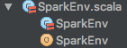
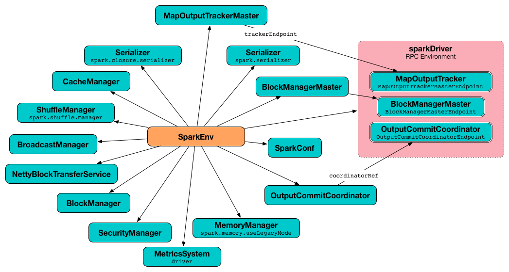
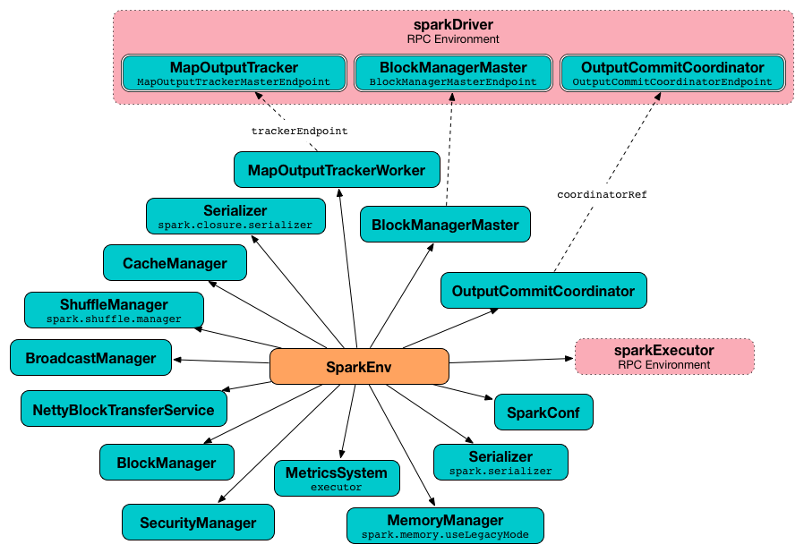
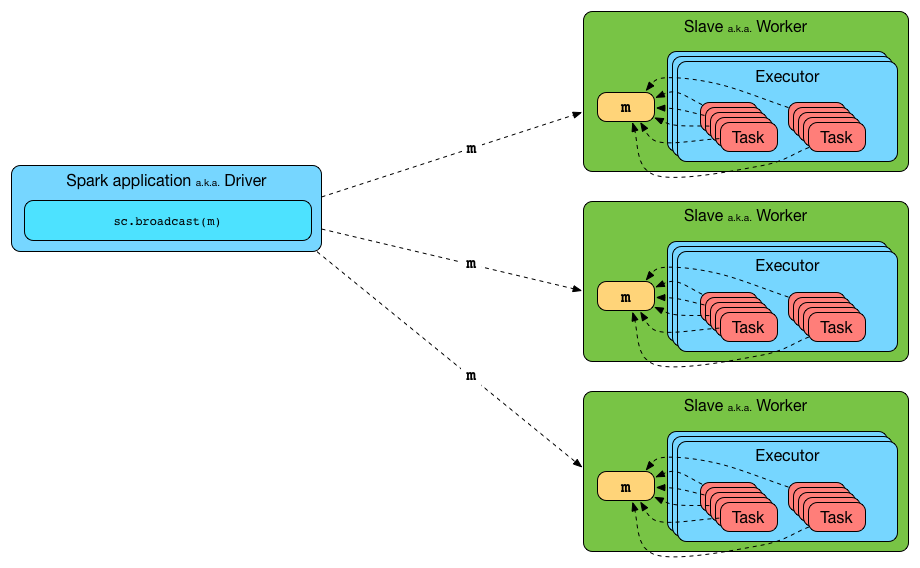
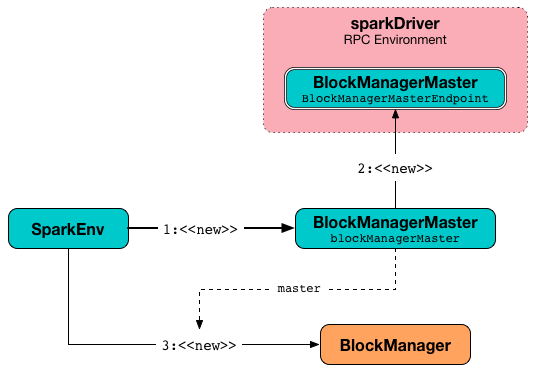
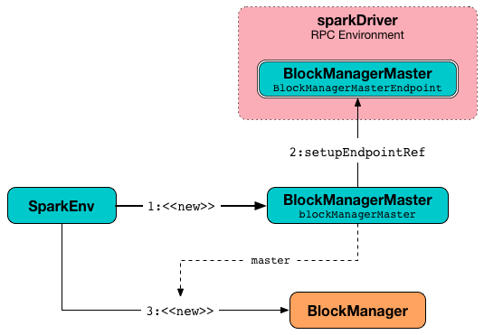

# Spark核心-SparkEnv

原文：https://www.cnblogs.com/xia520pi/p/8609625.html


## 1 功能概述

​        SparkEnv是Spark的执行环境对象，其中包含众多的Executor执行相关的对象。Spark对任务的计算都依托于Executor的能力，所有的Executor都有自己的Spark的执行环境SparkEnv。有了SparkEnv，就可以将数据存储在存储系统中；就能利用计算引擎对计算任务进行处理，就可以在节点间进行通信等。在local模式下，Driver会创建Executor，local-custer部署模式或者Standalone部署模式下，Worker另起的CoarseGrainedExecutorBackend进程中也会创建Executor，所以SparkEnv存在于Driver或者CoarseGrainedExecutorBackend进程中。

​        创建SparkEnv主要使用SparkEnv的createDriverEnv方法，有四个参数：conf、isLocal、listenerBus 以及本地模式下driver运行executor需要的 numberCorse。



```scala
/**
 * :: DeveloperApi ::
 * Holds all the runtime environment objects for a running Spark instance (either master or worker),
 * including the serializer, RpcEnv, block manager, map output tracker, etc. Currently
 * Spark code finds the SparkEnv through a global variable, so all the threads can access the same
 * SparkEnv. It can be accessed by SparkEnv.get (e.g. after creating a SparkContext).
 *
 * NOTE: This is not intended for external use. This is exposed for Shark and may be made private
 *       in a future release.
 */
@DeveloperApi
class SparkEnv (
    val executorId: String,
    private[spark] val rpcEnv: RpcEnv,
    val serializer: Serializer,
    val closureSerializer: Serializer,
    val serializerManager: SerializerManager,
    val mapOutputTracker: MapOutputTracker,
    val shuffleManager: ShuffleManager,
    val broadcastManager: BroadcastManager,
    val blockManager: BlockManager,
    val securityManager: SecurityManager,
    val metricsSystem: MetricsSystem,
    val memoryManager: MemoryManager,
    val outputCommitCoordinator: OutputCommitCoordinator,
    val conf: SparkConf) extends Logging
```



​                                                        图1 在 Driver 上创建 SparkEnv



​                                                        图2 在 Executor 上创建 SparkEnv

## 2 相关组件

| 名称                      | 说明                                                         |
| ------------------------- | ------------------------------------------------------------ |
| SecurityManager           | 主要对账户、权限及身份认证进行设置与管理。                   |
| RpcEnv                    | 各个组件之间通信的执行环境。                                 |
| SerializerManager         | Spark 中很多对象在通用网络传输或者写入存储体系时，都需要序列化。 |
| BroadcastManager          | 用于将配置信息和序列化后的RDD、Job以及ShuffleDependency等信息在本地存储。 |
| MapOutputTracker          | 用于跟踪Map阶段任务的输出状态，此状态便于Reduce阶段任务获取地址及中间结果。 |
| ShuffleManager            | 负责管理本地及远程的Block数据的shuffle操作。                 |
| MemoryManager             | 一个抽象的内存管理器，用于执行内存如何在执行和存储之间共享。 |
| NettyBlockTransferService | 使用Netty提供的异步事件驱动的网络应用框架，提供Web服务及客户端，获取远程节点上Block的集合。 |
| BlockManagerMaster        | 负责对BlockManager的管理和协调。                             |
| BlockManager              | 负责对Block的管理，管理整个Spark运行时的数据读写的，当然也包含数据存储本身，在这个基础之上进行读写操作。 |
| MetricsSystem             | 一般是为了衡量系统的各种指标的度量系统。                     |
| OutputCommitCoordinator   | 确定任务是否可以把输出提到到HFDS的管理者，使用先提交者胜的策略。 |

## 3 代码分析

| 代码 | 说明 |
| ---- | ---- |
|      |      |
|      |      |
|      |      |

### 3.1 创建安全管理器 SecurityManager

​        **SecurityManager 主要对账号、权限以及身份认证进行设置和管理**。如果Spark的部署模式为YARN，则需要生成 secret key（密钥）并存储Hadoop UGI。而在其他模式下，则需要设置环境变量 ***_SPARK_AUTH_SECRET***（优先级更高）或者 ***spark.authenticate.secret*** 属性指定 secret key。最后，SecurityManager 中设置了默认的口令认证实例 Authenticator，此实例采用匿名内部类实现，用于每次使用 HTTP Client 从 HTTP 服务器获取用户的用户和密码。这是由于 Spark 的节点间通信往往需要动态协商用户名、密码，这种方式灵活的智齿了这种需求。

```scala
// 变量声明
// 包名：org.apache.spark
// 类名：SparkEnv
val securityManager = new SecurityManager(conf, ioEncryptionKey)
if (isDriver) {
  securityManager.initializeAuth()
}
  
// 变量处理
// 第一步：new SecurityManager()
// 包名：org.apache.spark
// 类名：SecurityManager
// 使用 HTTP 链接设置口令认证
// Set our own authenticator to properly negotiate（协商/达成） user/password for HTTP connections.
// This is needed by the HTTP client fetching from the HttpServer. Put here so its
// only set once.
if (authOn) {
  Authenticator.setDefault(
    // 创建口令认证实例，复写PasswordAuthentication方法，获得用户名和密码
    new Authenticator() {
      override def getPasswordAuthentication(): PasswordAuthentication = {
        var passAuth: PasswordAuthentication = null
        val userInfo = getRequestingURL().getUserInfo()
        if (userInfo != null) {
          val  parts = userInfo.split(":", 2)
          passAuth = new PasswordAuthentication(parts(0), parts(1).toCharArray())
        }
        return passAuth
      }
    }
  )
}
  
// 第二步：initializeAuth()
// 包名：org.apache.spark
// 类名：SecurityManager
/**
 * Initialize the authentication secret.
 *
 * If authentication is disabled, do nothing.
 *
 * In YARN mode, generate a new secret and store it in the current user's credentials.
 *
 * In other modes, assert that the auth secret is set in the configuration.
 */
def initializeAuth(): Unit = {
  if (!sparkConf.get(NETWORK_AUTH_ENABLED)) {
    return
  }
  
  if (sparkConf.get(SparkLauncher.SPARK_MASTER, null) != "yarn") {
    require(sparkConf.contains(SPARK_AUTH_SECRET_CONF),
      s"A secret key must be specified via the $SPARK_AUTH_SECRET_CONF config.")
    return
  }
  
  val rnd = new SecureRandom()
  val length = sparkConf.getInt("spark.authenticate.secretBitLength", 256) / JByte.SIZE
  val secretBytes = new Array[Byte](length)
  rnd.nextBytes(secretBytes)
  
  val creds = new Credentials()
  val secretStr = HashCodes.fromBytes(secretBytes).toString()
  creds.addSecretKey(SECRET_LOOKUP_KEY, secretStr.getBytes(UTF_8))
  UserGroupInformation.getCurrentUser().addCredentials(creds)
}
```


### 3.2 创建RPC通信层 RpcEnv

​        Spark 1.6 推出的RpcEnv、RpcEndPoint、RpcEndpointRef 为核心的新型架构下的RPC通信方式，在底层封装了Akka和Netty，为未来扩充更多的通信系统提供了可能。RpcEnv是RPC的环境，所有的RpcEndpoint都需要注册到RpcEnv实例对象中，管理着这些注册的RpcEndpoint的生命周期：

* 根据name或者url注册RpcEndpoint
* 管理各种消息的处理
* 停止RpcEndpoint

​        Spark RPC 中最为重要的三个抽象（“三剑客”）为：RpcEnv、RpcEnd point、RpcEndpointRef，这样做的好处是：

* 对上层的 API 来说，屏蔽了底层的具体实现，使用方便
* 可以通过不同的实现来完成指定的功能，方便扩展
* 促进了底层实现层的良性竞争，Spark 1.6.3 种默认采用Netty作为底层实现，但Akka的依赖依然存在；而 Spark 2.1.0 中的底层实现只有 Netty，这样用户可以方便的使用不同版本的 Akka 或者将来某中更好的底层实现

​        创建RpcEnv的代码：

```scala
// 变量声明
// 包名：org.apache.spark
// 类名：SparkEnv
private[spark] val driverSystemName = "sparkDriver"
private[spark] val executorSystemName = "sparkExecutor"
  
val isDriver = executorId == SparkContext.DRIVER_IDENTIFIER
  
val systemName = if (isDriver) driverSystemName else executorSystemName
val rpcEnv = RpcEnv.create(systemName, bindAddress, advertiseAddress, port.getOrElse(-1), conf,
  securityManager, numUsableCores, !isDriver)
  
// 变量处理
// 第一步
// 包名：org.apache.spark.rpc
// 类名：RpcEnv
def create(
    name: String,
    bindAddress: String,
    advertiseAddress: String,
    port: Int,
    conf: SparkConf,
    securityManager: SecurityManager,
    numUsableCores: Int,
    clientMode: Boolean): RpcEnv = {
  val config = RpcEnvConfig(conf, name, bindAddress, advertiseAddress, port, securityManager,
    numUsableCores, clientMode)
  new NettyRpcEnvFactory().create(config)
}
  
// 第二步
// 包名：org.apache.spark.rpc.netty
// 类名：NettyRpcEnv
def create(config: RpcEnvConfig): RpcEnv = {
  val sparkConf = config.conf
  // Use JavaSerializerInstance in multiple threads is safe. However, if we plan to support
  // KryoSerializer in future, we have to use ThreadLocal to store SerializerInstance
  val javaSerializerInstance =
    new JavaSerializer(sparkConf).newInstance().asInstanceOf[JavaSerializerInstance]
  val nettyEnv =
    new NettyRpcEnv(sparkConf, javaSerializerInstance, config.advertiseAddress,
      config.securityManager, config.numUsableCores)
  if (!config.clientMode) {
    val startNettyRpcEnv: Int => (NettyRpcEnv, Int) = { actualPort =>
      nettyEnv.startServer(config.bindAddress, actualPort)
      (nettyEnv, nettyEnv.address.port)
    }
    try {
      Utils.startServiceOnPort(config.port, startNettyRpcEnv, sparkConf, config.name)._1
    } catch {
      case NonFatal(e) =>
        nettyEnv.shutdown()
        throw e
    }
  }
  nettyEnv
}
```

### 3.3 创建序列化管理器 SerializerManager

​        Spark 中很多对象在通用网络传输或者写入存储体系时，都需要序列化。SparkEnv中有两个序列化组件，分别是 SerializerManager 和 ClosureSerializer。

​        创建 SparkEnv的代码：

```scala
// 变量声明
// 包名：org.apache.spark
// 类名：SparkEnv
// Create an instance of the class named by the given SparkConf property, or defaultClassName
// if the property is not set, possibly initializing it with our conf
def instantiateClassFromConf[T](propertyName: String, defaultClassName: String): T = {
  instantiateClass[T](conf.get(propertyName, defaultClassName))
}
  
val serializer = instantiateClassFromConf[Serializer](
  "spark.serializer", "org.apache.spark.serializer.JavaSerializer")
logDebug(s"Using serializer: ${serializer.getClass}")
  
val serializerManager = new SerializerManager(serializer, conf, ioEncryptionKey)
  
val closureSerializer = new JavaSerializer(conf)
```

​        可以看到这里创建的 Serializer 默认为 org.apache.spark.serializer.JavaSerializer，用户可以通过 ***spark.serializer*** 属性配置其他的序列化实现，如 org.apache.spark.serializer.KryoSerializer。而 closureSerializer 的实际类型**固定**为 org.apache.spark.serializer.JavaSerializer，用户不能够自己指定。JavaSeiralizer 采用 java 语言自带的序列化 API 实现。

### 3.4 创建广播管理器 BroadcastManager

​        BroadcastManager 用于将配置信息和序列化后的RDD、Job 以及 ShuffleDependency 等信息在本地存储。如果为了容灾，也会复制到其他节点上。



​                                                        图3 向 Executor 广播一个变量

​         创建 BroadcastManager 的代码：

```scala
// 变量声明
// 包名：org.apache.spark
// 类名：SparkEnv
val broadcastManager = new BroadcastManager(isDriver, conf, securityManager)
  
// 变量处理
// 包名：org.apache.spark.broadcast
// 类名：BroadcastManager
initialize()
  
// Called by SparkContext or Executor before using Broadcast
private def initialize() {
  synchronized {
    if (!initialized) {
      broadcastFactory = new TorrentBroadcastFactory
      broadcastFactory.initialize(isDriver, conf, securityManager)
      initialized = true
    }
  }
}
```

​        BroadcastManager 在其初始化的过程中就会调用自身的 initialize 方法，当 initialize 执行完毕，BroadcastManager 就会正式生效。

### 3.5 创建Map任务输出跟踪器 MapOutputTracker

​        **MapOutputTracker 用于跟踪 Map 阶段任务的输出状态，此状态便于 Reduce 阶段任务获取地址及中间结果**。每个Map任务或者Reduce任务都会有其唯一的标识，分别是 mapId 和 reduceId。每个 Reduce 任务的输入可能是多个 Map 任务的输出，Reduce 会到各个 Map 任务的所在节点上拉取 Block，这个过程叫做 shuffle。每个 shuffle 过程都有唯一的标识 shuffleId。

​        MapOutputTracker 有两个子类：MapOutputTrackerMaster（for driver）和 MapOutputTrackerWorker（for executor），因为它们使用了不同的 HashMap 来存储元数据。

​        创建 MapOputputTracker 的代码：

```scala
// 变量声明
// 包名：org.apache.spark
// 类名：SparkEnv
val mapOutputTracker = if (isDriver) {
  new MapOutputTrackerMaster(conf, broadcastManager, isLocal)
} else {
  new MapOutputTrackerWorker(conf)
}
  
// 变量处理
// 第一步
// 包名：org.apache.spark
// 类名：SparkEnv
// MapOutputTracker.ENDPOINT_NAME 变量声明为 val ENDPOINT_NAME = "MapOutputTracker"
// Have to assign trackerEndpoint after initialization as MapOutputTrackerEndpoint
// requires the MapOutputTracker itself
mapOutputTracker.trackerEndpoint = registerOrLookupEndpoint(MapOutputTracker.ENDPOINT_NAME,
  new MapOutputTrackerMasterEndpoint(
    rpcEnv, mapOutputTracker.asInstanceOf[MapOutputTrackerMaster], conf))
  
// 第二步
// 包名：org.apache.spark
// 类名：SparkEnv
def registerOrLookupEndpoint(
    name: String, endpointCreator: => RpcEndpoint):
  RpcEndpointRef = {
  if (isDriver) {
    logInfo("Registering " + name)
    rpcEnv.setupEndpoint(name, endpointCreator)
  } else {
    RpcUtils.makeDriverRef(name, conf, rpcEnv)
  }
}
  
// 第三步
// 包名：org.apache.spark.rpc.netty
// 类名：NettyRpcEnv
override def setupEndpoint(name: String, endpoint: RpcEndpoint): RpcEndpointRef = {
  dispatcher.registerRpcEndpoint(name, endpoint)
}
  
// 包名：org.apache.spark.util
// 类名：RpcUtils
/**
 * Retrieve a `RpcEndpointRef` which is located in the driver via its name.
 */
def makeDriverRef(name: String, conf: SparkConf, rpcEnv: RpcEnv): RpcEndpointRef = {
  val driverHost: String = conf.get("spark.driver.host", "localhost")
  val driverPort: Int = conf.getInt("spark.driver.port", 7077)
  Utils.checkHost(driverHost)
  rpcEnv.setupEndpointRef(RpcAddress(driverHost, driverPort), name)
}

```

​        在 MapOutputTracker 初始化中，可以看到针对当前实例是 Driver 还是 Executor，创建其方式有所不同：

* 如果当前应用程式 Driver，则创建 MapOutputTrackerMaster，然后创建 MapOutputTrackerMasterEndpoint，并注册到 Dispatcher 中，注册名为 MapOutputTracker
* 如果当前应用程序是 Executor，则创建 MapOutputTrackerWorker，并从远端 Driver 实例的 NettyRpcEnv 的 Dispatcher 中查找 MapOutputTrackerMasterEndpoint 的引用

​        无论是 Driver 还是 Executor，最后都由 MapOutputTracker 的属性 trackerEndpoint 持有 MapOutputTrackerEndpoint 的引用。

### 3.6 创建 ShuffleManager

​         **ShuffleManager 负责管理本地及远程的Block数据的shuffle操作**。ShuffleManager根据默认的 spark.shuffle.manager 属性，通过反射方式生成的 SortShuffleManager 的实例。默认使用的是 sort 模式的 SortShuffleManager，Spark 2.x.x 版本提供了 sort 和 tungsten-sort 两种 ShuffleManager 的实现。无论是 sort 还是 tungsten-sort，实现类都是 **SortShuffleManager**：

```scala
// 变量声明
// 包名：org.apache.spark
// 类名：SparkEnv
// Let the user specify short names for shuffle managers
val shortShuffleMgrNames = Map(
  "sort" -> classOf[org.apache.spark.shuffle.sort.SortShuffleManager].getName,
  "tungsten-sort" -> classOf[org.apache.spark.shuffle.sort.SortShuffleManager].getName)
val shuffleMgrName = conf.get("spark.shuffle.manager", "sort")
val shuffleMgrClass =
  shortShuffleMgrNames.getOrElse(shuffleMgrName.toLowerCase(Locale.ROOT), shuffleMgrName)
val shuffleManager = instantiateClass[ShuffleManager](shuffleMgrClass)
  
  
// 变量处理
// 第一步
// 包名：org.apache.spark
// 类名：SparkEnv
// Create an instance of the class with the given name, possibly initializing it with our conf
def instantiateClass[T](className: String): T = {
  val cls = Utils.classForName(className)
  // Look for a constructor taking a SparkConf and a boolean isDriver, then one taking just
  // SparkConf, then one taking no arguments
  try {
    cls.getConstructor(classOf[SparkConf], java.lang.Boolean.TYPE)
      .newInstance(conf, new java.lang.Boolean(isDriver))
      .asInstanceOf[T]
  } catch {
    case _: NoSuchMethodException =>
      try {
        cls.getConstructor(classOf[SparkConf]).newInstance(conf).asInstanceOf[T]
      } catch {
        case _: NoSuchMethodException =>
          cls.getConstructor().newInstance().asInstanceOf[T]
      }
  }
}
  
// 第二步
// 包名：org.apache.spark.util
// 类名：Utils
// scalastyle:off classforname
/** Preferred alternative to Class.forName(className) */
def classForName(className: String): Class[_] = {
  Class.forName(className, true, getContextOrSparkClassLoader)
  // scalastyle:on classforname
}
  
/**
 * Get the Context ClassLoader on this thread or, if not present, the ClassLoader that
 * loaded Spark.
 *
 * This should be used whenever passing a ClassLoader to Class.ForName or finding the currently
 * active loader when setting up ClassLoader delegation chains.
 */
def getContextOrSparkClassLoader: ClassLoader =
  Option(Thread.currentThread().getContextClassLoader).getOrElse(getSparkClassLoader)
  
/**
 * Get the ClassLoader which loaded Spark.
 */
def getSparkClassLoader: ClassLoader = getClass.getClassLoader
```

### 3.7 创建内存管理器 MemoryManager

​        MemoryManager 的主要实现有 StaticMemoryManager 和 UnifiedMemoryManager。其中 StaticMemoryManager 是 Spark 早期版本遗留下来的内存管理器实现。可以配置 ***spark.memory.useLegacyMode*** 属性来指定，该属性默认是 ***false***，因此默认的内存管理器是 StaticMemoryManager；而UnifiedMemoryManager 是在 Spark 1.6 中增加的一个新的内存管理模型，该模型可以使得 executor 部分和 storage 部分的内存不像之前的（StaticMemoryManager）有比例参数限定性，而是两者可以相互借用空闲的内存。

​         创建 MemoryManager 的代码：

```scala
// 变量声明
// 包名：org.apache.spark
// 类名：SparkEnv
val useLegacyMemoryManager = conf.getBoolean("spark.memory.useLegacyMode", false)
val memoryManager: MemoryManager =
  if (useLegacyMemoryManager) {
    new StaticMemoryManager(conf, numUsableCores)
  } else {
    UnifiedMemoryManager(conf, numUsableCores)
  }
```

### 3.8 创建块传输服务 NettyBlockTransferService

​        Spark 1.6 中只保留了 NettyBlockTransferService，已经没有了 NioBlockTransferService。NettyBlockTransferService 使用 Netty 提供的异步事件驱动的网络应用框架，提供 web 服务以及客户端，获取远端节点上 Block 的集合。在这里使用的是 BlockTransferService 的子类 NettyBlockTransferService 创建块传输服务 BlockTransferSerivce，NettyBlockTransferService 将提供对外的块传输服务。也正是因为 MapOutputTracker 于 NettyBlockTransferService 的配合，才实现了 Spark 的 Shuffle。

​         创建 BlockTransferService 的代码：

```scala
// 变量声明
// 包名：org.apache.spark
// 类名：SparkEnv
val blockManagerPort = if (isDriver) {
  conf.get(DRIVER_BLOCK_MANAGER_PORT)
} else {
  conf.get(BLOCK_MANAGER_PORT)
}
  
val blockTransferService =
  new NettyBlockTransferService(conf, securityManager, bindAddress, advertiseAddress,
    blockManagerPort, numUsableCores)
```

### 3.9  创建 BlockManagerMaster

​         BlockManagerMaster 负责对 BlockManager 的管理和协调，具体操作依赖于 BlockManagerMasterEndpoint。

​        创建 BlockManagerMaster 的代码：

```scala
// 变量声明
// 包名：org.apache.spark
// 类名：SparkEnv
val blockManagerMaster = new BlockManagerMaster(registerOrLookupEndpoint(
  BlockManagerMaster.DRIVER_ENDPOINT_NAME,
  new BlockManagerMasterEndpoint(rpcEnv, isLocal, conf, listenerBus)),
  conf, isDriver)
  
  
// 第二步
// 包名：org.apache.spark
// 类名：SparkEnv
def registerOrLookupEndpoint(
    name: String, endpointCreator: => RpcEndpoint):
  RpcEndpointRef = {
  if (isDriver) {
    logInfo("Registering " + name)
    rpcEnv.setupEndpoint(name, endpointCreator)
  } else {
    RpcUtils.makeDriverRef(name, conf, rpcEnv)
  }
}
   
// 第三步
// 包名：org.apache.spark.rpc.netty
// 类名：NettyRpcEnv
override def setupEndpoint(name: String, endpoint: RpcEndpoint): RpcEndpointRef = {
  dispatcher.registerRpcEndpoint(name, endpoint)
}
   
// 包名：org.apache.spark.util
// 类名：RpcUtils
/**
 * Retrieve a `RpcEndpointRef` which is located in the driver via its name.
 */
def makeDriverRef(name: String, conf: SparkConf, rpcEnv: RpcEnv): RpcEndpointRef = {
  val driverHost: String = conf.get("spark.driver.host", "localhost")
  val driverPort: Int = conf.getInt("spark.driver.port", 7077)
  Utils.checkHost(driverHost)
  rpcEnv.setupEndpointRef(RpcAddress(driverHost, driverPort), name)
}
```



​                                                        图4 为 Driver 创建块管理的流程




​                                                        图5 为 Executor 创建块管理的流程

​        这里通过 registerOrLookupEndpoint 方法查找或者注册 BlockManagerMasterEndopint，而对 Driver 和 Executor 处理 BlockManagerMaster的方式不同：

* 当前应用程序是 Driver，则创建 BlockManagerMasterEndpoint，并且注册到 Dispatcher 中，注册名为 BlockManagerMaster
* 当前应用程序是 Executor，则从远端 Driver 实例的 NettyRpcEnv 的 Dispatcher 中查找 BlockManagerMasterEndpoint 的引用

无论是 Drive 还是 Exeutor，最后都由 BlockManagrMaster 的属性 driverEndpoint 持有 BlockManagerMasterEndpoint 的引用。

> 注：这里的 BlockManagerMaster 的创建逻辑于 MapOutputTracker 基本一致，可以相互对照着分析，能更好的理解 Spark RPC 服务

### 3.10 创建块管理器 BlockManager

​        BlockManager 负责对 Block 的管理，**只有**在 BlockManager 的初始化方法 ***initialize()*** 被调用后才是有效的。

​        创建 BlockManager 的代码：

```scala
// 变量声明
// 包名：org.apache.spark
// 类名：SparkEnv
// NB: blockManager is not valid until initialize() is called later.
val blockManager = new BlockManager(executorId, rpcEnv, blockManagerMaster,
  serializerManager, conf, memoryManager, mapOutputTracker, shuffleManager,
  blockTransferService, securityManager, numUsableCores)
  
// 变量处理
// 包名：org.apache.spark
// 类名：SparkContext
_env.blockManager.initialize(_applicationId)
```

​        BlockManager 对象在 SparkContext 初始化创建 SparkEnv 执行环境被创建，而在 SparkContext 后续的初始化过程中调用其 initializate() 完成其初始化。

### 3.11 创建测量系统 MetricsSystem

​        MetricsSystem 是 Spark 的度量系统，在 SparkEnv 中，度量系统也是必不可少的一个子组件。创建 MetrixSystem 的代码：

```scala
// 变量声明
// 包名：org.apache.spark
// 类名：SparkEnv
val metricsSystem = if (isDriver) {
  // Don't start metrics system right now for Driver.
  // We need to wait for the task scheduler to give us an app ID.
  // Then we can start the metrics system.
  MetricsSystem.createMetricsSystem("driver", conf, securityManager)
} else {
  // We need to set the executor ID before the MetricsSystem is created because sources and
  // sinks specified in the metrics configuration file will want to incorporate this executor's
  // ID into the metrics they report.
  conf.set("spark.executor.id", executorId)
  val ms = MetricsSystem.createMetricsSystem("executor", conf, securityManager)
  ms.start()
  ms
}
  
// 变量处理
// 第一步
// 包名：org.apache.spark.metrics
// 类名：MetricsSystem
def createMetricsSystem(
    instance: String, conf: SparkConf, securityMgr: SecurityManager): MetricsSystem = {
  new MetricsSystem(instance, conf, securityMgr)
}
  
// 第二步（当是 Driver 时）
// 包名：org.apache.spark
// 类名：SparkContext
// The metrics system for Driver need to be set spark.app.id to app ID.
// So it should start after we get app ID from the task scheduler and set spark.app.id.
_env.metricsSystem.start()
// Attach the driver metrics servlet handler to the web ui after the metrics system is started.
_env.metricsSystem.getServletHandlers.foreach(handler => ui.foreach(_.attachHandler(handler)))
```

​        根据代码描述，可以看出创建度量系统根据当前实例是 Driver 还是 Executor 有所区别：

* 当前实例为 Driver：创建度量系统，并且指定度量系统的实例名称为 driver。此时虽然创建了，但是并未启动，目的是等待 SparkContext 中的任务调度器 TaskScheduler 告诉度量系统应用程序 ID 后在启动
* 当前实例为 Executor：设置 spark.executor.id 属性为当前 Executor 的 ID，然后再创建并启动度量系统

​       创建度量系统使用了伴生对象 MetricsSystem 的 createMetricsSystem 方法（类似于Java的静态方法）

### 3.12 创建 OutputCommitCoordinator

​        当 Spark 应用程序使用了 Spark SQL（包括Hive）或者需要将任务的输出保存到 HDFS 是，就会用到输出提交协调器 OutputCommitCoordinate，OutputCommitCoordinate 将决定任务是否可以提交输出到 HDFS。无论是 Driver 还是 Executor，在 SparkEnv 中都包含了子组件 OutputCommitCoordinate。在 Driver 上注册了 OutputCommitCoordinateEndpoint，在所有 Exeutor 上的 OutputCommitCoordinate 都是通过 OutputCommitCoordinateEndpoint 的 RpcEndpointRef 来询问 Driver 上的 OutputCommitCoordinate 是否能够将输出提交到 HDFS。

​         创建 OutputCommitCoordinate 的代码：

```scala
// 变量声明
// 包名：org.apache.spark
// 类名：SparkEnv
val outputCommitCoordinator = mockOutputCommitCoordinator.getOrElse {
  new OutputCommitCoordinator(conf, isDriver)
}
val outputCommitCoordinatorRef = registerOrLookupEndpoint("OutputCommitCoordinator",
  new OutputCommitCoordinatorEndpoint(rpcEnv, outputCommitCoordinator))
outputCommitCoordinator.coordinatorRef = Some(outputCommitCoordinatorRef)
  
// 第二步
// 包名：org.apache.spark
// 类名：SparkEnv
def registerOrLookupEndpoint(
    name: String, endpointCreator: => RpcEndpoint):
  RpcEndpointRef = {
  if (isDriver) {
    logInfo("Registering " + name)
    rpcEnv.setupEndpoint(name, endpointCreator)
  } else {
    RpcUtils.makeDriverRef(name, conf, rpcEnv)
  }
}
   
// 第三步
// 包名：org.apache.spark.rpc.netty
// 类名：NettyRpcEnv
override def setupEndpoint(name: String, endpoint: RpcEndpoint): RpcEndpointRef = {
  dispatcher.registerRpcEndpoint(name, endpoint)
}
   
// 包名：org.apache.spark.util
// 类名：RpcUtils
/**
 * Retrieve a `RpcEndpointRef` which is located in the driver via its name.
 */
def makeDriverRef(name: String, conf: SparkConf, rpcEnv: RpcEnv): RpcEndpointRef = {
  val driverHost: String = conf.get("spark.driver.host", "localhost")
  val driverPort: Int = conf.getInt("spark.driver.port", 7077)
  Utils.checkHost(driverHost)
  rpcEnv.setupEndpointRef(RpcAddress(driverHost, driverPort), name)
}
```

​        根据代码可以看出 OutputCommitCoordinate 的创建步骤如下：

* 当前实例为 Driver是，则创建OutputCommitCoordinateEndpoint，并且注册到 Dispatcher 中，注册名为 OutputCommitCoordinate
* 当前实例为 Executor 时，则从远端 Driver 实例的 NettyRpcEnv 的 Dispatcher 中查找 OutputCommitCoordinateEndpint 的引用

无论是 Driver 还是 Executor，最后都是由 OutputCommitCoordinate 的属性 coordinatorRef 持有 OutputCommitCoordinateEndpoint 的引用。

> 提示：这里的BlockManagerMaster 的创建逻辑与 MapOutputTracker 基本一致，可以互相对照着分析，能更好理解 Spark RPC 服务。

### 3.13 创建 SparkEnv

​         当 SparkEnv 内的所有组件都实例化完毕，将正式构件 SparkEnv。

```scala
// 变量声明
// 包名：org.apache.spark
// 类名：SparkEnv
val envInstance = new SparkEnv(
  executorId,
  rpcEnv,
  serializer,
  closureSerializer,
  serializerManager,
  mapOutputTracker,
  shuffleManager,
  broadcastManager,
  blockManager,
  securityManager,
  metricsSystem,
  memoryManager,
  outputCommitCoordinator,
  conf)
```

​        如果当前实例为 Driver 时， 还要为其创建临时目录，相关代码如下：

```scala
// Add a reference to tmp dir created by driver, we will delete this tmp dir when stop() is
// called, and we only need to do it for driver. Because driver may run as a service, and if we
// don't delete this tmp dir when sc is stopped, then will create too many tmp dirs.
if (isDriver) {
  val sparkFilesDir = Utils.createTempDir(Utils.getLocalDir(conf), "userFiles").getAbsolutePath
  envInstance.driverTmpDir = Some(sparkFilesDir)
}
```

​        从上面的注释可以看出，当 Driver 调用 stop() 函数停止时，这些创建的临时目录将会被删除。但是当一个 SparkContext 实例停止时，则不会被删除，因为 Driver 是作为一个服务运行的，因此将会创建很多的临时目录。