# Spark的内存管理机制

原文：https://blog.csdn.net/zc19921215/article/details/86442158

​        Spark 的内存分配使用了 **Tungsten** 优化。Spark 的内存管理是 MemoryManager 实现的，在 SparkEnv 中被初始化。现在不关注 Driver 上的 MemoryManager，只分析 Executor 伤的内存是如何管理的。

## 一. Spark1.6 之前的静态内存管理机制

​        因为默认已经不使用这种方式了，这里只是提一提，不做详细介绍。1.6版本之前的内存结果如下图所示，各个部分的作用稍后会解释：

​        **堆内**：

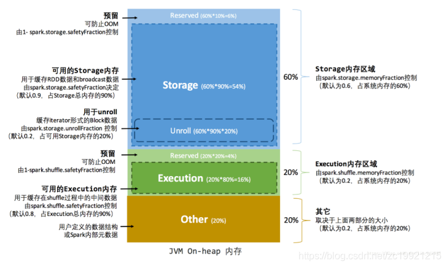

​        **堆外**：

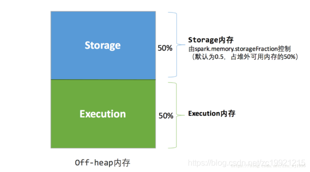

## 二. Spark 1.6 之后的动态内存管理

​        **堆内**：

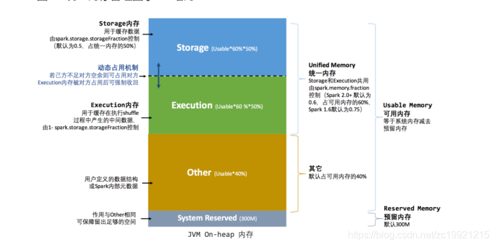

* **Storage**：用于 broadcast/cache/persist 数据的存储 

* **Execution**：用于 shuffle，例如 join/agg/sort 等操作，都是在这部分内存中执行的

* **Other**(User Memory)：存储用户的数据结构，个人理解不是对 RDD 的，操作用的都是这部分内存，例如在 Executor 端创建了一个 HashMap

* **System Reserved**：Spark 给自身预留的内存，至少 300M。
* System Reserved 大小由 “spark.testing.reservedMemory” 参数控制
* **Storage + Execution** 大小由 “spark.memory.fraction” 控制，默认是0.6。官网没有明确不能修改此值，但，如果这个值太大，容易造成GC的时间偏长
* **Storage + Execution** 所用内存中 **Execution** 所占的比例由 “spark.memory.storageFraction” 控制，默认是 0.5，官网建议不要改动这个配置，并且和1.6版本之前不同的是，它们之间的边界变成了“软边界”，内存可以在一定情况下相互借用。

​        *(ps: Unroll 已经完全归Storage管理了，它的大小不再固定 )*

​        **堆外**：

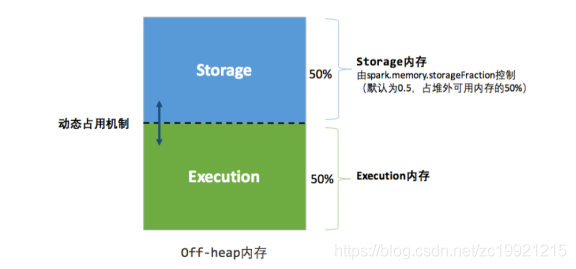

​        可以看到，堆外和之前还是一样的，主要改动是堆内。现在堆内的存储内存和执行的内存可以动态调整，相互占用了（但是会优先保证执行内存足够）。动态内存机制如下：

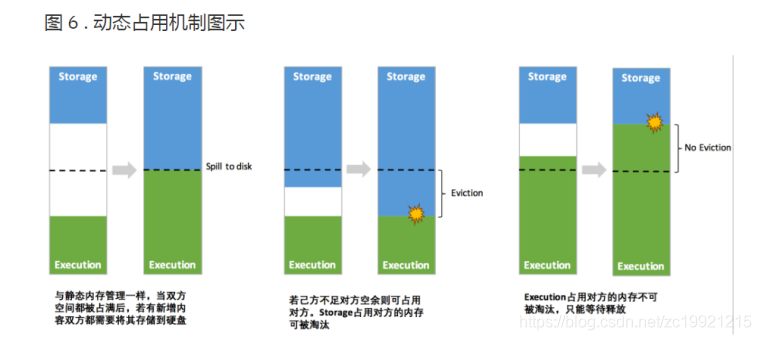

​        查看 **UnifiedMemoryManager** 中 **acquire*****() 相关方法：

1. **Execution 向 Storage 借内存**

   * 如果要申请的内存已经超过了 storagePool.memoryFree 的话，那么会向 Execution 借内存，最多借 executionPool.memoryFree

   * 如果还不够，会调用 **evictBlocksToFreeSpace()** ，将不用的 block 移除，block 要求不属于当前 RDD 并且 memoryMode 相关，就可以evict

   * 寻找可以移除的block，直到找到足够多的内存为止，如果找到了给它们加上写锁然后调用 **blockInfoMemory** 将它们移除。否则不移除并返回 0L

2. **Storage 向 Execution 借内存**

   ​        首先需要明确一点，单个 Task 不能拥有太多的内存，它被限制在了 $(\frac{1}{N} - \frac{1}{2N}) \times MaxExecutionMemory$ 之间，之所以加上了个 **Max** 是当前 Execution 最大的内存，可以像 Storage 借了一部分，也可能被 Storage 拿走了一部分。

   ​        如果 Execution 空闲的空间不够时，首先会占用 storagePool 的空闲内存，如果不够就会要求 storagePool 归还它占用的部分内存，还不够就叫 storagePool evict掉一些block。

   ​        （注意：如果一开始进来 storagePoolSize 就已经小于 storageRegionSize时，就不能要求 evict 了，storageRegionSize 表示 storagePoolSize 最开始的大小，表示一开始 storagePool 的内存就已经不够用了，而且已经被 Execution 借走了一部分）

## 三. 分析 UnifiedMemoryManager 其他的内部实现

### 3.1 初始化

​        UnifiedMemoryManager 继承自 MemoryManager，所以它先初始化父类。

#### 3.1.1 初始化内存池

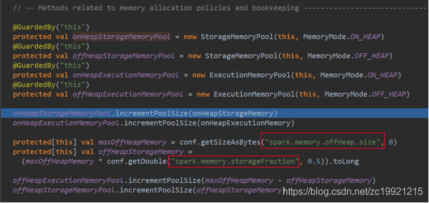

#### 3.1.2 判断 tungsten 是否启用了堆外内存

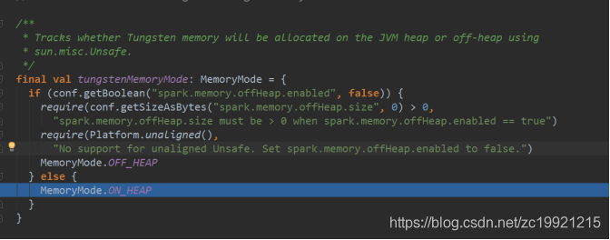

#### 3.1.3 判断 page 大小

​        判断一个 page 的大小，限定在 1M - 64M 之间，下面例子是 16M，和服务器总核数以及内存总大小有关。page 是 tungsten 中引入的优化概念。

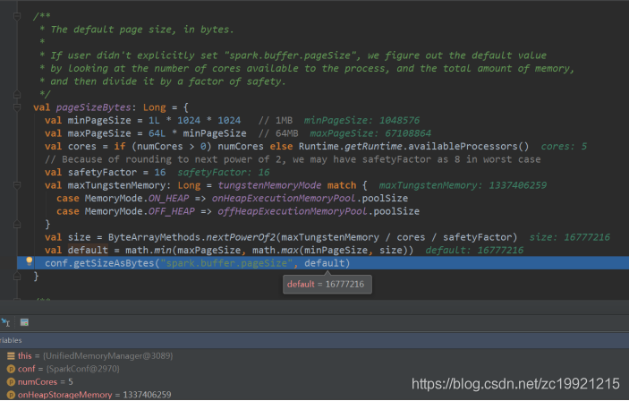

#### 3.1.4 分配内存

​        根据模式确定任务在哪里分配内存：这里是按照上面所说的 page 分配内存， Unsafe/Tungsten 模式下才会使用的，一般情况下都是直接申请多少个字节。

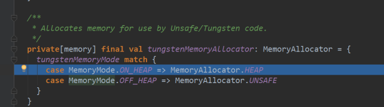

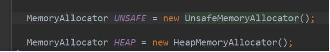

​        然后就初始化完毕了，可以看到其实一直都是在初始化父类中的属性。

​        这个 MemoryManager 是对于一个 Executor 而言的，同一个 Executor 内部的所有 Task 都调用它的接口来申请或者释放内存。申请时要指定申请的 MemoryMode，表示申请的是**堆内内存**还是**堆外内存**。

## 四. 单个任务内存管理 - TaskMemoryManager

​        TaskMemoryManager 负责管理一个 Task 的内存申请和释放，申请和释放内存的功能又依赖于上面的 MemoryManager。

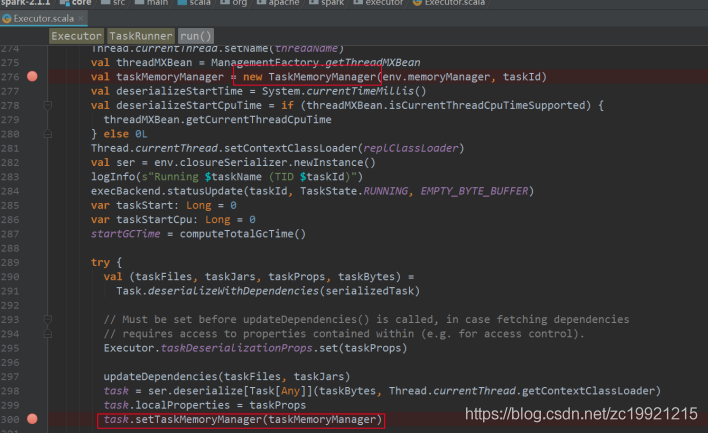

​        一个 Task 里面有很多地方需要使用到内存，它们都依赖 TaskMemoryManager 申请内存，被称为 MemoryConcumer。申请和释放内存又分了使用 **Tungsten** 和**非Tungsten** 模式。现在重点解释一下Tungsten模式。

### 4.1 Tungsten介绍

​        Tungsten 是 Spark 为了提升 JVM 带来的性能限制而提出的一个优化计划，主要是考虑如下两个因素：

* Java 对象所占的内存空间大，不像C/C++等更加底层的语言
* JVM 的 GC 机制在回收大空间时开销大

​        Tungsten 优化体现在三个方面：

* 内存管理与二进制处理（Memory Management and Binary Processing）：不处理 Java  对象的数据，而是直接处理二进制的数据，并引入了类似 OS 中的 page， 提升性能（堆外内存）
* 缓存敏感计算（Cache-aware computation）：设计算法和数据结构以充分利用 memory hierarchy
* 动态代码生成（Code generation）：使用code generation 去充分利用最新的编译器和 CPU 的性能

​        现在介绍第一点。

​        Page 结构：

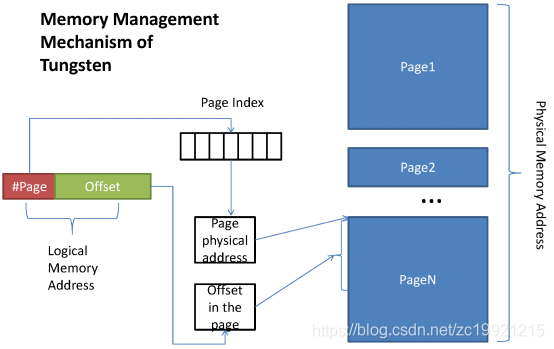

​        在 Tungsten 模式下，内存会按照 page 的方式进行管理。一个 page 在 UnifiedMemoryManager 中默认被限制在 1M - 64M 之间，当然也可以通过配置进行修改。在代码中，Page 被封装成 **MemoryBlock** 结构，用来**表示一段连续的内存**。

​        Page 的逻辑地址是一个 64 位 long 类型的数，对于堆外的数据，直接给用 64 位地址可以表示页的位置。但是对于堆内存来说，由于 GC 导致引用的地址其实是会变化的，所以 64 位中的**前 13 位**代表页编号，**后 51 位**代表页在内部的偏移量。映射的过程就是根据页编号去内部查找它的偏移量。

​        但是一个 page 的大小并不是 $2^{51}$ ，看如下解释，一个 page 在理论上最大时 16G：

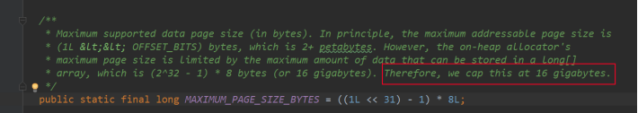

> 后面分析到 Shuffle 的时候会发现，其实一个 page 达不到 16G，因为page存放的数据记录只有27位是用来表示Page内的偏移量的，所以 page **最大**的大小为 $2^{27}$ Bits = 128M

​        一个 Task 所拥有的Page都放在 MemoryBlock[] pageTable 数组中，table 的大小最大为 1<<13 （$2^{13}$），即 8192。所以一个 Task 最多可以管理 8192 * 128M = 1TB 内存。

​        按默认的 1M - 64M 来算的话，一个 Task 可以管理的内存大小为 8G - 512G （因为一个 Executor 上可以根据核数并行的运行多个 Task，所以也很大）。
