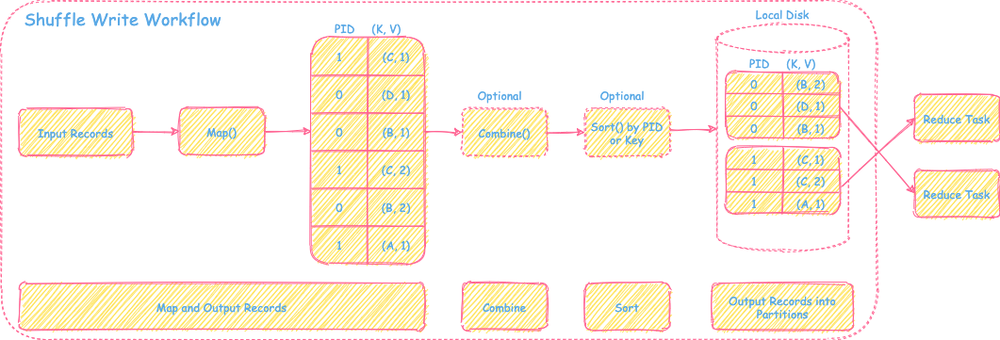
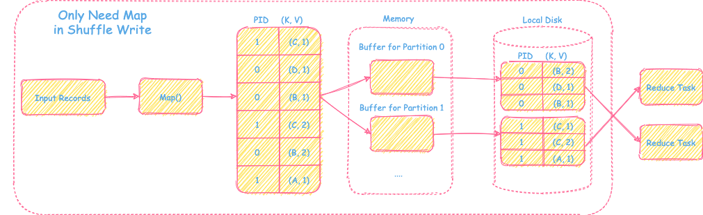
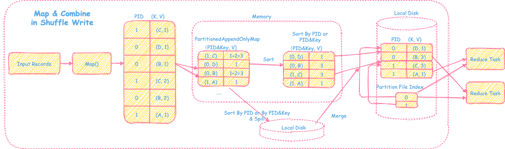
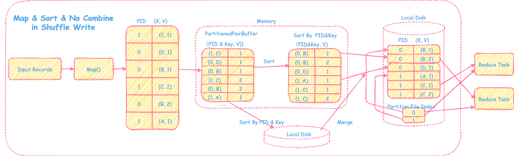
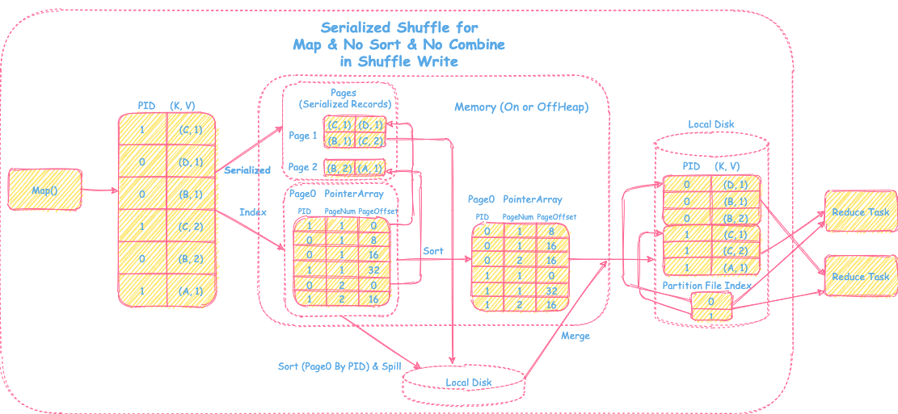

# Spark Shuffle 内部机制（一）

原文： https://xie.infoq.cn/article/27a597268c3776c6bd95c5caa

## Spark Shuffle是什么

Spark Shuffle是根据数据处理需求将数据按着某种方式重新混洗，以便于后面的数据处理。比如reduceByKey()的操作，通过先将数据按照Key进行重新分区以后，然后对每个Key的数据进行Reduce操作。

Spark Shuffle共包括两部分：

* Spark Shuffle Write： 解决上游输出数据的分区问题
* Spark Shuffle Read：通过网络拉取对应的分区数据，重新组织，然后为后续的操作提供输入数据

## Spark Shuffle要解决的问题

先从总体的角度来看一下Spark Shuffle要解决哪些问题，以及大致的解决方案是什么。

* 如何灵活支持不同计算场景下不同的需求？排序、聚合、分区？
  * 通过灵活的框架设计来满足不同的需求
* 如何应对大数据量的情况下面临的内存压力？
  * 通过**内存+磁盘+数据结构设计**来解决内存问题
* 如何保证Shuffle过程的高性能问题？
  * 减少网络传输：map端的reduce
  * 减少碎小文件：按partitionId进行排序并合并多个碎小文件为一个，然后加上分区文件索引供下游使用

## Spark Shuffle的框架

接下来，我们一起看看Spark Shuffle在Write和Read两个阶段是如何设计对应的框架，来解决上面阐述的问题。  

### Spark Shuffle Write框架

在Shuffle Write阶段，数据操作需要提供的是**排序、聚合和分区**三个数据功能。但可能在数据场景里，需要的功能只是其中一个或者两个，因此Spark Shuffle的Write整体框架设计成灵活的“map --> combine (可选)--> sort (可选) --> partitions”。具体的框架如下图所示：

如上图所示，根据Write阶段不同的数据处理需求，Spark进行不同的流程选择和数据结构设计来解决计算需求、内存压力和性能问题。接下来会进行每个场景详细的分解介绍。

#### 1. 仅需要Map，不需要combine和sort的场景

##### 过程

对于输入的Record，经过map运算后，会输出record对应的partitionId和map后的数据直接放到内存里其对应分区的buffer里，当buffer数据满了以后会直接flush到磁盘上对应的分区文件里。因此一个map task的每个分区对应一个buffer和磁盘上的一个文件。

##### 命名

* BypassMergeSortShuffeWriter

##### 优点

* 速度快，操作是在内存中进行，直接将map处理后的record输出到对应的分区文件

##### 缺点

* 每个分区需要对应内存的一个buffer，如果分区个数较多，那么占用的内存就会比较大。另外，每个分区对应一个输出文件，当分区个数过多时，文件打开数，以及下游shuffle Read时的连接数都会很大。因此容易造成资源不足的情况发生。

##### 使用场景

* 通过优缺点分析，可以看到，这种处理方式只适合分区个数比较小的情况（可以通过spark.shuffle.sort.byPassMergeThreshold设置），速度比较快。另外也不需要额外的combine和sort的场景，比如简单的partitionBy(), groupBy()类似的transformation操作。

##### 内存消耗

* 主要是每个分区对应的buffer的内存占用

#### 2. 需要map，需要combine的场景

##### 过程

1. **Map和在线聚合**

   对于输入的Record，经过map运算后，会放进一个类似Hashmap的数据结构里（PartitionedAppendOnlyMap，后面会对这个结构进行介绍），如果Hashmap里Key存在，那么会将该record的值和对应结构里的value进行comibne操作，然后更新key在这个Hashmap里的数值，实现在线聚合的功能。否则，直接将recode的值更新到Hashmap里即可。

   其中，这里的***Key = partitionId + record Key***

2. **Sort & Spill**

   当Hashmap里不够存放时，会先进行扩容，扩容为原来的两倍。如果还存放不下，然后会将Hashmap里的record排序然后放入磁盘。然后清空Hashmap，继续进行后续的在线聚合操作。

   其中，这里对record进行排序的Key：

   * 如果需要map端按照record key排序，那么这里排序的***Key = partitionId + record key***
   * 否则，这里的排序***Key = partitionId***

3. **Sort & Merge**

   在输出文件时，会将Spill到磁盘的和内存里的数据，进行Sort和Merge操作，然后按PartitionId输出数据。最终会生成一个输出文件（存放该Map task产生的所有的分区文件） + **分区数据索引文件**供下游Shuffle Read适用。

##### 命名

* **SortShuffleWriter** 的一种场景

##### 优点

* 通过设计的Hashmap数据结构支持在线聚合的方式处理map端的combine操作，不用等所有的map数据都处理结束，提升性能，也节省了内存空间。
* 利用内存+磁盘的方式，可以解决大数据量下面临内存不足的问题
* 一个map task只输出一个总的分区文件和分区索引，减少了碎文件的个数，提升了I/O资源利用率和性能，对下游也比较友好。适合分区数较多的Shuffle情况

##### 缺点

* 在线聚合的方式，需要对record一条一条的处理，相对Hadoop将map全处理结束后，再统一的进行聚合的方式相比，无法定制灵活的聚合方式
* 直接通过原生Hashmap的方式的话，会存在聚合后，再次Copy到线性数组结构时，进行排序引发的额外的copy和内存占用问题。需要设计更好的数据结构来支持高效的combine和sort操作

##### 适用场景

* 大分区且需要map端combine的操作，比如reduceByKey()， aggregateByKey()等

##### 内存消耗

* 内存量：在线聚合需要的Hashmap数据结构 + 中间聚合过程用户代码所占用的数据空间 + 排序所占用的空间
* 取决于输入数据量的大小和用户聚合函数的复杂性

##### PartitionedAppendOnlyMap

* 实现
  * Hashmap 与 Array 的结合体
  * 仅支持对数据的增加和更改操作（Append Only），不支持删除操作
  * 底层是一个线性数组，通过对Key(partitionId + record key)的hash，然后按照hash值在数组中通过探测的方式找到存放和读取的位置
    * 如果hash之对应的位置没有存放数据，那么就把对应的数据放进去
    * 否则，看邻近的下一个位置是否是空的，依次探测，直到找到一个空的位置放进去即可
    * 读取的时候，也是类似的，根据hash值探测方式读取，然后将值combine以后再update回去
  * **扩容**时将底层数组再扩大一倍，然后对数组里的数据再rehash重新放置
  * **局部排序**：讲述组的数据都移到最前方的位置，然后按照对应的partitionId或者partitionId + Key进行线性数组排序
  * **全局排序**：再将spill的数据和内存里的数据进行全局排序和meerge时，通过建立最小堆或者最大堆进行全局排序合并操作即可
* 优点
  * 不需要额外占用内存空间来进行hashmap结构到线性数组结构的copy转化过程

##### 3. 需要Map，需要Sort，不需要Combine的场景

##### 过程

1. **Map**

   对于输入的record，经过map运算后，会被放入内存一个类似线性数组的结构里（PartionedPairBuffer，下面会介绍该数据结构）

2. **Sort & Spill**

   当数组里放不下map后的数据时，会先进行扩容，扩容为原来的两倍，并移除数据到新分配的空间。如果还存放不下，会把array的record进行排序后放入磁盘。然后清空数据，继续后续的map数据存储。

   其中这里对record进行排序的key：

   * 如果需要map端按照record Key排序，那么这里排序的**key = partitionId + record Key**
   * 否则，这里排序的 **Key = partitionId**

3. **Sort & Merge**

   在输出文件时，会将Spill到磁盘的和内存里的数据，进行Sort和Merge操作，然后按PartitionId输出数据。最终会生成**一个输出文件**（存放该map task产生的所有的分区文件） **+ 分区数据索引文件**供下游Shuffle Read适用

##### 命名

* **SortShuffleWriter**的一种场景

##### 优点

* 通过一个数组的结构来支持map端按照partitionId或者partitionId + key的方式进行排序
* 同样的，利用内存 + 磁盘的方式来解决内存不足的问题
* 一个map task只输出一个总的分区文件和分区索引，减少了碎文件的个数，提升了I/O资源利用率和性能，对下游也比较友好。适合分区数据较多的shuffle情况

##### 缺点

* 需要额外的排序过程

##### 适用场景

* 大分区且需要map端按key进行Sort且不需要combine的场景，比如sortByKey（）
* 或者大分区限制下map端的不需要combine的场景，partitionBy(1000)

##### 内存消耗

* 内存量： 存放数组的sort所需要的数组 + 排序所占用的空间
* 取决于输入数据量的大小

##### PartionedPairBuffer

* 实现
  * 底层是特殊的Array
  * 一条record会占用array里两个相邻空间，第一元素是**partitionId + Key**，第二元素是
  * **扩容**时，将底层数组再扩大一倍，然后对数组里的数据copy到新的空间里
  * **局部排序**：直接将数组里的数据按照对应的partitionId或者partitionId + Key进行线性数组排序
  * **全局排序**：再将spill的数据和内存里的数据进行quanjupaixuhemerge时，通过建立最小堆或者最大堆进行全局归并排序合并操作即可
* 优点
  * 支持内存+磁盘的方式，可以支持按partitionId或者partitionId + record Key的方式进行排序

#### 4. 更进一步优化Serialized Shuffle

##### 过程

1. **Map & Serialized & Index**

   输入数据通过map处理后得到带分区的<K, V> record，然后会将record序列化后放到相应的pages中，并在page0中记录record在对应的page的offset信息，以便能够快速找到record，其中page0里会包括partitionId,，pageNum和pageOffset

2. **Sort & Spill**

   按照page0里记录的partitionId进行排序，当内存中放不下page0和相应的存放序列化数据的pages，会将pages和排序后的page0先spill到磁盘上，解决内存压力问题

3. **Sort & Merge**

   当map端的数据都处理结束后，将内存排序后的page0+pages数据和磁盘上spill的文件及数据按照partitonId做全局的归并排序，最后输出**一个文件包含排序后的所有分区数据+分区索引文件**供下游reduce task使用

##### 命名

* **UnsafeShuffleWriter**的一种场景

##### 优点

* 减少**memory**占用
* 提高性能
* 分页技术可以使用非连续的内存空间
* 可以使用堆外内存

##### 缺点

* 不支持map端的排序和聚合（因为record被序列化了）
* 分区个数有限制，需要小于224（page0里partitionId用24bits来表示）
* 单个serialized需要小于128M

##### 适用场景

* 适用于map端不需要排序和聚合，partition个数较大，record本身也比较大的场景

##### 内存消耗

* 内存量：page0 + 数据record序列化后pages的大小 + 排序占用空间
* 取决于输入数据量的大小 + record本身序列化后的大小

##### PointerArray

* 实现
  * 实质上就是一个Long Array
  * 前24bits表示partitionId，接着13bits表示pageNum，最后的72bits表示的是在page里offset
  * 用来存放序列化后的record在对应的哪个page及page中的offset
* 优点
  * 占用内存空间小，也能快速定位序列化后的record